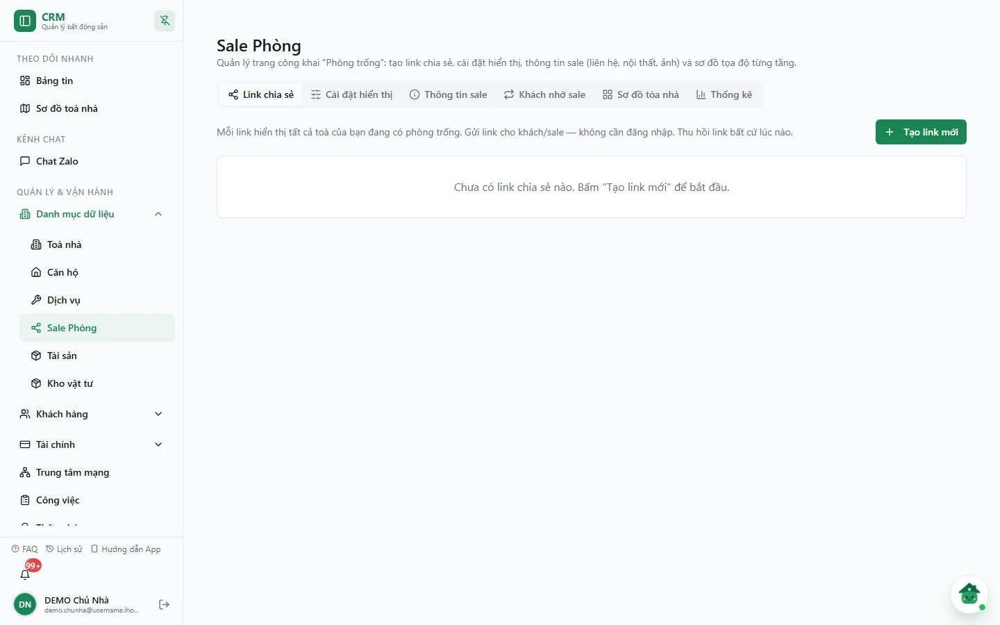
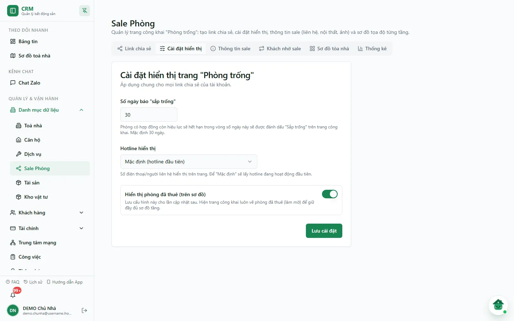
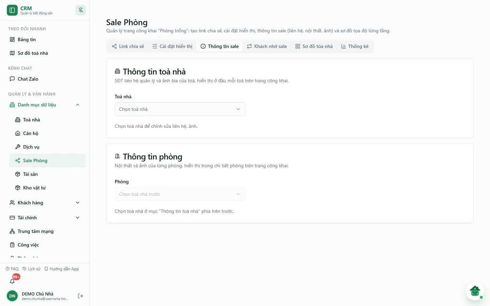
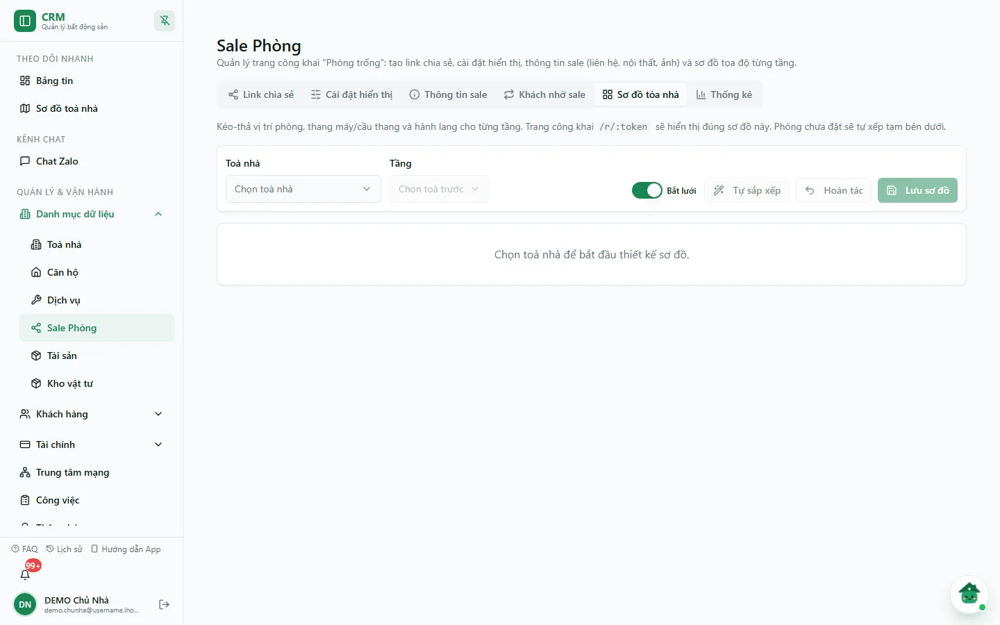
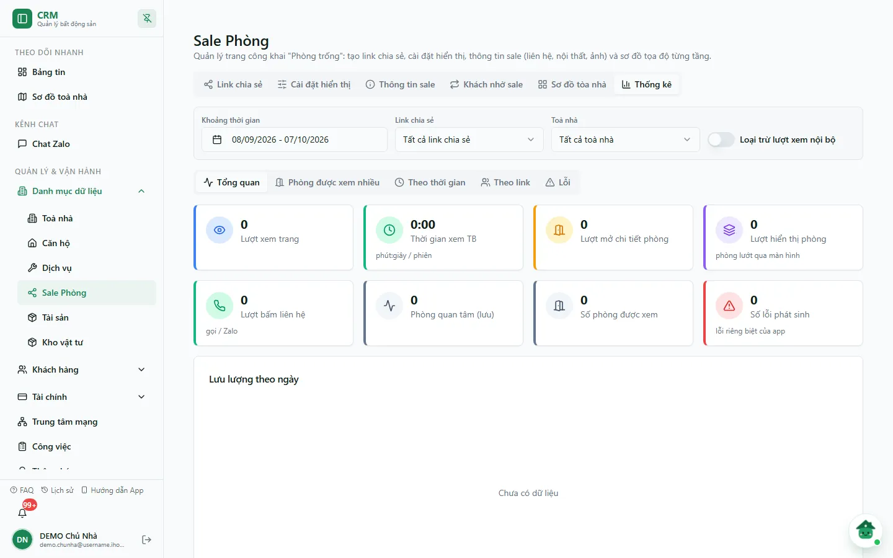

# Sale Phòng (đăng phòng cho thuê)

Màn **Sale Phòng** là nơi bạn vận hành trang phòng trống công khai — một trang web mà **khách xem không cần đăng nhập**. Bạn tạo **link chia sẻ** để gửi cho sale/khách, chỉnh **cách hiển thị** (số ngày báo "sắp trống", hotline, chính sách sale trên ảnh danh sách phòng trống), đăng **ảnh và thông tin sale** cho từng phòng/toà, đăng lại **phòng khách nhờ sale**, vẽ **sơ đồ tầng** bằng kéo-thả và xem **thống kê** người xem đã bấm gì. Trang công khai luôn hiển thị **đúng phòng đang trống tại thời điểm hiện tại** vì hệ thống suy trạng thái từ hợp đồng thật, giữ chỗ và lịch dọn/sửa phòng, không phụ thuộc bạn có nhớ cập nhật hay không.

::: info Điều kiện tiên quyết
- Quyền **Sale Phòng => Xem** (module `sale_phong`, action `view`) để mở màn.
- Mỗi tab cần một quyền chi tiết riêng: **Link chia sẻ** (`manage_tokens`), **Cài đặt hiển thị** (`manage_settings`), **Thông tin sale** (`manage_images`), **Khách nhờ sale** (`manage_pass_listings`), **Sơ đồ tòa nhà** (`edit_floor_plan`), **Thống kê** (`view_analytics`). Thiếu quyền nào thì ẩn tab đó; thiếu tất cả thì màn chỉ hiện dòng "Bạn chỉ có quyền xem trang này…".
- Đã có **toà nhà** và **phòng** trong hệ thống. Trang công khai chỉ hiện toà có ít nhất một phòng **trống / sắp trống / khách nhờ sale**.
- Là nhân viên, bạn chỉ thao tác trên các toà được gán phạm vi cho mình.
:::

## Hướng dẫn từng bước

**Bước 1**: Tại menu bên trái, vào **Danh mục dữ liệu** => **Sale Phòng**. Màn mở ra với **6 tab**: **Link chia sẻ**, **Cài đặt hiển thị**, **Thông tin sale**, **Khách nhờ sale**, **Sơ đồ tòa nhà** và **Thống kê**. Bạn chỉ thấy những tab mà mình có quyền.

**Bước 2**: Tạo link chia sẻ — ở tab **Link chia sẻ**, ấn **Tạo link mới**. Hộp **Tạo link chia sẻ mới** cho nhập **Nhãn (tuỳ chọn)** gợi nhớ (ví dụ "Gửi sale khu Gò Vấp"), rồi ấn **Tạo link**. Hệ thống sinh một **mã token ngẫu nhiên**, copy sẵn vào clipboard và tạo đường dẫn dạng `https://ptcrm.vercel.app/r/<token>`. Mã này **không chứa thông tin của bạn** nên chia sẻ an toàn. Mỗi link hiển thị **tất cả toà** của bạn đang có phòng trống.

**Bước 3**: Bảng link có các cột nhãn, **Trạng thái** (**Đang hoạt động** / **Đã thu hồi**), **Ngày tạo** và **Thao tác**: **Copy link**, **Mở link** (xem đúng những gì khách sẽ thấy), **Đổi nhãn**, **Thu hồi** (hoặc **Khôi phục** với link đã thu hồi) và **Xoá**. Dán link vào Zalo/Facebook/tin nhắn để gửi cho khách hoặc cộng tác viên sale.

::: warning Thu hồi khác Xoá
**Thu hồi** một link làm nó ngừng hoạt động ngay (khách mở sẽ thấy "Liên kết không hợp lệ hoặc đã hết hạn"), nhưng bạn có thể **Khôi phục** lại sau. **Xoá** thì mất hẳn, không lấy lại được. Nếu chỉ muốn tạm ngưng một chiến dịch sale, hãy **Thu hồi** thay vì Xoá.
:::

**Bước 4**: Chỉnh cách hiển thị — sang tab **Cài đặt hiển thị** (khối **Cài đặt hiển thị trang "Phòng trống"**, áp chung cho mọi link của tài khoản):

- **Số ngày báo "sắp trống"** (mặc định 30): phòng có hợp đồng còn hiệu lực sẽ hết hạn trong vòng số ngày này được đánh dấu **Sắp trống** trên trang công khai.
- Công tắc **Hiển thị phòng đã thuê (trên sơ đồ)**: hiện chỉ lưu cấu hình cho lần cập nhật sau — trang công khai luôn vẽ phòng đã thuê (làm mờ) để giữ đủ sơ đồ tầng.
- **Bảng phòng trống — điền như Excel**: bảng có bố cục y như ảnh **Danh sách phòng trống** (nút **Tải ảnh** và tin gửi Zalo). Ô nền trắng viền đứt là ô điền:
  - **Hotline chung cho tất cả nhà** (ô đỏ góc trên trái): chọn số in ở dòng **LIÊN HỆ ADMIN ĐỂ MỞ CỬA** và cho nút **Gọi / Zalo**; để **Mặc định (hotline đầu tiên)** thì lấy hotline đang bật tạo sớm nhất. Chưa có số thì bấm **Thêm / sửa số hotline**.
  - **Chính sách sale chung** (khối trên đầu): mỗi dòng một ý — tự ghi cả giá điện, nước, phí dịch vụ, nội quy; ảnh in đúng các dòng này.
  - **SĐT riêng** trong ô địa chỉ của từng nhà: chỉ điền khi nhà đó dùng số khác hotline — ảnh sẽ in số này kèm icon điện thoại trong ô địa chỉ. Để trống là dùng hotline chung.
  - **Chính sách sale** từng phòng đang trống: in chữ đỏ ở cột **CHÍNH SÁCH SALE** và hiện thành dòng **Khuyến mãi** trên trang công khai.
  - Địa chỉ trong ảnh tự rút tới phường (phường đánh số giữ thêm quận), bỏ thành phố; loại thang in cùng dòng kèm icon.

Ấn **Tải ảnh xem trước** để tải ảnh theo đúng nội dung đang nhập (chưa cần lưu). Ấn **Lưu cài đặt** để lưu tất cả.

**Bước 5**: Đăng ảnh và thông tin sale — sang tab **Thông tin sale**, gồm hai khối:

- **Thông tin toà nhà**: chọn **Toà nhà**, nhập **Liên hệ quản lý toà** (**Người liên hệ**, **Số điện thoại**) và **Ảnh toà nhà** — hiển thị ở đầu mỗi toà trên trang công khai.
- **Thông tin phòng**: chọn **Phòng** (sau khi đã chọn toà ở khối trên), nhập **Nội thất** dạng thẻ (ví dụ Máy lạnh, Tủ lạnh, Giường) và **Ảnh phòng** (thêm nhiều ảnh, sắp thứ tự, **Đặt làm ảnh bìa**). Mục **Đồng bộ ảnh sang phòng tương tự** cho chọn các phòng cùng mẫu để dùng chung bộ ảnh — nội thất vẫn giữ riêng từng phòng.

**Bước 6**: Vẽ sơ đồ tầng — sang tab **Sơ đồ tòa nhà**. Chọn **Toà nhà** và **Tầng**, rồi **kéo-thả** vị trí từng phòng, thang máy/cầu thang, hành lang cho khớp thực tế. Thanh công cụ có công tắc **Bắt lưới**, nút **Tự sắp xếp**, **Hoàn tác** và **Lưu sơ đồ**. Trên trang công khai, khách chuyển sang chế độ **Sơ đồ** sẽ thấy đúng bố trí bạn đã vẽ; phòng chưa đặt vị trí thì hệ thống tự xếp tạm.

**Bước 7**: Đo hiệu quả — sang tab **Thống kê**. Thanh lọc trên cùng gồm **Khoảng thời gian** (mặc định 30 ngày gần nhất), **Link chia sẻ**, **Toà nhà** và công tắc **Loại trừ lượt xem nội bộ**. Bên dưới là 5 tab con:

- **Tổng quan**: 8 thẻ số — Lượt xem trang, Thời gian xem TB, Lượt mở chi tiết phòng, Lượt hiển thị phòng, Lượt bấm liên hệ (gọi / Zalo), Phòng quan tâm (lưu), Số phòng được xem, Số lỗi phát sinh — và biểu đồ **Lưu lượng theo ngày**.
- **Phòng được xem nhiều**, **Theo thời gian**, **Theo link**.
- **Lỗi**: nhật ký lỗi của trang công khai, lọc theo **Lỗi ứng dụng** / **Ngoài app** / **Tất cả**, xem dạng **Nhóm lỗi** (gộp theo loại, xếp theo số lần) hoặc **Dòng thời gian**. Lỗi "Ngoài app" thường do trình duyệt trong ứng dụng Zalo tự chèn script — không phải lỗi của trang.

## Các tính năng khác

### Khách nhờ sale (đăng lại phòng đang có khách)

Khi khách đang thuê nhờ công ty **sale / pass phòng** giùm, phòng đó vẫn đang có hợp đồng nên bình thường không lên kênh công khai. Tab **Khách nhờ sale** là lớp đăng riêng cho tình huống này — **không đụng tới trạng thái phòng hay hợp đồng**. Ấn **Thêm phòng pass** để mở form:

- Chọn **Phòng**, hệ thống **tự điền khách đại diện** (tên + SĐT khách); bấm biểu tượng người để chọn khách khác.
- Nhập **Giá pass (đ/tháng)** (bỏ trống thì theo giá phòng), **Ngày trống phòng (tuỳ chọn)**, **Chính sách sale (của khách)** (ví dụ "Giảm khách 500k tháng đầu").
- Bật **Liên hệ quản lý (ẩn SĐT khách)** nếu khách không muốn lộ số: trên trang công khai nút **Gọi** trỏ về quản lý thay vì số khách.
- Công tắc **Hiển thị trên trang công khai** — tắt để tạm ẩn mà không xoá. Ấn **Lưu**.

Bảng liệt kê **Phòng**, **Liên hệ khách**, **Chính sách sale**, **Giá pass**, **Hiển thị** (**Đang hiện** / **Đang ẩn**). Phòng đăng ở đây hiện trên trang công khai với màu riêng (hồng) kèm chính sách và giá pass của khách.

### Trang công khai khách nhìn thấy gì

Xem chi tiết ở trang [Trang phòng trống công khai](/03-quan-ly-van-hanh/trang-phong-trong/): danh sách/sơ đồ phòng, lọc theo quận, toà, khoảng giá, bảng chi tiết phòng với các nút **Gọi / Zalo / Chỉ đường / Chia sẻ / Tải ảnh**. Riêng nút **Tạo cọc giữ phòng** chỉ hiện khi **người mở đang đăng nhập và có quyền tạo cọc nhanh** (`create_deposit`), và nút **Lock tạm** chỉ hiện khi có quyền **Lock tạm phòng** (`lock_room`) — khách vãng lai không bao giờ thấy.

### Lock tạm phòng

Quyền **Lock tạm phòng** (`sale_phong.lock_room`, nhóm Sale Phòng) mặc định chỉ vai Chủ sở hữu tổ chức có; chủ tự gán cho người cần trong [Phân quyền](/05-cai-dat/phan-quyen/). Người có quyền mở thẻ phòng đang **Trống** / **Sắp trống** trong danh sách phòng trống của app (bản điện thoại `/sale-phong`, hoặc link `/r/...` khi đã đăng nhập), ấn **Lock tạm**, chọn 6, 12 hoặc 24 giờ (mặc định 24) và ghi chú tuỳ chọn. Không tạo phiếu, không thu tiền, không cần khách.

- Phòng biến khỏi link công khai, ảnh **Danh sách phòng trống** và tin Zalo ngay; trong app nhân viên vẫn thấy phòng với nhãn **Đã chốt tạm · còn X giờ · bởi …**.
- Hết giờ mà chưa ai tạo phiếu cọc thì phòng tự hiện lại, không cần ai bấm. Phòng hiện lại được coi như phòng mới với worker gửi tin Zalo phòng trống.
- Gỡ lock sớm: người đã lock (còn quyền) hoặc người có quyền tạo cọc ở toà đó, có bước xác nhận. Quản lý tạo phiếu cọc cho phòng đang lock thì lock tự gỡ trong cùng lần lưu (xem [Đặt cọc](/03-quan-ly-van-hanh/dat-coc/)).

### Phiên bản điện thoại

Mở `/sale-phong` trên điện thoại, màn chuyển sang bản mobile: xem nhanh **phòng trống của chính bạn** (không cần link) và chế độ **Quản lý** với các chức năng như bản máy tính, cùng ràng buộc quyền.

## Tình huống & lỗi thường gặp

| Tình huống | Cách xử lý |
| --- | --- |
| Khách mở link báo **"Liên kết không hợp lệ hoặc đã hết hạn"** | Link đã bị **Thu hồi**, **Xoá** hoặc gõ sai. Vào tab **Link chia sẻ**: nếu link còn trong danh sách ở trạng thái **Đã thu hồi** thì **Khôi phục**, nếu đã xoá thì **Tạo link mới**. |
| Một **toà không lên** trang công khai | Trang chỉ hiện toà có ít nhất một phòng **trống / sắp trống / khách nhờ sale**. Toà đã kín khách sẽ không xuất hiện, trừ khi có phòng đăng ở tab **Khách nhờ sale**. |
| Phòng **còn hợp đồng nhưng vẫn hiện trống** trên trang | Trang suy trạng thái từ **hợp đồng thật**, không từ công tắc phòng. Kiểm tra hợp đồng của phòng còn **hiệu lực** không; nếu hợp đồng đã kết thúc thì phòng đúng là trống. |
| Phòng hiện **"Cần xác nhận ngày trống"** hoặc **"Đang chuẩn bị"** | Khách đã báo trả nhưng ngày trống đã qua mà chưa ghi trả phòng, hoặc phòng đang dọn/sửa. Cập nhật trả phòng ở [hợp đồng](/03-quan-ly-van-hanh/thanh-ly-move-out/) hoặc **Cập nhật dọn/sửa** ở màn [Căn hộ](/03-quan-ly-van-hanh/can-ho-phong/). |
| Ô **Thưởng sale** khách có nhìn thấy không | Không. **Thưởng sale** chỉ hiện cho người đang đăng nhập; khách vãng lai không thấy. **Khuyến mãi** (nếu có) thì hiện cho khách. |
| Phòng trống **biến mất** khỏi link, ảnh và tin Zalo dù chưa có hợp đồng hay cọc | Phòng có thể đang bị **Lock tạm**. Trong app (danh sách phòng trống đăng nhập) phòng vẫn hiện với nhãn **Đã chốt tạm · còn X giờ · bởi …**; hết giờ phòng tự hiện lại, hoặc người đã lock / người có quyền tạo cọc gỡ lock sớm. |
| Không thấy một số tab | Mỗi tab cần quyền chi tiết riêng (xem Điều kiện tiên quyết). Nhờ quản trị bật quyền `sale_phong.*` tương ứng ở [Phân quyền](/05-cai-dat/phan-quyen/). |
| Tab **Lỗi** có hàng nghìn dòng | Mặc định chỉ xem **Lỗi ứng dụng**. Lỗi **Ngoài app** chủ yếu do trình duyệt trong Zalo chèn script, không cần xử lý. |

## Thử trực tiếp trên sandbox

<SandboxTry account="demo.chunha" app-path="/sale-phong" app-label="Mở màn Sale Phòng" fixtures="Snapshot 07/10/2026: DEMO chưa có link chia sẻ, chưa có phòng khách nhờ sale, thống kê 0 lượt xem." view-only>

Thực hành làm quen các tab, chỉ xem:

1. Lần lượt mở **6 tab**: **Link chia sẻ**, **Cài đặt hiển thị**, **Thông tin sale**, **Khách nhờ sale**, **Sơ đồ tòa nhà**, **Thống kê**.
2. Ở tab **Link chia sẻ**, quan sát dòng "Chưa có link chia sẻ nào" và nút **Tạo link mới** — không tạo link trên tài khoản dùng chung.
3. Ở tab **Sơ đồ tòa nhà**, chọn **DEMO Toà A** và một tầng để xem bố trí, không bấm **Lưu sơ đồ**.
4. Ở tab **Thống kê**, mở tab con **Lỗi** để xem bộ lọc **Lỗi ứng dụng / Ngoài app / Tất cả**.

Kết quả mong đợi: bạn biết mỗi tab dùng để làm gì và không có dữ liệu DEMO nào bị tạo hoặc sửa.

</SandboxTry>

## Quy trình liên quan

- [Trang phòng trống công khai](/03-quan-ly-van-hanh/trang-phong-trong/) — những gì khách thấy khi mở link `/r/<token>`.
- [Hotline](/05-cai-dat/hotline/) — quản lý số điện thoại khách bấm Gọi/Zalo trên trang công khai (chọn ở tab Cài đặt hiển thị).
- [Đặt cọc](/03-quan-ly-van-hanh/dat-coc/) — giữ chỗ và cọc trước hợp đồng; phòng đã giữ chỗ tự biến khỏi danh sách trống trên trang công khai.
- [Căn hộ / Phòng](/03-quan-ly-van-hanh/can-ho-phong/) — nơi nhập giá, trạng thái và theo dõi dọn/sửa phòng.
- [Toà nhà](/03-quan-ly-van-hanh/toa-nha/) — thông tin toà và địa chỉ dùng cho trang công khai.
- [Phân quyền](/05-cai-dat/phan-quyen/) — bật các quyền chi tiết `sale_phong.*` cho từng tab và quyền tạo cọc nhanh.
- [Chat Zalo](/03-quan-ly-van-hanh/chat-zalo/) — kênh trả lời khách nhắn tới từ trang phòng trống.
