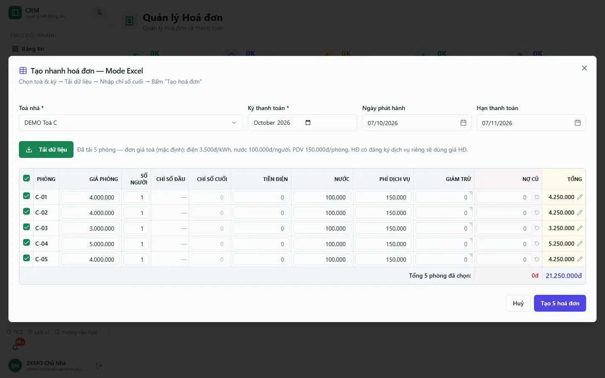

# Sinh hoá đơn hàng loạt

Luồng **Tạo nhanh hoá đơn — Mode Excel** phát hành hoá đơn cho nhiều phòng trong một toà và kỳ trên một bảng giống Excel: hệ thống nạp sẵn giá phòng, số người, chỉ số điện đầu, đơn giá nước/phí dịch vụ và nợ cũ; bạn chỉ nhập chỉ số điện cuối, rà lại rồi tạo cả lô. Bạn cần quyền xem và tạo hoá đơn.

::: info Điều kiện tiên quyết
- Quyền **Hoá đơn => Xem** và **Hoá đơn => Tạo** (`invoices.create`); thiếu quyền tạo thì nút **Mode Excel — Tạo nhanh** không hiện.
- Hợp đồng của các phòng đang hiệu lực; dịch vụ và đơn giá toà đã khai ở [Dịch vụ](/03-quan-ly-van-hanh/dich-vu/).
- Với phòng tính điện theo công tơ: đã có công tơ và chỉ số kỳ trước (xem [Ghi chỉ số điện nước](/03-quan-ly-van-hanh/ghi-chi-so/)).
:::

## Trước khi sinh

1. Lọc danh sách hoá đơn theo đúng toà/kỳ để phát hiện hoá đơn đã tồn tại.
2. Kiểm tra hợp đồng còn hiệu lực; mỗi phòng chỉ nên có một hợp đồng hiệu lực.
3. Xác định các trường hợp ngoại lệ cần [tạo hoá đơn lẻ](/03-quan-ly-van-hanh/hoa-don/) thay vì đưa vào lô.

## Các bước thực hiện

**Bước 1**: Tại **Tài chính** => **Hoá đơn**, bấm nút tròn tím **Mode Excel — Tạo nhanh**. Hộp **Tạo nhanh hoá đơn — Mode Excel** mở ra. Chọn **Toà nhà**, **Kỳ thanh toán**, kiểm tra **Ngày phát hành** và **Hạn thanh toán**, rồi bấm **Tải dữ liệu**. Dòng tóm tắt cho biết số phòng đã tải và đơn giá toà mặc định (điện/kWh, nước/người, PDV/phòng); hợp đồng có đăng ký dịch vụ riêng sẽ dùng giá của hợp đồng.

**Bước 2**: Rà từng dòng của bảng: **Phòng**, **Giá Phòng**, **Số người**, **Chỉ số đầu**, **Chỉ số cuối**, **Tiền điện**, **Nước**, **Phí Dịch Vụ**, **Giảm trừ**, **Nợ cũ**, **Tổng**. Nhập **Chỉ số cuối** cho phòng có công tơ để hệ thống tính tiền điện (phòng không có công tơ hiện "—" ở chỉ số đầu). Nút bút chì cuối dòng mở hộp chia tiền theo ngày (**Ngày bắt đầu / Ngày kết thúc**, tính /30 × số ngày) cho phòng vào ở/trả phòng giữa kỳ; nút tải lại cạnh ô **Nợ cũ** lấy lại nợ cũ tự động. Sửa dữ liệu nguồn nếu một dòng sai; không phát hành rồi mới dùng chứng từ tài chính để bù lỗi tính hoá đơn.

**Bước 3**: Bỏ tích các phòng chưa sẵn sàng. Dòng **Tổng N phòng đã chọn** cho tổng tiền của lô. Bấm **Tạo N hoá đơn**.

**Bước 4**: Đọc kết quả từng phòng ngay dưới bảng: **Đã tạo hoá đơn — xem biên nhận** (link mở hoá đơn) và "Chỉ số điện đã lưu" nếu có nhập chỉ số. Phòng lỗi hiện lý do riêng. Sau đó lọc lại danh sách theo toà/kỳ để kiểm tra.

::: warning Mode Excel lưu cả chỉ số điện
Khi bạn nhập **Chỉ số cuối**, lô tạo hoá đơn cũng lưu chỉ số điện của phòng. Nếu báo **Chưa lưu được chỉ số điện** cho một phòng, kiểm tra hoá đơn từng phòng ở trên; **không tạo lại** những hoá đơn đã có biên nhận.
:::

::: warning Trạng thái sau khi tạo
Hoá đơn mới vào **Đã duyệt** khi tổ chức bật **Tự động duyệt hóa đơn**, ngược lại ở **Nháp** chờ duyệt. Phát hành hoá đơn chưa làm tiền vào sổ quỹ.
:::

## Khi lô có lỗi

- Lô không nguyên tử: mỗi phòng được tạo riêng. Không bấm tạo lại toàn bộ; trước hết xác định phòng nào đã có biên nhận.
- Khi mở lại hộp sau một lần tạo dở, hệ thống báo **Đã xác minh kết quả lần tạo trước** và khoá ô tích của các hợp đồng đã tạo trong kỳ, để tránh trùng.
- Nếu phòng có hai hợp đồng hiệu lực, hệ thống báo **Phòng có nhiều hợp đồng hiệu lực** và chọn hợp đồng mới nhất — hãy thanh lý hợp đồng cũ.
- Với một trường hợp riêng lẻ, dùng [Tạo hoá đơn lẻ](/03-quan-ly-van-hanh/hoa-don/).

## Sau khi phát hành

- Mở mẫu một số hoá đơn để đối chiếu dòng tiền và hạn thanh toán.
- Dùng [Lịch thanh toán](/04-bao-cao/lich-thanh-toan/) như báo cáo hỗ trợ, nhưng lưu ý các giới hạn dữ liệu của báo cáo đó.
- Khi khách thanh toán, dùng [Thu tiền tại hoá đơn](/03-quan-ly-van-hanh/thu-tien-hoa-don/) hoặc [Thu tiền tại phòng](/03-quan-ly-van-hanh/thu-tien-mobile/).

## Thử trực tiếp trên sandbox

<SandboxTry account="demo.chunha" app-path="/invoices" app-label="Mở danh sách Hoá đơn" fixtures="Snapshot 07/10/2026: chọn DEMO Toà C, kỳ 10/2026, bấm Tải dữ liệu nạp 5 phòng C-01…C-05." view-only>

**Bài tập chỉ xem**

1. Bấm **Mode Excel — Tạo nhanh**, chọn một toà DEMO và kỳ, bấm **Tải dữ liệu** (chỉ đọc).
2. Đối chiếu các cột và dòng tổng, rồi bấm **Huỷ**. Không bấm **Tạo N hoá đơn**.

**Kết quả mong đợi**

- Bạn đọc được dữ liệu nạp sẵn của từng phòng.
- Không có hoá đơn hay chỉ số nào được tạo.

</SandboxTry>

## Quy trình liên quan

- [Hoá đơn — danh sách & tạo lẻ](/03-quan-ly-van-hanh/hoa-don/)
- [Chi tiết, in hoá đơn & QR tra cứu](/03-quan-ly-van-hanh/hoa-don-chi-tiet/)
- [Ghi chỉ số điện nước](/03-quan-ly-van-hanh/ghi-chi-so/)
- [Lịch thanh toán](/04-bao-cao/lich-thanh-toan/)
