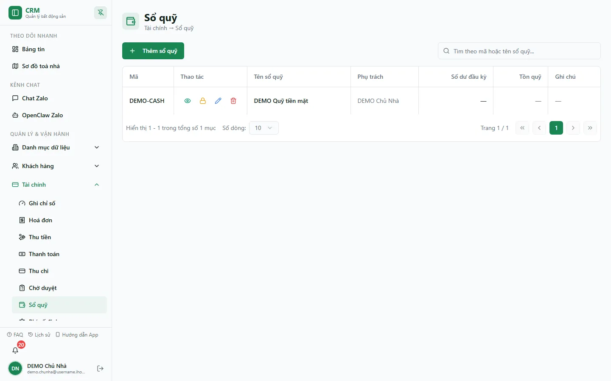

# Sổ quỹ (vận hành)

Màn **Sổ quỹ** dùng để xem và quản lý từng sổ tiền mặt, ngân hàng hoặc sổ nghiệp vụ được tổ chức cấu hình.

::: info Snapshot sổ DEMO hiện tại
Production ngày 13/08/2026 chỉ hiển thị một sổ **DEMO Quỹ tiền mặt**; các cột **Số dư đầu kỳ** và **Tồn quỹ** đang là dấu gạch. Không suy số dư bằng 0 từ dấu gạch và không thay bằng dữ liệu fixture cũ.
:::

## Cách đọc màn hình

**Bước 1**: Chọn sổ cần xem và kiểm tra loại sổ, phạm vi truy cập, số dư hiển thị và trạng thái hoạt động.

**Bước 2**: Mở chi tiết giao dịch để đối chiếu ngày, loại thu/chi, chứng từ nguồn và trạng thái.

**Bước 3**: Khi cần số theo ngày hoặc dòng tiền đã post, đối chiếu với [Sổ quỹ theo ngày](/04-bao-cao/so-quy-ngay/) thay vì chỉ dựa vào thẻ balance trên màn này.

::: warning Hai nguồn trong giai đoạn dual-run
Màn Sổ quỹ hiện vẫn đọc view legacy `accounts_with_balance`, trong khi các báo cáo Finance V2 posting-aware đọc posting lines. Không nên khẳng định mọi số dư nhìn thấy ở các màn đều đến từ một nguồn canonical duy nhất. Nếu có chênh lệch, kiểm tra trạng thái post/reversal của chứng từ trước.
:::

## Đóng sổ vĩnh viễn

Đóng sổ tại `/finance/cashbooks` là thao tác riêng với phiên đối soát:

- Cần người xác nhận khác với người khởi tạo.
- Người xác nhận phải thuộc vai trò phù hợp như chủ tổ chức hoặc kế toán theo chính sách hiện hành.
- Khi hoàn tất, sổ bị khóa vĩnh viễn; đây không phải chức năng khóa rồi mở khóa theo ngày.

::: danger Trước khi đóng sổ
Đối chiếu hết posting, reversal và số thực đếm. Sau khi đóng vĩnh viễn, không hứa hẹn có thể “mở khóa” lại từ giao diện.
:::

## Sổ ảo và chuyển nội bộ

Một số sổ phục vụ tiền thối, làm tròn, cấn trừ hoặc luồng nội bộ. Chuyển động trên các sổ này có thể xuất hiện trong báo cáo dòng tiền khi không lọc; đó là movement của sổ, không nhất thiết là doanh thu hoặc chi phí kinh doanh.

## Đối soát theo ngày

Trang [Bàn giao tiền & đối soát](/03-quan-ly-van-hanh/ban-giao-doi-soat/) ghi một lần so sánh **as-of** giữa số hệ thống và số đếm thực tế. Phiên đó không khóa sổ. Nếu cần khóa vĩnh viễn, quay lại màn Sổ quỹ và thực hiện đúng quy trình xác nhận khác người.

## Quy trình liên quan

- [Thu chi](/03-quan-ly-van-hanh/thu-chi/)
- [Bàn giao tiền & đối soát](/03-quan-ly-van-hanh/ban-giao-doi-soat/)
- [Sổ quỹ theo ngày](/04-bao-cao/so-quy-ngay/)
- [Dòng tiền](/04-bao-cao/dong-tien/)
