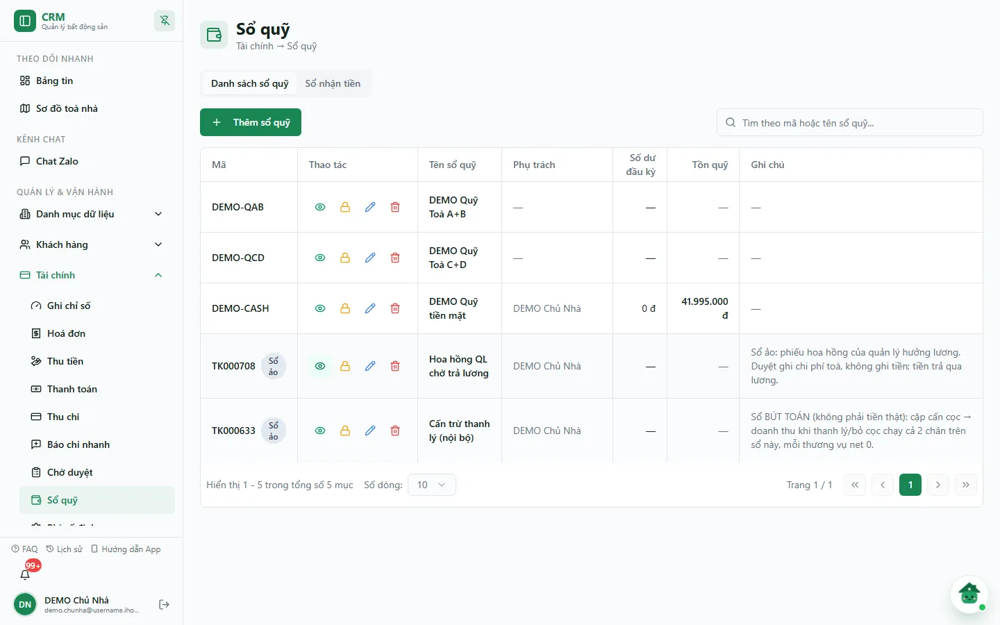
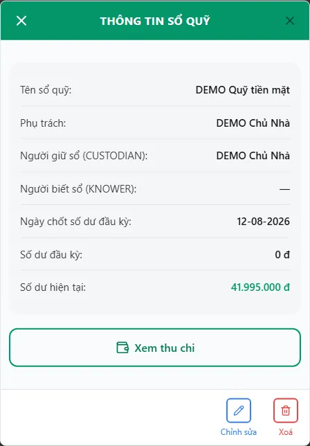
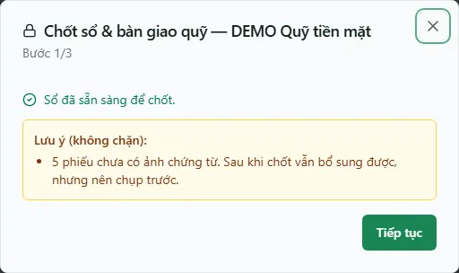
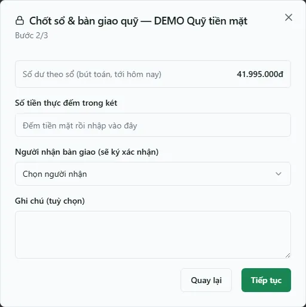
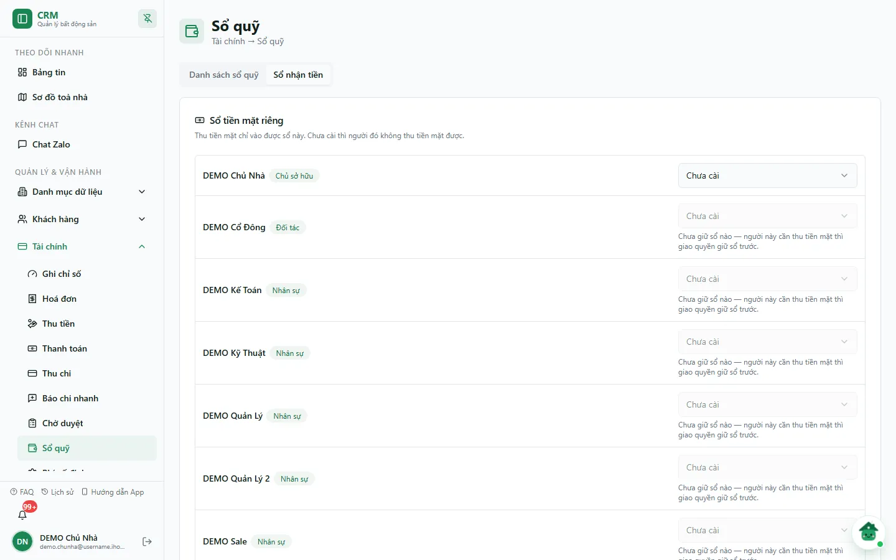

# Sổ quỹ (vận hành)

Màn **Sổ quỹ** (menu **Tài chính → Sổ quỹ**, đường dẫn `/finance/cashbooks`) liệt kê các sổ tiền mặt, ngân hàng và sổ nghiệp vụ của công ty, cho xem tồn quỹ, giao người giữ sổ và **chốt sổ & bàn giao quỹ**. Các đường dẫn cũ `/cashbooks`, `/setting/finance/cashbooks`, `/settings/finance/cashbooks` tự chuyển về đây.

::: info Điều kiện tiên quyết
- Quyền **Sổ quỹ ⇒ Xem** (module `cashbooks`). Thêm/sửa/xoá sổ, chốt sổ (**Đề nghị chốt & bàn giao quỹ**) và ký nhận (**Xác nhận nhận bàn giao**) là các quyền riêng.
- Chỉ **người giữ sổ** (CUSTODIAN) mới thấy tồn quỹ, ghi sổ và đề nghị chốt sổ đó.
:::

## Đọc danh sách sổ quỹ

**Bước 1**: Vào **Tài chính → Sổ quỹ**, tab **Danh sách sổ quỹ**.

Bảng có các cột **Mã**, **Thao tác** (xem chi tiết, chốt sổ & bàn giao quỹ, chỉnh sửa, xoá), **Tên sổ quỹ**, **Phụ trách**, **Số dư đầu kỳ**, **Tồn quỹ** và **Ghi chú**. Ô tìm theo mã hoặc tên sổ ở góc phải; nút **Thêm sổ quỹ** để tạo sổ mới.

- **Tồn quỹ** = số dư đầu kỳ cộng các bút toán **đã ghi sổ** (phiếu Đã Thu/Đã Chi). Phiếu chỉ mới duyệt chưa ghi sổ thì chưa tính vào đây.
- Bạn không giữ sổ (hoặc chỉ là **Người biết sổ** — KNOWER) thì cột tồn quỹ hiện dấu **—**. Dấu gạch không có nghĩa sổ bằng 0.
- Nhãn **Sổ ảo** đánh dấu sổ bút toán/kỹ thuật (ví dụ hoa hồng quản lý chờ trả lương, cấn trừ thanh lý nội bộ) — không phải tiền thật trong két.

::: info Snapshot DEMO 07/10/2026
DEMO có 5 sổ. **DEMO Quỹ tiền mặt** (DEMO-CASH) do DEMO Chủ Nhà giữ, tồn quỹ **41.995.000 đ**; hai sổ **DEMO Quỹ Toà A+B**, **DEMO Quỹ Toà C+D** chưa có người phụ trách nên tồn quỹ là dấu gạch; hai sổ ảo **Hoa hồng QL chờ trả lương** và **Cấn trừ thanh lý (nội bộ)**.
:::

**Bước 2**: Bấm biểu tượng mắt để mở **THÔNG TIN SỔ QUỸ**: tên sổ, phụ trách, **Người giữ sổ (CUSTODIAN)**, **Người biết sổ (KNOWER)**, ngày chốt số dư đầu kỳ, số dư đầu kỳ, số dư hiện tại. Nút **Xem thu chi** mở màn [Thu chi](/03-quan-ly-van-hanh/thu-chi/) lọc theo sổ này.

::: tip Sổ tiền thối và sổ làm tròn
Với sổ có tên kết thúc bằng "Thối" hoặc sổ **Làm tròn tiền thiếu**, nút **Xem thu chi** mở màn riêng **Sổ tiền thối** / **Sổ làm tròn** (`/finance/refund-log`, cần quyền xem cọc). Màn này chỉ đọc: chọn kỳ (tháng này, tháng trước, năm nay hoặc tùy chỉnh) để xem tổng tiền thối, số phiếu và bảng mã phiếu – ngày – hoá đơn – toà – phòng. Đây **không** phải nhật ký hoàn cọc; hoàn/bỏ cọc xem ở [Hoàn / bỏ cọc](/03-quan-ly-van-hanh/hoan-bo-coc/).
:::

## Chốt sổ & bàn giao quỹ

Chốt sổ là nghi thức **hai người**: người đang giữ sổ đếm tiền và gửi đề nghị, người nhận đếm lại và ký. Chỉ khi người nhận ký, kỳ mới bị khoá vĩnh viễn.

**Bước 3**: Người giữ sổ bấm biểu tượng ổ khoá **Chốt sổ & bàn giao quỹ** ở dòng sổ. Hộp **Chốt sổ & bàn giao quỹ** (kèm tên sổ) có ba bước. **Bước 1/3** kiểm tra sổ: mục đỏ **Phải dọn xong những việc này trước** chặn chốt; mục vàng **Lưu ý (không chặn)** chỉ nhắc, ví dụ phiếu chưa có ảnh chứng từ.

**Bước 4**: **Bước 2/3** hiện **Số dư theo sổ (bút toán, tới hôm nay)**. Nhập **Số tiền thực đếm trong két** (sổ ngân hàng thì nhập số dư trên sao kê), chọn **Người nhận bàn giao (sẽ ký xác nhận)** và ghi chú nếu cần. Máy báo **Khớp sổ** hoặc số lệch thừa/thiếu quỹ — số lệch được ghi vào biên bản.

**Bước 5**: **Bước 3/3** đọc lại hệ quả, gõ **CHOT SO** rồi bấm **Gửi đề nghị chốt sổ**. Bước này chỉ **gửi đề nghị** — sổ chưa khoá.

**Bước 6**: Người nhận thấy khung **Đề nghị chốt sổ đang chờ** ở đầu màn Sổ quỹ (kèm số **chờ bạn ký**), bấm **Xem & ký nhận**. Hộp **Xác nhận nhận bàn giao** tính lại số dư theo sổ; người nhận gõ lại số tiền **mình** vừa đếm, đánh dấu **Tôi đã đếm tiền mặt và xác nhận đã nhận đủ số trên**, rồi bấm **Ký nhận & khoá kỳ**. Nếu đếm không khớp thì bấm **Từ chối & huỷ đề nghị**. Nếu sổ đã thay đổi kể từ lúc đề nghị, hộp không cho ký — hai bên huỷ đề nghị và đếm lại.

::: danger Ký là khoá VĨNH VIỄN
Sau khi người nhận ký, mọi phiếu có ngày phát sinh ≤ ngày chốt **không sửa, huỷ hay xoá được nữa**, và không ai mở lại được — kể cả chủ tổ chức. Sai sót phát hiện sau phải xử lý bằng phiếu điều chỉnh ở kỳ hiện tại. Vẫn bổ sung được ảnh chứng từ và ghi chú cho phiếu cũ. Người ký phải **khác** người đề nghị.
:::

## In biên bản chốt sổ

Sau khi ký, khung **Biên bản chốt sổ đã ký** ở đầu màn Sổ quỹ liệt kê các lần chốt (sổ, ngày chốt, số đã đếm, số lệch). Bấm **Xem biên bản** để mở trang `/finance/cashbooks/closure/<số biên bản>`: **BIÊN BẢN CHỐT SỔ & BÀN GIAO QUỸ** gồm sổ quỹ, ngày chốt, số dư theo sổ, số tiền thực đếm, phiếu điều chỉnh chênh lệch, bên giao, bên nhận, thời điểm ký và hai ô ký tay. Bấm **In biên bản** để in, **Về Sổ quỹ** để quay lại. Nội dung biên bản đã khoá, không sửa được.

## Sổ nhận tiền

Tab **Sổ nhận tiền** chỉ hiện với chủ công ty hoặc super admin. Ở đây cài hình thức thu nào đi vào sổ nào:

- **Sổ tiền mặt riêng**: mỗi người thu một sổ tiền mặt riêng; người đó phải đang giữ sổ. Chưa cài thì người đó không thu tiền mặt được.
- **Chuyển khoản / Thanh toán theo toà**: mỗi toà một sổ mặc định (chọn sẵn khi thu) và các sổ phụ. Người thu chỉ thấy các sổ trong danh sách mà họ đang giữ hoặc biết.

Đây là nơi duy nhất sửa sổ mặc định Chuyển khoản/Thanh toán của toà. Người thu đổi hình thức của một lần thu đã ghi bằng nút **Đổi hình thức thu** ở [Thu chi](/03-quan-ly-van-hanh/thu-chi/).

## Sổ ảo và chuyển nội bộ

Sổ ảo phục vụ tiền thối, làm tròn, cấn trừ hoặc luồng nội bộ. Chuyển động trên các sổ này có thể xuất hiện trong báo cáo dòng tiền khi không lọc; đó là chuyển động của sổ, không nhất thiết là doanh thu hoặc chi phí kinh doanh.

## Bàn giao tiền và đối soát

Trang [Bàn giao tiền & đối soát](/03-quan-ly-van-hanh/ban-giao-doi-soat/) theo dõi các phiên bàn giao tiền và so số đếm với số hệ thống tại một thời điểm; nó **không** khoá cả kỳ sổ như chốt sổ. Riêng phiếu nằm trong một phiên bàn giao tiền mặt đã xác nhận thì không sửa/huỷ được cho tới khi hai bên huỷ phiên bàn giao đó.

## Thử trực tiếp trên sandbox

<SandboxTry account="demo.chunha" app-path="/finance/cashbooks" app-label="Mở Sổ quỹ" fixtures="Ngày 07/10/2026: 5 sổ, DEMO Quỹ tiền mặt tồn 41.995.000 đ do DEMO Chủ Nhà giữ; chưa có biên bản chốt sổ nào." view-only>

**Bài tập chỉ xem**

1. Đọc cột **Tồn quỹ** và giải thích vì sao hai sổ toà hiện dấu gạch.
2. Mở chi tiết **DEMO Quỹ tiền mặt**; mở hộp **Chốt sổ & bàn giao quỹ** tới Bước 2/3 rồi **Quay lại** và đóng — không gõ CHOT SO, không gửi.
3. Mở tab **Sổ nhận tiền** chỉ để xem.

**Kết quả mong đợi**

- Phân biệt được tồn quỹ đã ghi sổ với phiếu mới duyệt.
- Không có đề nghị chốt sổ hay thay đổi cài đặt nào được gửi.

</SandboxTry>

## Tình huống & lỗi thường gặp

| Tình huống | Nguyên nhân & cách xử lý |
|---|---|
| Tồn quỹ hiện **—** | Bạn không giữ sổ đó, hoặc chỉ là người biết sổ. Nhờ quản trị giao quyền giữ sổ nếu cần. |
| Không thấy nút ổ khoá | Bạn không có quyền quản lý sổ đó, hoặc sổ đã khoá. Bấm được nút nhưng máy chủ vẫn chỉ cho người đang giữ sổ có quyền **Đề nghị chốt & bàn giao quỹ** gửi đề nghị. |
| Bước 2/3 báo chưa có ai đủ quyền xác nhận | Nhờ quản trị cấp quyền **Xác nhận nhận bàn giao** cho người nhận trước. |
| Người nhận không ký được vì sổ đã thay đổi | Có phiếu mới ghi sổ sau lúc đề nghị. Huỷ đề nghị, đếm lại cùng nhau. |
| Thu chi báo "Ngày đã chọn nằm trong kỳ sổ quỹ đã khóa" | Kỳ đó đã chốt; lập phiếu điều chỉnh ở kỳ hiện tại. |

## Quy trình liên quan

- [Thu chi](/03-quan-ly-van-hanh/thu-chi/)
- [Bàn giao tiền & đối soát](/03-quan-ly-van-hanh/ban-giao-doi-soat/)
- [Sổ quỹ theo ngày](/04-bao-cao/so-quy-ngay/)
- [Dòng tiền](/04-bao-cao/dong-tien/)
