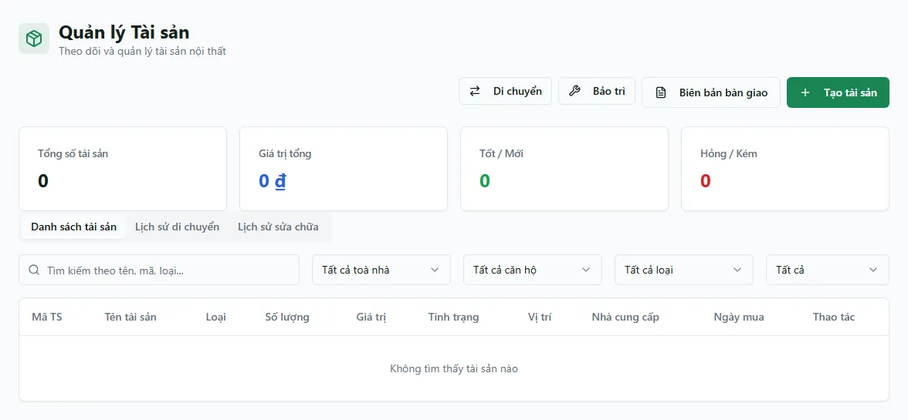

# Tài sản

Màn **Tài sản** là sổ quản lý toàn bộ nội thất và tài sản cố định của bạn: máy lạnh, tủ lạnh, giường, bàn ghế… Mỗi món là một dòng, có **loại tài sản**, **tình trạng**, **giá mua**, **số lượng** và **vị trí** (toà nhà + căn hộ). Dùng màn này khi cần biết một phòng đang có những đồ gì, theo dõi món nào đã cũ/hỏng cần thay, ghi lại việc chuyển đồ giữa các phòng, lập phiếu sửa chữa hay làm biên bản giao/nhận tài sản khi khách vào/ra.

Toàn bộ nghiệp vụ tài sản gom trong một màn với ba tab: **Danh sách tài sản**, **Lịch sử di chuyển** và **Lịch sử sửa chữa**. Từ đây bạn tạo tài sản mới, lập phiếu di chuyển, phiếu bảo trì và biên bản bàn giao theo hợp đồng.

::: info Điều kiện tiên quyết
- Quyền **Tài sản => Xem** (module `assets`, action `view`) để mở màn danh sách.
- Quyền **Tạo** trên module `assets` để thêm tài sản; quyền **Di chuyển tài sản** (`assets.move`) và **Tạo phiếu bảo trì/sửa chữa** (`assets.maintain`) cho hai thao tác tương ứng.
- Nút **Biên bản bàn giao** dùng quyền **Bàn giao** của module hợp đồng (`contracts.handover`), không phải quyền `assets`.
- Đã có **toà nhà** và **phòng** trong hệ thống để gắn vị trí tài sản. Biên bản bàn giao cần có **hợp đồng** để chọn.
- Là nhân viên, bạn chỉ thấy/sửa tài sản thuộc các **toà được gán phạm vi** cho mình; tài sản chưa gắn toà thì cần quyền cấp tổ chức mới sửa được.
:::

## Hướng dẫn từng bước

**Bước 1**: Tại menu bên trái, trong nhóm **Danh mục dữ liệu**, ấn chọn **Tài sản**. Màn hiện tab **Danh sách tài sản** kèm 4 thẻ thống kê ở đầu trang (**Tổng số tài sản** / **Giá trị tổng** / **Tốt / Mới** / **Hỏng / Kém**), ô tìm kiếm và các bộ lọc theo **Loại tài sản**, **Toà nhà**, **Căn hộ**, **Tình trạng**.

**Bước 2**: Muốn thêm tài sản, ấn **Tạo tài sản** để mở form. Điền các trường:
- **Tên tài sản** (bắt buộc) và **Loại tài sản** (bắt buộc) — ví dụ "Máy lạnh Daikin", loại "Điện lạnh".
- **Số lượng** (bắt buộc, tối thiểu 1), **Tình trạng** (bắt buộc — **Mới / Tốt / Khá / Kém / Hỏng**), **Giá mua** (bắt buộc).
- Tùy chọn thêm: **Mã tài sản**, **Nhà cung cấp**, **Ngày mua**, **Tòa nhà**, **Căn hộ**, **Mô tả**.

Điền xong ấn nút tạo. Tài sản mới xuất hiện ngay trong danh sách và cả trong tab **Tài sản** ở trang chi tiết của phòng bạn gắn.

**Bước 3**: Cần chỉnh, ấn **Sửa** trên dòng tài sản, đổi thông tin rồi lưu. Muốn bỏ một món (thanh lý, nhập nhầm…), ấn **Xoá** — món đó được ẩn khỏi danh sách. **Tình trạng** của tài sản (Mới → Tốt → Khá → Kém → Hỏng) do bạn **tự cập nhật tay** qua nút Sửa; hệ thống không tự đổi tình trạng.

**Bước 4**: Muốn ghi lại việc chuyển một món sang phòng khác, ấn **Di chuyển** để mở phiếu. Chọn **Tài sản** cần chuyển, **Từ căn hộ** (vị trí hiện tại), **Đến căn hộ** (bắt buộc), nhập **Số lượng**, **Ngày di chuyển** và **Lý do**, rồi lưu. Phiếu được ghi vào tab **Lịch sử di chuyển**.

**Bước 5**: Cần ghi nhận sửa chữa/bảo trì, ấn **Bảo trì** để mở phiếu. Điền **Tài sản**, **Mô tả công việc** (bắt buộc), **Ngày bảo trì**, tùy chọn **Chi phí (VNĐ)**, **Phân công cho**, **Ghi chú** và **Trạng thái** (**Chờ xử lý / Đang làm / Hoàn thành**), rồi lưu. Phiếu vào tab **Lịch sử sửa chữa**.

Ô **Chi phí** trên phiếu bảo trì chỉ là metadata theo dõi của tài sản. Nó không tự tạo phiếu chi, không làm giảm sổ quỹ công ty và không tự vào báo cáo tài chính; nếu đã trả tiền sửa chữa, hãy ghi khoản chi riêng ở [Thu chi](/03-quan-ly-van-hanh/thu-chi/).

**Bước 6**: Khi khách nhận hoặc trả căn hộ, ấn **Biên bản bàn giao** để lập biên bản. Chọn **Hợp đồng**, **Loại** (**Nhận căn hộ** khi khách vào / **Trả căn hộ** khi khách ra), **Ngày**, và điền **Danh sách tài sản** bàn giao, rồi ấn **Tạo biên bản**.

::: warning Phiếu di chuyển chỉ ghi lịch sử — không tự đổi vị trí tài sản
Lập phiếu **Di chuyển** chỉ ghi lại một dòng lịch sử; nó **không tự cập nhật** vị trí (toà/phòng) của tài sản trong danh sách. Muốn tài sản hiển thị đúng ở phòng mới, sau khi tạo phiếu bạn hãy vào **Sửa** món đó và đổi lại **Tòa nhà** / **Căn hộ**. Ngoài ra ô **Số lượng** trên phiếu di chuyển không tự trừ/cộng vào tồn của tài sản — nó chỉ là con số ghi nhận.
:::

::: warning Phiếu bảo trì và biên bản bàn giao chưa sửa lại được sau khi tạo
Sau khi tạo, phiếu bảo trì **giữ nguyên trạng thái** bạn chọn lúc đầu — bản hiện tại chưa có nút đổi trạng thái từ **Chờ xử lý** sang **Đang làm** / **Hoàn thành** trên giao diện, nên hãy chọn đúng trạng thái ngay khi tạo. Biên bản bàn giao cũng **chưa có màn xem lại** danh sách đã lập; hãy kiểm tra kỹ **Hợp đồng** và **Loại** trước khi lưu.
:::

## Các tính năng khác trên màn hình

| Nút / Bộ lọc | Công dụng |
| --- | --- |
| Ô tìm kiếm | Tìm nhanh theo **tên**, **mã** hoặc **loại tài sản**; áp ngay vào danh sách. |
| Bộ lọc **Loại tài sản** / **Toà nhà** / **Căn hộ** / **Tình trạng** | Thu hẹp danh sách theo loại, toà, phòng hoặc tình trạng. Các bộ lọc và ô tìm kiếm được giữ lại khi tải lại trang (F5). |
| Thẻ **Tổng số tài sản** | Đếm số món đang có (theo danh sách đã lọc). |
| Thẻ **Giá trị tổng** | Tổng giá trị = giá mua × số lượng của các món đang lọc. |
| Thẻ **Tốt / Mới** và **Hỏng / Kém** | Gộp nhanh số món theo nhóm tình trạng để biết bao nhiêu đồ còn tốt, bao nhiêu đồ đã xuống cấp. |
| Tab **Lịch sử di chuyển** | Xem lại các phiếu di chuyển đã lập. |
| Tab **Lịch sử sửa chữa** | Xem lại các phiếu bảo trì/sửa chữa đã lập. |
| **Tạo tài sản** / **Di chuyển** / **Bảo trì** / **Biên bản bàn giao** | Mở các form tương ứng (hiện theo quyền của bạn). |
| **Sửa** / **Xoá** | Chỉnh thông tin hoặc ẩn (xoá mềm) một tài sản. |

## Tình huống & lỗi thường gặp

| Tình huống | Cách xử lý |
| --- | --- |
| Không thấy nút **Tạo tài sản** / **Di chuyển** / **Bảo trì** | Thiếu quyền tương ứng (`assets.create` / `assets.move` / `assets.maintain`). Nhờ quản trị bật quyền cho tài khoản. |
| Không thấy nút **Biên bản bàn giao** | Nút này dùng quyền **Bàn giao** của module hợp đồng (`contracts.handover`), không phải quyền tài sản. |
| Danh sách trống dù chắc chắn có tài sản | Thường do phạm vi: nhân viên chỉ thấy tài sản thuộc toà được gán. Cũng nên kiểm tra ô tìm kiếm và bộ lọc còn dính giá trị cũ (bộ lọc giữ qua F5). |
| Đã lập phiếu **Di chuyển** nhưng tài sản vẫn hiện ở phòng cũ | Đúng hiện trạng: phiếu chỉ ghi lịch sử. Vào **Sửa** tài sản và đổi lại **Tòa nhà** / **Căn hộ** để cập nhật vị trí. |
| Không thấy **Loại tài sản** cần dùng trong ô chọn | Danh mục loại tài sản hiện được quản trị viên khởi tạo sẵn; nếu thiếu loại, liên hệ quản trị bổ sung trước khi tạo tài sản. |
| Ô **Phân công cho** trong phiếu bảo trì chỉ có tên mình | Đúng hiện trạng: bản này chỉ cho tự gán mình. Ghi thêm người thực hiện vào ô **Ghi chú** nếu cần. |
| Không đổi được trạng thái phiếu bảo trì đã tạo | Bản hiện tại chưa có nút đổi trạng thái sau khi tạo. Hãy chọn đúng **Trạng thái** ngay lúc lập phiếu. |
| Tình trạng phòng chi tiết hiển thị khác với màn Tài sản | Tab **Tài sản** ở trang chi tiết phòng dùng cách hiển thị riêng; số liệu chuẩn về tình trạng và giá trị hãy xem tại màn **Tài sản** này. |

## Thử trực tiếp trên sandbox

<SandboxTry account="demo.chunha" app-path="/assets" app-label="Mở màn Tài sản" fixtures="Snapshot 13/08/2026: danh sách tài sản đang rỗng." view-only>

Quan sát empty state mà không tạo dữ liệu:

1. Mở tab **Danh sách tài sản**, đọc bốn thẻ thống kê và xác nhận bảng không có dòng ở snapshot hiện tại.
2. Mở **Lịch sử di chuyển** và **Lịch sử sửa chữa** để kiểm tra trạng thái rỗng theo từng tab.
3. Nhận diện các nút **Tạo tài sản / Di chuyển / Bảo trì / Biên bản bàn giao**, nhưng không mở/lưu form trong bài quan sát.

Kết quả mong đợi: bạn nhận diện đúng empty state và biết các điều kiện dữ liệu cần có trước khi tạo tài sản, di chuyển hoặc bảo trì.

</SandboxTry>

## Quy trình liên quan

- [Căn hộ / Phòng](/03-quan-ly-van-hanh/can-ho-phong/) — nơi gắn vị trí tài sản; trang chi tiết phòng có tab **Tài sản** liệt kê đồ trong phòng.
- [Hợp đồng](/03-quan-ly-van-hanh/hop-dong/) — hợp đồng thuê, dùng để chọn khi lập **Biên bản bàn giao** tài sản.
- [Toà nhà](/03-quan-ly-van-hanh/toa-nha/) — quản lý toà; phạm vi toà quyết định tài sản nào bạn thấy và sửa được.
