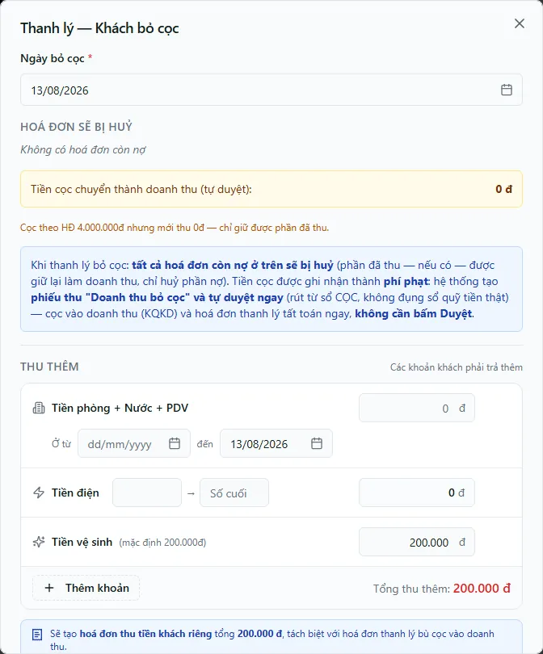

# Thanh lý hợp đồng — Khách bỏ cọc

Khi khách **bỏ ngang, chịu mất cọc**, bạn thanh lý hợp đồng theo hình thức **Khách bỏ cọc** (forfeit). Đây là luồng ghi tiền: hệ thống **tịch thu phần cọc khách đã thực đóng** và chuyển thành doanh thu (phí phạt), đồng thời **huỷ toàn bộ hoá đơn còn nợ** của hợp đồng. Nếu bạn cần đòi thêm phần vượt quá cọc, khu **Thu thêm** sẽ tạo một **hoá đơn thu tiền khách riêng** để bạn theo dõi và thu sau. Trang này hướng dẫn mở form từ trang chi tiết hợp đồng, đọc đúng các con số, và nắm rõ dòng tiền của việc bỏ cọc.

::: info Điều kiện tiên quyết
- Có quyền **Hợp đồng => Thanh lý** (`contracts.terminate`) và phạm vi toà của hợp đồng.
- Quyền **Hợp đồng => Thanh lý** (module `contracts`, action `terminate`). Thao tác chỉ chạy khi bạn có quyền trên **toà của hợp đồng** — nếu không, bấm xác nhận sẽ bị hệ thống từ chối.
- Hợp đồng đang ở trạng thái **Đang hoạt động** (chưa **Thanh lý** / **Hết hạn**) và còn phòng, còn toà.
- Đã cấu hình **sổ CỌC** (`CỌC (giữ hộ khách)`) và **sổ vận hành** của toà để tiền cọc và doanh thu có chỗ chảy vào. Xem [Sổ quỹ & loại thu chi](/01-bat-dau/so-quy-loai-thu-chi/).
- Hiểu trước hai cách tất toán cọc ở [Hoàn / bỏ cọc](/03-quan-ly-van-hanh/hoan-bo-coc/); nếu khách **trả phòng đúng quy trình và còn cọc phải trả lại**, dùng [Thanh lý — Khách rời phòng](/03-quan-ly-van-hanh/thanh-ly-move-out/) thay vì bỏ cọc.
:::

## Hướng dẫn từng bước

**Bước 1**: Mở trang chi tiết một hợp đồng **Đang hoạt động** cần kiểm tra. Ảnh production dùng `HD-2026-00001`, phòng **A-01**, khách **DEMO Khách 01**. Đầu trang có một hàng nút thao tác vòng đời, trong đó có nút **Thanh lý**.

**Bước 2**: Ấn **Thanh lý** để mở hộp thoại **Thanh lý hợp đồng**. Ở bước đầu **Chọn hình thức thanh lý hợp đồng:**, ấn ô **Khách bỏ cọc** (ô đỏ, biểu tượng cấm) — dành cho trường hợp khách bỏ ngang, mất cọc.

**Bước 3**: Form **Thanh lý — Khách bỏ cọc** mở ra. Đọc ô **Ngày bỏ cọc** (bắt buộc, mặc định là hôm nay) — đây là ngày ghi nhận bỏ cọc và quyết định tháng của hoá đơn thanh lý.

::: danger Không thanh lý khi danh sách nợ còn loading hoặc vừa lỗi
Danh sách/tổng nợ được tính phía trình duyệt. Khi truy vấn lỗi, form có thể coi nợ là 0 và huỷ/tất toán sai. Chỉ tiếp tục sau khi bảng hoá đơn ổn định và tổng được đối chiếu với nguồn kế toán; mọi con số minh hoạ phải được thay bằng số đang hiển thị trên hợp đồng thực tế.
:::

**Bước 4**: Đọc khối **Hoá đơn sẽ bị huỷ**. Bảng liệt kê mọi hoá đơn còn nợ của hợp đồng theo cột **Mã HĐ**, **Kỳ**, **Tổng tiền**, **Đã TT**, **Còn nợ**. Nếu không có nợ như snapshot ngày 13/08/2026, form hiện *Không có hoá đơn còn nợ*. Khi có dữ liệu thật, hoá đơn chưa thu bị huỷ phần nợ; hoá đơn đã thu một phần giữ lại đúng phần đã thu, chỉ xoá phần chưa thu.

**Bước 5**: Đọc hộp giải thích màu xanh và dòng **Tiền cọc chuyển thành doanh thu**. Snapshot cho thấy **cọc theo hợp đồng 4.000.000đ nhưng mới thu 0đ**, nên số chuyển thành doanh thu là **0đ**. Hệ thống chỉ tịch thu phần cọc **đã thực đóng**, không tính phần khách còn nợ cọc — doanh thu bỏ cọc có thể nhỏ hơn tổng cọc ghi trên hợp đồng.

::: danger Bỏ cọc là quyết định kế toán không tiền mặt, được tự duyệt trong cùng writer
Khi bạn ấn **Lập hoá đơn & thanh lý**, hệ thống huỷ phần nợ cũ, tạo **hoá đơn thanh lý** bằng phần cọc đã thực đóng, rồi tạo cặp bút toán nội bộ **Cấn cọc bỏ cọc / Doanh thu bỏ cọc** trên sổ ảo. Cặp này được đóng dấu `posting_mode=NON_CASH`, `posting_status=NOT_APPLICABLE` và **tự duyệt** trong writer thanh lý; cascade đồng thời tạo payment không tiền mặt để tất toán hoá đơn thanh lý. Vì vậy không có bước **Duyệt và Thu/Chi** thủ công, và tuyệt đối không coi đây là tiền mới vào hoặc ra sổ quỹ thật.
:::

**Bước 6**: Nếu cần **đòi thêm** một khoản ngoài phần cọc thực thu, dùng khu **Thu thêm**. Nhập các khoản khách phải trả thêm:
- **Tiền phòng + Nước + PDV** theo khoảng **Ở từ** → **đến** (ô **đến** mặc định là ngày bỏ cọc) — hệ thống tính theo số ngày ở thực tế.
- **Tiền điện**: nhập **số đầu** → **Số cuối** để chốt số điện cuối kỳ.
- **Tiền vệ sinh** (mặc định **200.000đ**).
- **Thêm khoản** cho một khoản tuỳ ý (tên + số tiền).

Cuối khu hiện **Tổng thu thêm**. Khác với rời phòng, thu thêm khi **bỏ cọc** sẽ tạo một **hoá đơn thu tiền khách riêng** (ghi rõ dưới form: *"Sẽ tạo hoá đơn thu tiền khách riêng… tách biệt với hoá đơn thanh lý bù cọc vào doanh thu"*). Hoá đơn AR này **chờ bạn thu tiền khách thật** sau thanh lý ở [Thu tiền hoá đơn](/03-quan-ly-van-hanh/thu-tien-hoa-don/) — nó **không** được cấn vào cọc.

**Bước 7 (bài tập — không hoàn tất)**: Để chỉ tìm hiểu dòng tiền mà không ghi dữ liệu, ấn **Hủy** (hoặc dấu **✕** góc trên) để đóng form. Nút **Quay lại** đưa bạn về bước chọn hình thức nếu muốn xem lại luồng **Khách rời phòng**.

::: warning Nếu đã lỡ hoàn tất — dừng sửa dữ liệu và đối soát
Thanh lý đóng hợp đồng thật (đổi trạng thái **Thanh lý**, giải phóng phòng) và rất khó hoàn tác. Bài kiểm tra tài liệu chỉ mở form rồi đóng; không bấm **Lập hoá đơn & thanh lý**.

Cặp bút toán được bảo vệ bằng `system_source` canonical và authorization bất biến; marker ghi chú `[CẤN CỌC BỎ CỌC …]` chỉ còn dùng để nhận diện dữ liệu legacy đã review. **Không sửa phiếu, ghi chú, sổ hoặc trạng thái của cặp bút toán bằng thao tác thông thường.** Nếu kết quả không khớp, giữ nguyên bằng chứng và chuyển kế toán/quản trị kỹ thuật xử lý qua writer/RPC được phép.
:::

::: danger Checklist bắt buộc sau bỏ cọc
Sau bước thanh lý, kiểm tra: hợp đồng **TERMINATED** đúng ngày; phòng **TRỐNG** và không còn hợp đồng hiệu lực; hoá đơn cũ/hoá đơn thanh lý/hoá đơn Thu thêm có trạng thái đúng; **cả hai đầu** cặp bút toán cấn trừ tồn tại đúng một lần, cùng sổ ảo, cùng số tiền, `APPROVED` và `posting_status=NOT_APPLICABLE`; payment tất toán hoá đơn có `received_amount=0`; có bản ghi `contract_terminations`/lịch sử. Nếu thiếu bất kỳ phần nào, dừng thao tác và báo kế toán + quản trị kỹ thuật. Không thanh lý lại, không tạo cặp phiếu bù và không chỉnh nhãn để ép máy trạng thái.
:::

## Các tính năng khác trên màn hình

| Nút / Thành phần | Công dụng |
| --- | --- |
| **Ngày bỏ cọc** | Ngày ghi nhận bỏ cọc (mặc định hôm nay); quyết định tháng của hoá đơn thanh lý. |
| Bảng **Hoá đơn sẽ bị huỷ** | Liệt kê mọi hoá đơn còn nợ (Mã HĐ / Kỳ / Tổng tiền / Đã TT / Còn nợ) sẽ bị huỷ; dòng **Tổng còn nợ sẽ huỷ** cộng lại phần nợ. |
| Hộp giải thích (xanh) | Tóm tắt cơ chế bỏ cọc: huỷ nợ, cọc thành phí phạt, cặp bút toán nội bộ tự duyệt trên sổ ảo và payment không tiền mặt tất toán hoá đơn thanh lý. |
| Khu **Thu thêm** | Bốn khoản đòi thêm: **Tiền phòng + Nước + PDV** (theo **Ở từ** → **đến**), **Tiền điện** (số đầu → **Số cuối**), **Tiền vệ sinh**, **Thêm khoản** tuỳ ý; hiện **Tổng thu thêm**. |
| Thẻ **Tiền cọc** (phải) | **Tổng tiền cọc** / **Đã thu** / **Còn lại** — nguồn của phần cọc bị tịch thu. |
| Thẻ **Tóm tắt hóa đơn** (phải) | **Tổng hóa đơn** / **Tổng phát sinh** / **Đã thanh toán** / **Công nợ** của hợp đồng. |
| **Quay lại** | Về bước **Chọn hình thức thanh lý** (đổi sang **Khách rời phòng**). |
| **Hủy** | Đóng hộp thoại, không ghi gì. |
| **Lập hoá đơn & thanh lý** | Nút đỏ xác nhận: chạy thanh lý bỏ cọc (huỷ nợ, tạo hoá đơn thanh lý + cặp bút toán nội bộ tự duyệt, hoá đơn AR thu thêm nếu có). |

## Tình huống & lỗi thường gặp

| Tình huống | Cách xử lý |
| --- | --- |
| Bấm **Lập hoá đơn & thanh lý** báo **từ chối quyền** | Trang chi tiết vẫn hiện nút cho mọi toà, nhưng thao tác chỉ chạy khi bạn có quyền **Thanh lý** trên toà của hợp đồng. Nhờ người quản lý toà đó thực hiện, hoặc kiểm tra phân quyền. |
| Đã thanh lý nhưng **hoá đơn thanh lý chưa tất toán** / KQKD thiếu doanh thu bỏ cọc | Đây là lỗi của chuỗi writer/cascade vì cặp bút toán hiện phải tự duyệt và tất toán ngay. Giữ nguyên dữ liệu; đối chiếu hai `system_source` `termination.forfeit_offset`/`termination.forfeit_revenue`, authorization và payment không tiền mặt, rồi báo quản trị kỹ thuật. **Không bấm Duyệt/Thu/Chi thủ công và không thanh lý lại.** |
| **Cọc thành doanh thu ít hơn** tổng cọc trên hợp đồng | Đúng thiết kế: bỏ cọc chỉ tịch thu phần cọc **khách đã thực đóng**, không tính phần khách còn nợ cọc. |
| Nợ **lớn hơn** cọc, muốn thu phần vượt | Bỏ cọc huỷ hết hoá đơn nợ cũ và giữ cọc làm doanh thu; phần vượt **không** tự đòi. Dùng khu **Thu thêm** để tạo **hoá đơn thu tiền khách riêng**, rồi thu sau ở [Thu tiền hoá đơn](/03-quan-ly-van-hanh/thu-tien-hoa-don/). |
| Cặp bút toán hiện nút **Duyệt và Thu/Chi** | Không thao tác: đây là bút toán `NON_CASH/NOT_APPLICABLE`, không được ghi vào sổ quỹ thật. Chụp trạng thái và báo quản trị kỹ thuật kiểm runtime/migration. |
| Hợp đồng đã đóng nhưng thiếu lịch sử thanh lý | Có lỗi đã biết khiến insert `contract_terminations` bị bỏ qua. Đối chiếu hợp đồng, phòng, hoá đơn và cặp phiếu; báo quản trị phục hồi audit trail, không thực hiện lại giao dịch. |
| Không thấy nút **Thanh lý** hoặc form báo lỗi | Hợp đồng đã **Thanh lý** / **Hết hạn**, hoặc chưa có phòng/toà. Chỉ thanh lý được hợp đồng **Đang hoạt động**. |

## Thử trực tiếp trên sandbox

<SandboxTry account="demo.chunha" app-path="/contracts" app-label="Mở danh sách hợp đồng" fixtures="HD-2026-00001 · không có hoá đơn còn nợ · cọc yêu cầu 4.000.000đ, đã thu 0đ" view-only>

Tìm hiểu dòng tiền bỏ cọc trên `HD-2026-00001` — **không hoàn tất**:

1. Trong danh sách hợp đồng, mở `HD-2026-00001` của phòng **A-01**.
2. Đầu trang, ấn **Thanh lý** → ở bước **Chọn hình thức thanh lý hợp đồng:** chọn **Khách bỏ cọc**.
3. Ở form **Thanh lý — Khách bỏ cọc**, xác nhận **Không có hoá đơn còn nợ** và dòng **Tiền cọc chuyển thành doanh thu = 0đ** vì cọc chưa được thu.
4. Xem khu **Thu thêm**: để ý dòng dưới cùng báo sẽ tạo **hoá đơn thu tiền khách riêng** — cách đòi thêm phần vượt cọc.
5. Ấn **Hủy** (hoặc **✕**) để đóng mà không ghi dữ liệu.

Kết quả mong đợi: bạn hiểu luồng bỏ cọc — cọc thực đóng thành doanh thu qua **cặp bút toán nội bộ tự duyệt, không tiền mặt**, hoá đơn nợ cũ bị huỷ, và phần vượt cọc phải đòi bằng hoá đơn AR từ khu **Thu thêm**.

</SandboxTry>

## Quy trình liên quan

- [Hợp đồng chi tiết](/03-quan-ly-van-hanh/hop-dong-chi-tiet/) — nơi có nút **Thanh lý** mở hộp thoại này.
- [Thanh lý — Khách rời phòng](/03-quan-ly-van-hanh/thanh-ly-move-out/) — hình thức còn lại: khách trả phòng đúng quy trình, còn cọc phải trả lại.
- [Hoàn / bỏ cọc](/03-quan-ly-van-hanh/hoan-bo-coc/) — tra soát các khoản đã hoàn/bỏ cọc sau thanh lý.
- [Thu chi & Sổ quỹ](/03-quan-ly-van-hanh/thu-chi/) — nơi tra soát cặp bút toán nội bộ; không dùng nút Thu/Chi cho cặp bỏ cọc.
- [Thu tiền hoá đơn](/03-quan-ly-van-hanh/thu-tien-hoa-don/) — thu hoá đơn AR "thu thêm" sinh ra khi bỏ cọc.
- [Sổ quỹ](/03-quan-ly-van-hanh/so-quy/) — sổ CỌC (giữ hộ khách) và sổ vận hành, hai đầu của dòng tiền bỏ cọc.
- [Đặt cọc giữ chỗ](/03-quan-ly-van-hanh/dat-coc/) — nguồn của số cọc bị tịch thu.
- [Chia lợi nhuận](/03-quan-ly-van-hanh/chia-loi-nhuan/) — doanh thu bỏ cọc vào KQKD nên ảnh hưởng phân bổ lợi nhuận cổ đông.
- [Quy trình thanh lý](/01-bat-dau/quy-trinh-thanh-ly/) — vị trí bước thanh lý trong toàn bộ vòng đời khách thuê.
