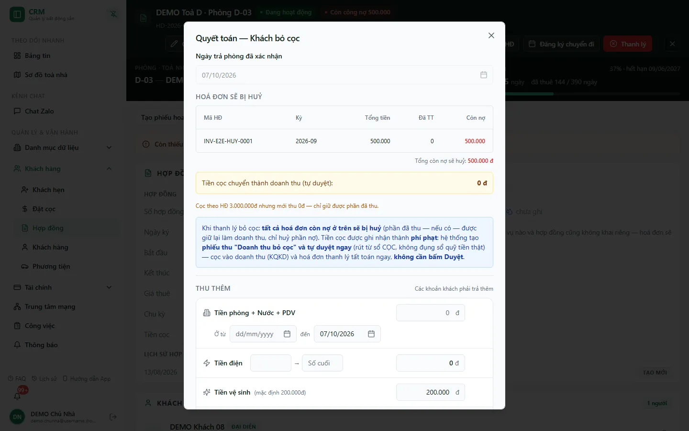

# Thanh lý hợp đồng — Khách bỏ cọc

Khi khách **bỏ ngang, chịu mất cọc**, bạn thanh lý hợp đồng với loại **Bỏ cọc**. Đây là luồng ghi tiền: hệ thống **giữ phần cọc khách đã thực đóng** làm doanh thu (phí phạt) và **huỷ toàn bộ phần nợ của các hoá đơn còn nợ**. Nếu cần đòi thêm một khoản ngoài cọc, khu **Thu thêm** tạo một **hoá đơn thu tiền khách riêng** để thu sau.

::: info Điều kiện tiên quyết
- Quyền **Hợp đồng => Thanh lý** (`contracts.terminate`) trên toà của hợp đồng.
- Hợp đồng đang hiệu lực và còn gắn phòng/toà — hoặc đã có hồ sơ **Chờ quyết toán** được ghi nhận trước với loại Bỏ cọc.
- Nếu khách **trả phòng đúng quy trình và còn cọc phải trả lại**, dùng [Thanh lý — Khách rời phòng](/03-quan-ly-van-hanh/thanh-ly-move-out/) thay vì bỏ cọc.
:::

## Hướng dẫn từng bước

**Bước 1**: Mở [trang chi tiết hợp đồng](/03-quan-ly-van-hanh/hop-dong-chi-tiet/) cần xử lý và ấn nút đỏ **Thanh lý**. Hộp **Thanh lý hợp đồng** mở ra.

**Bước 2**: Điền **Ngày khách thực tế trả phòng \***, chọn **Loại thanh lý** = **Bỏ cọc**, nhập **Nội dung thanh lý \*** (có nút **Dùng nội dung mẫu**: "Khách trả phòng và bỏ cọc."), và khai **Chỉ số điện, nước khi bàn giao** (hoặc giữ tích **Chưa đủ chỉ số, bổ sung sau**). Các bước này giống luồng rời phòng — xem chi tiết ở [Khách rời phòng](/03-quan-ly-van-hanh/thanh-ly-move-out/).

**Bước 3**: Chọn **Trả phòng, quyết toán sau** (hồ sơ vào tab **Chờ quyết toán**, chưa ghi tiền) hoặc **Tiếp tục quyết toán ngay**. Hồ sơ để sau thì quyết toán bằng nút **Quyết toán** ở tab **Chờ quyết toán** hoặc **Quyết toán hồ sơ này** ở trang chi tiết.

**Bước 4**: Form **Quyết toán — Khách bỏ cọc** hiện:

- **Ngày trả phòng đã xác nhận** (chỉ đọc).
- **HOÁ ĐƠN SẼ BỊ HUỶ**: mọi hoá đơn còn nợ (Mã HĐ, Kỳ, Tổng tiền, Đã TT, Còn nợ) và dòng **Tổng còn nợ sẽ huỷ**; hoặc *Không có hoá đơn còn nợ*. Hoá đơn đã thu một phần giữ lại phần đã thu, chỉ huỷ phần nợ.
- Dòng **Tiền cọc chuyển thành doanh thu (tự duyệt)** = phần cọc **đã thu** (không vượt cọc theo hợp đồng). Nếu cọc thu chưa đủ, dòng dưới ghi "Cọc theo HĐ …đ nhưng mới thu …đ — chỉ giữ được phần đã thu."
- Nếu hợp đồng có credit (tiền khách trả dư), khung cam báo toàn bộ credit sẽ bị xoá khi bỏ cọc.
- Hộp giải thích xanh về cơ chế bỏ cọc.
- **THU THÊM**: **Tiền phòng + Nước + PDV** (theo **Ở từ → đến**), **Tiền điện** (số đầu → **Số cuối**), **Tiền vệ sinh** (mặc định 200.000 đ), khoản tuỳ ý; khi có số, dòng dưới báo sẽ tạo **hoá đơn thu tiền khách riêng**.

::: danger Không quyết toán khi danh sách nợ chưa tải xong hoặc vừa lỗi
Nếu hộp báo "Không tải được công nợ và số dư khách hàng", đóng lại và tải lại trang. Chỉ tiếp tục khi bảng hoá đơn đã hiện ổn định và đã đối chiếu với số đang theo dõi.
:::

**Bước 5**: Ấn **Lập hoá đơn & thanh lý**. Hộp **Xác nhận thanh lý — khách bỏ cọc** tóm tắt **Cọc chuyển thành doanh thu (tự duyệt)**, **Hoá đơn còn nợ sẽ bị huỷ** (số hoá đơn và tổng), **Thu thêm (hoá đơn công nợ riêng)** nếu có. Ấn **Xem lại** để quay lại, hoặc **Xác nhận thanh lý** để chốt.

::: danger Bỏ cọc là bút toán không tiền mặt, tự duyệt, không hoàn tác
Khi xác nhận, hệ thống huỷ phần nợ cũ, tạo **hoá đơn thanh lý** bằng phần cọc đã thực đóng, và tạo phiếu **"Doanh thu bỏ cọc"** rút từ sổ **CỌC** — **tự duyệt ngay**, không đụng sổ quỹ tiền thật, không cần bấm **Duyệt**. Cọc vào doanh thu (KQKD) và hoá đơn thanh lý tất toán ngay; hợp đồng chuyển **Đã thanh lý**, phòng được giải phóng. Đây không phải tiền mới vào hay ra sổ quỹ thật.
:::

**Bước 6 — Checklist sau bỏ cọc**: hợp đồng **Đã thanh lý** đúng ngày, khối **Hồ sơ trả phòng** ghi **Đã chốt quyết toán**; phòng trống; hoá đơn cũ đã huỷ phần nợ; hoá đơn thanh lý đã tất toán; phiếu **Doanh thu bỏ cọc** tồn tại đúng một lần, đã duyệt; hoá đơn **Thu thêm** (nếu có) đang chờ thu ở [Thu tiền hoá đơn](/03-quan-ly-van-hanh/thu-tien-hoa-don/). Nếu thiếu bất kỳ phần nào, dừng thao tác và báo kế toán + quản trị kỹ thuật — không thanh lý lại, không tạo phiếu bù.

## Các tính năng khác trên màn hình

| Nút / Thành phần | Công dụng |
| --- | --- |
| **Loại thanh lý = Bỏ cọc** | Chọn ở bước ghi nhận trả phòng; quyết định form quyết toán bỏ cọc. |
| Bảng **Hoá đơn sẽ bị huỷ** | Mọi hoá đơn còn nợ sẽ bị huỷ phần nợ; dòng **Tổng còn nợ sẽ huỷ**. |
| Dòng **Tiền cọc chuyển thành doanh thu (tự duyệt)** | Số cọc thực thu sẽ thành doanh thu bỏ cọc. |
| Khu **Thu thêm** | Khoản đòi thêm; tạo **hoá đơn thu tiền khách riêng** chờ thu, không cấn vào cọc. |
| **Quay lại** | Về bước ghi nhận trả phòng (đổi loại thanh lý nếu chọn nhầm). |
| **Hủy** | Đóng hộp, không ghi gì. |
| **Lập hoá đơn & thanh lý** → **Xác nhận thanh lý** | Chốt bỏ cọc (không hoàn tác). |

## Tình huống & lỗi thường gặp

| Tình huống | Cách xử lý |
| --- | --- |
| Bấm xác nhận báo **từ chối quyền** | Thao tác chỉ chạy khi bạn có quyền **Thanh lý** trên toà của hợp đồng. Nhờ người quản lý toà đó thực hiện, hoặc kiểm tra phân quyền. |
| **Cọc thành doanh thu ít hơn** tổng cọc trên hợp đồng | Đúng thiết kế: chỉ giữ phần cọc khách đã thực đóng. |
| Nợ **lớn hơn** cọc, muốn thu phần vượt | Bỏ cọc huỷ nợ cũ và giữ cọc làm doanh thu; phần vượt **không** tự đòi. Dùng khu **Thu thêm** để tạo hoá đơn riêng rồi thu ở [Thu tiền hoá đơn](/03-quan-ly-van-hanh/thu-tien-hoa-don/). |
| Trang chi tiết nhắc **Phiếu thanh lý chờ xử lý** với phiếu "Doanh thu bỏ cọc" | Hồ sơ cũ (trước khi tự duyệt) có thể còn phiếu chờ: mở phiếu ở [Thu chi](/03-quan-ly-van-hanh/thu-chi/) và **Duyệt** để cọc vào doanh thu và hoá đơn thanh lý tất toán. Không tạo phiếu mới. |
| Chọn nhầm **Bỏ cọc** | Trước khi xác nhận: bấm **Quay lại** và đổi loại. Với hồ sơ chờ quyết toán, đổi loại phải ghi **Lý do đổi loại thanh lý**. |
| Hợp đồng đã đóng nhưng thiếu dòng **THANH LÝ** ở Lịch sử hợp đồng | Đối chiếu hợp đồng, phòng, hoá đơn và phiếu; báo quản trị phục hồi lịch sử, không thực hiện lại giao dịch. |

## Thử trực tiếp trên sandbox

<SandboxTry account="demo.chunha" app-path="/deposits" app-label="Mở màn Đặt cọc để vào hợp đồng" fixtures="Snapshot 07/10/2026: HD-2026-00008 · D-03 · 1 hoá đơn nợ 500.000 đ · cọc 3.000.000 đ, đã thu 0 đ." view-only>

Tìm hiểu dòng tiền bỏ cọc — **không hoàn tất**:

1. Ở **Đặt cọc** → **Sổ cọc đầy đủ** → tab **Đủ / Thiếu cọc**, bấm **DEMO Khách 08** để mở hợp đồng.
2. Ấn **Thanh lý**, chọn **Bỏ cọc**, bấm **Dùng nội dung mẫu**, rồi **Tiếp tục quyết toán ngay**.
3. Đọc bảng **Hoá đơn sẽ bị huỷ** (500.000 đ) và dòng **Tiền cọc chuyển thành doanh thu = 0 đ** vì cọc chưa thu.
4. Xem khu **Thu thêm** rồi ấn **Hủy** — không bấm **Lập hoá đơn & thanh lý**.

Kết quả mong đợi: bạn hiểu bỏ cọc giữ phần cọc thực đóng làm doanh thu bằng bút toán tự duyệt không tiền mặt, huỷ nợ cũ, và phần vượt cọc phải đòi bằng hoá đơn Thu thêm.

</SandboxTry>

## Quy trình liên quan

- [Thanh lý — Khách rời phòng](/03-quan-ly-van-hanh/thanh-ly-move-out/) — báo trả phòng, ghi nhận trả phòng và quyết toán còn cọc phải trả lại.
- [Trang chi tiết hợp đồng](/03-quan-ly-van-hanh/hop-dong-chi-tiet/) — nơi có nút **Thanh lý**.
- [Hoàn / bỏ cọc](/03-quan-ly-van-hanh/hoan-bo-coc/) — tra soát các khoản đã hoàn/bỏ cọc sau thanh lý.
- [Thu chi](/03-quan-ly-van-hanh/thu-chi/) — nơi tra soát phiếu Doanh thu bỏ cọc.
- [Thu tiền hoá đơn](/03-quan-ly-van-hanh/thu-tien-hoa-don/) — thu hoá đơn "thu thêm" sinh ra khi bỏ cọc.
- [Sổ quỹ](/03-quan-ly-van-hanh/so-quy/) — sổ CỌC (giữ hộ khách) và sổ vận hành.
- [Đặt cọc giữ chỗ](/03-quan-ly-van-hanh/dat-coc/) — bỏ cọc **giữ chỗ** (khách chưa ký hợp đồng) xử lý ở màn này, không qua thanh lý hợp đồng.
- [Chia lợi nhuận](/03-quan-ly-van-hanh/chia-loi-nhuan/) — doanh thu bỏ cọc vào KQKD.
- [Quy trình thanh lý](/01-bat-dau/quy-trinh-thanh-ly/) — vị trí bước thanh lý trong vòng đời khách thuê.
