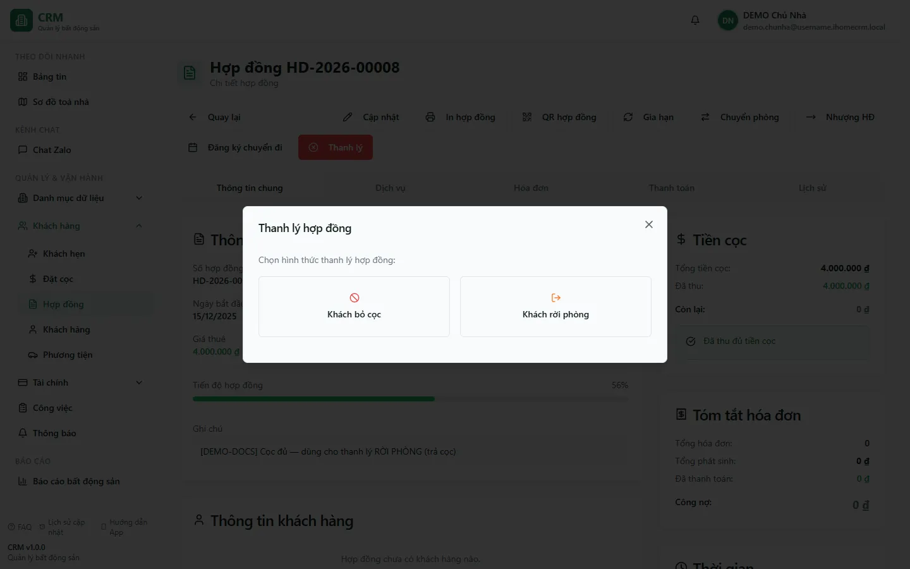
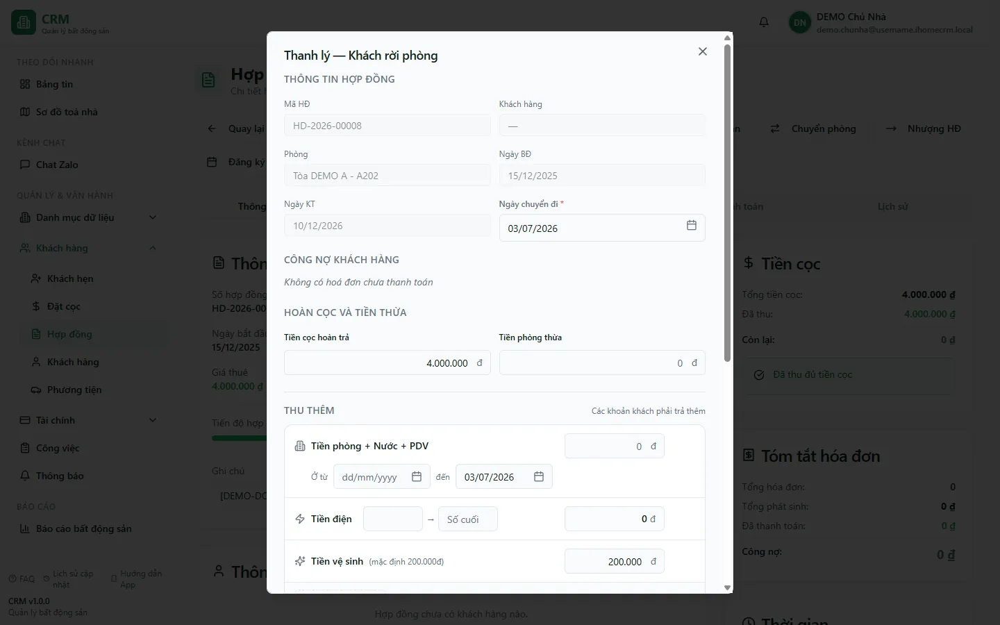

# Thanh lý hợp đồng — Khách rời phòng

Khi một khách **trả phòng đúng quy trình** (báo trước, dọn đi, bàn giao lại phòng), bạn dùng luồng **Khách rời phòng** để tất toán hợp đồng. Hệ thống tính công nợ và khoản thu thêm để cấn vào cọc, nhưng một số bước phụ như ghi chỉ số và ghi lịch sử thanh lý là best-effort. Vì vậy thông báo thành công chưa đủ để kết luận toàn bộ dòng tiền/audit đã hoàn tất; bắt buộc đối soát sau thao tác.

::: danger Thanh lý là thao tác GHI TIỀN và KHÓ HOÀN TÁC
Bấm hoàn tất thanh lý sẽ **ghi phiếu thu/chi thật**, **gạch nợ các hoá đơn được form tải vào quyết toán** và **đóng hợp đồng**; các phiếu chính được duyệt ngay, không có bước xác nhận thứ hai để bạn kịp rút lại. Ghi chỉ số và bản ghi lịch sử là bước best-effort nên vẫn cần hậu kiểm. Hãy kiểm tra kỹ **ngày chuyển đi**, **công nợ**, **số cọc hoàn trả** và **các khoản thu thêm** trước khi xác nhận. Bài kiểm tra trong tài liệu chỉ **mở form rồi đóng**, tuyệt đối không hoàn tất thanh lý.
:::

::: info Điều kiện tiên quyết
- Bạn có quyền **Hợp đồng => Thanh lý** (module `contracts`, action `terminate`) để thấy và bấm được nút **Thanh lý** trên màn chi tiết hợp đồng.
- Hợp đồng đang ở trạng thái còn hiệu lực (**ACTIVE**) — chưa **TERMINATED** hay **EXPIRED**, và còn gắn phòng/toà nhà.
- Nên **ghi chỉ số điện lần cuối** hoặc biết **số điện cuối kỳ** để chốt tiền điện chính xác (xem [Ghi chỉ số](/03-quan-ly-van-hanh/ghi-chi-so/)). Nếu bỏ trống, hệ thống vẫn cho thanh lý nhưng sẽ không có tiền điện cuối.
- Tiền cọc phải đang nằm ở **sổ CỌC (giữ hộ khách)** hoặc trên sổ thật đã thu; hệ thống tự bù cọc từ đó. Xem [Đặt cọc](/03-quan-ly-van-hanh/dat-coc/) và [Hoàn/bỏ cọc](/03-quan-ly-van-hanh/hoan-bo-coc/).
:::

## Hướng dẫn từng bước

**Bước 1**: Vào menu **Khách hàng => Hợp đồng**, mở một hợp đồng **Đang hoạt động** đang hiển thị. Ảnh production dùng `HD-2026-00001`, phòng **A-01**, **DEMO Tòa A**. Trên thanh thao tác của màn chi tiết, bấm nút đỏ **Thanh lý**. Hộp thoại hiện hai lựa chọn: **Khách bỏ cọc** và **Khách rời phòng**.

**Bước 2**: Bấm **Khách rời phòng**. Form **Thanh lý — Khách rời phòng** mở ra, gồm bốn khối từ trên xuống:

- **THÔNG TIN HỢP ĐỒNG** — Mã HĐ, Khách hàng, **Phòng**, Ngày BĐ, Ngày KT và ô **Ngày chuyển đi** (bắt buộc, mặc định là hôm nay). Ngày chuyển đi này chính là **ngày kết thúc thực tế** ghi vào hợp đồng.
- **CÔNG NỢ KHÁCH HÀNG** — liệt kê các hoá đơn khách **chưa thanh toán**. Trong snapshot `HD-2026-00001`, khối này hiện *Không có hoá đơn chưa thanh toán*.
- **HOÀN CỌC VÀ TIỀN THỪA** — ô **Tiền cọc hoàn trả** lấy theo phần cọc thực có thể hoàn và ô **Tiền phòng thừa** lấy credit còn lại. Snapshot cho thấy nghĩa vụ cọc 4.000.000đ nhưng đã thu 0đ, nên **Tiền cọc hoàn trả = 0đ**.
- **THU THÊM** — *Các khoản khách phải trả thêm*: **Tiền phòng + Nước + PDV**, **Tiền điện**, **Tiền vệ sinh**.

**Bước 3**: Kiểm tra **CÔNG NỢ KHÁCH HÀNG** và **Ngày chuyển đi**. Nếu còn hoá đơn chưa thu, chúng sẽ được **gạch nợ** trong lúc thanh lý (đánh dấu *Đã thu* bằng bút toán "Quyết toán khi thanh lý", **không huỷ** hoá đơn). Đặt đúng **Ngày chuyển đi** vì hệ thống dùng ngày này làm mốc tính số ngày ở nốt cho khoản **Tiền phòng + Nước + PDV** và ghi vào `actual_end_date` của hợp đồng.

::: danger Không xác nhận khi công nợ còn đang tải hoặc vừa báo lỗi
Tổng nợ trong form được tính phía trình duyệt. Nếu truy vấn hoá đơn đang loading hoặc lỗi, giá trị có thể rơi về 0 và làm số hoàn cọc tăng sai. Trước khi xác nhận, tải lại đến khi bảng công nợ hiển thị ổn định, đối chiếu tổng với danh sách hoá đơn/Payment Schedule và kiểm tra cả hoá đơn bị huỷ/xoá/cancelled bằng nguồn kế toán phù hợp.
:::

**Bước 4**: Xem khối **HOÀN CỌC VÀ TIỀN THỪA**. Số **thực trả cho khách** không phải là cả cục cọc, mà được tính theo công thức:

> **Hoàn cọc thực = (Cọc hoàn trả + Tiền phòng thừa) − (Công nợ + Tổng thu thêm)**

- Phần cọc dùng để **bù nợ và các khoản thu thêm** sẽ được chuyển thành **Doanh thu thanh lý** trên **sổ vận hành của toà** và **tính vào KQKD**.
- Phần cọc **còn dư** sau khi trừ hết mới là tiền **hoàn trả thật** cho khách, chi ra từ **sổ CỌC** và **nằm ngoài KQKD** (trả lại tiền giữ hộ, không phải doanh thu).
- Nếu khấu trừ **vượt** số cọc (khách còn phải trả thêm), phần âm đó thành khoản **khách trả thêm**, ghi thu vào sổ vận hành và **tính vào KQKD**.

Với snapshot `HD-2026-00001`, hợp đồng ghi cọc **4.000.000đ** nhưng **đã thu 0đ**; vì vậy ô **Tiền cọc hoàn trả** là **0đ**. Hệ thống không được hoàn một nghĩa vụ cọc mà khách chưa thực nộp.

**Bước 5**: Điền khu **THU THÊM** nếu khách còn phải trả các khoản cuối kỳ:

- **Tiền phòng + Nước + PDV** — tiền cho những ngày ở nốt trong tháng cuối, tính theo **khoảng ngày *Ở từ → đến*** (ô *đến* mặc định là ngày chuyển đi). Nhập số tiền hoặc để hệ thống prorate theo số ngày.
  - **Tiền điện** — nhập **Số cuối** để tính khoản cuối kỳ. Việc ghi bản chỉ số vào công tơ là best-effort và có thể không thành công nếu trùng/lỗi; vẫn phải kiểm tra lại màn [Ghi chỉ số](/03-quan-ly-van-hanh/ghi-chi-so/).
  - **Tiền vệ sinh** — dùng mức hiển thị trên form và sửa theo chính sách đang áp dụng; không coi số fixture trong ảnh là biểu phí cố định.
- Có thể bấm **Thêm khoản** cho một mục tuỳ ý (tên + số tiền).

Mọi khoản thu thêm được **gộp chung vào một hoá đơn thanh lý** và **cấn trừ vào cọc** ngay (khác luồng bỏ cọc — nơi thu thêm ra một hoá đơn AR riêng chờ thu).

::: danger Xác nhận hoàn tất = ghi tiền và đóng hợp đồng ngay
Khi bạn bấm xác nhận thanh lý, hệ thống lập tức: (1) tạo/ghép **hoá đơn thanh lý** kèm các khoản thu thêm; (2) **gạch nợ mọi hoá đơn còn lại** về *Đã thu*; (3) chuyển phần cọc đã cấn thành **Doanh thu thanh lý** (vào KQKD) và **chi hoàn cọc dư** cho khách (ngoài KQKD); (4) **chốt số điện** vào công tơ; (5) đổi hợp đồng sang **TERMINATED** và **giải phóng phòng về trống**. Tất cả **duyệt ngay** — không có bước Duyệt thứ hai, nên **rất khó hoàn tác**. Chỉ bấm khi mọi con số đã đúng.
:::

**Bước 6**: Sau khi thanh lý, hoàn tất checklist trước khi cho thuê lại phòng hoặc chi tiền ngoài hệ thống:

1. Hợp đồng ở **TERMINATED**, đúng `actual_end_date`; phòng thực sự **TRỐNG** và không còn hợp đồng hiệu lực.
2. Hoá đơn tất toán/nợ cũ có trạng thái và số dư đúng; không còn khoản bị loading/ẩn khỏi danh sách.
3. Phiếu hoàn cọc và phiếu doanh thu/cấn trừ tồn tại đúng một lần, đúng sổ, đúng số tiền, đúng trạng thái duyệt/posting.
4. Có bản ghi thanh lý/lịch sử tương ứng; nếu thiếu, ghi nhận lỗi audit và báo quản trị, không thanh lý lại.
5. Chỉ số cuối (nếu nhập) xuất hiện đúng một lần ở [Ghi chỉ số](/03-quan-ly-van-hanh/ghi-chi-so/).

Luồng hoàn legacy và V2 có thể cùng tồn tại. Nếu đã thấy một phiếu hoàn từ bất kỳ luồng nào, không mở/tạo thêm hoàn cọc chỉ vì màn khác đang trống.

## Các tính năng khác trên màn hình

| Thành phần | Công dụng |
| --- | --- |
| Nút **Thanh lý** (đỏ) | Mở hộp thoại chọn hình thức thanh lý (Khách bỏ cọc / Khách rời phòng). |
| Nút **Khách rời phòng** | Chọn luồng MOVE_OUT — chốt điện, cấn nợ, hoàn cọc, phòng về trống (bài này). |
| Nút **Khách bỏ cọc** | Chọn luồng FORFEIT — khách bỏ ngang, mất cọc; xem [Thanh lý — Khách bỏ cọc](/03-quan-ly-van-hanh/thanh-ly-forfeit/). |
| Ô **Ngày chuyển đi** | Ngày kết thúc thực tế; mốc tính tiền phòng ở nốt và ghi vào hợp đồng. |
| Khối **CÔNG NỢ KHÁCH HÀNG** | Liệt kê hoá đơn chưa thanh toán sẽ được gạch nợ khi thanh lý. |
| Ô **Tiền cọc hoàn trả** | Phần cọc thực có thể hoàn đưa vào bù trừ; hệ thống trừ nợ + thu thêm để ra số hoàn thật. Không mặc định bằng nghĩa vụ cọc nếu khách chưa nộp đủ. |
| Ô **Tiền phòng thừa** | Credit khách nộp dư còn lại, cộng vào nguồn bù cùng tiền cọc. |
| Khu **THU THÊM** | Tiền phòng+Nước+PDV theo ngày, Tiền điện (chốt công tơ), Tiền vệ sinh, khoản tuỳ ý. |
| Nút **Thêm khoản** | Thêm một dòng thu thêm tuỳ ý (tên + số tiền). |
| Khối **Tiền cọc** (cột phải) | Đối chiếu Tổng cọc / Đã thu / Còn lại của hợp đồng trước khi thanh lý. |

## Tình huống & lỗi thường gặp

| Tình huống | Cách hiểu / xử lý |
| --- | --- |
| Không thấy nút **Thanh lý** | Bạn thiếu quyền **Hợp đồng => Thanh lý** (`contracts.terminate`), hoặc hợp đồng đã **TERMINATED/EXPIRED**. Nhờ chủ nhà cấp quyền. |
| Chọn nhầm **Khách bỏ cọc** | Đó là luồng giữ cọc làm phí phạt bằng cặp bút toán nội bộ tự duyệt, không phải hoàn tiền khách. Nếu khách trả phòng đúng quy trình, hãy dùng **Khách rời phòng**. Xem [Thanh lý — Khách bỏ cọc](/03-quan-ly-van-hanh/thanh-ly-forfeit/). |
| **Tiền hoàn trả nhỏ hơn** tổng cọc | Đúng thiết kế: cọc bị **cấn vào công nợ + thu thêm** trước, chỉ phần dư mới hoàn khách. Phần cấn thành Doanh thu thanh lý (vào KQKD). |
| Khấu trừ **vượt** cọc | Không hoàn trả; phần vượt trở thành khoản **khách trả thêm**, ghi thu vào sổ vận hành và tính KQKD. |
| Không nhớ **số điện cuối** | Có thể để trống ô Tiền điện — thanh lý vẫn chạy nhưng **không có tiền điện cuối**. Nên [ghi chỉ số](/03-quan-ly-van-hanh/ghi-chi-so/) trước, hoặc nhập **Số cuối** ngay trong khu Thu thêm để chốt luôn. |
| Chốt số điện **không thấy** trong công tơ | Việc ghi chỉ số khi thanh lý là **best-effort** (bọc trong xử lý lỗi để không chặn thanh lý); nếu trùng/lỗi, bản ghi có thể không tạo — kiểm tra lại ở [Ghi chỉ số](/03-quan-ly-van-hanh/ghi-chi-so/). |
| Hợp đồng đã đóng nhưng không có dòng lịch sử thanh lý | Việc ghi `contract_terminations` có lỗi đã biết có thể bị bỏ qua. Đối chiếu toàn bộ checklist, báo quản trị phục hồi audit trail và **không** chạy thanh lý/hoàn cọc lần nữa. |
| Tab hoàn/bỏ cọc trống dù đã thấy phiếu chi | Không tạo hoàn mới. Đối chiếu mọi sổ và trạng thái posting; các writer hoàn cọc có thể cùng tồn tại và màn đọc không bao phủ giống nhau. `/finance/refund-log` hiện là **Sổ tiền thối**, không phải bằng chứng hoàn cọc. |
| Hoá đơn nợ cũ vẫn còn sau thanh lý | Move-out **gạch nợ** hoá đơn về *Đã thu* (bằng bút toán "Quyết toán khi thanh lý"), **không huỷ**. Chúng vẫn hiển thị nhưng đã tất toán. |
| Lỡ thanh lý nhầm | Rất khó hoàn tác vì mọi phiếu đã duyệt và phòng đã về trống. Liên hệ chủ nhà / kế toán để đảo bút toán thủ công; đừng tự sửa lẻ tẻ. |

## Thử trực tiếp trên sandbox

<SandboxTry account="demo.chunha" app-path="/contracts" app-label="Mở danh sách Hợp đồng" fixtures="HD-2026-00001 · A-01 · cọc yêu cầu 4.000.000đ, đã thu 0đ, không có công nợ" view-only>

Bài tập **an toàn** — chỉ mở form và **không hoàn tất**:

1. Mở `HD-2026-00001` của phòng **A-01**, bấm nút đỏ **Thanh lý**.
2. Trong hộp thoại, chọn **Khách rời phòng** để mở form **Thanh lý — Khách rời phòng**.
3. Quan sát khối **CÔNG NỢ KHÁCH HÀNG** hiện *Không có hoá đơn chưa thanh toán*, và ô **Tiền cọc hoàn trả = 0đ** dù cọc theo hợp đồng là 4.000.000đ.
4. Nhận diện khu **THU THÊM** nhưng không nhập số; các trường này sẽ làm thay đổi quyết toán nếu dùng trong nghiệp vụ thật.
5. **ĐÓNG hộp thoại** để không ghi tiền.

Kết quả mong đợi: bạn hiểu dòng tiền move-out — **cọc bù nợ + thu thêm ⇒ Doanh thu thanh lý (vào KQKD)**, **phần dư ⇒ hoàn trả khách (ngoài KQKD)**, mọi phiếu duyệt ngay và **phòng về trống** khi hoàn tất.

</SandboxTry>

## Quy trình liên quan

- [Thanh lý — Khách bỏ cọc](/03-quan-ly-van-hanh/thanh-ly-forfeit/) — luồng còn lại: khách bỏ ngang, giữ cọc làm phí phạt qua cặp bút toán nội bộ tự duyệt.
- [Hoàn/bỏ cọc](/03-quan-ly-van-hanh/hoan-bo-coc/) — theo dõi tiền cọc, hoàn cọc và bỏ cọc theo hợp đồng.
- [Đặt cọc](/03-quan-ly-van-hanh/dat-coc/) — nguồn tiền cọc và credit dư dùng để bù trừ khi thanh lý.
- [Chi tiết hợp đồng](/03-quan-ly-van-hanh/hop-dong-chi-tiet/) — nơi có nút Thanh lý và vòng đời hợp đồng.
- [Ghi chỉ số](/03-quan-ly-van-hanh/ghi-chi-so/) — chốt chỉ số điện nước; thanh lý ghi thẳng số cuối vào công tơ.
- [Thu chi](/03-quan-ly-van-hanh/thu-chi/) và [Sổ quỹ](/03-quan-ly-van-hanh/so-quy/) — nơi xem phiếu hoàn cọc và Doanh thu thanh lý phát sinh.
- [Chia lợi nhuận](/03-quan-ly-van-hanh/chia-loi-nhuan/) — Doanh thu thanh lý vào KQKD, ảnh hưởng phân bổ lợi nhuận cổ đông.
- [Quy trình thanh lý](/01-bat-dau/quy-trinh-thanh-ly/) — bức tranh tổng quát về thanh lý hợp đồng.
