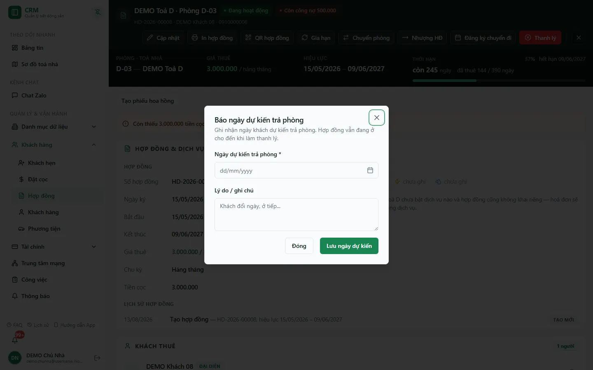
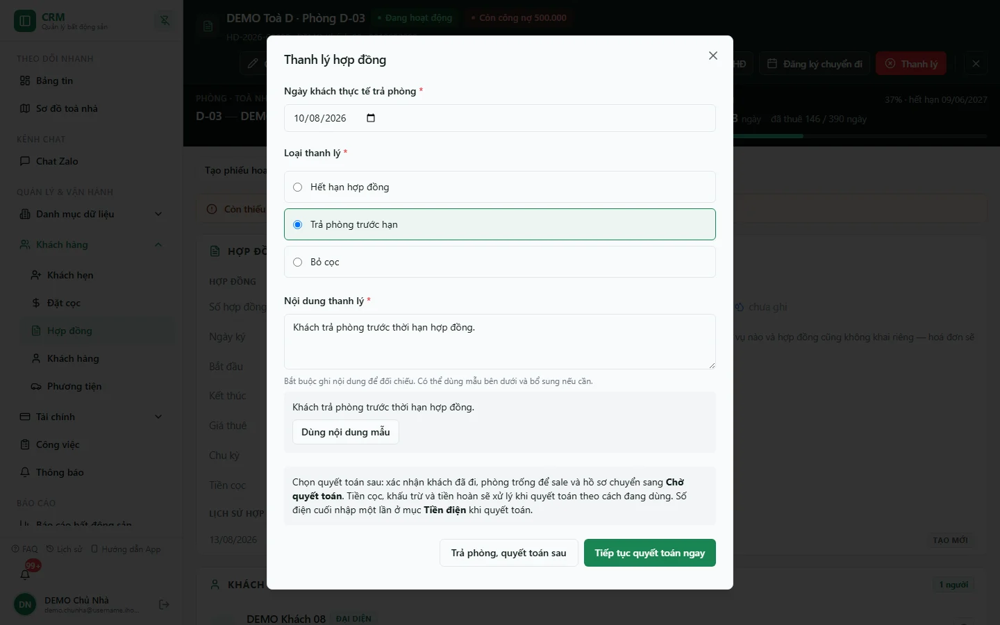
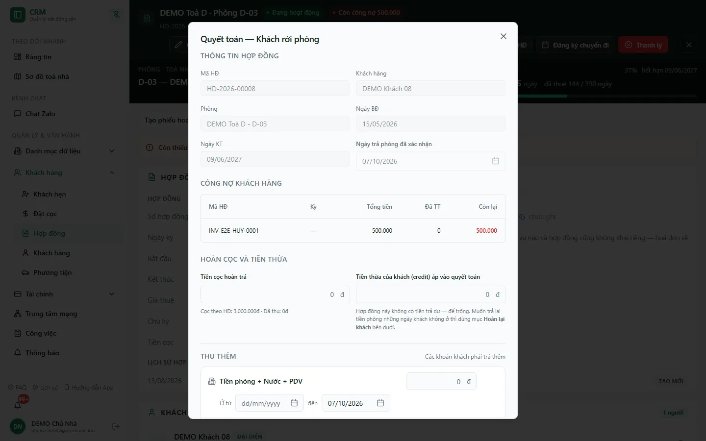

# Thanh lý hợp đồng — Khách rời phòng

Khi một khách **trả phòng đúng quy trình** (hết hạn hoặc trả trước hạn, bàn giao lại phòng), bạn đi qua ba chặng: **báo ngày dự kiến trả phòng** (khi khách thông báo), **ghi nhận trả phòng thực tế** (khi bàn giao), và **quyết toán** cọc/công nợ — ngay lúc trả hoặc để sau. Tách hai chặng cuối giúp phòng được **trả trống để sale ngay** trong khi kế toán quyết toán sau, không ai phải đoán.

::: danger Quyết toán là thao tác GHI TIỀN và KHÔNG THỂ HOÀN TÁC
Bấm **Lập hoá đơn & Thanh lý** rồi **Xác nhận thanh lý** sẽ **ghi phiếu thu/chi thật**, **quyết toán các hoá đơn còn nợ** và **đóng hợp đồng**. Kiểm tra kỹ **ngày trả phòng**, **công nợ**, **tiền cọc hoàn trả**, **thu thêm** và **hoàn lại khách** trước khi xác nhận. Bài kiểm tra trong tài liệu chỉ **mở form rồi đóng**.
:::

::: info Điều kiện tiên quyết
- Quyền **Hợp đồng => Thanh lý** (module `contracts`, action `terminate`) — nút **Đăng ký chuyển đi** và **Thanh lý** chỉ hiện khi bạn có quyền này.
- Hợp đồng đang hiệu lực và còn gắn phòng/toà nhà.
- Nên biết **chỉ số điện/nước khi bàn giao**; nếu chưa có, chọn **bổ sung sau** (hồ sơ sẽ vào hàng chờ bổ sung chỉ số).
- Tiền cọc đã thu nằm trên các phiếu cọc của hợp đồng — xem [Đặt cọc](/03-quan-ly-van-hanh/dat-coc/) và [Hoàn / bỏ cọc](/03-quan-ly-van-hanh/hoan-bo-coc/).
:::

## Hướng dẫn từng bước

**Bước 1 — Báo ngày dự kiến trả phòng**: Khi khách báo sẽ trả, mở [trang chi tiết hợp đồng](/03-quan-ly-van-hanh/hop-dong-chi-tiet/) và ấn **Đăng ký chuyển đi** (ở danh sách là nút **ĐK chuyển đi**). Hộp **Báo ngày dự kiến trả phòng** ("Hợp đồng vẫn đang ở cho đến khi làm thanh lý") có **Ngày dự kiến trả phòng \*** và **Lý do / ghi chú**; ấn **Lưu ngày dự kiến**.

Sau khi lưu: trang chi tiết hiện dải **Khách dự kiến trả phòng: dd/mm/yyyy** kèm **Sửa / hủy báo trả phòng**; trang công khai [Phòng trống](/03-quan-ly-van-hanh/trang-phong-trong/) hiện phòng là **Sắp trống**. Đến ngày hẹn, hợp đồng vào khối **Cần xác nhận ngày trả phòng** đầu màn [Hợp đồng](/03-quan-ly-van-hanh/hop-dong/) — bấm **Cập nhật ngày trả** để đổi ngày, hoặc **Hủy báo trả phòng** nếu khách ở tiếp. Báo trả **không** đóng hợp đồng và không ghi tiền.

**Bước 2 — Ghi nhận khách trả phòng**: Khi khách bàn giao thực tế, ấn nút đỏ **Thanh lý**. Hộp **Thanh lý hợp đồng** mở ra:

- **Ngày khách thực tế trả phòng \*** (mặc định hôm nay).
- **Loại thanh lý \***: **Hết hạn hợp đồng**, **Trả phòng trước hạn** hoặc **Bỏ cọc** (bỏ cọc xem trang [Khách bỏ cọc](/03-quan-ly-van-hanh/thanh-ly-forfeit/)).
- **Nội dung thanh lý \*** — bắt buộc, dùng để đối chiếu và **in trên phiếu hoàn cọc**. Có thể bấm **Dùng nội dung mẫu** rồi bổ sung.
- **Chỉ số điện, nước khi bàn giao**: mặc định tích **Chưa đủ chỉ số, bổ sung sau. Vẫn ghi nhận khách đã trả phòng.** Bỏ tích để nhập số trên từng đồng hồ đã kiểm tra và **Thời điểm đo thực tế** (số 0 chỉ dùng khi đồng hồ thực sự bằng 0).

**Bước 3 — Chọn quyết toán ngay hay để sau**:

- **Trả phòng, quyết toán sau**: xác nhận khách đã đi; hợp đồng chuyển **Đã thanh lý** với ngày trả thực tế, phòng trống để sale, và hồ sơ vào tab **Chờ quyết toán** của màn Hợp đồng. Tiền cọc, khấu trừ và tiền hoàn xử lý khi quyết toán. Thao tác này **không ghi tiền**.
- **Tiếp tục quyết toán ngay**: chuyển sang form quyết toán (Bước 4).

Với hồ sơ đã trả phòng, mở lại từ tab **Chờ quyết toán** (nút **Quyết toán**) hoặc khối **Hồ sơ trả phòng** trên trang chi tiết (**Quyết toán hồ sơ này**). Hộp mở với tiêu đề **Quyết toán hồ sơ đã trả phòng**, giữ ngày và nội dung đã ghi; nếu đổi loại thanh lý phải nhập **Lý do đổi loại thanh lý**. Ấn **Tiếp tục quyết toán**.

**Bước 4 — Form Quyết toán — Khách rời phòng**, từ trên xuống:

- **THÔNG TIN HỢP ĐỒNG**: Mã HĐ, Khách hàng, Phòng, Ngày BĐ, Ngày KT, **Ngày trả phòng đã xác nhận** (chỉ đọc).
- **CÔNG NỢ KHÁCH HÀNG**: hoá đơn chưa thanh toán (Mã HĐ, Kỳ, Tổng tiền, Đã TT, Còn lại) hoặc *Không có hoá đơn chưa thanh toán*.
- **HOÀN CỌC VÀ TIỀN THỪA**: **Tiền cọc hoàn trả** (mặc định bằng cọc **đã thu**, dòng dưới ghi "Cọc theo HĐ … · Đã thu …"; nhập quá số đã thu thì hệ thống chỉ hoàn tối đa số đã thu) và **Tiền thừa của khách (credit) áp vào quyết toán** (mặc định 0; nếu khách có credit, ô ghi rõ số credit hiện có — phần không nhập vẫn treo trên hợp đồng).
- **THU THÊM** (các khoản khách phải trả thêm): **Tiền phòng + Nước + PDV** theo khoảng **Ở từ → đến**, **Tiền điện** (số đầu → **Số cuối**), **Tiền vệ sinh** (mặc định 200.000 đ), và khoản tuỳ ý. Các khoản này vào **hoá đơn thanh lý riêng** (kỳ tháng trả phòng) và được khấu trừ vào cọc — không sửa hoá đơn tiền phòng hằng tháng.
- **HOÀN LẠI KHÁCH**: **Tiền phòng ngày không ở** theo khoảng **Không ở từ → đến** và khoản hoàn tuỳ ý. Phần này **giảm lợi nhuận** (khác hoàn cọc là tiền giữ hộ); nếu khách còn nợ, nó được cấn thẳng vào công nợ trước.
- **TỔNG HỢP**: Tổng công nợ, Tiền cọc hoàn trả, Tiền phòng thừa, Hoàn lại khách, Tổng thu thêm, **Tổng khấu trừ (công nợ + thu thêm)** và ô kết quả **Chủ nhà trả lại khách** hoặc **Khách còn phải trả**.
- **Ghi chú**.

> **Số quyết toán = (Cọc hoàn trả + Tiền thừa áp vào + Hoàn lại khách) − (Công nợ + Tổng thu thêm)**

**Bước 5**: Nếu kết quả là **Khách còn phải trả**, chọn một trong hai:

- **Khách đã trả đủ … khi rời phòng — ghi nhận thu ngay**: chọn **Sổ nhận tiền** (mặc định **Tự chọn (sổ Thu của bạn)**).
- **Ghi nợ** — hoá đơn giữ công nợ chờ thu sau; không ghi doanh thu khi chưa thu được tiền.

**Bước 6**: Ấn **Lập hoá đơn & Thanh lý**. Hộp **Xác nhận thanh lý — khách rời phòng** tóm tắt **Cọc hoàn/cấn (kẹp theo đã thu)**, **Công nợ được quyết toán**, **Thu thêm**, **Tiền thừa (credit) áp vào quyết toán**, **Hoàn lại khách** (tách phần cấn vào công nợ / chi trả khách), cảnh báo credit còn treo (nếu có) và dòng cuối **Trả lại khách** / **Khách trả thêm (ghi thu ngay)** / **Khách còn nợ (ghi nợ chờ thu)**. Ấn **Xem lại** để quay lại, hoặc **Xác nhận thanh lý** để chốt.

::: danger Xác nhận = ghi tiền và đóng hợp đồng ngay
Khi xác nhận, hệ thống: tạo **hoá đơn thanh lý** kèm các khoản thu thêm; quyết toán các hoá đơn còn nợ; chuyển phần cọc đã cấn thành **doanh thu thanh lý** (vào KQKD); tạo **phiếu chi hoàn cọc / trả khách** cho phần dư (hoàn cọc nằm ngoài KQKD, hoàn tiền phòng ngày không ở thì giảm lợi nhuận); đổi hợp đồng sang **Đã thanh lý** và giải phóng phòng. Phiếu chi **"Trả khách thanh lý"** có thể còn **chờ duyệt** — trang chi tiết sẽ nhắc vào phiếu, **chọn sổ quỹ chi tiền** rồi **Duyệt**; chỉ phiếu đã ghi sổ (**POSTED**) mới là tiền thật đã ra quỹ.
:::

**Bước 7 — Checklist sau thanh lý** (trước khi cho thuê lại hoặc chi tiền ngoài hệ thống):

1. Hợp đồng ở **Đã thanh lý**, đúng ngày trả thực tế; khối **Hồ sơ trả phòng** ghi **Đã chốt quyết toán**; phòng thực sự trống.
2. Hoá đơn còn nợ và hoá đơn thanh lý có trạng thái và số dư đúng.
3. Phiếu hoàn cọc / trả khách tồn tại đúng một lần, đúng số, có **nội dung thanh lý**; đã chọn sổ quỹ, đã duyệt và đã ghi sổ.
4. Chỉ số bàn giao: số điện cuối nhập ở ô **Tiền điện (chốt số)** lúc quyết toán, mốc trả phòng tự lấy số đó. Hồ sơ đã quyết toán mà chưa có số chốt nằm trong khối **Chỉ số trả phòng cần xử lý** (tab Chờ quyết toán) — bấm **Mở hồ sơ trả phòng** rồi **Bổ sung / sửa chỉ số**. Bỏ cọc không cần số chốt.
5. Credit còn treo (nếu cảnh báo có nhắc) được xử lý riêng.

## Các tính năng khác trên màn hình

| Thành phần | Công dụng |
| --- | --- |
| **Đăng ký chuyển đi** / **ĐK chuyển đi** | Mở hộp **Báo ngày dự kiến trả phòng** (sửa/hủy được khi đã báo). |
| Khối **Cần xác nhận ngày trả phòng** (màn Hợp đồng) | Hợp đồng đã đến ngày hẹn trả; **Cập nhật ngày trả**. |
| Nút **Thanh lý** (đỏ) | Mở hộp **Thanh lý hợp đồng** (ngày trả, loại thanh lý, nội dung, chỉ số bàn giao). |
| **Dùng nội dung mẫu** | Điền nhanh nội dung thanh lý theo loại đã chọn. |
| **Trả phòng, quyết toán sau** | Ghi nhận trả phòng, phòng trống, hồ sơ vào tab **Chờ quyết toán**; không ghi tiền. |
| **Tiếp tục quyết toán ngay** / **Tiếp tục quyết toán** | Sang form quyết toán. |
| Tab **Chờ quyết toán** → **Quyết toán** | Mở đúng hồ sơ đã trả phòng để quyết toán sau. |
| Khu **THU THÊM** / **HOÀN LẠI KHÁCH** | Khoản khách trả thêm (vào hoá đơn thanh lý) / khoản mình trả lại khách (giảm lợi nhuận). |
| **Lập hoá đơn & Thanh lý** → **Xác nhận thanh lý** | Chốt quyết toán (không hoàn tác). **Quay lại** về bước trước, **Hủy** đóng hộp. |

## Tình huống & lỗi thường gặp

| Tình huống | Cách hiểu / xử lý |
| --- | --- |
| Không thấy nút **Thanh lý** / **Đăng ký chuyển đi** | Thiếu quyền `contracts.terminate`, hoặc hợp đồng đã **Thanh lý**. |
| Nút **Trả phòng, quyết toán sau** / **Tiếp tục quyết toán ngay** bị mờ | Chưa chọn loại thanh lý, chưa nhập **Nội dung thanh lý**, hoặc chưa nhập đủ chỉ số khi đã bỏ tích "bổ sung sau". |
| Form báo "Không tải được công nợ và số dư khách hàng" | Không quyết toán khi số nợ chưa tải được — tổng có thể sai. Đóng hộp, tải lại trang rồi làm lại. |
| **Tiền cọc hoàn trả = 0** dù hợp đồng ghi cọc | Khách chưa thực nộp cọc (đã thu 0 đ). Hệ thống không hoàn một nghĩa vụ cọc khách chưa nộp. |
| **Tiền hoàn trả nhỏ hơn** tổng cọc | Đúng thiết kế: cọc cấn vào công nợ + thu thêm trước, chỉ phần dư mới hoàn khách. |
| Khách có credit nhưng không được tính | Ô credit mặc định 0. Nhập số muốn cấn (tối đa bằng credit); phần không nhập vẫn treo trên hợp đồng và hộp xác nhận sẽ nhắc. |
| Chưa biết chỉ số điện cuối | Giữ tích **bổ sung sau** và chọn **Trả phòng, quyết toán sau**. Khi quyết toán, nhập số cuối ở ô **Tiền điện (chốt số)** (khu Thu thêm); mốc trả phòng tự lấy số đó, không nhập lại. |
| Đổi loại thanh lý khi quyết toán sau | Phải nhập **Lý do đổi loại thanh lý**; loại ban đầu vẫn được giữ để đối soát. |
| Lỡ thanh lý nhầm | Không thể hoàn tác vì phiếu đã tạo và phòng đã giải phóng. Liên hệ chủ nhà / kế toán; đừng tự sửa lẻ tẻ. |

## Thử trực tiếp trên sandbox

<SandboxTry account="demo.chunha" app-path="/deposits" app-label="Mở màn Đặt cọc để vào hợp đồng" fixtures="Snapshot 07/10/2026: HD-2026-00008 · DEMO Toà D · D-03 · cọc 3.000.000 đ, đã thu 0 đ · 1 hoá đơn nợ 500.000 đ." view-only>

Bài tập **an toàn** — chỉ mở form và **không hoàn tất**:

1. Ở **Đặt cọc** → **Sổ cọc đầy đủ** → tab **Đủ / Thiếu cọc**, bấm tên **DEMO Khách 08** để mở hợp đồng D-03.
2. Ấn **Đăng ký chuyển đi** để xem hộp báo trả phòng, rồi **Đóng**.
3. Ấn **Thanh lý**, chọn **Trả phòng trước hạn**, bấm **Dùng nội dung mẫu**, rồi **Tiếp tục quyết toán ngay**.
4. Đọc khối **CÔNG NỢ KHÁCH HÀNG** (hoá đơn 500.000 đ) và **Tiền cọc hoàn trả = 0 đ** vì cọc chưa thu; kéo xuống xem **TỔNG HỢP** báo **Khách còn phải trả**.
5. Ấn **Hủy** để đóng — **không** bấm **Lập hoá đơn & Thanh lý** hay **Trả phòng, quyết toán sau**.

Kết quả mong đợi: bạn hiểu ba chặng báo trả → trả phòng → quyết toán, và dòng tiền **cọc bù nợ + thu thêm ⇒ doanh thu thanh lý**, **phần dư ⇒ hoàn khách**.

</SandboxTry>

## Quy trình liên quan

- [Thanh lý — Khách bỏ cọc](/03-quan-ly-van-hanh/thanh-ly-forfeit/) — loại thanh lý còn lại: khách bỏ ngang, giữ cọc làm phí phạt.
- [Hợp đồng](/03-quan-ly-van-hanh/hop-dong/) — khối **Cần xác nhận ngày trả phòng** và tab **Chờ quyết toán**.
- [Hoàn / bỏ cọc](/03-quan-ly-van-hanh/hoan-bo-coc/) — theo dõi tiền cọc, hoàn cọc và bỏ cọc.
- [Trang chi tiết hợp đồng](/03-quan-ly-van-hanh/hop-dong-chi-tiet/) — nơi có nút Thanh lý và khối Hồ sơ trả phòng.
- [Ghi chỉ số](/03-quan-ly-van-hanh/ghi-chi-so/) — chỉ số điện nước của phòng.
- [Thu chi](/03-quan-ly-van-hanh/thu-chi/) và [Sổ quỹ](/03-quan-ly-van-hanh/so-quy/) — nơi duyệt phiếu "Trả khách thanh lý" và xem doanh thu thanh lý.
- [Quy trình thanh lý](/01-bat-dau/quy-trinh-thanh-ly/) — bức tranh tổng quát về thanh lý hợp đồng.
