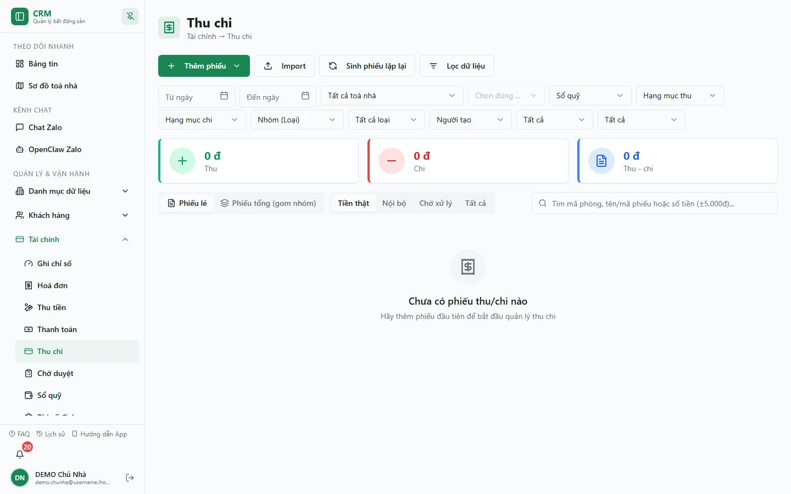
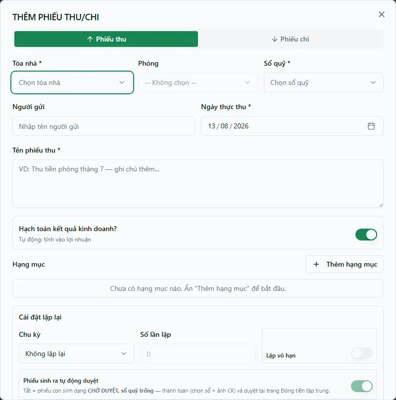

# Thu chi — tạo phiếu, duyệt & in

Màn **Thu chi** quản lý các phiếu thu/chi ngoài luồng thu hóa đơn và các chứng từ liên quan. Mỗi phiếu có các item, sổ quỹ, người gửi/nhận, ngày nghiệp vụ và trạng thái xử lý.

::: info Snapshot DEMO hiện tại
Danh sách production ngày 13/08/2026 đang ở empty state **Chưa có phiếu thu/chi nào**. Hộp thoại bên dưới được mở thật để kiểm tra các trường nhưng không lưu, nên không tạo chứng từ hoặc thay đổi số dư.
:::

## Ba bước cần phân biệt

| Bước | Ý nghĩa trong Finance V2 |
| --- | --- |
| Tạo phiếu | Ghi yêu cầu/chứng từ nghiệp vụ và các item. Chưa mặc nhiên đổi số dư. |
| Duyệt | Xác nhận yêu cầu. Ở tổ chức dùng kế toán chuẩn, duyệt đơn thuần **không đổi số dư sổ quỹ**. |
| Post Thu/Chi | Ghi posting line làm thay đổi số dư. Reversal được ghi bằng posting event đảo chiều. |

Một số tổ chức legacy vẫn kết hợp duyệt và ghi sổ. Vì hệ thống đang dual-run, hãy đọc trạng thái và posting thực tế của phiếu thay vì suy ra số dư chỉ từ nhãn **Đã duyệt**.

## Lập phiếu

**Bước 1**: Chọn **Tạo phiếu thu** hoặc **Tạo phiếu chi**.

**Bước 2**: Chọn sổ quỹ, tòa/phòng nếu có, ngày nghiệp vụ, người gửi/nhận và ghi chú.

**Bước 3**: Thêm từng hạng mục, số lượng và đơn giá. Tổng phiếu được tính từ các item.

**Bước 4**: Kiểm tra tài liệu đính kèm và lưu. Nếu phiếu cần maker-checker, nó xuất hiện trong hàng chờ của người được giao duyệt.

::: info Cọc trong phiếu thu
Một phiếu có thể chứa cả item cọc và item doanh thu. Item được đánh dấu là cọc không đi vào P&L/KQKD, dù dòng tiền vẫn có thể được post vào sổ quỹ.
:::

## Duyệt và ghi sổ

- **Duyệt** có thể chỉ duyệt yêu cầu, không di chuyển tiền.
- **Duyệt và Thu/Chi** có thể duyệt và post nguyên tử khi người thao tác có posting route và quyền giữ sổ phù hợp.
- Nếu chỉ duyệt được, chuyển sang người/công đoạn có quyền post; không chỉnh trực tiếp số dư.
- Từ chối yêu cầu bắt buộc nhập lý do.

## Sửa và đảo nghiệp vụ

Sau khi đã post, ưu tiên thao tác huỷ/đảo được cung cấp bởi hệ thống. Finance V2 giữ lịch sử bằng reversal posting event; không xoá chứng từ hoặc sửa trực tiếp balance.

## Đọc số trên các màn khác

- Màn [Sổ quỹ](/03-quan-ly-van-hanh/so-quy/) hiện vẫn đọc nguồn balance legacy.
- Báo cáo posting-aware như [Sổ quỹ theo ngày](/04-bao-cao/so-quy-ngay/) và [Dòng tiền](/04-bao-cao/dong-tien/) tổng hợp POSTING/REVERSAL.
- Trong giai đoạn dual-run, hai nhóm màn hình có thể cần đối chiếu thêm thay vì giả định chúng dùng cùng một nguồn chuẩn.

## Quy trình liên quan

- [Chờ duyệt](/03-quan-ly-van-hanh/cho-duyet/)
- [Sổ quỹ](/03-quan-ly-van-hanh/so-quy/)
- [Sổ quỹ theo ngày](/04-bao-cao/so-quy-ngay/)
- [Phân tích tài chính](/04-bao-cao/phan-tich-tai-chinh/)
