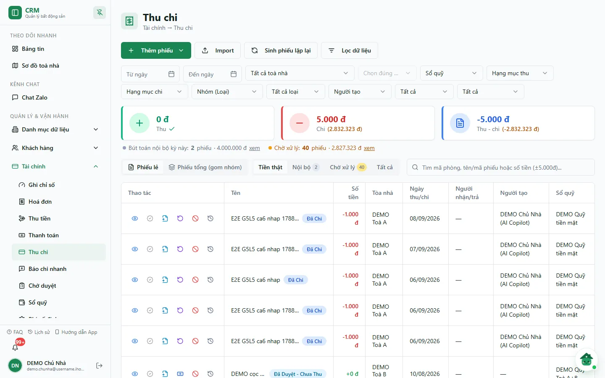
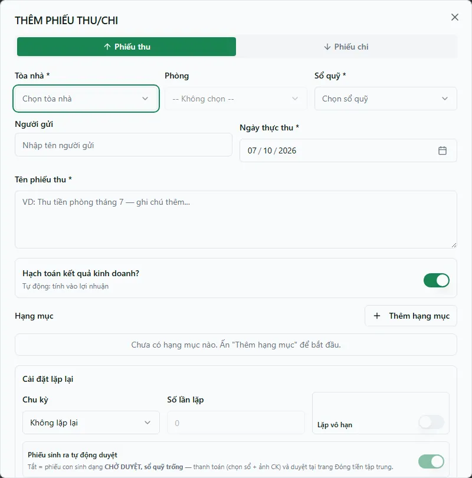
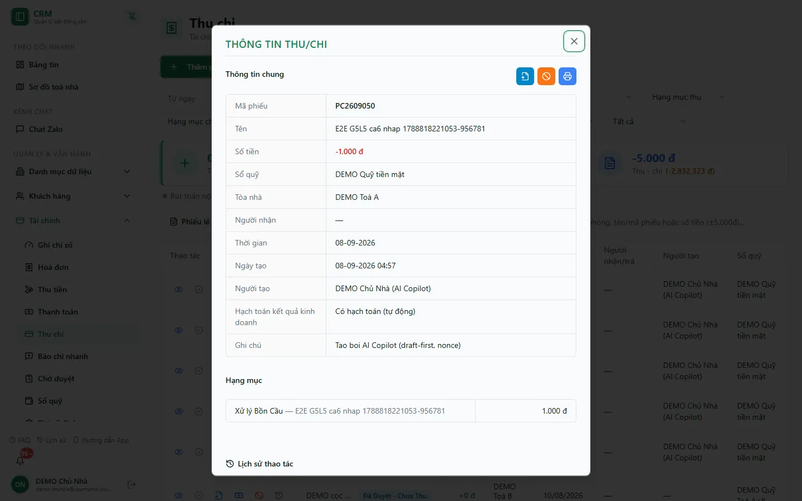
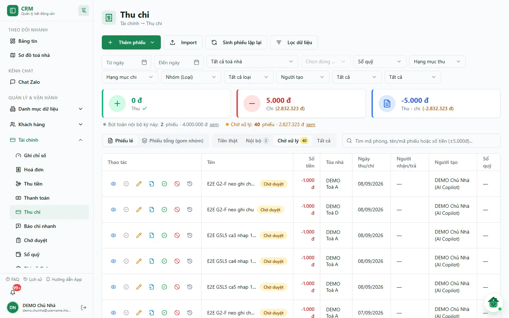

# Thu chi — tạo phiếu, duyệt & in

Màn **Thu chi** (menu **Tài chính → Thu chi**, đường dẫn `/income-expense`) quản lý mọi phiếu thu/chi của công ty: phiếu lập tay, phiếu từ [Báo chi nhanh](/03-quan-ly-van-hanh/bao-chi-nhanh/), và phiếu hệ thống sinh từ thu tiền hoá đơn, cọc, hoa hồng, thanh lý. Các đường dẫn cũ `/payments`, `/payments/income-expense` tự chuyển về `/income-expense`.

::: info Điều kiện tiên quyết
- Quyền **Thu chi ⇒ Xem** (module `income_expenses`) để mở màn; **Tạo**, **Duyệt**, **Huỷ**, **In** là các quyền riêng.
- Muốn thu/chi tiền vào sổ, bạn phải đang **giữ sổ quỹ** đó (người giữ sổ — CUSTODIAN). Xem [Sổ quỹ](/03-quan-ly-van-hanh/so-quy/).
:::

## Đọc màn danh sách

**Bước 1**: Vào **Tài chính → Thu chi**.

- **Thanh nút**: **Thêm phiếu** (chọn **Thêm phiếu lẻ** hoặc **Thêm phiếu tổng** — gom nhiều toà), **Import**, **Sinh phiếu lặp lại** (sinh các phiếu định kỳ đã đến hạn), **Lọc dữ liệu**.
- **Hàng bộ lọc**: từ ngày – đến ngày, toà, phòng, sổ quỹ, hạng mục thu, hạng mục chi, nhóm (loại), loại phiếu, người tạo…
- **Ba thẻ Thu / Chi / Thu - chi**: số lớn chỉ tính **tiền thật** đã vào sổ. Số trong ngoặc là số sẽ thành nếu duyệt hết phiếu chờ xử lý; dấu ✓ nghĩa là duyệt hết cũng không đổi số đó.
- Dòng phụ dưới thẻ: **Bút toán nội bộ kỳ này** (cấn cọc, điều chỉnh — không có tiền thật ra/vào két) và **Chờ xử lý** (phiếu chờ duyệt hoặc chưa chọn sổ quỹ). Bấm **xem** để lọc nhanh.
- Hai chế độ xem: **Phiếu lẻ** và **Phiếu tổng (gom nhóm)**. Ở Phiếu lẻ có bốn lớp: **Tiền thật** (mặc định), **Nội bộ**, **Chờ xử lý**, **Tất cả**.
- Ô tìm kiếm nhận mã phòng, tên/mã phiếu hoặc số tiền (sai số ±5.000đ).

Mỗi phiếu có nhãn trạng thái:

| Nhãn | Nghĩa |
| --- | --- |
| **Chờ duyệt** | Phiếu đã lập, chưa duyệt. Không ảnh hưởng tồn quỹ. |
| **Đã Duyệt - Chưa Chi** / **Đã Duyệt - Chưa Thu** | Đã phê duyệt nhưng **chưa ghi sổ** — tiền chưa ra/vào sổ quỹ. Có thể kèm “· Chờ phân sổ”. |
| **Đã Chi** / **Đã Thu** | Đã ghi sổ: **tiền thật** đã ra/vào sổ quỹ. |
| **Đã ghi nhận - Không qua sổ** | Bút toán nội bộ, không di chuyển tiền thật. |
| **Đã hoàn tác** | Lần ghi sổ đã bị đảo; phiếu chờ thu/chi lại hoặc huỷ. |
| **Cần bổ sung** / **Đang tranh chấp** | Người duyệt yêu cầu sửa / phiếu đang tranh chấp. |
| **Đã hủy** | Phiếu đã huỷ, giữ lại trong lịch sử. |

::: warning Đã duyệt chưa phải tiền thật
Chỉ nhãn **Đã Chi**/**Đã Thu** nghĩa là tiền đã ra/vào sổ quỹ. Tab **Tiền thật** liệt kê phiếu đã duyệt ở sổ thật, nên vẫn có thể có phiếu **Đã Duyệt - Chưa Thu/Chi** — đọc nhãn của từng phiếu.
:::

## Lập phiếu

**Bước 2**: Bấm **Thêm phiếu → Thêm phiếu lẻ**. Hộp **THÊM PHIẾU THU/CHI** mở ra.

**Bước 3**: Chọn **Phiếu thu** hoặc **Phiếu chi**, rồi điền **Tòa nhà**, **Phòng** (nếu có), **Sổ quỹ**, người gửi/nhận, ngày thực thu/chi và **Tên phiếu**. Công tắc **Hạch toán kết quả kinh doanh?** mặc định tự động tính vào lợi nhuận.

**Bước 4**: Bấm **Thêm hạng mục** để thêm từng dòng hạng mục và số tiền; tổng phiếu cộng từ các dòng. Ô chọn hạng mục chi xếp theo nhóm của **danh mục chi chuẩn** (từ 03/10/2026); gõ vài chữ để tìm theo tên hoặc cụm từ hay nói. Chỉ chủ công ty thêm được hạng mục mới — quản lý cần mục mới thì báo chủ công ty.

**Bước 5**: Nếu cần, đặt **Cài đặt lặp lại** (chu kỳ hàng tuần/tháng/quý/năm, số lần lặp hoặc lặp vô hạn, phiếu con có tự duyệt hay không). Thêm ảnh ở **Đính kèm** rồi lưu.

::: info Hạng mục không lập tay được
**Hoa hồng môi giới** và **Thưởng nóng Sale** chỉ tạo từ hợp đồng, phiếu cọc, "Tạo phiếu hoa hồng" hoặc "Tạo lại" ở Cần rà soát — lập tay ở Thu chi bị từ chối với câu "Không lập tay được hạng mục này". **Chuyển tiền nội bộ** và **Chia lợi nhuận cổ đông** luôn ghi ngoài kết quả kinh doanh (không tính lãi lỗ). Một phiếu thu có thể vừa có dòng cọc vừa có dòng doanh thu; dòng cọc không vào lãi lỗ.
:::

Sau khi lưu, **máy chủ quyết** phiếu được tự duyệt hay vào **Chờ duyệt** theo luật chi của công ty (ngưỡng tiền, cam kết chi theo hạng mục ở **Tài chính → Cam kết chi**; nhóm cọc, hoa hồng, thưởng luôn phải có người duyệt). Phiếu cần người duyệt sẽ hiện ở [Chờ duyệt](/03-quan-ly-van-hanh/cho-duyet/) của người được giao.

::: tip Ảnh chứng từ khi mạng chập chờn
Ảnh chứng từ được nén và tải lên ngay khi chọn; mạng đứng thì máy tự tải lại. Trong lúc ảnh đang tải, các ô ngày, sổ quỹ và số tiền tạm khoá để không lưu nhầm.
:::

## Xem chi tiết phiếu

**Bước 6**: Bấm biểu tượng mắt **Xem chi tiết** ở cột Thao tác. Hộp **THÔNG TIN THU/CHI** hiện ngay từ dữ liệu của dòng, rồi tự cập nhật bản mới nhất; các nút thao tác chỉ bấm được khi bản mới đã về.

Hộp có **Thông tin chung** (mã phiếu, tên, số tiền, sổ quỹ, toà, người nhận, thời gian, người tạo, hạch toán kết quả kinh doanh, ghi chú), **Hạng mục**, **Đính kèm** và **Lịch sử thao tác**. Các nút ở góc: **Bổ sung chứng từ / ghi chú**, **Huỷ phiếu**, **In phiếu**. Phiếu thu của hoá đơn có thêm dòng **Hình thức thu** và nút **Đổi hình thức thu**. Mở trang riêng của phiếu theo dạng `/income-expense/voucher/<mã>` (ví dụ bấm mã phiếu ở màn Chờ duyệt).

## Duyệt và ghi sổ

**Bước 7**: Chọn tab **Chờ xử lý** để thấy các phiếu chờ duyệt hoặc chưa chọn sổ quỹ.

**Bước 8**: Bấm nút **Duyệt phiếu (đã thanh toán)** (dấu tích xanh). Hộp **Xác nhận duyệt phiếu** mở ra:

- **Chỉ duyệt**: chỉ đổi trạng thái phê duyệt, **không** thay đổi tồn quỹ. Phiếu thành **Đã Duyệt - Chưa Chi/Chưa Thu**.
- **Duyệt và Chi…** / **Duyệt và Thu…**: mở hộp thu/chi để duyệt và ghi sổ trong một lần (cần đủ ngày, sổ quỹ và chứng từ). Chỉ hiện khi bạn giữ sổ quỹ; phiếu nội bộ không bao giờ có nút này.
- Nếu phiếu từng được sửa khi Chờ duyệt, hộp hiện **trước khi sửa → hiện tại** và từng lần sửa (ai sửa, lúc nào, lý do) để người duyệt đối chiếu.

Phiếu đã duyệt nhưng chưa ghi sổ có nút **Chi tiền từ sổ (phiếu đã duyệt)** / **Thu tiền vào sổ (phiếu đã duyệt)** cho người giữ sổ. Người duyệt từ màn [Chờ duyệt](/03-quan-ly-van-hanh/cho-duyet/) có cùng các lựa chọn.

## Sửa phiếu chờ duyệt (có lưu vết)

Chỉ phiếu **Chờ duyệt** mới sửa được, bằng nút bút chì **Sửa phiếu chờ duyệt** (hộp **SỬA PHIẾU CHỜ DUYỆT**). Sửa xong bấm **Lưu**: phiếu vẫn Chờ duyệt, và mỗi lần sửa được lưu lại (ai sửa, lúc nào, trước → sau). Đổi số tiền, hạng mục, Thu/Chi, toà, sổ quỹ hoặc hạch toán kết quả kinh doanh thì phải ghi **Lý do sửa** (ít nhất 8 ký tự). Bảng hiện dấu **Đã sửa N lần**.

- Phiếu hệ thống (hoa hồng, trả khách thanh lý) chỉ sửa được số tiền các hạng mục đang có, sổ quỹ, ngày, người nhận, tên phiếu và ảnh.
- Phiếu thu hoá đơn và phiếu chia lợi nhuận cổ đông sửa ở luồng gốc, không sửa ở đây.
- Phiếu đã duyệt không sửa được. Nếu sai, huỷ phiếu rồi dùng **Tạo bản sao** trên phiếu đã huỷ để lập phiếu mới đã điền sẵn (kể cả ảnh); phiếu đã ghi sổ mà chỉ sai sổ quỹ thì **Mở lại** rồi chi/thu lại đúng sổ.
- Chỉ cần thêm ảnh hoặc ghi chú thì dùng **Bổ sung chứng từ / ghi chú** — dùng được cả với phiếu đã duyệt hoặc đã khoá kỳ.

## Đổi hình thức thu

Phiếu thu của hoá đơn (lần thu còn hiệu lực) hiện **Hình thức thu** (tiền mặt, chuyển khoản, thanh toán · sổ nhận). Người đã thu, chủ công ty hoặc super admin thấy nút **Đổi hình thức thu**: sổ nhận đi theo hình thức mới và phải ghi lý do. Sổ nhận của từng hình thức do chủ công ty cài ở tab **Sổ nhận tiền** của [Sổ quỹ](/03-quan-ly-van-hanh/so-quy/).

## Mở lại, huỷ và khôi phục

- **Mở lại** (nút mũi tên vòng, chỉ phiếu đã ghi sổ): hệ thống tạo bút toán đối dấu ghi ngày hôm nay — tiền về sổ (phiếu chi) hoặc rời sổ (phiếu thu), **tồn quỹ thay đổi**. Phiếu chuyển **Đã hoàn tác** và chờ **Chi lại/Thu lại** (ví dụ đúng sổ khác) hoặc **Huỷ**. Bút toán gốc giữ nguyên trong lịch sử.
- **Huỷ phiếu**: bắt buộc nhập lý do (ít nhất 8 ký tự). Nếu phiếu đã thu/chi tiền thật, nút xác nhận là **Huỷ phiếu và cập nhật sổ quỹ** — khoản đó bị trừ khỏi tồn quỹ ngay. Huỷ khoản thu của hoá đơn sẽ gỡ cả lần thu đó và **mở lại nợ** trên hoá đơn. Nút bị mờ kèm lý do khi bạn không có quyền huỷ.
- **Lịch sử phiếu**: mốc lập/duyệt/huỷ, lý do và nhật ký trước/sau (Sửa phiếu, Đổi hình thức thu, Đổi sổ quỹ…).
- **Tạo bản sao** từ phiếu đã huỷ; **Khôi phục phiếu** và **Huỷ duyệt** chỉ dành cho super admin.

::: danger Kỳ đã khoá không sửa được
Phiếu có ngày nằm trong **tháng đã chốt lợi nhuận** bị khoá với mọi người, kể cả chủ công ty (muốn sửa phải nhờ chủ công ty mở khoá tháng, có lý do). Phiếu thuộc **kỳ sổ quỹ đã chốt & bàn giao** bị khoá vĩnh viễn — sai sót xử lý bằng phiếu điều chỉnh ở kỳ hiện tại. Cả hai trường hợp vẫn **Bổ sung** ảnh/ghi chú được.
:::

## Trên điện thoại

Màn Thu chi trên điện thoại có nút **+ Phiếu**, ô tìm, nút lọc, ba thẻ **Tổng thu / Tổng chi / Thu – chi** (số trong ngoặc gồm phiếu chờ), bốn lớp Tiền thật / Nội bộ / Chờ xử lý / Tất cả và hai chế độ Phiếu lẻ / Phiếu tổng. Chạm một phiếu để mở chi tiết với cùng các nút thao tác như máy tính.

## Thử trực tiếp trên sandbox

<SandboxTry account="demo.chunha" app-path="/income-expense" app-label="Mở Thu chi" fixtures="Ngày 07/10/2026: tab Tiền thật có các phiếu E2E Đã Chi 1.000 đ ở DEMO Toà A; Chờ xử lý 40 phiếu; Nội bộ 2 phiếu." view-only>

**Bài tập chỉ xem**

1. Đổi qua bốn lớp **Tiền thật / Nội bộ / Chờ xử lý / Tất cả** và đọc nhãn trạng thái từng phiếu.
2. Mở **Xem chi tiết** một phiếu, rồi mở **Thêm phiếu → Thêm phiếu lẻ** để xem các ô; đóng mà không lưu.
3. Ở tab Chờ xử lý, bấm **Duyệt phiếu** chỉ để đọc hộp xác nhận rồi bấm **Đóng**.

**Kết quả mong đợi**

- Phân biệt được **Chờ duyệt**, **Đã Duyệt - Chưa Chi** và **Đã Chi**.
- Không có phiếu DEMO nào bị tạo, sửa, duyệt hay ghi sổ.

</SandboxTry>

## Tình huống & lỗi thường gặp

| Tình huống | Nguyên nhân & cách xử lý |
|---|---|
| Duyệt rồi mà tồn quỹ không đổi | Bạn mới **Chỉ duyệt**. Người giữ sổ cần bấm Chi/Thu (hoặc dùng **Duyệt và Chi…**). |
| Không thấy nút bút chì | Phiếu không còn Chờ duyệt, hoặc là phiếu hoá đơn/cổ đông phải sửa ở luồng gốc. |
| Báo "Ngày đã chọn nằm trong kỳ sổ quỹ đã khóa" | Đổi sang ngày ở kỳ hiện tại; kỳ đã chốt không ghi thêm được. |
| Phiếu mới vào Chờ duyệt dù số tiền nhỏ | Hạng mục thuộc nhóm bắt buộc duyệt, vượt cam kết chi, hoặc bạn không giữ sổ đã chọn. |
| Chi tiết phiếu báo chưa tải được | Bấm **Thử lại**; trong lúc đọc lại, các nút thao tác bị khoá để tránh thao tác trên bản cũ. |

## Quy trình liên quan

- [Chờ duyệt](/03-quan-ly-van-hanh/cho-duyet/)
- [Báo chi nhanh](/03-quan-ly-van-hanh/bao-chi-nhanh/)
- [Sổ quỹ](/03-quan-ly-van-hanh/so-quy/)
- [Sổ quỹ theo ngày](/04-bao-cao/so-quy-ngay/)
- [Phân tích tài chính](/04-bao-cao/phan-tich-tai-chinh/)
