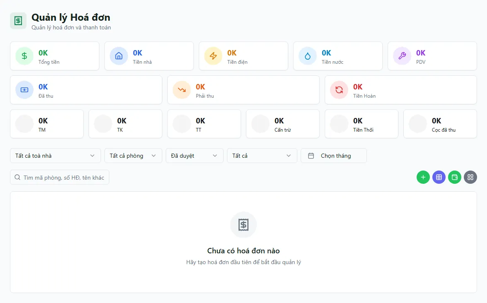

# Thu tiền tại hoá đơn

Khi khách trả tiền cho một hoá đơn, bạn ghi nhận khoản đó ngay tại hoá đơn qua hộp thoại **Ghi nhận thanh toán**. Mỗi lần thu sẽ tạo một **phiếu thu** đi thẳng vào **sổ quỹ** bạn chọn, đồng thời cập nhật trạng thái hoá đơn (**Đã thanh toán một phần** hoặc **Đã thanh toán**). Trang này hướng dẫn bạn thu đủ hoặc thu nhiều đợt, chọn đúng phương thức và sổ nhận, xử lý tiền thối, làm tròn tiền thiếu và tách phần cọc.

::: info Điều kiện tiên quyết
- Bạn có quyền **Ghi nhận thanh toán** (`invoices.record_payment`) trên hoá đơn thuộc phạm vi tòa nhà bạn phụ trách.
- Hoá đơn đang ở trạng thái **Đã duyệt**, **Đã thanh toán một phần** hoặc **Quá hạn** (chưa **Đã thanh toán**, chưa **Đã huỷ**).
- Đã có **sổ quỹ** để nhận tiền: sổ tên kết thúc bằng **Thu** của bạn (ví dụ "Nguyễn Văn A Thu"), hoặc sổ **Chung**; với chuyển khoản (TT/TK) nên cấu hình sẵn sổ mặc định cho tòa.
- Nếu hoá đơn có **gộp cọc** (item **Tiền cọc** trong hoá đơn tháng đầu), hệ thống cần sẵn một **loại thu "Tiền cọc"** (đánh dấu cọc). Thiếu loại này, hệ thống sẽ báo lỗi và chặn thu.
:::

::: danger Thu tiền ghi thẳng vào sổ quỹ — không có bước duyệt lại
Mỗi lần bấm xác nhận, một **phiếu thu thật** được ghi vào sổ quỹ và số dư thay đổi ngay. Hãy kiểm tra **số tiền**, **phương thức** và **sổ nhận** trước khi xác nhận. Muốn sửa sai, bạn phải **xoá phiếu thu** (xem [Chi tiết hoá đơn](/03-quan-ly-van-hanh/hoa-don-chi-tiet/)) chứ không có nút "hoàn tác" tức thời tại hộp thoại.
:::

## Hướng dẫn từng bước

**Bước 1**: Vào **Hoá đơn** (`/invoices`), tìm hoá đơn cần thu bằng ô tìm kiếm (số hoá đơn, tên khách hoặc số tiền) hoặc bộ lọc tòa/kỳ. Mở **chi tiết hoá đơn** (bấm vào dòng) hoặc dùng nút thu ngay trên danh sách.

**Bước 2**: Bấm **Ghi nhận thanh toán**. Hộp thoại thu tiền mở ra, hiển thị **Tổng tiền**, **Đã thu** và **Còn lại** của hoá đơn.

::: tip
Nếu nút đổi thành **Hoàn trả khách** (hoá đơn thanh lý có tổng âm, hoặc đã thu vượt tổng), đó là luồng hoàn trả — không phải thu tiền. Xem [Tiền thừa](/03-quan-ly-van-hanh/tien-thua/).
:::

**Bước 3**: Nhập **số tiền thu**. Thu đủ thì để đúng số **Còn lại**; thu một phần thì nhập số nhỏ hơn — hoá đơn sẽ chuyển **Đã thanh toán một phần** và bạn thu tiếp ở các đợt sau.

**Bước 4**: Chọn **phương thức** và **sổ nhận**. Giữ nguyên mã, không dịch:
- **TM** — tiền mặt: mặc định vào sổ tên kết thúc bằng **Thu** của bạn.
- **TT** / **TK** — chuyển khoản/tài khoản: vào sổ ngân hàng cấu hình sẵn cho tòa.

Bạn có thể tách một lần thu thành **nhiều dòng phương thức** (ví dụ một phần TM, một phần TK) trong cùng hộp thoại; mỗi dòng chọn sổ nhận riêng.

**Bước 5**: Xử lý các khoản đặc biệt nếu có (bỏ qua nếu không cần):
- **Tiền thối**: khi khách đưa dư tiền mặt và bạn thối lại. Chỉ áp cho dòng **TM** và không vượt tổng TM. Số tiền ghi trên phiếu thu **đã trừ tiền thối** (đã net); sổ "…Thối" chỉ là ghi nhận, **không trừ tiền lần nữa**.
- **Giữ lại làm credit (Nợ kỳ sau)**: phần dư không thối mà giữ cho khách — cộng vào **tiền thừa** của hợp đồng để trừ vào hoá đơn sau.
- **Làm tròn tiền thiếu**: nếu sau khi thu còn thiếu **dưới 10.000đ**, hệ thống tự gắn phần thiếu vào sổ **Làm tròn tiền thiếu** và đánh dấu hoá đơn **Đã thanh toán**. Số **đã thu net** vẫn giữ đúng số thực nhận, không bị đẩy lên bằng tổng.

**Bước 6**: Bấm **Xác nhận**. Hệ thống tạo phiếu thu vào sổ quỹ, cập nhật trạng thái hoá đơn và (nếu thu đủ) đặt **ngày thanh toán**. Kiểm tra lại ở [Chi tiết hoá đơn](/03-quan-ly-van-hanh/hoa-don-chi-tiet/): dòng **Đã thanh toán net** và danh sách các lần thu.

::: warning Hoá đơn tháng đầu có gộp cọc
Với hoá đơn tháng đầu, phần **cọc còn thiếu** nằm ngay trong hoá đơn (một khoản **Tiền cọc**). Khi thu, hệ thống tự **tách một lần thu thành 2 hạng mục trên cùng phiếu**: phần **doanh thu** (tiền phòng/dịch vụ) và phần **cọc**. Tiền đến đâu **phủ phần phòng/dịch vụ trước, dư mới tính vào cọc**. Phần cọc gắn loại thu đánh dấu **cọc** nên **KHÔNG vào báo cáo Kết quả kinh doanh (KQKD)**. Vì cần tách như vậy, hoá đơn gộp cọc **phải thu qua hộp thoại này** — màn [Thu tiền mặt mobile](/03-quan-ly-van-hanh/thu-tien-mobile/) và thu hàng loạt sẽ **từ chối** để tránh cọc lọt vào doanh thu.
:::

## Các tính năng khác trên màn hình

| Tính năng | Mô tả |
|-----------|-------|
| Nhiều dòng phương thức | Một lần thu có thể chia **TM + TT/TK**, mỗi dòng một sổ nhận riêng. |
| Thu nhiều đợt | Thu một phần → hoá đơn thành **Đã thanh toán một phần**; thu tiếp cho đến khi đủ → **Đã thanh toán**. |
| Tiền thối | Nhập số thối cho dòng **TM**; phiếu thu ghi số ròng, sổ "…Thối" chỉ ghi nhận. |
| Giữ credit (Nợ kỳ sau) | Giữ phần dư làm **tiền thừa** của hợp đồng để trừ hoá đơn sau. |
| Làm tròn tiền thiếu | Thiếu **dưới 10.000đ** tự vào sổ **Làm tròn tiền thiếu** và đánh dấu Đã thanh toán. |
| Tách cọc tự động | Hoá đơn tháng đầu tự tách hạng mục **doanh thu / cọc** (phòng trước, cọc sau). |
| Ảnh chứng từ | Đính kèm/paste ảnh biên nhận cho lần thu (xem qua [Chi tiết hoá đơn](/03-quan-ly-van-hanh/hoa-don-chi-tiet/)). |
| Xem & sửa lần thu | Danh sách các lần thu cho phép **đổi phương thức**, **thêm ảnh**, **xoá** phiếu thu. |

## Tình huống & lỗi thường gặp

| Tình huống | Nguyên nhân & cách xử lý |
|------------|--------------------------|
| Không thấy nút **Ghi nhận thanh toán** | Hoá đơn đã **Đã thanh toán** hoặc **Đã huỷ**, hoặc bạn thiếu quyền `record_payment`. Kiểm tra trạng thái và quyền. |
| Thu hàng loạt / mobile báo "thu qua màn hình hoá đơn" | Hoá đơn có **gộp cọc** tháng đầu — bắt buộc thu tại hộp thoại này để tách cọc. |
| Báo lỗi thiếu loại thu "Tiền cọc" | Chưa có **loại thu đánh dấu cọc**. Nhờ quản lý tạo loại thu "Tiền cọc" rồi thu lại. |
| Báo không tìm được sổ quỹ nhận tiền | Sổ nhận được tìm **theo tên** (sổ "…Thu"/"Chung"/tên tòa). Ai đó đổi tên sổ sẽ gãy luồng thu — kiểm tra lại [Sổ quỹ](/03-quan-ly-van-hanh/so-quy/). |
| Nhập tiền thối nhưng bị chặn | Tiền thối **chỉ áp cho dòng TM** và **không vượt tổng TM**. Điều chỉnh lại số. |
| Còn thiếu ít mà hoá đơn đã thành **Đã thanh toán** | Đây là **làm tròn tiền thiếu** (thiếu dưới 10.000đ). Số đã thu net vẫn đúng số thực nhận. |
| Đã thu nhưng sổ quỹ chưa thấy phiếu | Ghi nhận thanh toán gồm 2 bước (tạo lần thu → tạo phiếu thu), không đảm bảo liền mạch tuyệt đối. Nếu nghi thiếu phiếu thu, kiểm tra ở [Thu chi](/03-quan-ly-van-hanh/thu-chi/) và thu/đối chiếu lại. |

## Thử trực tiếp trên sandbox

<SandboxTry account="demo.ketoan" app-path="/invoices" app-label="Mở danh sách hoá đơn" fixtures="B101 chưa thu 5.570.000đ (Tòa DEMO B, bài tập)">

**Bối cảnh**: Tòa DEMO A đã dùng cho triển lãm (đã thu / quá hạn — chỉ xem, đừng thu lại). Bạn thực hành trên **Tòa DEMO B**, phòng **B101** có hoá đơn tháng 7 **chưa thu 5.570.000đ** (tiền phòng 5.000.000đ + điện 420.000đ + nước 120.000đ + rác 30.000đ).

**Bài tập**:
1. Lọc về **Tòa DEMO B**, mở hoá đơn phòng **B101**.
2. Bấm **Ghi nhận thanh toán**, nhập đủ **5.570.000đ**, chọn phương thức **Tiền mặt (TM)**.
3. Chọn **sổ nhận** (sổ "…Thu" của bạn), rồi **Xác nhận**.
4. Kiểm tra hoá đơn B101 chuyển sang **Đã thanh toán** và một **phiếu thu** đã vào sổ quỹ.
5. Xong bài tập, bấm **Reset** để trả sandbox về trạng thái ban đầu.

**Kết quả mong đợi**: bạn hiểu rằng thu tiền tại hoá đơn sẽ **sinh một phiếu thu vào sổ quỹ** và cập nhật trạng thái hoá đơn theo số đã thu.

</SandboxTry>

## Quy trình liên quan

- [Danh sách hoá đơn](/03-quan-ly-van-hanh/hoa-don/) — lọc, tìm và mở hoá đơn cần thu.
- [Chi tiết hoá đơn](/03-quan-ly-van-hanh/hoa-don-chi-tiet/) — xem các lần thu, sửa/xoá phiếu, đính ảnh chứng từ.
- [Thu tiền mặt (mobile)](/03-quan-ly-van-hanh/thu-tien-mobile/) — thu nhanh theo lưới ô phòng trên điện thoại.
- [Sổ quỹ](/03-quan-ly-van-hanh/so-quy/) — nơi phiếu thu đổ tiền vào.
- [Phiếu thu chi](/03-quan-ly-van-hanh/thu-chi/) — đối chiếu phiếu thu sinh ra từ lần thu.
- [Tiền thừa](/03-quan-ly-van-hanh/tien-thua/) — credit giữ lại và hoàn trả khách.
- [Bàn giao & đối soát](/03-quan-ly-van-hanh/ban-giao-doi-soat/) — nộp và chốt số tiền mặt đã thu.
- [Quy trình thu tiền](/01-bat-dau/quy-trinh-thu-tien/) — bức tranh tổng quan luồng thu.
