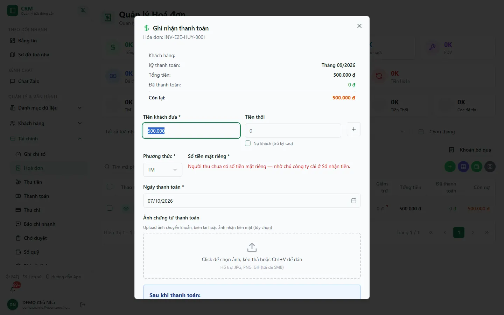

# Thu tiền tại hoá đơn

Luồng này ghi một lần thanh toán vào đúng hoá đơn và đúng sổ nhận tiền. Bạn cần quyền xem hoá đơn và quyền **Thu tiền (ghi nhận thanh toán)** (`invoices.record_payment`) để thấy nút thu. Trên điện thoại, dùng [Thu tiền tại phòng](/03-quan-ly-van-hanh/thu-tien-mobile/) cho nhanh.

::: info Điều kiện tiên quyết
- Hoá đơn ở trạng thái **Đã duyệt**, **Trả 1 phần** hoặc **Quá hạn** và còn phải thu.
- Người thu đã có **sổ tiền mặt riêng** (cho TM) và được giao giữ/biết sổ nhận **Chuyển khoản / Thanh toán** của toà. Chủ công ty cài ở **Sổ quỹ → Sổ nhận tiền**.
:::

## Ghi nhận một lần thu

**Bước 1**: Tại **Tài chính** => **Hoá đơn**, bấm nút tròn **Thu tiền** (biểu tượng $) trên dòng hoá đơn còn nợ, hoặc mở chi tiết rồi bấm **Ghi nhận thanh toán**. Hộp **Ghi nhận thanh toán** hiện tóm tắt **Kỳ thanh toán**, **Tổng tiền**, **Đã thanh toán**, **Còn lại**.

**Bước 2**: Nhập **Tiền khách đưa** (mặc định điền sẵn số còn lại) và chọn **Phương thức**:

- `TM` — Tiền mặt: luôn vào **Sổ tiền mặt riêng** của người thu, không chọn được sổ khác.
- `TK` — Chuyển khoản và `TT` — Thanh toán: chọn **Sổ quỹ nhận** trong danh sách sổ của toà mà bạn được giữ/biết (sổ **mặc định** đứng đầu).

Khách trả bằng nhiều hình thức thì bấm **+** để thêm dòng thanh toán; mỗi dòng có số tiền, phương thức và sổ riêng.

**Bước 3**: Nếu khách đưa dư, nhập **Tiền thối** thực tế; hoặc tích **Nợ khách (trừ kỳ sau)** để giữ phần dư làm tiền nợ khách của hợp đồng, trừ vào hoá đơn kỳ sau (khi đó không tạo phiếu chi thối). Có tiền thối thì chọn **Sổ ghi nhận tiền thối**.

**Bước 4**: Kiểm tra **Ngày thanh toán** (không được ở tương lai), đính **Ảnh chứng từ thanh toán** nếu có (bấm chọn, kéo thả hoặc Ctrl+V; JPG/PNG/GIF tối đa 5MB) và **Ghi chú**. Khung **Sau khi thanh toán** cho biết đã thanh toán, còn lại, tiền thối/giữ nợ và **Trạng thái mới** (**Đã thanh toán** hoặc **Trả 1 phần**).

**Bước 5**: Bấm **Ghi nhận thanh toán**. Nếu hoá đơn vừa có một khoản thu **cùng số tiền trong 30 phút**, hệ thống hỏi **Có thể đang thu trùng** — chọn **Không thu** nếu đúng là trùng, hoặc **Vẫn thu tiếp**.

::: info Một lần thu là một giao dịch nguyên tử
Mọi dòng `TM/TK/TT` của **một hoá đơn** được ghi trong cùng một giao dịch: hoặc tất cả cùng lưu, hoặc không dòng nào được lưu. Mỗi dòng tạo một phiếu thu "Thu tiền theo HĐ …" gắn với hoá đơn. Nếu mạng chập chờn lúc gửi, dữ liệu đã nhập được giữ lại; bấm ghi lại là an toàn vì lệnh dùng cùng khoá chống trùng. Nếu hệ thống báo "Lần thu trước có thể đã được ghi", đóng hộp, tải lại hoá đơn rồi thu theo số còn lại mới.
:::

::: danger Đã duyệt chưa chắc là tiền đã vào sổ
Phiếu thu tạo ra từ lần thu đã ở trạng thái duyệt, nhưng tiền chỉ coi là vào sổ quỹ khi phiếu ở trạng thái **Đã Thu** (đã ghi sổ — `POSTED`). Đối chiếu ở [Thu chi](/03-quan-ly-van-hanh/thu-chi/) / [Sổ quỹ](/03-quan-ly-van-hanh/so-quy/) trước khi bàn giao hoặc chốt quỹ.
:::

::: tip Khoản thiếu lẻ dưới 10.000đ
Khi khách đóng thiếu dưới 10.000đ, hệ thống tự làm tròn, ghi khoản này vào sổ "Làm tròn tiền thiếu" và đánh dấu hoá đơn **Đã thanh toán** đủ — trừ khi phần thiếu thuộc tiền cọc. Tra lại các khoản này bằng nút **Khoản bỏ qua** trên màn Hoá đơn.
:::

## Xem, đổi hình thức thu và hoàn tác

**Bước 6**: Ở cột **Đã thanh toán** của danh sách, bấm **(Xem)** để mở hộp **Các lần thanh toán**. Mỗi lần thu có mã phiếu (bấm để mở phiếu trong sổ Thu/Chi), ảnh chứng từ và các nút thao tác.

- **Đổi hình thức thu**: chuyển một dòng thu sang hình thức/sổ nhận khác (ví dụ TM ↔ TK, hoặc đổi sổ trong cùng hình thức) — **không đổi số tiền và không đổi nợ hoá đơn**. Chỉ người đã thu, chủ công ty hoặc quản trị hệ thống đổi được; phải ghi **Lý do đổi** (tối thiểu 8 ký tự) và lần đổi được lưu vào lịch sử phiếu. Dòng có tiền thối hoặc làm tròn không đổi được.
- **Hoàn tác**: huỷ toàn bộ một lần thu (mọi dòng TM/TK/TT của lần đó), bắt buộc nhập **Lý do hoàn tác**. Tuỳ chế độ kế toán, hệ thống tạo **phiếu chi đối ứng** (giữ nguyên lịch sử gốc) hoặc chuyển phiếu thu sang **Đã huỷ**; cả hai cách đều tính lại số đã thu của hoá đơn.

Không xoá phiếu thu hoặc chỉnh tay số dư để sửa một lần thu.

## Thu nhiều hoá đơn cùng lúc

Nút tròn **Thanh toán hàng loạt — Mode Excel** mở bảng **Thanh toán hàng loạt — Mode Excel**: chọn toà & kỳ → **Tải dữ liệu** → nhập TM/TT/TK/Thối cho từng phòng → **Ghi nhận N thanh toán**.

::: warning Thu hàng loạt không nguyên tử giữa các hoá đơn
Mỗi hoá đơn là một giao dịch riêng. Một số hoá đơn có thể đã ghi trước khi hoá đơn khác lỗi; luôn đọc kết quả từng dòng và đối soát, không bấm ghi lại cả lô.
:::

## Hoàn tiền cho khách

::: danger Luồng hiện tại chỉ tạo phiếu chi chờ duyệt
Với hoá đơn âm hoặc khách đã trả dư, nút thu đổi thành **Hoàn trả khách**. Hộp này có **Ngày hoàn trả** và **Sổ quỹ chi**, nhưng luồng ghi hiện hành chưa dùng hai giá trị đó; bấm **Lập phiếu chi** chỉ tạo phiếu chi hoàn trả ở trạng thái **Chờ duyệt**, chưa có tiền ra. Sau đó duyệt theo [Chờ duyệt](/03-quan-ly-van-hanh/cho-duyet/) và đối chiếu số tiền trước khi duyệt; tiền chỉ ra khi phiếu ở trạng thái **Đã Chi**.
:::

## Tình huống & lỗi thường gặp

| Tình huống | Nguyên nhân & cách xử lý |
|---|---|
| Ô sổ báo **Người thu chưa có sổ tiền mặt riêng — nhờ chủ công ty cài ở Sổ nhận tiền.** | Tài khoản đang thu chưa được cài sổ tiền mặt riêng; nút ghi nhận bị khoá. Nhờ chủ công ty cài ở **Sổ quỹ → Sổ nhận tiền**. |
| Báo **chưa dùng được sổ nhận Chuyển khoản/Thanh toán nào của toà** | Toà chưa cài sổ, hoặc người thu chưa được giao giữ/biết sổ đó. Nhờ chủ công ty kiểm ở **Sổ quỹ → Sổ nhận tiền**. |
| **Ngày thu không được ở tương lai** | Chọn lại ngày thanh toán là hôm nay hoặc trước đó. |
| **Số đã thu vừa thay đổi; vui lòng tải lại hóa đơn** | Có người vừa thu hoá đơn này. Đóng hộp, tải lại rồi thu theo số còn lại mới. |
| Báo lợi nhuận tháng **đã chốt** | Tháng của khoản thu đã khoá lợi nhuận và chia cho cổ đông. Không sửa/hoàn tác khoản thu của tháng đó; lập điều chỉnh ở tháng hiện tại hoặc nhờ chủ tổ chức mở khoá tháng. |
| Nút **Đổi hình thức thu** bị mờ | Bạn không phải người đã thu và không phải chủ công ty. |

## Thử trực tiếp trên sandbox

<SandboxTry account="demo.chunha" app-path="/invoices" app-label="Mở danh sách Hoá đơn" fixtures="Snapshot 07/10/2026: hoá đơn INV-E2E-HUY-0001 (DEMO Toà D - D-03, 500.000đ, Quá hạn); tài khoản demo.chunha chưa có sổ tiền mặt riêng nên hộp thu báo thiếu sổ." view-only>

**Bài tập chỉ xem**

1. Bấm nút **Thu tiền** trên dòng hoá đơn, đọc các ô **Tiền khách đưa**, **Phương thức**, ô sổ nhận và khung **Sau khi thanh toán**.
2. Bấm **Hủy** để đóng. Không bấm **Ghi nhận thanh toán**.

**Kết quả mong đợi**

- Bạn nhận ra vì sao ô sổ báo thiếu sổ tiền mặt riêng và biết ai phải cài.
- Không có lần thu nào được ghi.

</SandboxTry>

## Quy trình liên quan

- [Chi tiết, in hoá đơn & QR tra cứu](/03-quan-ly-van-hanh/hoa-don-chi-tiet/)
- [Thu tiền tại phòng trên điện thoại](/03-quan-ly-van-hanh/thu-tien-mobile/)
- [Sổ quỹ](/03-quan-ly-van-hanh/so-quy/)
- [Tiền thừa](/03-quan-ly-van-hanh/tien-thua/)
- [Chờ duyệt](/03-quan-ly-van-hanh/cho-duyet/)
