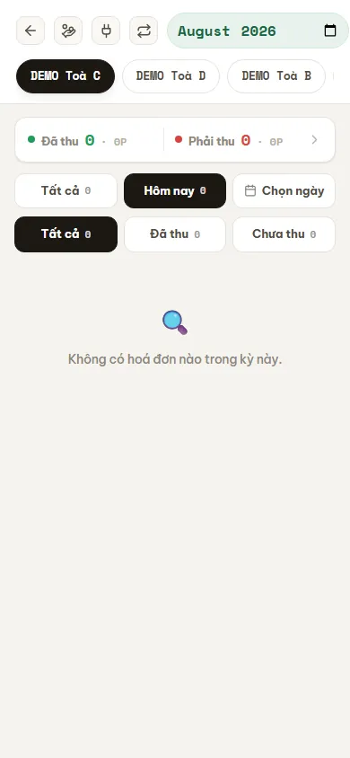

# Thu tiền tại phòng (điện thoại)

Màn **Thu tiền** tối ưu cho người đi thu tại phòng. Route cần quyền xem module `thu_tien`; nút thu, báo cáo và hoàn tác tiếp tục được kiểm tra bằng các action riêng.

## Thu một hóa đơn

**Bước 1**: Chọn tòa và kỳ, sau đó tìm phòng cần thu. Màu và nhãn trên ô phòng giúp nhận biết chưa thu, thu một phần hoặc đã thu.

::: warning Snapshot DEMO hiện tại đang rỗng
Lần kiểm tra production ngày 13/08/2026 không có hoá đơn trong kỳ đang chọn, nên ảnh chỉ chứng minh route, bộ lọc và empty state thực tế; ảnh **không** minh hoạ một lưới phòng có thể thu. Khi không có ô phòng, hãy kiểm tra lại kỳ/toà và dữ liệu hoá đơn trước khi kết luận thiếu quyền hoặc lỗi màn hình.
:::

**Bước 2**: Mở ô phòng và kiểm tra hợp đồng, hóa đơn, số còn nợ. Không thu theo tên phòng nếu thông tin khách hoặc kỳ chưa đúng.

**Bước 3**: Bấm **Thu**, nhập các phần `TM/TK/TT`, chọn đúng sổ quỹ và xác nhận tổng tiền.

**Bước 4**: Chờ thông báo thành công rồi kiểm tra lại ô phòng hoặc lịch sử. Với một hóa đơn, mọi tender được ghi nguyên tử qua writer V5: hoặc cùng thành công, hoặc không phần nào được lưu.

Trong lần xác minh này, fixture V5 có cleanup đã tự dừng ở preflight vì DEMO không còn tổ hợp phòng trống/khách/sổ quỹ đủ điều kiện để tạo hợp đồng và hoá đơn mới an toàn. Tài liệu không tạo dữ liệu giả hoặc cưỡng ép ghi tiền để lấy ảnh thao tác.

## Thu nhiều phòng

Thu hàng loạt vẫn là nhiều giao dịch độc lập. Nếu quá trình dừng giữa chừng, các hóa đơn đã thành công không tự quay lại. Hãy đọc kết quả từng phòng, lọc lại danh sách và chỉ thực hiện tiếp với hóa đơn chưa ghi.

## Hoàn tác và báo cáo

- Nút hoàn tác chỉ hiện khi có quyền `thu_tien.undo` và dữ liệu cho phép đảo thu.
- Hoàn tác dùng nghiệp vụ reversal chuẩn, giữ lịch sử và có thể tạo chứng từ đối ứng tùy chế độ kế toán.
- Báo cáo thu chỉ hiện khi có quyền báo cáo tương ứng; quyền thu không tự cấp quyền xem báo cáo.
- Báo cáo **Chu kỳ Thu → Bàn giao** cần riêng `reports_finance.collection_cycle`.

::: warning Không xóa chứng từ để sửa
Nếu chọn nhầm tiền, sổ hoặc hóa đơn, dùng **Hoàn tác/Đảo thu** rồi ghi lại. Không xóa phiếu thu hoặc chỉnh tay số dư vì sẽ làm mất chuỗi kiểm toán.
:::

## Tiền cọc và tiền thừa

- Phần cọc và phần doanh thu được phân bổ thành các item trong cùng collection/voucher, không tạo một phiếu cọc tách rời.
- Tiền khách trả vượt và credit khách hàng cần đối chiếu theo ledger credit chuẩn; báo cáo [Tiền thừa](/03-quan-ly-van-hanh/tien-thua/) hiện là báo cáo legacy, không phải số dư credit chuẩn.

## Quy trình liên quan

- [Thu tiền tại hóa đơn](/03-quan-ly-van-hanh/thu-tien-hoa-don/)
- [Chu kỳ Thu → Bàn giao](/04-bao-cao/thu-ban-giao/)
- [Bàn giao tiền & đối soát](/03-quan-ly-van-hanh/ban-giao-doi-soat/)
- [Chờ duyệt](/03-quan-ly-van-hanh/cho-duyet/)
