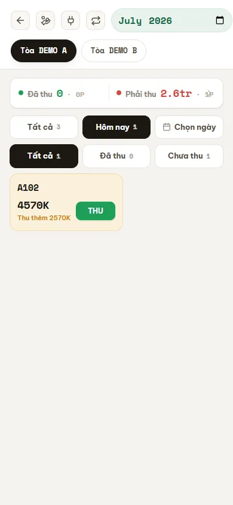

# Thu tiền tại phòng (điện thoại)

Màn **Thu tiền** là công cụ cầm tay để bạn đi thu tiền hoá đơn tháng ngay tại từng phòng. Bạn chọn **kỳ (tháng)** và **toà nhà**, nhìn lưới ô phòng đổi màu theo trạng thái (chưa thu / thu một phần / đã thu), chạm vào ô phòng cần thu, rồi ghi **Thu đủ** hoặc **Thu một phần** chỉ trong vài chạm. Mọi thao tác được thiết kế cho màn hình điện thoại, nên bạn thu tiền tại chỗ mà không cần mở máy tính. Mỗi lần thu là **ghi tiền thật vào sổ quỹ**, nên hãy đọc kỹ các cảnh báo trong bài.

::: info Điều kiện tiên quyết
- Quyền **Thu tiền => Xem** (module `thu_tien`, action `view`) để mở màn.
- Quyền **Thu tiền => Thu tiền** (`thu_tien.collect`) để ghi phiếu thu; quyền **Thu tiền => Hoàn tác** (`thu_tien.undo`) để huỷ khoản vừa thu; quyền **Thu tiền => Báo cáo** (`thu_tien.report`) để mở báo cáo thu.
- Đã có **hoá đơn tháng** cho các phòng (xem [Sinh hoá đơn](/03-quan-ly-van-hanh/sinh-hoa-don/)) và ít nhất một **sổ quỹ thu** đứng tên bạn để tiền chảy vào (xem [Sổ quỹ & loại thu chi](/01-bat-dau/so-quy-loai-thu-chi/)).
- Là nhân viên, bạn chỉ thấy và thu được hoá đơn của các toà được gán phạm vi cho mình.
- Mở trang bằng **điện thoại** để có bố cục thu tiền tối ưu.
:::

## Hướng dẫn từng bước

**Bước 1**: Ở menu, vào **Tài chính => Thu tiền**. Trên đầu màn có ô chọn **kỳ (tháng)** và dải nút **toà nhà**. Chọn **Tòa DEMO A** và đặt kỳ về tháng bạn cần thu (ví dụ tháng 7/2026). Lưới ô phòng của toà hiện ra, mỗi ô là **một hoá đơn** của một phòng trong kỳ đó.

**Bước 2**: Đọc **màu ô phòng** để biết ngay tình trạng thu:

- **Đỏ** — *Chưa thu*: hoá đơn còn nguyên chưa có đồng nào (ví dụ **B101** còn 5.570.000đ).
- **Vàng** — *Thu một phần*: đã thu một ít, vẫn còn nợ (ví dụ **A102** còn phải thu thêm 2.570.000đ).
- **Xanh** — *Đã thu*: hoá đơn đã thu đủ (ví dụ **A101**, **A103**).

Mỗi ô hiện tên phòng, số tiền còn phải thu, **chữ viết tắt của người đã thu** khoản đó, và một nút **Zalo** để nhắn nhanh cho khách đại diện của phòng.

**Bước 3**: Lọc danh sách cho gọn bằng hai bộ lọc phía trên lưới:

- **Thời gian**: **Tất cả** / **Hôm nay** (mặc định) / **Chọn ngày**. Ở **Chọn ngày** bạn chọn được một ngày hoặc một **khoảng ngày** (ví dụ 7 ngày gần đây).
- **Trạng thái**: **Tất cả** (mặc định) / **Đã thu** / **Chưa thu**.

Thanh tổng ở trên cùng cho biết **Đã thu** và **Còn phải thu** cùng số phòng theo phạm vi đang lọc. Muốn xem hoá đơn quá hạn của tháng trước (ví dụ **A105** còn nợ tháng 6), chỉ cần đổi ô **kỳ** về đúng tháng đó.

::: tip "Chưa thu" và "Đã thu" hiểu theo mốc ngày
Khi bạn lọc theo một ngày trong quá khứ, **Chưa thu** nghĩa là "còn nợ tính đến hết ngày đó", còn **Đã thu** nghĩa là "có phát sinh phiếu thu trong ngày đó" — kể cả khi mới thu được một phần. Nhờ vậy báo cáo theo ngày phản ánh đúng bạn đã thu bao nhiêu vào từng ngày đi thu.
:::

**Bước 4**: Chạm vào một ô phòng cần thu — **ngăn thu tiền** trượt lên từ đáy màn. Ngăn này hiển thị chi tiết hoá đơn: **Tiền phòng** cùng các hạng mục **Điện 420.000đ**, **Nước 120.000đ**, **Rác 30.000đ**, và **số tiền còn phải thu**. Ngay trong ngăn có các nút điều hướng **phòng trước / phòng sau** theo đúng danh sách bạn đang lọc, nên đi thu liền một mạch không phải đóng ra đóng vào.

**Bước 5**: Thu trọn số còn nợ — ấn **Thu đủ**, chọn phương thức, xong. Đây là đường nhanh nhất: chỉ 2–3 chạm là ô phòng chuyển sang **xanh**.

::: danger Thu tiền là thao tác ghi tiền thật vào sổ quỹ
Khi bạn xác nhận thu, hệ thống tạo **một phiếu thu** và ghi tiền vào **sổ quỹ theo phương thức**: **TM** vào sổ "…Thu" của chính bạn, **TK** vào sổ chuyển khoản của toà, **TT** vào sổ thanh toán của toà. Hãy chọn đúng phòng, đúng số tiền và đúng phương thức trước khi xác nhận — đây là tiền thật, không phải bản nháp. Giữ nguyên mã **TM / TK / TT**, không cần đổi tên hay dịch nghĩa.
:::

**Bước 6**: Thu một phần hoặc nhiều phương thức — nếu khách chỉ trả một phần, ấn **Thu một phần** và nhập số bằng **bàn phím số**. Lưu ý bàn phím này **nhập theo nghìn**: gõ `2000` nghĩa là **2.000.000đ**. Nếu khách trả bằng nhiều cách (một phần TM, một phần TK…), mở **form nhiều dòng** để tách từng dòng **TM / TK / TT**, mỗi dòng chọn được ngày và đính ảnh chứng từ.

::: tip Tiền thối, làm tròn và tiền cọc được xử lý tự động
- **Thu dư bằng TM**: phần dư trả lại khách được ghi làm **tiền thối** — số **Đã thu** hiển thị đã là **số ròng** (đã trừ tiền thối), bạn không phải tự trừ.
- **Còn thiếu dưới 10.000đ**: hệ thống tự **làm tròn** phần lẻ vào sổ "Làm tròn tiền thiếu" và đánh dấu hoá đơn **Đã thu** — đây chỉ là bút toán ghi nhận, **không** trừ vào số dư sổ quỹ của bạn.
- **Tiền cọc gộp trong hoá đơn tháng đầu**: nếu hoá đơn có hạng mục "Tiền cọc", phần cọc được **tách riêng** khi thu và **không tính vào kết quả kinh doanh (KQKD)** — cứ thu bình thường, hệ thống tự phân loại.
:::

**Bước 7**: Ghi chú cho phòng — trong ngăn thu tiền có ô **Ghi chú** để lưu tình huống (khách hẹn ngày trả, thu hộ…). Ghi chú bám theo hoá đơn, ai mở ra cũng thấy.

**Bước 8**: Lỡ tay thì hoàn tác — nếu ghi nhầm, ấn **Hoàn tác** trong ngăn thu tiền để đảo **khoản thu gần nhất** của hoá đơn đó; số tiền và trạng thái được tính lại ngay.

::: warning Hoàn tác chỉ gỡ khoản thu mới nhất
**Hoàn tác** ưu tiên tạo bút toán đối ứng và giữ dấu vết thay vì xoá lịch sử payment. Nó chỉ áp cho **lần thu gần nhất**, không phải toàn bộ lịch sử. Một số payment legacy đặc biệt mới dùng fallback xoá cũ. Cần điều chỉnh khoản cũ hơn thì xử lý tại [Thu chi](/03-quan-ly-van-hanh/thu-chi/). Nếu tiền đã bàn giao, phải đối chiếu trước khi hoàn tác.
:::

**Bước 9**: Xem báo cáo thu — mở **Báo cáo** (cần quyền `thu_tien.report`) để xem theo **Toà** (hoặc Tất cả toà) và theo **thời gian** (Cả kỳ / Hôm nay / chọn 1 ngày trên lịch tháng thu gọn): nhóm phòng đã thu theo toà và danh sách phòng chưa thu để bạn biết còn phải đi những phòng nào.

**Bước 10**: Đóng phí vận hành theo kỳ — bấm icon **phích cắm** trên header. Màn **Đóng tiền tập trung** cho phép chọn Tiền nhà, Điện, Nước, Internet, Quản lý, Vệ sinh, Công an, Rác, Thang máy; ngoài ra có khu Hoa hồng và Bảo trì. Chọn toà, nhập **tổng tiền của cả khoảng kỳ**, số kỳ (1–36), sổ và ảnh rồi xác nhận. Ô có thể ở trạng thái **Nháp chờ thanh toán**; khi đó mở phiếu, chọn sổ/ảnh và bấm **Thanh toán** để duyệt. Nếu hệ thống cảnh báo trùng, kiểm các voucher đang có trước khi force tạo thêm.

## Các tính năng khác trên màn hình

| Nút / Bộ lọc | Công dụng |
| --- | --- |
| Ô chọn **kỳ (tháng)** | Chọn tháng hoá đơn cần thu; đổi tháng để xem cả hoá đơn quá hạn của kỳ trước. |
| Dải nút **toà nhà** | Chuyển nhanh giữa các toà trong phạm vi của bạn; đổi toà **không tải lại** dữ liệu, lọc ngay tại chỗ. |
| Bộ lọc **Thời gian** | Tất cả / Hôm nay (mặc định) / Chọn ngày (một ngày hoặc một khoảng). |
| Bộ lọc **Trạng thái** | Tất cả (mặc định) / Đã thu / Chưa thu; chip kèm số đếm. |
| Thanh tổng thu | Tổng **Đã thu** và **Còn phải thu** + số phòng theo phạm vi đang lọc. |
| **Zalo** trên ô phòng | Nhắn nhanh cho khách đại diện của phòng. |
| Nút **Gọi khách** (trong ngăn) | Gọi cho khách đại diện của phòng đang mở. |
| **Báo cáo** | Mở báo cáo thu theo toà và thời gian (cần quyền `thu_tien.report`). |
| **Bàn giao tiền mặt** | Bàn giao số dư sổ thu của bạn cho người nhận — xem [Sổ quỹ](/03-quan-ly-van-hanh/so-quy/) và [Bàn giao & đối soát](/03-quan-ly-van-hanh/ban-giao-doi-soat/). |
| **Đóng phí theo kỳ** | Ghi/đối chiếu phí cố định, hoa hồng và bảo trì theo toà; hỗ trợ nhiều kỳ, phiếu nháp và nhiều voucher mỗi ô. |

Kỳ, toà và các bộ lọc bạn đang chọn được **giữ lại khi tải lại trang (F5)**.

## Tình huống & lỗi thường gặp

| Tình huống | Cách xử lý |
| --- | --- |
| Lưới ô phòng **trống** dù toà có hoá đơn | Kiểm tra đã chọn đúng **kỳ (tháng)** chưa và bộ lọc **Trạng thái/Thời gian** có đang ẩn bớt phòng không. Nhân viên chỉ thấy toà trong phạm vi của mình. |
| Không thấy **hoá đơn quá hạn** của tháng trước | Ô phòng theo đúng **kỳ** đang chọn. Đổi ô kỳ về tháng có hoá đơn nợ (ví dụ tháng 6 của **A105**) để thu. |
| Gõ số ở **Thu một phần** thấy tiền gấp cả nghìn lần | Bàn phím nhập **theo nghìn**: gõ `500` là **500.000đ**, gõ `2000` là **2.000.000đ**. |
| Nút **Thu đủ / Thu một phần** bị mờ, không bấm được | Bạn thiếu quyền **Thu tiền => Thu tiền** (`thu_tien.collect`). Nhờ quản trị cấp quyền. |
| Thu xong mà **số Đã thu ít hơn** số khách đưa | Đúng khi khách đưa dư và trả lại bằng TM: phần dư là **tiền thối**, số Đã thu là **số ròng**. Nếu giữ lại làm nợ khách thì phần dư nằm ở khoản thu dư của khách. |
| Hoá đơn tự thành **Đã thu** dù còn thiếu vài nghìn | Đúng thiết kế: phần thiếu **dưới 10.000đ** được **làm tròn** vào sổ "Làm tròn tiền thiếu" và đóng hoá đơn — không trừ số dư của bạn. |
| Không thấy nút **Hoàn tác** | Bạn thiếu quyền **Thu tiền => Hoàn tác** (`thu_tien.undo`). Hoàn tác cũng chỉ gỡ được **khoản thu gần nhất** của hoá đơn. |
| Thu tiền cọc mà lo cọc **lẫn vào doanh thu** | Yên tâm: hạng mục **Tiền cọc** trong hoá đơn tháng đầu được tách riêng khi thu và **không tính vào KQKD**. |
| Phí theo kỳ hiện badge **Nháp** | Phiếu chưa vào sổ. Mở voucher, chọn sổ + ảnh chứng từ rồi bấm **Thanh toán**. |
| Đóng phí báo **đã có phiếu** | Mở danh sách voucher của ô để kiểm số tiền/kỳ; chỉ force tạo thêm khi chắc chắn đây là khoản chi khác. |

## Thử trực tiếp trên sandbox

<SandboxTry account="demo.sale" app-path="/thu-tien" app-label="Mở màn Thu tiền" fixtures="A102 thu một phần còn nợ, B101 chưa thu">

Thực hành thu tiền một phòng ngay tại chỗ (mở trên điện thoại):

1. Ở đầu màn, chọn **Tòa DEMO B** và đặt **kỳ** về **tháng 7** (2026).
2. Tìm ô phòng **B101** đang màu **đỏ** (Chưa thu, còn 5.570.000đ) và chạm vào ô — ngăn thu tiền trượt lên.
3. Ấn **Thu đủ**, chọn phương thức **TM** để ghi trọn số còn nợ. Ô **B101** chuyển sang **xanh** (Đã thu).
4. Xong, ấn **Reset** để trả dữ liệu sandbox về ban đầu.

Lưu ý: **Tòa DEMO A** là dữ liệu triển lãm (A101/A103 đã thu đủ, A102 thu một phần, A105 tháng 6 quá hạn) — chỉ để **xem**, đừng thu lại.

Kết quả mong đợi: bạn thu được tiền của một phòng chỉ trong **2–3 chạm** ngay tại phòng.

</SandboxTry>

## Quy trình liên quan

- [Thu tiền theo hoá đơn](/03-quan-ly-van-hanh/thu-tien-hoa-don/) — thu tiền trên máy tính từ danh sách hoá đơn, cùng đường ghi dữ liệu với màn điện thoại.
- [Sinh hoá đơn](/03-quan-ly-van-hanh/sinh-hoa-don/) — tạo hoá đơn tháng để có ô phòng mà thu.
- [Hoá đơn](/03-quan-ly-van-hanh/hoa-don/) — xem và quản lý toàn bộ hoá đơn, trạng thái thu.
- [Thu chi](/03-quan-ly-van-hanh/thu-chi/) — nơi phiếu thu được lưu; điều chỉnh/duyệt/huỷ các khoản cũ.
- [Sổ quỹ](/03-quan-ly-van-hanh/so-quy/) — sổ thu theo phương thức TM/TK/TT nơi tiền chảy vào.
- [Bàn giao & đối soát](/03-quan-ly-van-hanh/ban-giao-doi-soat/) — bàn giao tiền mặt đã thu và chốt số sổ.
- [Sổ quỹ & loại thu chi](/01-bat-dau/so-quy-loai-thu-chi/) — cấu hình sổ thu mặc định của bạn.
- [Quy trình thu tiền](/01-bat-dau/quy-trinh-thu-tien/) — vị trí bước thu tiền trong toàn bộ vận hành.
