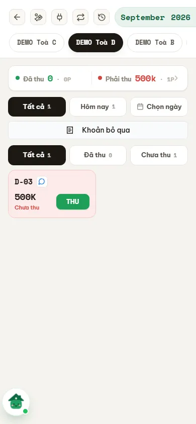
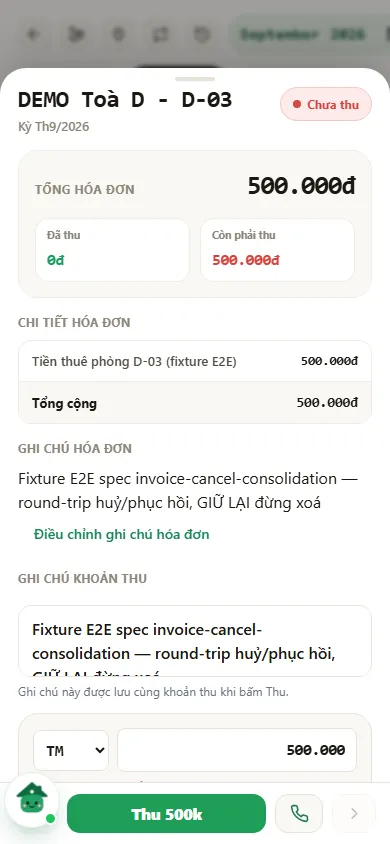

# Thu tiền tại phòng (điện thoại)

Màn **Thu tiền** tối ưu cho người đi thu tại phòng: mỗi hoá đơn của kỳ là một ô phòng, bấm là thu. Route cần quyền **Vào trang Thu tiền** (`thu_tien.view`); nút thu, hoàn tác và báo cáo được kiểm bằng các quyền riêng. Trên máy tính, màn hiện thêm cột trái là bảng quản lý/báo cáo.

::: info Điều kiện tiên quyết
- `thu_tien.collect` để thấy nút **THU** và các nút bàn giao/điện nước; `thu_tien.undo` để **Hoàn tác**; `thu_tien.report` để mở báo cáo thu tiền.
- Kỳ đang chọn đã có hoá đơn (xem [Sinh hoá đơn hàng loạt](/03-quan-ly-van-hanh/sinh-hoa-don/)).
- Người thu đã có sổ tiền mặt riêng và được giao sổ nhận chuyển khoản của toà (chủ công ty cài ở **Sổ quỹ → Sổ nhận tiền**).
:::

## Thu một hoá đơn

**Bước 1**: Tại menu, chọn **Tài chính** => **Thu tiền**. Chọn kỳ ở ô tháng góc trên phải, rồi chọn toà ở hàng nút tên toà. Dải tổng cho biết **Đã thu** và **Phải thu** (kèm số phòng); bên dưới là bộ lọc thời gian **Tất cả / Hôm nay / Chọn ngày**, nút **Khoản bỏ qua** và bộ lọc trạng thái **Tất cả / Đã thu / Chưa thu**. Mỗi ô phòng ghi mã phòng, số tiền, trạng thái và nút **THU** (ô đã thu đủ hiện **Đủ**).

::: tip Màn rỗng không có nghĩa là lỗi
Nếu kỳ/toà đang chọn không có hoá đơn, màn hiện **Không có hoá đơn nào trong kỳ này.** Bộ lọc **Hôm nay** chỉ đếm phòng thu trong ngày, nên nhiều khi phải bấm **Tất cả** mới thấy ô phòng. Kiểm tra lại kỳ và toà trước khi kết luận thiếu quyền. Lúc đang tải, dải tổng và lưới ô hiện khối xám thay vì số 0.
:::

**Bước 2**: Bấm vào ô phòng để mở trang chi tiết: **Tổng hóa đơn**, **Đã thu**, **Còn phải thu**, **Ai thu bao nhiêu** (khi đã có người thu), **Chi tiết hóa đơn**, **Ghi chú hóa đơn** và **Ghi chú khoản thu** (được lưu cùng khoản thu khi bấm Thu). Kiểm tra đúng phòng, kỳ và số còn nợ trước khi thu.

**Bước 3**: Ở phần thu cuối trang, chọn hình thức (`TM` / `TK` / `TT`), nhập số tiền; TM luôn vào **Sổ tiền mặt riêng của người thu**, TK/TT chọn **Sổ nhận tiền**. Có thể thêm dòng để chia nhiều hình thức. Nhập **Tiền thối** hoặc tích **Nợ khách (trừ kỳ sau)** nếu khách đưa dư, chọn **Ngày thanh toán** và đính **Ảnh chứng từ** (bấm chọn, kéo thả hoặc Ctrl+V).

**Bước 4**: Bấm nút xanh **Thu …** ở cuối màn. Nếu hoá đơn vừa có khoản thu **cùng số tiền trong 30 phút**, hệ thống hỏi **Có thể đang thu trùng** — chọn **Không thu** hoặc thu tiếp. Thu xong, ô phòng chuyển sang **Đủ** (hoặc giảm số còn lại khi thu một phần).

::: tip Thu nhanh bằng nút THU trên ô
Bấm **THU** ngay trên ô phòng mở bàn phím gọn: **Khách trả** điền sẵn đúng số còn phải thu (nút **Thu đủ …**), có phím tắt **500k / 1tr / 2tr / Xóa**. Gõ số nhỏ hơn để thu một phần; gõ số lớn hơn thì chọn thối lại hoặc **Nợ khách (trừ kỳ sau) thay vì thối lại**. Bàn phím nhanh ghi bằng tiền mặt.
:::

::: info Một hoá đơn — một giao dịch nguyên tử
Mọi dòng TM/TK/TT của một lần thu được ghi cùng nhau: hoặc tất cả thành công, hoặc không dòng nào được lưu. Phiếu thu tạo ra đã ở trạng thái duyệt, nhưng tiền chỉ coi là vào sổ quỹ khi phiếu ở trạng thái **Đã Thu** (đã ghi sổ); đối chiếu ở [Sổ quỹ](/03-quan-ly-van-hanh/so-quy/) trước khi bàn giao.
:::

## Thu nhiều phòng

Thu từng phòng là các giao dịch độc lập. Nếu dừng giữa chừng, các hoá đơn đã thu không tự quay lại. Đọc lại trạng thái từng ô (lọc **Chưa thu**) và chỉ thu tiếp các phòng chưa ghi. Dùng nút mũi tên ở cuối trang chi tiết để chuyển sang phòng trước/sau mà không quay về lưới.

## Hoàn tác và báo cáo

- Nút **Hoàn tác** trong trang chi tiết chỉ hiện khi có quyền `thu_tien.undo` và dữ liệu cho phép đảo thu; nếu bị chặn, dòng gợi ý dưới nút nói rõ lý do.
- Bấm **Hoàn tác** mở ô **Lý do hoàn tác** — phải ghi lý do thật rồi bấm **Xác nhận hoàn tác**. Hệ thống dùng nghiệp vụ đảo thu chuẩn, giữ lịch sử và tính lại số đã thu.
- Muốn chuyển một khoản thu sang hình thức/sổ khác mà không đổi số tiền, dùng **Đổi hình thức thu** ở [Thu tiền tại hoá đơn](/03-quan-ly-van-hanh/thu-tien-hoa-don/) hoặc màn Thu chi.
- Bấm dải tổng **Đã thu / Phải thu** để mở báo cáo thu tiền (cần `thu_tien.report`; quyền thu không tự cấp quyền xem báo cáo).

| Nút trên thanh đầu trang | Công dụng |
|---|---|
| **Bàn giao tiền mặt** (biểu tượng bàn tay cầm tiền, có số đếm) | Mở phiên bàn giao tiền mặt; xem [Bàn giao tiền & đối soát](/03-quan-ly-van-hanh/ban-giao-doi-soat/). |
| **Đóng tiền điện nước** (biểu tượng phích cắm) | Chuyển sang trang **Thanh toán** (`/thanh-toan`), dùng chung kỳ đang xem. |
| **Chu kỳ Thu → Bàn giao** (biểu tượng hai mũi tên) | Mở báo cáo [Chu kỳ Thu → Bàn giao](/04-bao-cao/thu-ban-giao/); cần riêng `reports_finance.collection_cycle`. |
| **Chu trình phòng** (biểu tượng đồng hồ) | Xem vòng đời hợp đồng của các phòng trên trục thời gian (chỉ đọc). |

::: warning Không xoá chứng từ để sửa
Nếu chọn nhầm tiền, sổ hoặc hoá đơn, dùng **Hoàn tác** rồi ghi lại, hoặc **Đổi hình thức thu** khi chỉ sai hình thức/sổ. Không xoá phiếu thu hoặc chỉnh tay số dư vì sẽ làm mất chuỗi kiểm toán.
:::

## Tiền cọc và tiền thừa

- Phần cọc và phần doanh thu được phân bổ trong cùng lần thu, không tạo một phiếu cọc tách rời.
- Tiền khách trả dư giữ làm **Nợ khách** của hợp đồng và trừ vào hoá đơn kỳ sau; báo cáo [Tiền thừa](/03-quan-ly-van-hanh/tien-thua/) là báo cáo cũ, không phải số dư credit chuẩn.

## Thử trực tiếp trên sandbox

<SandboxTry account="demo.chunha" app-path="/thu-tien" app-label="Mở màn Thu tiền" fixtures="Snapshot 07/10/2026: kỳ hiện tại (10/2026) chưa có hoá đơn; chọn kỳ 09/2026 + DEMO Toà D + Tất cả thấy ô D-03 500K Chưa thu (fixture E2E — không thu)." view-only>

**Bài tập chỉ xem**

1. Mở màn trên điện thoại (hoặc thu nhỏ trình duyệt), đổi kỳ sang 09/2026, chọn **DEMO Toà D** và bộ lọc **Tất cả**.
2. Bấm vào ô **D-03** để xem chi tiết rồi kéo xuống đóng. Không bấm **THU**, **Thu …** hoặc **Hoàn tác**.

**Kết quả mong đợi**

- Bạn hiểu vì sao kỳ hiện tại rỗng và cách tìm đúng kỳ/toà có hoá đơn.
- Không có khoản thu nào được ghi.

</SandboxTry>

## Quy trình liên quan

- [Thu tiền tại hoá đơn](/03-quan-ly-van-hanh/thu-tien-hoa-don/)
- [Chu kỳ Thu → Bàn giao](/04-bao-cao/thu-ban-giao/)
- [Bàn giao tiền & đối soát](/03-quan-ly-van-hanh/ban-giao-doi-soat/)
- [Chờ duyệt](/03-quan-ly-van-hanh/cho-duyet/)
