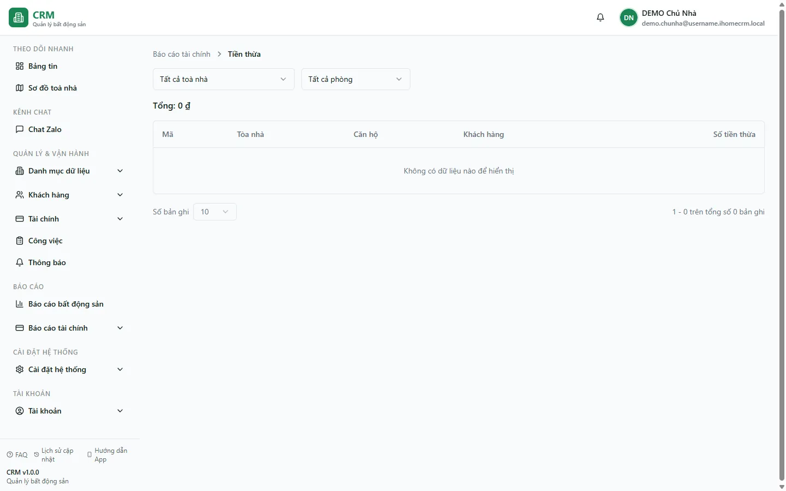

# Tiền thừa

Trang **Tiền thừa** liệt kê những hoá đơn mà khách đã nộp **nhiều hơn** tổng phải trả. Phần nộp vượt không mất đi: hệ thống ghi nhận nó thành **credit** (tiền thừa) theo hợp đồng, để **cấn trừ (giảm trừ) vào hoá đơn kỳ sau** của chính khách đó. Đây là màn hình **chỉ để xem và đối chiếu** — bạn không thu, chi hay chỉnh sửa gì trên trang này. Trong hầu hết các kỳ, trang này **trống** vì bình thường khách nộp đúng bằng hoá đơn; nó chỉ có dữ liệu khi thực sự có ai đó nộp thừa.

::: info Điều kiện tiên quyết
- Bạn có quyền **Báo cáo tài chính** (`reports_finance` – view) để mở nhóm báo cáo.
- Đã có ít nhất một lần thu tiền tạo ra tiền thừa (khách nộp vượt tổng hoá đơn). Nếu chưa từng có, trang sẽ hiển thị **Không có dữ liệu nào để hiển thị** — đó là trạng thái bình thường, không phải lỗi.
- Việc **thu tiền** (thao tác sinh ra tiền thừa) được làm ở màn hình hoá đơn, không phải ở đây — xem [Thu tiền hoá đơn](/03-quan-ly-van-hanh/thu-tien-hoa-don/).
:::

## Hướng dẫn từng bước

**Bước 1**: Vào menu **Báo cáo tài chính** => **Tiền thừa**. Màn hình mở ra một bảng danh sách với dòng **Tổng** ở phía trên và các bộ lọc.

**Bước 2**: Chọn phạm vi ở ô **Tất cả toà nhà**. Để trống (giữ **Tất cả toà nhà**) để xem mọi toà, hoặc chọn một toà cụ thể (ví dụ **Tòa DEMO A**) để lọc nhanh. Ô **Chọn phòng** hiện chỉ có mục **Tất cả phòng** — đây là ô dự phòng, chưa dùng để lọc.

**Bước 3**: Đọc bảng. Mỗi dòng là **một hoá đơn** mà khách đã nộp vượt tổng, gồm các cột:

| Cột | Ý nghĩa |
| --- | --- |
| **Mã** | Số hoá đơn (ví dụ một hoá đơn của **A101**, **Tòa DEMO A**). |
| **Tòa nhà** | Toà chứa phòng của hoá đơn. |
| **Căn hộ** | Phòng, ví dụ **A101**. |
| **Khách hàng** | Khách đại diện của hợp đồng, ví dụ **Nguyễn Văn A** (**0900 000 001**). |
| **Số tiền thừa** | Phần khách nộp **vượt** tổng hoá đơn = *đã thu − tổng phải trả*. Hiển thị màu xanh. |

Dòng **Tổng** phía trên bảng cộng cột **Số tiền thừa** của tất cả các dòng đang lọc (ví dụ **1.000.000đ**).

**Bước 4**: Hiểu ý nghĩa nghiệp vụ — phần thừa này là **credit của hợp đồng**. Khi bạn lập hoá đơn kỳ sau cho đúng khách đó, hệ thống **tự đề xuất áp credit vào giảm trừ**, nên tổng hoá đơn mới sẽ nhỏ đi đúng bằng phần thừa còn lại. Bạn **không xoá hay tất toán credit** ở trang này; nó tự tiêu dần khi được cấn trừ vào các kỳ tiếp theo.

::: tip Số "đã thu" ở đây là số ròng
Cột **Số tiền thừa** tính trên **đã thu net** — tức đã trừ **tiền thối** trả lại khách. Sổ "…Thối" chỉ là bút toán ghi nhận, tổng thu của phiếu đã là số ròng, nên tiền thối **không** bị tính nhầm thành tiền thừa.
:::

::: danger Tiền thừa được sinh khi THU tiền — một thao tác ghi tiền
Credit chỉ xuất hiện khi khách nộp vượt và bạn chọn **giữ lại làm credit** lúc ghi nhận thanh toán (thay vì thối lại). Đó là thao tác chạm vào tiền thật và phải làm ở [Thu tiền hoá đơn](/03-quan-ly-van-hanh/thu-tien-hoa-don/) hoặc [Thu tiền (mobile)](/03-quan-ly-van-hanh/thu-tien-mobile/). Trang Tiền thừa chỉ **phản ánh** kết quả đó, không tạo ra nó.
:::

## Các tính năng khác trên màn hình

| Thành phần | Công dụng |
| --- | --- |
| Ô **Tất cả toà nhà** | Lọc danh sách theo một toà. Bỏ chọn để xem mọi toà. Lựa chọn được giữ lại khi bạn tải lại trang (F5). |
| Ô **Chọn phòng** | Hiện chỉ có **Tất cả phòng** — chưa dùng để lọc theo phòng cụ thể. |
| Dòng **Tổng** | Tổng số tiền thừa của các dòng đang hiển thị theo bộ lọc. |
| **Số bản ghi** | Chọn số dòng mỗi trang (10 / 20 / 50 / 100). |
| Dòng phân trang | Cho biết đang xem dải bản ghi nào trên tổng số (ví dụ *1 - 10 trên tổng số 12 bản ghi*). |

## Tình huống & lỗi thường gặp

| Tình huống | Cách hiểu / xử lý |
| --- | --- |
| Bảng hiện **Không có dữ liệu nào để hiển thị** | Bình thường — chưa có khách nào nộp thừa. Không phải lỗi phân quyền hay mất dữ liệu. |
| Một khách nộp thừa nhưng **không thấy** trong bảng | Kiểm tra bộ lọc **toà nhà**; hoặc phần thừa đã được **cấn trừ hết** vào hoá đơn kỳ sau nên credit về 0 và hoá đơn không còn *đã thu > tổng*. |
| Muốn **hoàn tiền** cho khách thay vì giữ credit | Không làm ở đây. Khi thu, chọn thối lại tiền tại màn hình thu; hoặc xử lý theo quy trình [Hoàn/bỏ cọc](/03-quan-ly-van-hanh/hoan-bo-coc/) nếu liên quan thanh lý. |
| Khách nộp **thiếu** dưới 10.000đ | Đây là *làm tròn tiền thiếu*, hệ thống coi hoá đơn đã **thu đủ** mà **không** đẩy số thu lên bằng tổng — nên **không** tạo tiền thừa, và trường hợp này **không** xuất hiện ở trang này. |
| Số tiền thừa trông lệch với cảm nhận | Nhớ rằng số thu đã **net tiền thối**, và tổng hoá đơn đã được **làm tròn về bội số 1.000đ** lúc lập; chênh lệch nhỏ thường đến từ hai cơ chế này. |
| Không mở được trang | Cần quyền **Báo cáo tài chính**. Liên hệ chủ tài khoản để được cấp. |

## Thử trực tiếp trên sandbox

<SandboxTry account="demo.ketoan" app-path="/reports/finance/overpayment" app-label="Mở báo cáo Tiền thừa" view-only fixtures="Dữ liệu demo P3: hoá đơn tháng 7/2026 cho A101 (đã thu đủ), A102 (còn nợ), A103 (đã thu đủ), B101 (chưa thu); A105 quá hạn tháng 6.">
Mở trang **Tiền thừa** và quan sát:

1. Đọc dòng **Tổng** và danh sách khách nộp thừa (nếu có). Với dữ liệu demo, khách thường nộp **đúng** hoá đơn nên bảng có thể hiện **Không có dữ liệu nào để hiển thị** — hãy nhận ra đây là trạng thái bình thường.
2. Thử chọn **Tòa DEMO A** rồi bỏ chọn để thấy bộ lọc toà hoạt động.
3. Tự trả lời: nếu **Nguyễn Văn A** ở **A101** lỡ nộp **1.000.000đ** nhiều hơn hoá đơn, số đó sẽ nằm ở cột **Số tiền thừa** và được **cấn trừ vào hoá đơn kỳ sau** của chính hợp đồng đó.

Đây là bài **chỉ xem** — bạn không thu/chi gì. Muốn tự tạo ra một khoản thừa để quan sát, hãy sang bài thu tiền (thu vượt rồi chọn giữ credit) ở màn hình hoá đơn.
</SandboxTry>

## Quy trình liên quan

- [Thu tiền hoá đơn](/03-quan-ly-van-hanh/thu-tien-hoa-don/) — nơi phát sinh tiền thừa khi khách nộp vượt và bạn chọn giữ làm credit.
- [Thu tiền (mobile)](/03-quan-ly-van-hanh/thu-tien-mobile/) — luồng thu nhanh theo lưới ô phòng.
- [Sinh hoá đơn](/03-quan-ly-van-hanh/sinh-hoa-don/) — nơi credit được đề xuất áp vào giảm trừ cho kỳ sau.
- [Chi tiết hoá đơn](/03-quan-ly-van-hanh/hoa-don-chi-tiet/) — xem lịch sử thanh toán và phần đã thu net của từng hoá đơn.
- [Quy trình thu tiền](/01-bat-dau/quy-trinh-thu-tien/) — bức tranh tổng thể từ lập hoá đơn đến thu và đối chiếu.
