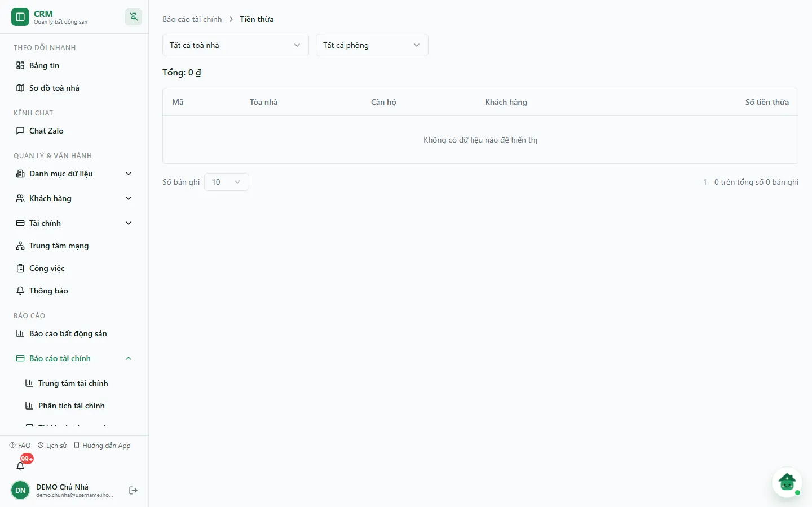

# Tiền thừa

Báo cáo **Tiền thừa** liệt kê các hoá đơn có **số đã thu lớn hơn tổng hoá đơn** (`paid_amount - total_amount > 0`). Mở từ menu **Báo cáo** => **Báo cáo tài chính** => **Tiền thừa** (đường dẫn `/reports/finance/overpayment`; địa chỉ cũ `/report/finance/prepaid` tự chuyển hướng về đây). Route cần quyền riêng `reports_finance.overpayment`.

::: tip Cấp quyền đúng chỗ
Ô quyền mở màn này nằm ở trang **Báo cáo tài chính** trong [Phân quyền](/05-cai-dat/phan-quyen/) (`reports_finance.overpayment`). Mục "tiền thừa" ở nhóm quyền dữ liệu là một quyền khác (quyền đọc dữ liệu) — bật nó **không** mở được báo cáo này.
:::

::: warning Đây là báo cáo legacy
Số trên màn là phần thu vượt còn nằm trên bản ghi hoá đơn. Nó **không phải** số dư tín dụng (credit) khách hàng chuẩn và không theo dõi đầy đủ việc credit đã được tạo, cấn trừ hay còn lại.
:::

## Đọc màn hình

- Đầu trang: đường dẫn **Báo cáo tài chính › Tiền thừa**, ô **Tất cả toà nhà** (chọn 1 toà hoặc tất cả) và ô **Tất cả phòng**.
- Dòng **Tổng: …** — tổng tiền thừa theo bộ lọc toà.
- Bảng: **Mã** (số hoá đơn), **Tòa nhà**, **Căn hộ**, **Khách hàng**, **Số tiền thừa**. Không có dữ liệu thì hiện "Không có dữ liệu nào để hiển thị".
- Chân bảng: **Số bản ghi** mỗi trang (10 / 20 / 50 / 100) và dòng "x - y trên tổng số n bản ghi".

## Nguồn credit chuẩn

Credit khách hàng được theo dõi bằng các lot tín dụng; số dư còn lại được truy vấn qua `get_customer_credit_balance_v1`. Khi thanh lý hợp đồng, form quyết toán hiện số credit hiện có ở ô **Tiền thừa của khách (credit) áp vào quyết toán** (xem [Khách rời phòng](/03-quan-ly-van-hanh/thanh-ly-move-out/)).

Vì vậy:

- Một dòng có trên báo cáo cho biết hoá đơn legacy đang có số đã thu lớn hơn tổng.
- Không thấy dòng **không có nghĩa** credit đã được dùng hết.
- Không dùng tổng của báo cáo này để cam kết số tiền khách còn được cấn trừ.
- Trước khi cấn, hoàn hoặc giải thích cho khách, kiểm tra số dư credit chuẩn trong luồng nghiệp vụ (thu tiền hoá đơn, thanh lý).

## Bộ lọc hiện tại

Ô toà nhà lọc được danh sách và dòng **Tổng**. Ô **Tất cả phòng** hiện chỉ là ô giữ chỗ (chỉ có lựa chọn "Tất cả phòng") và chưa lọc dữ liệu; không dùng nó để kết luận một phòng không có tiền thừa.

## Khi cần xử lý

1. Xác định khách/hợp đồng và hoá đơn nguồn (cột **Mã**).
2. Kiểm tra số dư credit còn lại của khách.
3. Đối chiếu các lần cấn trừ hoặc hoàn tác liên quan.
4. Chỉ xử lý tiếp bằng luồng thu tiền / thanh lý chuẩn; không sửa trực tiếp số đã thu của hoá đơn.

## Thử trực tiếp trên sandbox

<SandboxTry account="demo.chunha" app-path="/reports/finance/overpayment" app-label="Mở báo cáo Tiền thừa" fixtures="Snapshot 07/10/2026: Tổng 0 đ, không có dòng nào." view-only>

1. Đọc dòng **Tổng: 0 đ** và bảng trống.
2. Chọn thử một toà ở ô **Tất cả toà nhà**, rồi trả về tất cả.

Kết quả mong đợi: bạn biết báo cáo này đọc từ hoá đơn legacy và không thay thế số dư credit chuẩn.

</SandboxTry>

## Quy trình liên quan

- [Thu tiền tại hoá đơn](/03-quan-ly-van-hanh/thu-tien-hoa-don/)
- [Chi tiết hoá đơn](/03-quan-ly-van-hanh/hoa-don-chi-tiet/)
- [Thanh lý — Khách rời phòng](/03-quan-ly-van-hanh/thanh-ly-move-out/) — áp credit vào quyết toán.
- [Sổ quỹ theo ngày](/04-bao-cao/so-quy-ngay/)
