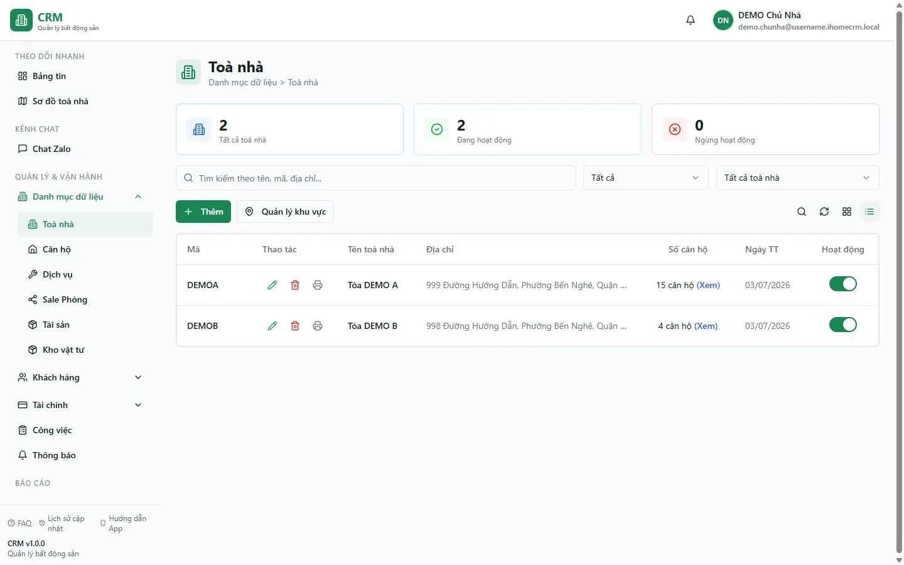

# Toà nhà

Màn **Toà nhà** là nơi bạn tra cứu và điều hành toàn bộ danh sách toà đang quản lý: tìm nhanh một toà, xem số căn hộ và tình trạng hoạt động, mở danh sách phòng của từng toà, sửa thông tin hoặc tạm ngừng một toà. Dùng màn này mỗi ngày khi cần nắm nhanh "đang có bao nhiêu toà, mỗi toà bao nhiêu phòng" hoặc khi cần đi tới đúng một toà để xử lý nghiệp vụ.

Đây là trang **quản lý/tra cứu**. Nếu bạn muốn tạo toà mới hoàn toàn, xem trang [Tạo khu vực & toà nhà](/01-bat-dau/tao-toa-nha/).

::: info Điều kiện tiên quyết
- Quyền **Toà nhà => Xem** (module `buildings`, action `view`) để mở màn danh sách.
- Cần quyền **Sửa** trên toà nếu muốn đổi thông tin hoặc bật/tắt hoạt động.
- Đã có ít nhất một toà nhà trong hệ thống (nếu chưa, hãy tạo trước theo trang [Tạo khu vực & toà nhà](/01-bat-dau/tao-toa-nha/)).
- Sổ quỹ mặc định (TT/TK) của toà chỉ hiển thị và chỉnh được khi bạn là **quản trị cấp cao** (super admin).
:::

## Hướng dẫn từng bước

**Bước 1**: Tại menu bên trái, ấn chọn **Toà nhà**. Màn hiện danh sách toà kèm 3 thẻ thống kê ở đầu trang (**Tổng** / **Đang hoạt động** / **Ngừng**), ô tìm kiếm và các nút thao tác.

**Bước 2**: Tại ô tìm kiếm phía trên danh sách, gõ tên, mã hoặc địa chỉ toà (ví dụ "DEMO"). Danh sách lọc ngay theo từ khoá; 3 thẻ thống kê cũng tính lại theo phạm vi đang lọc.

**Bước 3**: Muốn thu hẹp hơn, chọn **Trạng thái** (Đang hoạt động / Ngừng) hoặc chọn một toà cụ thể ở ô lọc toà. Ô lọc toà là danh sách phẳng A→Z, chọn đúng **1 toà** hoặc **Tất cả toà nhà**. Các bộ lọc được giữ lại khi bạn tải lại trang (F5).

**Bước 4**: Trên dòng của một toà, ấn nút xem số **căn hộ** để mở danh sách phòng của toà đó. Hệ thống chuyển bạn sang màn **Căn hộ / Phòng** đã lọc sẵn theo toà vừa chọn.

**Bước 5**: Muốn xem chi tiết một toà, ấn vào tên toà để mở trang chi tiết. Tại đây có các tab **Thông tin chung** (kèm 5 thẻ thống kê phòng: Tổng số căn hộ / Còn trống / Đã đặt cọc / Đang thuê / Bảo trì), **Căn hộ**, **Hợp đồng** và **Hoá đơn**.

**Bước 6**: Cần cập nhật thông tin, ấn nút **Sửa** trên dòng toà (hoặc trong trang chi tiết) để mở form. Chỉnh xong ấn **Lưu**. Form gồm các phần: Thông tin cơ bản (tên + mã, trạng thái), Địa chỉ (kèm toạ độ GPS cho geo-fence nghiệm thu), Dịch vụ toà, Cấu hình (sổ quỹ, mẫu hoá đơn, mẫu hợp đồng) và Hoa hồng môi giới.

::: tip Số phòng tự cập nhật
Cột số phòng (**total_rooms**) của mỗi toà do hệ thống **tự đếm** từ số phòng chưa xoá — bạn không cần và không nên sửa tay. Thêm/xoá phòng ở màn Căn hộ là con số này tự đổi theo.
:::

## Các tính năng khác trên màn hình

| Nút / Bộ lọc | Công dụng |
| --- | --- |
| Ô tìm kiếm | Lọc theo **tên / mã / địa chỉ** toà; áp ngay và cập nhật lại 3 thẻ thống kê. |
| Bộ lọc **Trạng thái** | Combobox gõ-để-tìm, lọc toà **Đang hoạt động** / **Ngừng**. Không ảnh hưởng số liệu 3 thẻ thống kê (3 thẻ luôn phân tích đủ theo phạm vi tìm kiếm). |
| Ô lọc toà nhà | Chọn đúng **1 toà** hoặc **Tất cả toà nhà** (danh sách phẳng A→Z, gõ để tìm). |
| Thẻ **Tổng / Đang hoạt động / Ngừng** | Thống kê nhanh theo phạm vi đang tìm kiếm + lọc toà. |
| Công tắc bật/tắt hoạt động | Chuyển nhanh một toà giữa **Đang hoạt động** và **Ngừng** ngay trên bảng, phản hồi tức thì. |
| **Quản lý khu vực** | Mở hộp thoại đặt tên khu vực và gán toà vào khu (nhóm để lọc/scope, một toà thuộc được nhiều khu). |
| Nút xem **căn hộ** | Điều hướng sang màn **Căn hộ / Phòng** đã lọc theo toà. |
| Nút **Sửa** | Mở form chỉnh thông tin toà (thông tin cơ bản, địa chỉ, dịch vụ, cấu hình, hoa hồng). |

## Tình huống & lỗi thường gặp

| Tình huống | Cách xử lý |
| --- | --- |
| Danh sách trống dù chắc chắn có toà | Thường do quyền: nếu bạn là nhân viên, chỉ thấy toà được gán phạm vi. Kiểm tra lại phân quyền hoặc nhờ quản lý gán toà. Cũng nên kiểm tra ô tìm kiếm/lọc còn dính từ khoá cũ (bộ lọc giữ qua F5). |
| Số phòng của toà hiển thị sai sau khi chuyển phòng sang toà khác | Con số tự cập nhật khi có thay đổi phòng kế tiếp của chính toà đó. Không sửa tay số phòng; thêm/xoá/chỉnh một phòng của toà để hệ thống đếm lại. |
| Không thấy ô **sổ quỹ mặc định** trong form | 2 sổ quỹ TT/TK chỉ hiển thị với tài khoản **quản trị cấp cao**. Nhân viên/quản lý thường sẽ không thấy phần này. |
| Bật/tắt hoạt động nhưng bảng "nhảy" lại trạng thái cũ | Thao tác phản hồi tức thì rồi ghi xuống máy chủ; nếu ghi lỗi (mất mạng/thiếu quyền) hệ thống tự trả về trạng thái cũ. Thử lại hoặc kiểm tra quyền **Sửa**. |
| Toà "Chung" không xuất hiện trong danh sách | Đúng thiết kế: toà ảo dùng cho chi phí không thuộc toà thật nào bị ẩn khỏi danh sách, chỉ dùng trong form thu/chi. |
| Nhập trùng **mã** toà mà vẫn lưu được | Cơ sở dữ liệu không có ràng buộc duy nhất cho mã toà; đây là nhãn tra cứu do bạn quản lý. Nên tự đặt mã không trùng để lọc và tạo công việc nhanh không chọn nhầm. |

## Thử trực tiếp trên sandbox

<SandboxTry account="demo.quanly" app-path="/buildings" app-label="Mở màn Toà nhà" fixtures="Tòa DEMO A, Tòa DEMO B" view-only>

Thực hành điều hướng màn danh sách toà:

1. Tại ô tìm kiếm, gõ **DEMO** và kiểm tra danh sách chỉ còn **Tòa DEMO A** và **Tòa DEMO B**; để ý 3 thẻ thống kê cập nhật lại theo kết quả lọc.
2. Trên dòng **Tòa DEMO A**, ấn nút xem số **căn hộ** để mở danh sách phòng của toà (ví dụ A101, A102...).
3. Quay lại, thử ấn vào tên **Tòa DEMO B** để xem trang chi tiết và 5 thẻ thống kê phòng.

Kết quả mong đợi: bạn lọc, mở căn hộ và mở chi tiết toà thành thạo, di chuyển tự tin giữa màn danh sách và các phòng của từng toà.

</SandboxTry>

## Quy trình liên quan

- [Tạo khu vực & toà nhà](/01-bat-dau/tao-toa-nha/) — tạo toà mới và gom nhóm theo khu vực.
- [Căn hộ / Phòng](/03-quan-ly-van-hanh/can-ho-phong/) — quản lý phòng của từng toà (mở từ nút xem căn hộ).
- [Dịch vụ](/03-quan-ly-van-hanh/dich-vu/) — bật/tắt và định giá dịch vụ áp cho từng toà.
- [Sơ đồ toà nhà](/02-theo-doi-nhanh/so-do-toa-nha/) — nhìn nhanh tình trạng phòng theo tầng của một toà.
