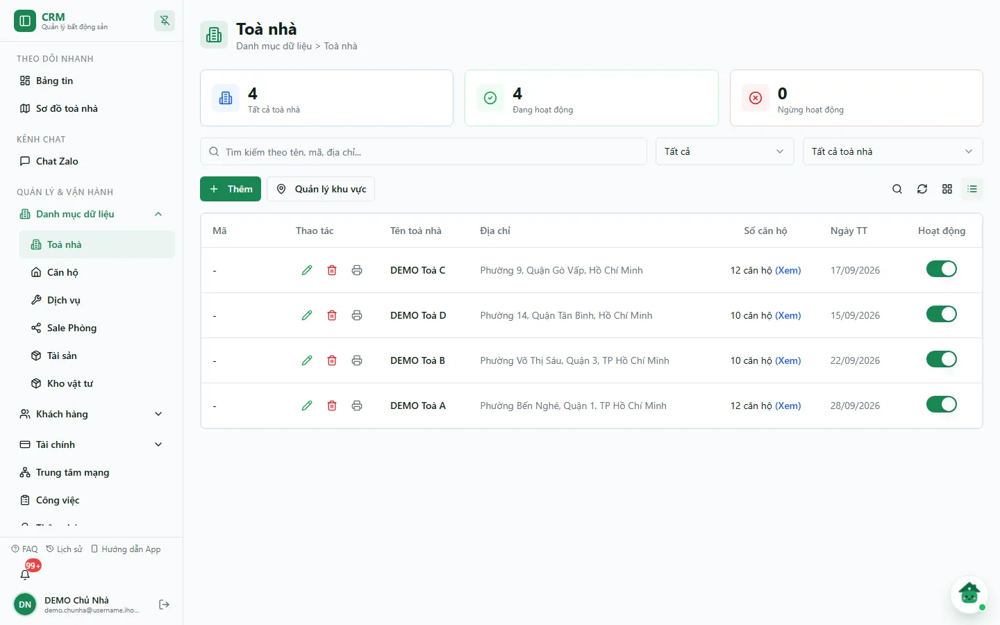
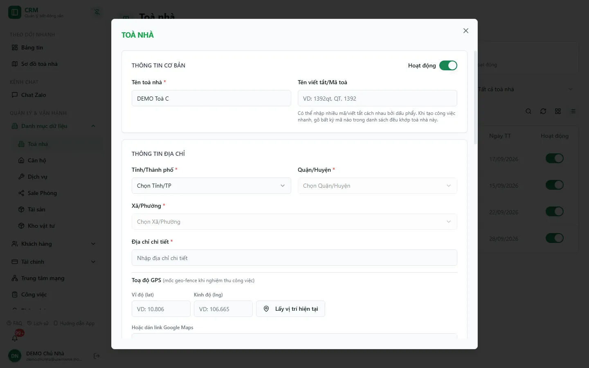

# Toà nhà

Màn **Toà nhà** là nơi bạn tra cứu và điều hành toàn bộ danh sách toà đang quản lý: tìm nhanh một toà, xem số căn hộ và tình trạng hoạt động, mở danh sách phòng của từng toà, sửa thông tin hoặc tạm ngừng một toà. Dùng màn này mỗi ngày khi cần nắm nhanh "đang có bao nhiêu toà, mỗi toà bao nhiêu phòng" hoặc khi cần đi tới đúng một toà để xử lý nghiệp vụ.

Đây là trang **quản lý/tra cứu**. Nếu bạn muốn tạo toà mới hoàn toàn, xem trang [Tạo khu vực & toà nhà](/01-bat-dau/tao-toa-nha/).

::: info Điều kiện tiên quyết
- Quyền **Toà nhà => Xem** (module `buildings`, action `view`) để mở màn danh sách.
- Cần quyền **Sửa** trên toà nếu muốn đổi thông tin hoặc bật/tắt hoạt động.
- Đã có ít nhất một toà nhà trong hệ thống (nếu chưa, hãy tạo trước theo trang [Tạo khu vực & toà nhà](/01-bat-dau/tao-toa-nha/)).
:::

## Hướng dẫn từng bước

**Bước 1**: Tại menu bên trái, ấn chọn **Danh mục dữ liệu** => **Toà nhà**. Màn hiện 3 thẻ thống kê ở đầu trang (**Tất cả toà nhà** / **Đang hoạt động** / **Ngừng hoạt động**), hàng bộ lọc, thanh công cụ (**Thêm**, **Quản lý khu vực**) và bảng toà với các cột **Mã**, **Thao tác**, **Tên toà nhà**, **Địa chỉ**, **Số căn hộ**, **Ngày TT** (ngày cập nhật gần nhất) và **Hoạt động**.

**Bước 2**: Tại ô **Tìm kiếm theo tên, mã, địa chỉ...**, gõ tên, mã hoặc địa chỉ toà (ví dụ "DEMO"). Danh sách lọc ngay theo từ khoá; 3 thẻ thống kê cũng tính lại theo phạm vi đang tìm.

**Bước 3**: Muốn thu hẹp hơn, chọn trạng thái ở ô thứ hai (**Tất cả** / **Đang hoạt động** / **Ngừng hoạt động**) hoặc chọn một toà cụ thể ở ô **Tất cả toà nhà**. Ô lọc toà là danh sách phẳng A→Z, gõ để tìm, chọn đúng **1 toà** hoặc **Tất cả toà nhà**.

**Bước 4**: Trên dòng của một toà, ở cột **Số căn hộ** ấn **(Xem)** để mở danh sách phòng của toà đó. Hệ thống chuyển bạn sang màn [Căn hộ](/03-quan-ly-van-hanh/can-ho-phong/) đã lọc sẵn theo toà vừa chọn.

**Bước 5**: Cần cập nhật thông tin, ấn biểu tượng bút chì (**Sửa**) ở cột **Thao tác**. Hộp thoại **TOÀ NHÀ** mở ra, gồm các phần:

- **Thông tin cơ bản**: công tắc **Hoạt động**, **Tên toà nhà** (bắt buộc), **Tên viết tắt/Mã toà** (nhập được nhiều mã cách nhau bởi dấu phẩy — khi tạo công việc nhanh, gõ mã nào cũng khớp toà này).
- **Thông tin địa chỉ**: **Tỉnh/Thành phố**, **Quận/Huyện**, **Xã/Phường**, **Địa chỉ chi tiết** và **Toạ độ GPS** (mốc geo-fence khi nghiệm thu công việc) — nhập vĩ độ/kinh độ, ấn **Lấy vị trí hiện tại** hoặc dán link Google Maps.
- **Dịch vụ toà nhà**: dịch vụ và đơn giá áp cho toà.
- **Cấu hình**: công tắc **Có thang máy** (bật để báo cáo Phân bổ lợi nhuận cảnh báo khi thiếu phiếu bảo trì thang máy), **Mẫu in hóa đơn**, **Mẫu hợp đồng**.
- **Hoa hồng môi giới**: các bậc hoa hồng của toà.
- **Chủ sở hữu pháp lý (bên cho thuê)**: họ tên, năm sinh, CCCD/CMND, ngày cấp, nơi cấp, địa chỉ thường trú của người đứng tên sở hữu — dùng làm **bên A** trong hợp đồng thuê.
- **Giấy tờ chứng minh chỗ ở hợp pháp** (chỉ hiện khi sửa toà đã có): tải ảnh giấy tờ một lần, dùng đính kèm cho hồ sơ đăng ký tạm trú của mọi khách trong toà.

Chỉnh xong ấn **Lưu**; muốn bỏ, ấn **Huỷ bỏ**.

**Bước 6**: Muốn xem tổng quan một toà, mở trang **Chi tiết Tòa nhà**: từ trang chi tiết một căn hộ, ấn vào tên toà ở khối **Thông tin tòa nhà**. Trang có nút **Chỉnh sửa** và các tab **Thông tin chung** (kèm 5 thẻ: Tổng số căn hộ / Còn trống / Đã đặt cọc / Đang thuê / Bảo trì), **Căn hộ (n)**, **Hợp đồng (n)** và **Hóa đơn (n)**.

::: tip Số phòng tự cập nhật
Số căn hộ của mỗi toà do hệ thống **tự đếm** từ các phòng chưa xoá — bạn không cần và không nên sửa tay. Thêm/xoá phòng ở màn Căn hộ là con số này tự đổi theo.
:::

## Các tính năng khác trên màn hình

| Nút / Bộ lọc | Công dụng |
| --- | --- |
| Ô tìm kiếm | Lọc theo **tên / mã / địa chỉ** toà; áp ngay và cập nhật lại 3 thẻ thống kê. |
| Ô trạng thái (**Tất cả** / **Đang hoạt động** / **Ngừng hoạt động**) | Lọc bảng theo trạng thái. Không ảnh hưởng 3 thẻ thống kê (3 thẻ luôn tính đủ theo phạm vi tìm kiếm + toà). |
| Ô **Tất cả toà nhà** | Chọn đúng **1 toà** hoặc tất cả (danh sách phẳng A→Z, gõ để tìm). |
| Thẻ **Tất cả toà nhà / Đang hoạt động / Ngừng hoạt động** | Thống kê nhanh theo phạm vi đang tìm kiếm + lọc toà. |
| **Thêm** | Mở hộp thoại **TOÀ NHÀ** trống để tạo toà mới. |
| **Quản lý khu vực** | Đặt tên nhóm toà và gán toà vào khu — dùng để chọn nhanh cả nhóm ở các ô lọc (thay cho trang `/areas` cũ, nay chuyển hướng về `/buildings`). |
| Biểu tượng **Làm mới** / **Dạng lưới** / **Dạng danh sách** | Tải lại danh sách và đổi kiểu hiển thị. |
| Cột **Thao tác**: **Sửa** / **Xoá** / **In** | Mở hộp thoại sửa, mở hộp xác nhận xoá toà, in màn hình hiện tại. |
| **(Xem)** ở cột Số căn hộ | Điều hướng sang màn **Căn hộ** đã lọc theo toà. |
| Công tắc **Hoạt động** | Chuyển nhanh một toà giữa **Đang hoạt động** và **Ngừng hoạt động** ngay trên bảng. |

## Tình huống & lỗi thường gặp

| Tình huống | Cách xử lý |
| --- | --- |
| Danh sách trống dù chắc chắn có toà | Thường do quyền: nếu bạn là nhân viên, chỉ thấy toà được gán phạm vi. Kiểm tra lại phân quyền hoặc nhờ quản lý gán toà. Cũng nên kiểm tra ô tìm kiếm/lọc còn dính từ khoá cũ. |
| Không thấy ô **sổ quỹ mặc định** trong form | Từ 25/09/2026 sổ nhận tiền (chuyển khoản / thanh toán) của toà cài ở **Tài chính → Sổ quỹ → Sổ nhận tiền**, không còn trong form toà. Chỉ **chủ công ty** hoặc **quản trị cấp cao** thấy màn này. |
| Nút **Lưu** bị khoá, form báo "Chưa tải đủ dịch vụ của tòa" | Danh sách dịch vụ chưa tải xong. Ấn **Tải lại dịch vụ** rồi lưu lại. |
| Form báo "Tòa nhà đã lưu với ID …" sau khi lưu lỗi giữa chừng | Phần thông tin toà đã ghi, phần chủ sở hữu/dịch vụ chưa xong. Ấn **Đóng để đối chiếu tòa đã lưu**, mở lại đúng toà đó để hoàn tất, đừng tạo toà mới trùng. |
| Bật/tắt hoạt động nhưng bảng "nhảy" lại trạng thái cũ | Thao tác phản hồi tức thì rồi ghi xuống máy chủ; nếu ghi lỗi (mất mạng/thiếu quyền) hệ thống tự trả về trạng thái cũ. Thử lại hoặc kiểm tra quyền **Sửa**. |
| Toà ảo "Kho Văn Phòng Chung" không xuất hiện trong danh sách | Đúng thiết kế: toà ảo gom thu/chi không thuộc toà thật nào bị ẩn khỏi màn quản lý toà, chỉ chọn được ở ô lọc thu chi và báo cáo tài chính. |
| Nhập trùng **mã** toà mà vẫn lưu được | Mã toà không bắt buộc duy nhất; đây là nhãn tra cứu do bạn quản lý. Nên tự đặt mã không trùng để lọc và tạo công việc nhanh không chọn nhầm. |

## Thử trực tiếp trên sandbox

<SandboxTry account="demo.chunha" app-path="/buildings" app-label="Mở màn Toà nhà" fixtures="Snapshot 07/10/2026: 4 toà DEMO Toà A/B/C/D, đều đang hoạt động, 10–12 căn hộ mỗi toà." view-only>

Thực hành điều hướng màn danh sách toà:

1. Tại ô tìm kiếm, gõ **Toà A** và kiểm tra danh sách chỉ còn **DEMO Toà A**; để ý 3 thẻ thống kê cập nhật lại theo kết quả lọc.
2. Trên dòng **DEMO Toà A**, ấn **(Xem)** ở cột Số căn hộ để mở danh sách phòng của toà (A-01, A-02...).
3. Quay lại, ấn biểu tượng bút chì của một toà để xem các phần của hộp thoại **TOÀ NHÀ**, rồi ấn **Huỷ bỏ** — không bấm **Lưu**.

Kết quả mong đợi: bạn lọc, mở căn hộ và xem form toà thành thạo, không có dữ liệu DEMO nào bị sửa.

</SandboxTry>

## Quy trình liên quan

- [Tạo khu vực & toà nhà](/01-bat-dau/tao-toa-nha/) — tạo toà mới và gom nhóm theo khu vực.
- [Căn hộ / Phòng](/03-quan-ly-van-hanh/can-ho-phong/) — quản lý phòng của từng toà (mở từ nút **(Xem)**).
- [Dịch vụ](/03-quan-ly-van-hanh/dich-vu/) — bật/tắt và định giá dịch vụ áp cho từng toà.
- [Sơ đồ toà nhà](/02-theo-doi-nhanh/so-do-toa-nha/) — nhìn nhanh tình trạng phòng theo tầng của một toà.
- [Đăng ký tạm trú trên Cổng DVC](/03-quan-ly-van-hanh/dang-ky-tam-tru-dvc/) — dùng giấy tờ chỗ ở hợp pháp đã tải ở form toà.
