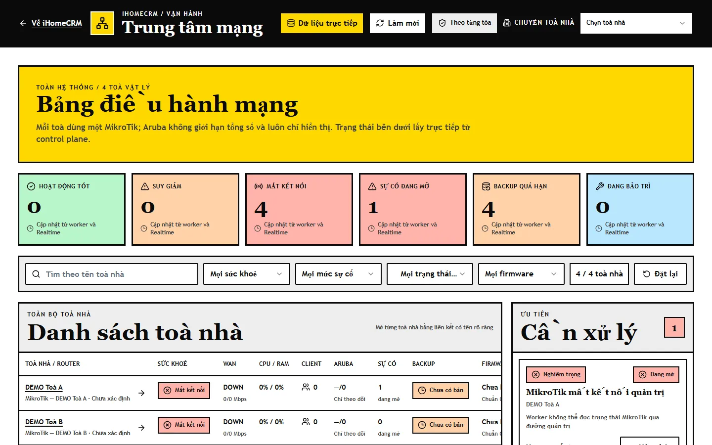
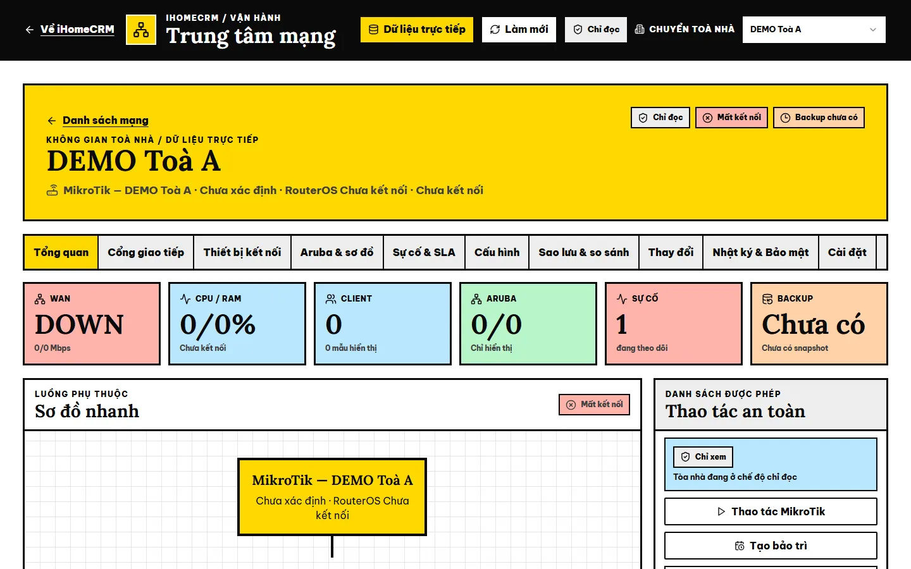
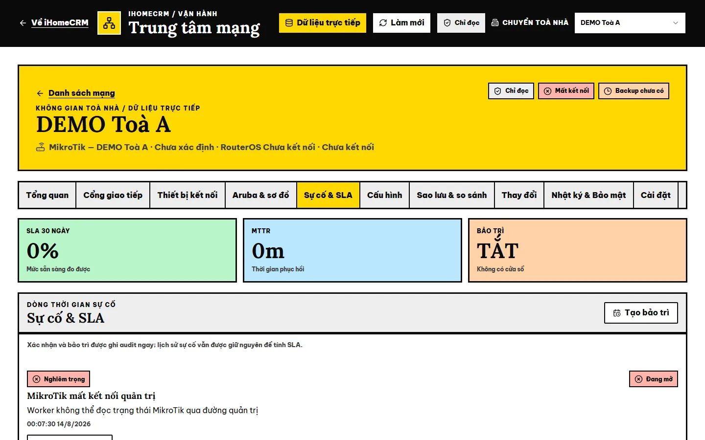

# Trung tâm mạng

**Trung tâm mạng** là bảng điều hành mạng Internet của các toà: mỗi toà dùng một router **MikroTik**, các điểm phát Wi-Fi **Aruba** (và H196A) chỉ được theo dõi. Màn hình cho biết toà nào đang mất kết nối, tải CPU/RAM, số thiết bị đang kết nối, sự cố đang mở, tình trạng sao lưu cấu hình, và — với người được cấp quyền thực thi — cho chạy bốn thao tác đã được kiểm duyệt trên router thật. Đây là bề mặt **quản trị hạ tầng**, thường chỉ chủ công ty hoặc người được giao mới thấy.

::: info Điều kiện tiên quyết
- Quyền **Xem Trung tâm mạng** (`network_center.view`) để thấy mục **Trung tâm mạng** trên menu và mở `/network-center`. Thao tác ghi cần thêm **Thực thi thao tác mạng** (`network_center.execute`, quyền nhạy cảm).
- Toà phải được nối vào hệ thống giám sát (router đã đăng ký, có worker hỏi thăm định kỳ). Toà chưa nối sẽ hiện **Mất kết nối** / **Chưa có snapshot**.
- Mỗi toà còn có chế độ triển khai riêng: **Đã tắt**, **Chỉ đọc** hoặc **Được thực thi**. Có quyền `execute` nhưng toà ở chế độ **Chỉ đọc** thì vẫn không thao tác được.
:::

::: danger Thao tác chạm thiết bị thật
Trên bản đang chạy, các nút **Kiểm tra và thực thi**, **Tạo bảo trì**, **Chụp cấu hình**, **Lưu cài đặt**, **Xác nhận** sự cố đều gửi yêu cầu thật (vào hàng đợi worker hoặc ghi nhật ký). Chỉ bấm khi bạn chịu trách nhiệm vận hành toà đó và đã ghi rõ lý do.
:::

## Hướng dẫn từng bước

**Bước 1**: Tại menu bên trái, mục **QUẢN LÝ & VẬN HÀNH**, ấn chọn **Trung tâm mạng** (trên điện thoại: ô **Trung tâm mạng** ở màn hình chính). Trang mở **Bảng điều hành mạng** toàn hệ thống: sáu thẻ đếm **Hoạt động tốt**, **Suy giảm**, **Mất kết nối**, **Sự cố đang mở**, **Backup quá hạn**, **Đang bảo trì**; thanh lọc; bảng **Danh sách toà nhà** và cột **Ưu tiên — Cần xử lý** bên phải.

Thanh trên cùng có nhãn **Dữ liệu trực tiếp**, nút **Làm mới** (nạp lại số liệu ngay — router chỉ được hỏi thăm định kỳ), nhãn chế độ (**Theo từng tòa**, **Chỉ đọc**…) và ô **Chuyển toà nhà**.

**Bước 2**: Lọc danh sách bằng ô **Tìm theo tên toà nhà** và các ô **Mọi sức khoẻ** (Hoạt động tốt / Suy giảm / Mất kết nối), **Mọi mức sự cố** (Nghiêm trọng / Trung bình / Thấp…), **Mọi trạng thái backup** (Backup mới / Backup cũ), **Mọi firmware** (Sai lệch firmware); **Đặt lại** để bỏ lọc. Bảng ghi cho từng toà: **Sức khoẻ**, **WAN**, **CPU / RAM**, **Client**, **Aruba**, **Sự cố**, **Backup**, **Firmware**.

**Bước 3**: Ấn tên một toà (ví dụ **DEMO Toà A**) để mở **không gian toà nhà**. Đầu trang ghi tên toà, router, phiên bản RouterOS và các nhãn trạng thái (chế độ, kết nối, backup); liên kết **Danh sách mạng** quay về bảng toàn hệ thống. Tab **Tổng quan** có các ô **WAN**, **CPU / RAM**, **Client**, **Aruba**, **Sự cố**, **Backup**, khung **Sơ đồ nhanh**, khung **Thao tác an toàn** và **Hoạt động gần đây**.

**Bước 4**: Chuyển giữa các tab theo việc cần xem:

| Tab | Xem gì |
|---|---|
| **Tổng quan** | Chỉ số chính, sơ đồ nhanh, thao tác an toàn, hoạt động gần đây. |
| **Cổng giao tiếp** | Trạng thái và lưu lượng từng cổng MikroTik; cổng WAN/uplink bị khoá khỏi thao tác ghi. |
| **Thiết bị kết nối** | Mẫu thiết bị đang kết nối (tối đa 100 thiết bị mới nhất), kiểu thiết bị, gợi ý khu, cảnh báo MAC ngẫu nhiên. |
| **Aruba & sơ đồ** | MikroTik → uplink → AP; Aruba và H196A **chỉ theo dõi**, không có thao tác cấu hình/khởi động lại. |
| **Sự cố & SLA** | **SLA 30 ngày**, **MTTR** (thời gian phục hồi), trạng thái **Bảo trì**, dòng thời gian sự cố. |
| **Cấu hình** | Cấu hình an toàn mong muốn và danh mục thao tác được phép. |
| **Sao lưu & so sánh** | Các bản cấu hình đã làm sạch (lịch tự động / thủ công / trước thao tác), nút **Chụp cấu hình**. |
| **Thay đổi** | Hàng đợi thao tác và kết quả (Đang chờ, Đang chạy, Thành công, Thất bại, Đã hoàn tác…). |
| **Nhật ký & Bảo mật** | Nhật ký thao tác; xác nhận rằng thông tin đăng nhập không tải vào giao diện, CLI tuỳ ý và ghi Aruba bị khoá. |
| **Cài đặt** | Chính sách theo toà: **Chu kỳ kiểm tra (giây)** (30–3600), **Giờ sao lưu**, **Ngưỡng cảnh báo**, gom cảnh báo Aruba, tạm dừng thay đổi. |

**Bước 5** *(chỉ người có `network_center.execute` và toà ở chế độ được thực thi)*: Trong khung **Thao tác an toàn**, ấn **Thao tác MikroTik**, chọn **Loại thao tác**, xem phần xem trước (**Mục tiêu**, **Rủi ro**, **Trước / Sau**, **Sao lưu**, **Kiểm tra sau**), nhập **Lý do thao tác** rồi ấn **Kiểm tra và thực thi**. Yêu cầu được kiểm tra, đưa vào hàng đợi và thực thi trên router; theo dõi kết quả ở tab **Thay đổi**. Bốn thao tác được phép:

| Thao tác | Rủi ro | Ghi chú |
|---|---|---|
| Làm mới bộ nhớ đệm DNS | Thấp | Không thay DNS upstream. |
| Gia hạn DHCP uplink | Trung bình | Không đổi tuyến mặc định. |
| Khởi động lại cổng truy cập | Trung bình | Chỉ cổng LAN trong danh sách được phép; chọn **Cổng LAN** và **Thời gian ngắt (giây)**. |
| Khởi động lại MikroTik | Cao | Sao lưu và kiểm tra đầu vào trước khi chạy. |

Nút **Tạo bảo trì** mở **Tạo cửa sổ bảo trì** (**Thời lượng (phút)**, **Lý do**) để đánh dấu toà đang bảo trì trong lúc sửa chữa; huỷ ở tab **Sự cố & SLA** bằng **Huỷ bảo trì**.

## Các tính năng khác trên màn hình

| Nút / Khu | Công dụng |
|---|---|
| **Làm mới** | Nạp lại toàn bộ số liệu ngay; số liệu cũng tự cập nhật theo thời gian thực. |
| **Chuyển toà nhà** | Nhảy sang toà khác, giữ nguyên tab đang xem. |
| Cột **Ưu tiên — Cần xử lý** | Các sự cố đang mở toàn hệ thống; nút **Xác nhận** ghi nhận đã tiếp nhận sự cố (ghi nhật ký, không xoá lịch sử SLA). |
| **Về iHomeCRM** | Quay về trang chủ CRM. |

## Tình huống & lỗi thường gặp

| Tình huống | Cách xử lý |
|---|---|
| Không thấy mục Trung tâm mạng trên menu | Tài khoản thiếu `network_center.view`; nhờ chủ công ty cấp quyền. |
| Nút thao tác bị khoá, ghi *Tài khoản chỉ có quyền xem. Cần network_center.execute để thực thi thao tác.* | Bạn chỉ có quyền xem; cần quyền thực thi. |
| Khung ghi *Tòa nhà đang ở chế độ chỉ đọc* / *Network Center đang tắt cho tòa nhà này* | Toà chưa được bật thực thi; đây là cài đặt triển khai theo toà, không phải lỗi quyền cá nhân. |
| Toà hiện **Mất kết nối**, WAN **DOWN**, CPU/RAM 0% | Worker không đọc được router qua đường quản trị (router tắt, mất mạng, đường hầm quản trị đứt). Kiểm tra router và đường truyền tại toà. |
| Số liệu chưa đổi sau khi sửa ở toà | Router được hỏi thăm theo chu kỳ; bấm **Làm mới**. |
| Thao tác báo *Chưa xác nhận được kết quả…* | Không bấm lặp. Xem tab **Thay đổi** để biết yêu cầu đã chạy chưa; nút **Thử gửi lại an toàn** chỉ hiện khi gửi lại không gây trùng. |

## Thử trực tiếp trên sandbox

<SandboxTry account="demo.chunha" app-path="/network-center" app-label="Mở Trung tâm mạng" view-only>

1. Xem sáu thẻ đếm và bảng **Danh sách toà nhà** của 4 toà DEMO (router DEMO không nối thật nên đều **Mất kết nối**).
2. Ấn **DEMO Toà A**, chuyển qua các tab **Sự cố & SLA**, **Sao lưu & so sánh**, **Nhật ký & Bảo mật**.
3. Không bấm **Thao tác MikroTik**, **Tạo bảo trì**, **Chụp cấu hình**, **Lưu cài đặt** hay **Xác nhận**.

</SandboxTry>

## Quy trình liên quan

- [Bảng tra quyền nhanh](/07-thong-tin-khac/tra-quyen-nhanh/) — quyền `network_center.*`.
- [Phân quyền theo trang](/05-cai-dat/phan-quyen/)
- [Toà nhà](/03-quan-ly-van-hanh/toa-nha/)
