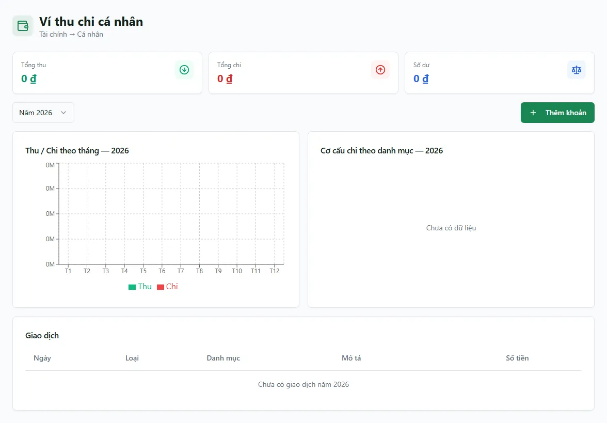

# Ví thu chi cá nhân

Màn **Ví cá nhân** là cuốn sổ tay thu chi **riêng của chính bạn** — nơi bạn tự ghi lại tiền vào/ra của cá nhân (thưởng, ăn uống, xăng xe, tiền ứng công ty…). Đây là công cụ ghi chép cá nhân, **tách bạch hoàn toàn** với sổ quỹ, hoá đơn và các báo cáo của công ty: mỗi giao dịch bạn nhập ở đây **chỉ mình bạn thấy**, **không** cộng vào tồn quỹ, **không** vào Kết quả kinh doanh và **không** hiện trong bất kỳ báo cáo chung nào. Trang này giúp bạn xem lại các khoản đã ghi, thống kê thu/chi theo năm, và thêm/sửa/xoá khoản cá nhân.

::: info Điều kiện tiên quyết
- Quyền **Ví cá nhân => Xem** (module `personal_finance`, action `view`) để mở màn.
- Không cần sổ quỹ hay hạng mục thu chi của công ty — ví cá nhân là dữ liệu **của riêng từng người**, mỗi tài khoản có ví riêng và không thấy ví của người khác.
- Nếu bạn là **cổ đông**, đầu trang có thêm dải "Từ công ty" tóm tắt phần lợi nhuận bạn được chia — xem [Chia lợi nhuận cổ đông](/03-quan-ly-van-hanh/chia-loi-nhuan/).
:::

::: danger Đừng ghi tiền của công ty vào ví cá nhân
Ví cá nhân **không** phải sổ quỹ công ty. Khoản bạn nhập ở đây **không** làm thay đổi số dư sổ quỹ, **không** vào hoá đơn, bàn giao hay báo cáo lợi nhuận. Vì vậy **tuyệt đối không** dùng màn này để ghi tiền phòng đã thu hay chi phí vận hành của công ty — những khoản đó phải ghi bằng phiếu thu/chi ở màn [Thu chi](/03-quan-ly-van-hanh/thu-chi/). Ghi nhầm vào đây thì tiền công ty sẽ **biến mất khỏi mọi sổ sách chung**.
:::

## Hướng dẫn từng bước

**Bước 1**: Vào menu **Tài chính => Ví cá nhân**. Màn mở ra gồm **3 thẻ thống kê** (Tổng thu / Tổng chi / Số dư), một ô chọn **Năm**, nút **Thêm khoản**, hai biểu đồ (Thu/Chi theo tháng và Cơ cấu chi theo danh mục) và bảng **Giao dịch** liệt kê từng khoản. Trong dữ liệu demo bạn thấy sẵn 3 khoản: một khoản **Thu — thưởng 2.000.000đ**, một khoản **Chi — ăn trưa 350.000đ** và một khoản **Chi — xăng 1.200.000đ**.

**Bước 2**: Đọc 3 thẻ và bảng **Giao dịch**. Ba thẻ **Tổng thu**, **Tổng chi**, **Số dư** cộng gộp **toàn bộ** giao dịch của bạn (mọi năm) — **Số dư** = Tổng thu − Tổng chi. Bảng **Giao dịch** ở dưới mỗi dòng có: **Ngày**, **Loại** (Thu tô xanh / Chi tô đỏ), **Danh mục**, **Mô tả** và **Số tiền** (Thu có dấu **+**, Chi có dấu **−**). Bảng và hai biểu đồ chỉ hiển thị các khoản của **năm đang chọn** ở ô Năm.

**Bước 3**: Chọn năm để lọc. Bấm ô **Năm** (ví dụ **Năm 2026**) để đổi năm — bảng **Giao dịch**, biểu đồ **Thu / Chi theo tháng** và **Cơ cấu chi theo danh mục** cập nhật theo năm bạn chọn. Lựa chọn năm được **giữ lại khi bạn tải lại trang (F5)**.

**Bước 4**: Thêm một khoản cá nhân. Bấm **Thêm khoản** để mở hộp thoại **Thêm khoản**, rồi điền:
- **Thu** hoặc **Chi**: bấm chọn một trong hai ô ở đầu hộp thoại (mặc định là **Chi**).
- **Số tiền** (bắt buộc): gõ số tiền của khoản này. Phải **lớn hơn 0** thì nút **Lưu** mới bật.
- **Ngày** (bắt buộc): ngày phát sinh (mặc định là hôm nay).
- **Danh mục**: gõ tự do hoặc chọn gợi ý có sẵn (**Ăn uống**, **Nhà cửa**, **Cá nhân**, **Ứng công ty**, **Khác**). Danh mục dùng để nhóm biểu đồ **Cơ cấu chi theo danh mục** — để trống thì biểu đồ gom vào nhóm "Khác".
- **Mô tả**: ghi chú thêm (không bắt buộc).

Bấm **Lưu** để ghi khoản vào ví của bạn.

**Bước 5**: Sửa hoặc xoá một khoản. Ở mỗi dòng trong bảng **Giao dịch** có hai nút:
- Nút **bút chì** mở hộp thoại **Sửa khoản** với các trường giống lúc thêm — chỉnh xong bấm **Lưu**.
- Nút **thùng rác** (màu đỏ) mở hộp xác nhận **Xoá khoản này?** — bấm **Xoá** để bỏ khoản khỏi ví.

::: warning Xoá khoản khó lấy lại
Khi bấm **Xoá**, khoản bị **ẩn khỏi ví cá nhân của bạn** và không còn hiện trong danh sách, thống kê hay biểu đồ. Màn này **không có nút khôi phục** khoản đã xoá, nên hãy chắc chắn trước khi xoá — nếu chỉ nhập sai vài trường, hãy dùng nút **bút chì** để **Sửa** thay vì xoá đi ghi lại.
:::

## Các tính năng khác trên màn hình

| Nút / Vùng | Công dụng |
| --- | --- |
| Thẻ **Tổng thu** / **Tổng chi** / **Số dư** | Cộng gộp **toàn bộ** giao dịch của bạn (mọi năm); **Số dư** = Tổng thu − Tổng chi, tô xanh khi ≥ 0, tô đỏ khi âm. |
| Ô **Năm** | Lọc bảng và hai biểu đồ theo năm; lựa chọn được giữ qua F5. |
| Biểu đồ **Thu / Chi theo tháng** | Cột xanh (Thu) và cột đỏ (Chi) theo 12 tháng của năm đang chọn. |
| Biểu đồ **Cơ cấu chi theo danh mục** | Tỉ trọng các khoản **Chi** theo danh mục trong năm; chưa có khoản chi nào thì hiện "Chưa có dữ liệu". |
| **Thêm khoản** | Mở hộp thoại nhập một khoản Thu/Chi mới. |
| Nút **bút chì** trên mỗi dòng | Sửa lại khoản đó. |
| Nút **thùng rác** trên mỗi dòng | Xoá (ẩn) khoản đó khỏi ví. |
| Dải **Từ công ty** (chỉ cổ đông) | Tóm tắt **Được chia** / **Đã ứng** / **Còn lại được nhận** từ lợi nhuận cổ đông — chỉ hiện nếu tài khoản của bạn là cổ đông. |

## Tình huống & lỗi thường gặp

| Tình huống | Cách xử lý |
| --- | --- |
| Nút **Lưu** trong hộp thoại bị mờ, không bấm được | **Số tiền** phải **lớn hơn 0** và phải có **Ngày**. Nhập đủ hai trường bắt buộc này. |
| Bảng báo **Chưa có giao dịch năm …** dù có dữ liệu | Bạn đang xem **năm khác**. Đổi ô **Năm** về đúng năm của khoản cần xem. |
| Biểu đồ **Cơ cấu chi theo danh mục** trống ("Chưa có dữ liệu") | Năm đó chưa có khoản **Chi** nào (biểu đồ chỉ vẽ phần chi). Thêm khoản chi hoặc đổi năm. |
| Số tiền ở khoản cá nhân **không** thấy trong sổ quỹ / báo cáo công ty | Đúng thiết kế: ví cá nhân **tách bạch hoàn toàn**, không cộng vào tồn quỹ, KQKD hay báo cáo chung. |
| Đồng nghiệp **không thấy** khoản bạn ghi | Đúng: ví cá nhân là **của riêng từng người** — mỗi tài khoản chỉ thấy ví của chính mình. |
| Lỡ **xoá** một khoản | Màn không có nút khôi phục — bạn cần **thêm lại** khoản đó thủ công. Lần sau nên **Sửa** thay vì xoá. |
| Không thấy dải **Từ công ty** ở đầu trang | Dải này chỉ hiện khi tài khoản của bạn là **cổ đông**; người không phải cổ đông sẽ không thấy. |

## Thử trực tiếp trên sandbox

<SandboxTry account="demo.chunha" app-path="/finance/personal-wallet" app-label="Mở màn Ví cá nhân" fixtures="3 giao dịch: thưởng 2.000.000đ, ăn trưa 350.000đ, xăng 1.200.000đ">

Thực hành xem ví và thêm một khoản chi cá nhân:

1. Xem bảng **Giao dịch**: đã có sẵn **Thu — thưởng 2.000.000đ**, **Chi — ăn trưa 350.000đ** và **Chi — xăng 1.200.000đ**. Đối chiếu với 3 thẻ (Tổng thu **2.000.000đ**, Tổng chi **1.550.000đ**, Số dư **450.000đ**).
2. Bấm **Thêm khoản**. Giữ nút **Chi**, nhập **Số tiền** = **1.000.000**, chọn **Ngày** hôm nay, **Danh mục** = **Cá nhân**, **Mô tả** = "Mua sắm". Bấm **Lưu**.
3. Để ý khoản mới xuất hiện trong bảng, **Tổng chi** tăng và **Số dư** giảm đi **1.000.000đ**.
4. Mở lại màn [Sổ quỹ](/03-quan-ly-van-hanh/so-quy/) hoặc [Thu chi](/03-quan-ly-van-hanh/thu-chi/) của công ty và kiểm tra: khoản vừa thêm **không** hề xuất hiện ở đó.
5. Xong bấm **Reset** để trả sandbox về trạng thái ban đầu.

Kết quả mong đợi: bạn hiểu rằng ví cá nhân là sổ tay thu chi **của riêng bạn**, hoàn toàn **tách bạch** với sổ quỹ và báo cáo của công ty — ghi ở đây không đụng tới tiền chung.

</SandboxTry>

## Quy trình liên quan

- [Thu chi](/03-quan-ly-van-hanh/thu-chi/) — ghi tiền vào/ra **của công ty** bằng phiếu thu/chi gắn sổ quỹ (khác hẳn ví cá nhân).
- [Sổ quỹ](/03-quan-ly-van-hanh/so-quy/) — xem tồn quỹ các sổ tiền chung của công ty.
- [Chia lợi nhuận cổ đông](/03-quan-ly-van-hanh/chia-loi-nhuan/) — nguồn của dải "Từ công ty" (phần lợi nhuận bạn được chia và đã ứng).
- [Lương của tôi](/03-quan-ly-van-hanh/luong-cua-toi/) — xem bảng lương cá nhân của bạn từ công việc/hợp đồng thực tế.
