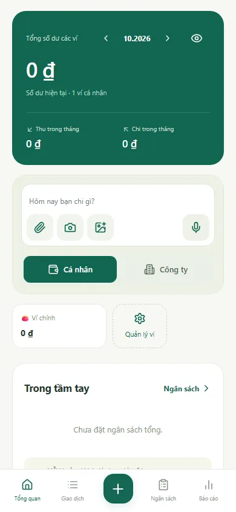
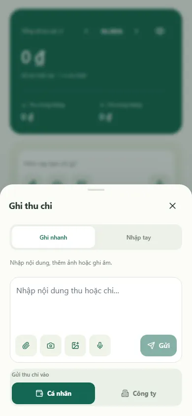
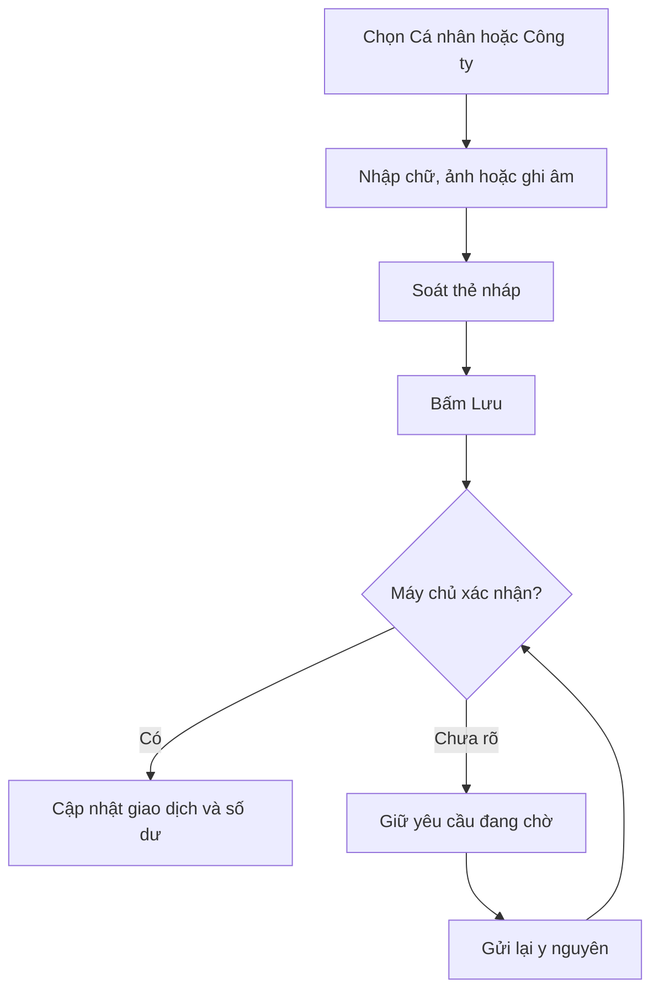
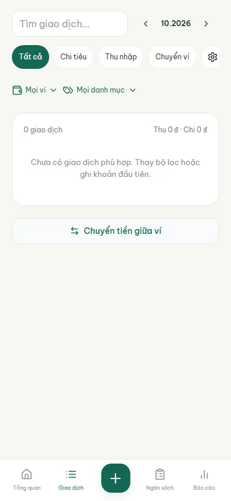
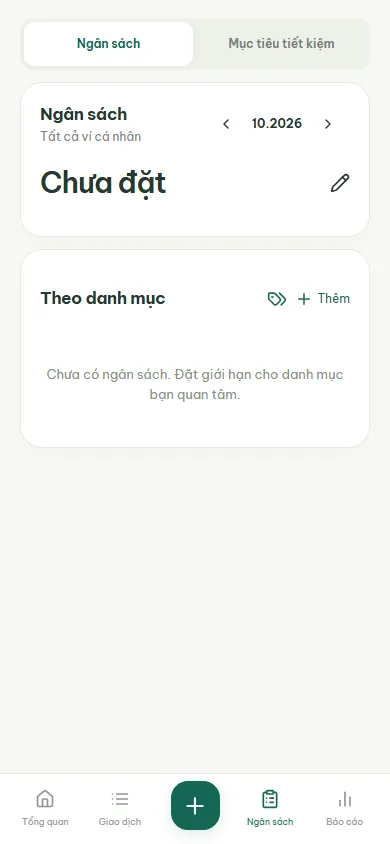

# Ví thu chi cá nhân

Mở **Cá nhân → Ví cá nhân** trên màn hình chính điện thoại, hoặc **Tài chính → Ví cá nhân** ở menu máy tính. Đường dẫn trong ứng dụng là `/finance/personal-wallet`.

Mỗi tài khoản chỉ xem ví của chính mình, kể cả khi chuyển công ty đang làm việc. Cần quyền **Ví cá nhân → Xem** để mở; các nút thêm, sửa và xóa xuất hiện theo quyền tương ứng.

## Bốn màn hình

| Màn | Nội dung |
| --- | --- |
| **Tổng quan** | Tổng số dư các ví, thu/chi trong tháng, ô ghi nhanh **Hôm nay bạn chi gì?**, các ví, ô **Quản lý ví** và khung **Trong tầm tay** (ngân sách tháng). Chạm mắt để ẩn/hiện số tiền. |
| **Giao dịch** | Tìm giao dịch, lọc **Tất cả / Chi tiêu / Thu nhập / Chuyển ví**, lọc **Mọi ví** và **Mọi danh mục**; nút bánh răng **Cài đặt ví và danh mục**; sửa/xóa khoản; nút **Chuyển tiền giữa ví**. |
| **Ngân sách** | Hai thẻ con **Ngân sách** (hạn mức tổng tháng và theo danh mục) và **Mục tiêu tiết kiệm**. |
| **Báo cáo** | Tổng thu/chi, tỷ trọng danh mục, xu hướng sáu tháng; chạm danh mục để xem giao dịch. |

Thanh dưới cùng có năm nút: **Tổng quan**, **Giao dịch**, nút **+** (**Ghi thu chi**), **Ngân sách**, **Báo cáo**.

Tháng hiển thị ngắn như **9.2026**. Đổi tháng để xem thu/chi và báo cáo của tháng khác. **Tổng số dư các ví luôn là số dư hiện tại**, gồm số dư ban đầu và toàn bộ lịch sử; không chỉ là Thu trừ Chi trong tháng đang xem.

## Ghi thu hoặc chi

1. Tại Tổng quan, chọn **Cá nhân** ở dưới ô nhập. Nút **Công ty** chỉ xuất hiện khi bạn có quyền lập phiếu công ty.
2. Chạm ô **Hôm nay bạn chi gì?** hoặc một trong bốn nút: **Ảnh kèm nội dung**, **Chụp bill**, **Chọn ảnh**, **Ghi âm**. Hộp **Ghi thu chi** mở ra ở tab **Ghi nhanh**. Với **Ảnh kèm nội dung**, chọn ảnh xong máy bắt đầu ghi âm ngay để bạn nói thêm rồi gửi chung.
3. Khi ghi âm, bấm **Xong** để tự gửi vào xử lý; bấm huỷ để giữ phần chữ/ảnh trước đó. Chưa có khoản nào vào sổ ở bước này.
4. Soát thẻ: Thu hay Chi, số tiền, ngày, ví và danh mục. Bấm **Lưu vào ví** khi đúng. Một câu có cả nhận lương và chi ăn uống có thể tạo các thẻ riêng đúng loại.

Muốn điền tay, bấm nút **+** (**Ghi thu chi**) rồi chọn tab **Nhập tay**. Số tiền mới phải là số nguyên VND dương; số dư ban đầu của ví có thể bằng 0 hoặc âm. Thẻ nháp chưa lưu từ [Báo chi nhanh](/03-quan-ly-van-hanh/bao-chi-nhanh/) trên cùng máy cũng hiện lại ở đây với dòng **Các thẻ chưa lưu từ lần trước.**

```mermaid
flowchart TD
  A[Chọn Cá nhân hoặc Công ty] --> B[Nhập chữ, ảnh hoặc ghi âm]
  B --> C[Soát thẻ nháp]
  C --> D[Bấm Lưu]
  D --> E{Máy chủ xác nhận?}
  E -->|Có| F[Cập nhật giao dịch và số dư]
  E -->|Chưa rõ| G[Giữ yêu cầu đang chờ]
  G --> H[Gửi lại y nguyên]
  H --> E
```

Chọn **Công ty** thì khoản đi vào luồng phiếu thu/chi công ty theo quyền và luật duyệt hiện có. Số liệu công ty không cộng vào Ví cá nhân. Ảnh cá nhân chỉ dùng để đọc, không lưu thành chứng từ; ảnh công ty được lưu cùng phiếu theo luồng hiện có.

## Thêm và cấu hình ví

Mở **Quản lý ví** từ ô Quản lý ví ở Tổng quan, hoặc nút bánh răng **Cài đặt ví và danh mục** ở tab Giao dịch. Bạn có thể thêm ví tiền mặt, ngân hàng, ví điện tử, tiết kiệm hoặc loại khác; đổi tên, biểu tượng, số dư ban đầu và ẩn/hiện ví.

Số dư ban đầu không được tính là Thu. Ẩn ví chỉ bỏ thẻ khỏi Tổng quan; ví vẫn được tính vào tổng số dư, còn trong bộ lọc và vẫn chọn được khi nhập khoản hoặc chuyển tiền. Ví chính, ví đã có giao dịch hoặc gắn mục tiêu không thể xóa; dùng Ẩn nếu không còn muốn thấy thẻ ví.

Ở tab **Giao dịch**, bấm **Chuyển tiền giữa ví** để chuyển tiền giữa hai ví (chọn **Ví chuyển**, **Ví nhận**, số tiền, **Ngày chuyển**).

Lần chuyển làm giảm ví nguồn và tăng ví đích cùng số tiền, không tạo Thu/Chi và không đổi tổng tiền của bạn. Có thể sửa/xóa lần chuyển thông thường theo quyền.

## Danh mục

Mở **Quản lý danh mục** (biểu tượng nhãn ở khung **Theo danh mục** của tab Ngân sách, hoặc nút bánh răng ở tab Giao dịch), chọn **Chi** hoặc **Thu**, rồi thêm tên và biểu tượng. Khi đang nhập giao dịch hoặc ngân sách, có thể thêm danh mục ngay trong form mà vẫn giữ các ô đang điền.

Ẩn danh mục để ngừng gợi ý cho khoản mới; giao dịch cũ vẫn giữ danh mục đó. Danh mục chuẩn, đã sử dụng hoặc gắn ngân sách có thể không xóa được. Mỗi loại Thu/Chi cần còn ít nhất một danh mục hiện.

## Ngân sách tính theo danh mục hay ví?

**Ngân sách tính trên tất cả ví cá nhân**, gồm hai kiểu hạn mức độc lập:

- **Tổng tháng**: tổng Chi của tháng so với hạn mức bạn đặt.
- **Từng danh mục**: Chi của danh mục đó so với hạn mức riêng.

Các hạn mức lặp lại mỗi tháng. Tổng hạn mức danh mục không bắt buộc bằng hạn mức tổng. Thu, chuyển tiền giữa ví và phiếu công ty không tính vào ngân sách. Vượt hạn mức sẽ được báo rõ, không tự chặn việc ghi chi.

Trong tab **Ngân sách**, thẻ con **Ngân sách**: bấm bút chì (**Sửa ngân sách tháng**) để đặt hạn mức tổng, hoặc **+ Thêm** (**Thêm hạn mức**) ở khung **Theo danh mục**. Trong form, chọn **Tổng chi tiêu** để đặt hạn mức chung, hoặc chọn một danh mục Chi, rồi nhập **Hạn mức mỗi tháng**.

## Mục tiêu tiết kiệm

Mở **Ngân sách → Mục tiêu tiết kiệm → Thêm mục tiêu**, điền **Số tiền mục tiêu**, **Ví tích lũy** và **Ngày mục tiêu**. Khi góp, bấm nút **Góp tiền** kèm tên mục tiêu, chọn ví nguồn và số tiền để chuyển thật sang ví tích lũy.

**Đã góp** là tổng các lần góp đã ghi, không phải cam kết số tiền ấy vẫn còn nguyên trong ví đích nếu bạn đã chi từ ví đó. Lần góp đã xác nhận không sửa/xóa; mục tiêu có lần góp không thể xóa hoặc đổi ví đích.

## Khi có lỗi hoặc chưa rõ đã lưu chưa

| Tình huống | Cách xử lý |
| --- | --- |
| Mất mạng sau khi bấm Lưu | Giữ yêu cầu đang chờ và bấm **Gửi lại y nguyên**. Hệ thống dùng lại yêu cầu cũ để tránh ghi hai lần. |
| Tải lại trang khi còn yêu cầu chờ | Mở Ví cá nhân trên cùng tài khoản và thiết bị để tiếp tục xác minh. Không nhập lại như một khoản mới. |
| Khoản đã được sửa ở nơi khác | Nội dung bạn đang nhập được giữ; tải bản mới và đối chiếu trước khi sửa tiếp. |
| Không tải được dữ liệu | Dùng Thử lại. Trạng thái lỗi không có nghĩa ví đã hết tiền. |
| Không thấy khoản trong tháng | Kiểm tra tháng và các bộ lọc; số dư hiện tại vẫn bao gồm lịch sử đầy đủ. |

Thông tin lợi nhuận cổ đông là phần xem riêng. Khoản được phân bổ từ công ty không tự trở thành Thu trong ví; chỉ ghi khoản thực nhận khi bạn muốn theo dõi nó trong sổ cá nhân.

## Quy trình liên quan

- [Báo chi nhanh](/03-quan-ly-van-hanh/bao-chi-nhanh/)
- [Thu chi công ty](/03-quan-ly-van-hanh/thu-chi/)
- [Chia lợi nhuận cổ đông](/03-quan-ly-van-hanh/chia-loi-nhuan/)
