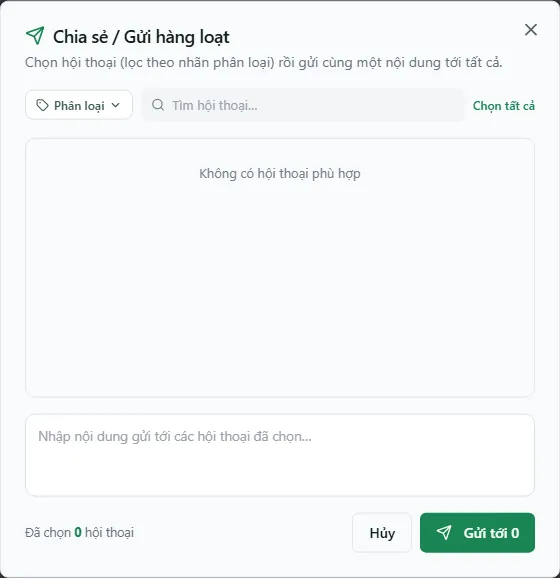

# Chat Zalo — mẫu tin & tự động hoá

::: warning Trạng thái hiện hành (07/10/2026)
Kênh **Chat Zalo** đang **tạm ngưng phát triển** từ 06/10/2026: màn `/chat-zalo` vẫn nằm trong menu **Kênh chat** và vẫn mở được theo quyền, nhưng chưa có tính năng mới hay bản sửa lỗi cho kênh này cho tới khi được mở lại. Broadcast, mẫu tin và tự động hoá chỉ thực sự gửi tin khi công ty bạn có **tài khoản Zalo đã kết nối** và **tiến trình nền** đang chạy — tài liệu này mô tả giao diện, không xác nhận tiến trình nền của từng công ty.
:::

Màn **Chat Zalo** (`/chat-zalo`) đưa việc nhắn tin Zalo với khách trọ, khách tiềm năng và môi giới vào thẳng CRM. Ngoài việc chat 1-1, trang còn có ba nhóm công cụ để bạn làm việc nhanh hơn với số đông: **gửi tin hàng loạt (broadcast) theo nhãn**, **chèn mẫu tin** khi soạn, và **tự động hoá tin nhắn** (gửi ảnh phòng trống định kỳ, tự động trả lời sale). Bài này tập trung vào ba nhóm đó.

Đây là hệ Chat Zalo hiện hành dùng quyền `chat_zalo.*`. (Hệ OpenClaw Zalo từng hiển thị song song đã bị xóa toàn bộ 30/08/2026.)

::: info Điều kiện tiên quyết
- Quyền **Chat Zalo => Xem** (module `chat_zalo`, action `view`) để mở trang `/chat-zalo`. Không có quyền này thì mục **Chat Zalo** bị ẩn khỏi menu (nhóm **Kênh chat**).
- Quyền **Chat Zalo => Gửi / soạn tin nhắn** (`chat_zalo.send`) để gửi tin và **broadcast**; quyền **Quản lý mẫu tin / ZNS** (`chat_zalo.manage_templates`) để thêm/sửa/xoá mẫu; quyền **Bật/tắt luồng tự động hoá** (`chat_zalo.manage_automation`) để bật/tắt các công tắc tự động.
- Đã **kết nối ít nhất một tài khoản Zalo** (quét QR ở nút **Kết nối Zalo cá nhân**) và tiến trình đồng bộ đang chạy — nếu chưa, danh sách hội thoại và nhãn sẽ trống.
- **Nhãn phân loại** được tạo và sửa trong **ứng dụng Zalo**, hệ thống chỉ **đọc về** để lọc và chọn người nhận (xem mục Nhãn phân loại bên dưới).
:::

::: warning Zalo nối vào CRM qua tài khoản cá nhân — hãy dùng nick phụ
Kênh này chạy trên **tài khoản Zalo cá nhân** thông qua một tiến trình nền riêng (worker), không phải cổng chính thức của Zalo. Gửi quá nhiều tin trong thời gian ngắn có thể khiến Zalo **khoá tạm nick**. Vì vậy nên dùng một **tài khoản Zalo phụ** dành riêng cho CRM, và không đăng nhập cùng nick đó ở nơi khác (mở Zalo Web cùng nick sẽ làm rớt luồng nhận tin). Đây là lý do broadcast được **rải nhịp** chứ không bắn một loạt (xem bên dưới).
:::

## Gửi tin hàng loạt (broadcast) theo nhãn

Broadcast là cách gửi **cùng một nội dung** tới nhiều hội thoại một lần — ví dụ nhắc đóng tiền đầu tháng cho tất cả khách gắn nhãn "Khách trọ", hay gửi thông báo cho nhóm môi giới.

**Bước 1**: Ở **cột danh sách hội thoại** (bên trái), bấm nút **loa** (**Chia sẻ / Gửi hàng loạt**) trên đầu danh sách. Hộp thoại **Chia sẻ / Gửi hàng loạt** mở ra: "Chọn hội thoại (lọc theo nhãn phân loại) rồi gửi cùng một nội dung tới tất cả."

**Bước 2**: Chọn tập người nhận. Trong hộp thoại bạn có thể:

- Bấm **Phân loại** để lọc theo **nhãn phân loại** (ví dụ chỉ những hội thoại gắn nhãn "Khách trọ").
- Gõ vào ô **Tìm hội thoại…** để thu hẹp thêm.
- Bấm **Chọn tất cả** để chọn nhanh — lưu ý **chỉ chọn trong tập đang lọc/tìm**, không phải toàn bộ danh bạ. Bạn cũng tích/bỏ tích từng hội thoại thủ công; dòng "Đã chọn N hội thoại" ở chân hộp thoại cho biết số đang chọn, **Bỏ chọn** để làm lại.

**Bước 3**: Nhập **nội dung tin** vào ô "Nhập nội dung gửi tới các hội thoại đã chọn…" rồi bấm **Gửi tới N**. Hệ thống trả về thông báo **"Đã xếp N/M hội thoại vào hàng đợi gửi"** — đây là số hội thoại đã được đưa vào hàng đợi, tiến trình nền sẽ gửi **tuần tự** ngay sau đó. Nếu N nhỏ hơn M, thông báo chuyển sang dạng cảnh báo và ghi rõ số hội thoại chưa được xếp hàng — kiểm tra quyền và trạng thái các hội thoại đó, **không gửi lại toàn bộ danh sách**.

**Bước 4**: (Cách khác để mở broadcast) Trong khung chat, trỏ vào một tin và bấm **Chia sẻ tin này** — nội dung tin đó được đổ sẵn vào hộp thoại broadcast để bạn chuyển tiếp cho nhiều người.

::: warning Broadcast gửi tin thật, không thu hồi hàng loạt được
Mỗi hội thoại trong tập chọn sẽ nhận một **tin Zalo thật**. Sau khi gửi, bạn chỉ có thể **thu hồi từng tin một** (và chỉ với tin do mình gửi đi), không có nút "thu hồi cả loạt". Trước khi bấm gửi hãy kiểm tra kỹ **đúng nhãn / đúng tập người nhận**, **đúng nội dung**, và **đúng tài khoản Zalo** đang chọn ở đầu danh sách.
:::

::: tip Vì sao broadcast gửi "chậm"
Tiến trình nền cố ý **nghỉ ngẫu nhiên khoảng 0,7–1,5 giây giữa mỗi tin** để Zalo không xem là spam và khoá nick. Với tập lớn, tin sẽ tới người nhận rải ra trong ít phút — đó là bình thường, không phải lỗi. Tránh gửi nhiều đợt lớn liên tiếp trong thời gian ngắn.
:::

::: tip Ai không đủ quyền sẽ bị bỏ qua âm thầm
Khi gửi, hệ thống kiểm tra quyền **theo từng hội thoại**. Hội thoại nào bạn không phải chủ và không có quyền **gửi** sẽ bị **bỏ qua** — khi đó thông báo "Đã xếp N/M…" có N nhỏ hơn M và hiện dạng cảnh báo.
:::

## Chèn mẫu tin khi soạn

Mẫu tin giúp bạn chèn nhanh những câu hay dùng (chào hỏi, nhắc nợ, hướng dẫn chuyển khoản…) thay vì gõ lại mỗi lần.

- Khi đang mở một hội thoại, ở **ô soạn tin** (cột giữa) có nút **mẫu tin** — bấm để mở **Thư viện mẫu tin** và chọn một mẫu, nội dung được **chèn vào ô soạn** để bạn xem lại và gửi.
- Cách nhanh hơn: gõ `/` ở đầu ô soạn, danh sách gợi ý **"Mẫu tin — Enter để chèn"** hiện ra; dùng phím mũi tên lên/xuống rồi **Enter** để chèn.
- Danh sách mẫu cũng hiển thị ở **cột thông tin bên phải**, tab **Tự động hoá**, để bạn xem nhanh các mẫu đang có.

::: tip Quản lý thư viện mẫu ngay trong Chat Zalo
Tài khoản có quyền `chat_zalo.manage_templates` thấy biểu tượng **Quản lý mẫu tin** trong Thư viện mẫu tin. Hộp thoại **Quản lý mẫu tin** ("Mẫu tin dùng chung cho cả công ty") cho phép thêm, sửa, bật/tắt và xoá mẫu; mỗi mẫu có **Tiêu đề (nhãn hiển thị)**, **Nội dung tin (thứ sẽ được chèn/gửi)**, **Màu** và công tắc **Đang dùng** — mẫu tắt hiện nhãn **TẮT** và không xuất hiện khi chèn. Người không có quyền quản lý vẫn chèn được các mẫu đang dùng vào ô soạn để xem lại trước khi gửi.
:::

## Nhãn phân loại khách

Nhãn (**Phân loại** trong Zalo) là công cụ chính để nhóm khách và **chọn người nhận broadcast**.

- Nhãn được **tạo và sửa trong ứng dụng Zalo** (không tạo trong CRM). Mỗi lần kết nối, hệ thống **đồng bộ về** danh sách nhãn và gắn nhãn tương ứng cho từng hội thoại.
- Ở **cột danh sách hội thoại**, dùng ô **lọc theo nhãn** để chỉ xem những hội thoại của một nhãn.
- Trong hộp thoại **broadcast**, chọn nhãn để nhắm đúng tập người nhận (ví dụ chỉ gửi cho nhãn "Sắp hết hạn HĐ").

::: tip Muốn thêm/đổi nhãn thì làm trên điện thoại
Vì nhãn thuộc về tài khoản Zalo, bạn tạo/đổi tên/đổi màu nhãn ngay trong **ứng dụng Zalo** rồi gắn nhãn cho khách ở đó. Ít phút sau (sau nhịp đồng bộ) nhãn mới sẽ xuất hiện trong bộ lọc và hộp thoại broadcast của CRM.
:::

## Bật/tắt tự động hoá tin nhắn

Ở **cột thông tin bên phải** (mở một hội thoại rồi bấm biểu tượng bánh răng **Tự động hoá**), tab **Tự động hoá** có hai công tắc, nút **Dừng khẩn cấp** và **Cài đặt chi tiết**:

- **Gửi ảnh phòng trống** — máy tự gửi danh sách/ảnh phòng trống định kỳ cho các nhóm Zalo môi giới và các hội thoại đã đánh dấu **Sale / Môi giới** mà bạn chọn làm người nhận.
- **Tự động trả lời** — khi một hội thoại **Sale / Môi giới** nhắn tin khớp từ khoá bạn cài, máy trả lời bằng danh sách phòng trống mới nhất; tin nhắc tới tiền, cọc, hợp đồng, thanh toán, khiếu nại thì máy **không** trả lời.

Bật/tắt và chỉnh cài đặt cần quyền **Bật/tắt luồng tự động hoá** (`chat_zalo.manage_automation`). Cách chọn chế độ theo thứ trong tuần, các phanh an toàn, nút **Dừng khẩn cấp** và mục **Nhật ký** được mô tả chi tiết ở [Chat Zalo — hội thoại](/03-quan-ly-van-hanh/chat-zalo/), mục Bước 7.

::: warning Tự động hoá gửi tin thật qua nick Zalo của công ty
Khi bật, máy **thật sự gửi tin** theo lịch và theo từ khoá. Gạt công tắc tắt chỉ ngăn **lượt sau**; muốn chặn ngay lô tin đang chờ gửi, bấm **Dừng khẩn cấp**. Nếu tài khoản Zalo rớt phiên, tự động hoá ngừng **im lặng** — hãy xem **Nhật ký** để biết máy còn chạy. Dòng "Đã chạy 0 lượt hôm nay" ở chân danh sách hội thoại hiện **chưa đếm lượt thật**, đừng dựa vào nó.
:::

## ZNS và Zalo OA — hiện chưa hỗ trợ

- **ZNS** (Zalo Notification Service — tin mẫu chính thức qua Official Account) và **Zalo OA** **chưa được hỗ trợ** trong phiên bản này. Cấu trúc dữ liệu có chừa sẵn chỗ (mã mẫu ZNS, kênh `oa`) nhưng **không có luồng gửi nào chạy**.
- Toàn bộ việc gửi hiện đi qua **tài khoản Zalo cá nhân** đã kết nối. Khi cần gửi cho khách, hãy dùng **chat trực tiếp** hoặc **broadcast theo nhãn**.

## Các tính năng khác

| Nút / Khu vực | Công dụng |
| --- | --- |
| Nút **loa** (đầu danh sách hội thoại) | Mở hộp thoại **Chia sẻ / Gửi hàng loạt** (broadcast) theo nhãn / tìm / chọn tất cả. |
| **Chọn tài khoản Zalo** (đầu danh sách) | Mở khung **Tài khoản hiển thị**: xem **nhiều tài khoản Zalo cùng lúc**; nút **Kết nối Zalo cá nhân** (quét QR), **Đăng nhập lại** / **Ngắt kết nối** từng nick. |
| Ô **lọc theo nhãn** | Chỉ hiện hội thoại của một nhãn phân loại. |
| Chip **Tất cả · Chưa đọc · Khách trọ · Lead · Danh bạ** | Lọc nhanh danh sách; hai chip **Khách trọ / Lead** chỉ hiện hội thoại đã **Gắn hồ sơ CRM**. |
| Nút **mẫu tin** hoặc gõ `/` (ô soạn tin) | Chèn nhanh một mẫu tin đang dùng vào nội dung đang soạn. |
| **Chia sẻ tin này** (thao tác trên một tin) | Chuyển tiếp nội dung tin đó tới nhiều người qua hộp thoại broadcast. |
| Tab **Tự động hoá** (cột phải) | Hai công tắc tự động, **Dừng khẩn cấp**, **Cài đặt chi tiết**, **Nhật ký** + danh sách mẫu tin. |
| **Thông báo đẩy** khi có tin mới | Khi có tin Zalo **đến**, bạn nhận **thông báo đẩy** (Web Push) trên trình duyệt/điện thoại (xem [Thông báo](/02-theo-doi-nhanh/thong-bao/)). |

## Tình huống & lỗi thường gặp

| Tình huống | Cách xử lý |
| --- | --- |
| Danh sách hội thoại **trống** | Chưa kết nối tài khoản Zalo hoặc tiến trình đồng bộ chưa chạy. Bấm **Kết nối Zalo cá nhân** và quét QR; đợi ít phút để danh bạ/nhóm đồng bộ về. |
| Ô **lọc theo nhãn** không có nhãn nào | Nhãn được đọc từ ứng dụng Zalo. Hãy tạo/gắn **Phân loại** trong app Zalo trước, rồi đợi nhịp đồng bộ. |
| Bấm loa nhưng **không gửi được** hoặc nút mờ | Bạn thiếu quyền **Chat Zalo => Gửi** (`chat_zalo.send`). Nhờ quản trị cấp quyền. |
| Broadcast báo "Đã xếp N/M hội thoại vào hàng đợi gửi" với **N nhỏ hơn M** | Hệ thống kiểm quyền và trạng thái **theo từng hội thoại**; hội thoại không đủ điều kiện bị bỏ qua. Kiểm tra các hội thoại đó, **không gửi lại toàn bộ danh sách**. |
| Broadcast **tới chậm**, rải trong vài phút | Đúng thiết kế: tin được **rải nhịp 0,7–1,5 giây/tin** để tránh bị Zalo coi là spam. Không phải lỗi. |
| Không thấy nút **Quản lý mẫu tin** | Tài khoản thiếu quyền `chat_zalo.manage_templates`. Nhờ quản trị cấp quyền; người không có quyền vẫn chèn được các mẫu đang hoạt động. |
| Bật **Tự động hoá** mà không thấy tin nào tự gửi | Mở **Nhật ký** trong tab Tự động hoá: máy ghi cả lượt cố ý không gửi kèm lý do (chưa chọn người nhận, danh sách phòng không đổi, ngoài khung giờ…). Nhật ký trống nhiều ngày thường là tài khoản Zalo đã rớt phiên. |
| Muốn gửi **ZNS/OA** | Chưa hỗ trợ trong phiên bản này. Dùng chat trực tiếp hoặc broadcast qua tài khoản Zalo cá nhân. |
| Đang nhận tin thì **rớt kết nối** | Có thể do nick Zalo đang được mở ở nơi khác (Zalo Web/thiết bị khác). Dùng **nick phụ riêng** cho CRM và chỉ đăng nhập một nơi. |

## Thử trực tiếp trên sandbox

<SandboxTry account="demo.chunha" app-path="/chat-zalo" app-label="Mở Chat Zalo" fixtures="Ảnh chụp 07/10/2026: chưa kết nối tài khoản Zalo, chưa có hội thoại hoặc nhãn được đồng bộ." view-only>

Bài này chỉ **xem để định vị** trạng thái trống — không kết nối tài khoản hoặc gửi tin Zalo:

1. Mở **Chat Zalo** và xác nhận danh sách hội thoại đang trống ("Đang xem 0/0 tài khoản").
2. Bấm nút **loa** để mở hộp thoại **Chia sẻ / Gửi hàng loạt**, nhận diện **Phân loại**, **Tìm hội thoại…**, **Chọn tất cả** và nút **Gửi tới 0**, rồi bấm **Hủy**.
3. Không bấm **Kết nối Zalo cá nhân** vì thao tác đó yêu cầu tài khoản Zalo thật và tạo trạng thái ngoài tài liệu.

Kết quả mong đợi: bạn biết chính xác **broadcast**, **mẫu tin** và **tự động hoá** nằm ở đâu trong màn Chat Zalo, và nhớ rằng chúng chỉ có dữ liệu sau khi một tài khoản Zalo được kết nối và đồng bộ.

</SandboxTry>

## Quy trình liên quan

- [Thông báo](/02-theo-doi-nhanh/thong-bao/) — thông báo đẩy (Web Push) khi có tin Zalo mới về.
- [Thu tiền tại phòng (điện thoại)](/03-quan-ly-van-hanh/thu-tien-mobile/) — nút **Zalo** trên từng ô phòng để nhắn nhanh cho khách đại diện.
- [Phân quyền](/05-cai-dat/phan-quyen/) — cấp quyền `chat_zalo` (Xem / Gửi / Quản lý mẫu tin / Quản lý tự động hoá) cho nhân viên.
- [Nhân viên & đội ngũ](/05-cai-dat/nhan-vien-doi-ngu/) — giao phạm vi và tài khoản để nhân viên dùng Chat Zalo.
