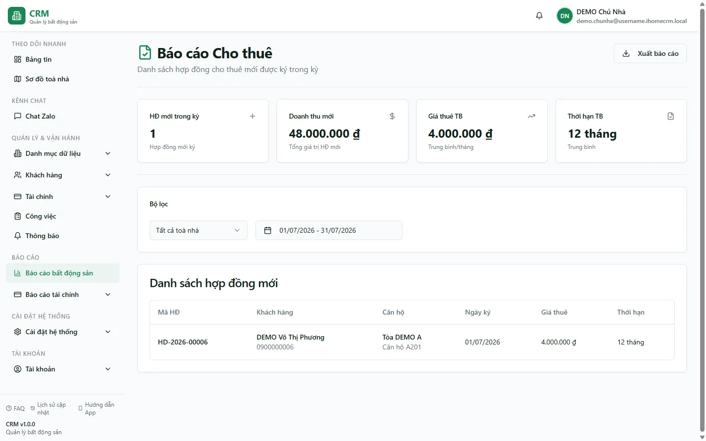

# Báo cáo: Cho thuê mới

Route cần `reports_real_estate.new_leases`. Báo cáo đọc các hợp đồng chưa xóa có `signed_date` trong khoảng chọn, không yêu cầu một trạng thái hợp đồng cụ thể.

## Bộ lọc

- Mặc định: từ đầu đến cuối tháng hiện tại.
- Khoảng ngày lọc trên `contracts.signed_date`, không phải `start_date` hay ngày tạo bản ghi.
- Tòa được lọc phía trình duyệt sau khi truy vấn bằng quan hệ phòng → tòa.
- Bộ lọc được lưu trong phiên và có thể giữ lại khi tải lại trang.

## Bốn thẻ số

| Thẻ | Cách tính hiện tại |
| --- | --- |
| HĐ mới trong kỳ | Số dòng hợp đồng trả về. |
| Doanh thu mới | Tổng `rent_price × duration_months`. Đây là **giá trị hợp đồng ước tính**, không phải doanh thu đã thu hoặc P&L. |
| Giá thuê TB | Trung bình `rent_price` mỗi tháng của các hợp đồng trong danh sách. |
| Thời hạn TB | Trung bình số tháng ước tính, làm tròn ở thẻ. |

`duration_months` hiện được tính bằng `max(1, round(differenceInDays(end_date, start_date) / 30))`; vì vậy đây là quy đổi gần đúng theo 30 ngày/tháng, không phải số chu kỳ thanh toán chính xác.

## Bảng và nguồn số

Bảng hiển thị mã HĐ, khách chính từ `tenant_id`, phòng/tòa, ngày ký, giá thuê và thời hạn ước tính. Tiền cọc được truy vấn nhưng hiện không hiển thị trong bảng hoặc file export.

::: warning Giới hạn truy vấn
Hook dùng một truy vấn PostgREST không có `fetchAllRows`/phân trang rõ ràng. Với tập dữ liệu lớn, kết quả có thể chịu giới hạn số dòng của API. Hãy thu hẹp khoảng ngày và không dùng báo cáo này làm phép đếm lịch sử tuyệt đối khi số hợp đồng rất lớn.
:::

Nút **Xuất** tạo file `bao-cao-cho-thue` từ chính danh sách đang tải, gồm mã HĐ, khách, căn hộ, ngày ký, giá thuê và thời hạn.

## Cách đối chiếu

- Muốn biết tiền thực thu: dùng [Thu tiền tại hóa đơn](/03-quan-ly-van-hanh/thu-tien-hoa-don/) và báo cáo cashbook.
- Muốn biết doanh thu P&L: dùng [Phân tích tài chính](/04-bao-cao/phan-tich-tai-chinh/).
- Muốn theo dõi khách rời: dùng [Thanh lý / bỏ trả](/04-bao-cao/thanh-ly/).
