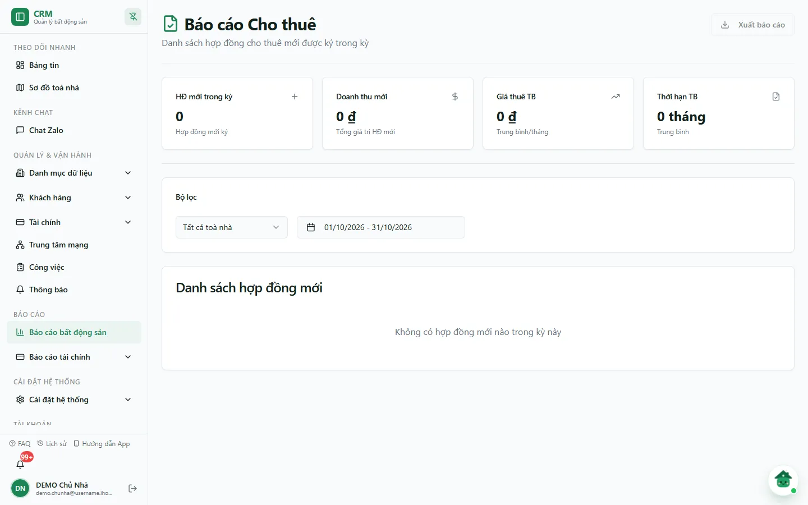
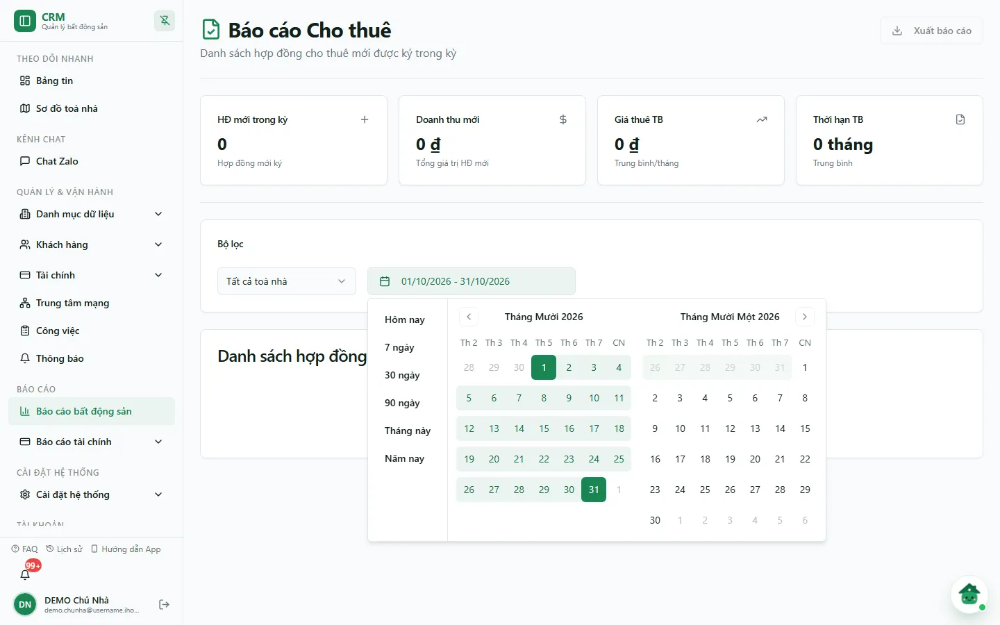
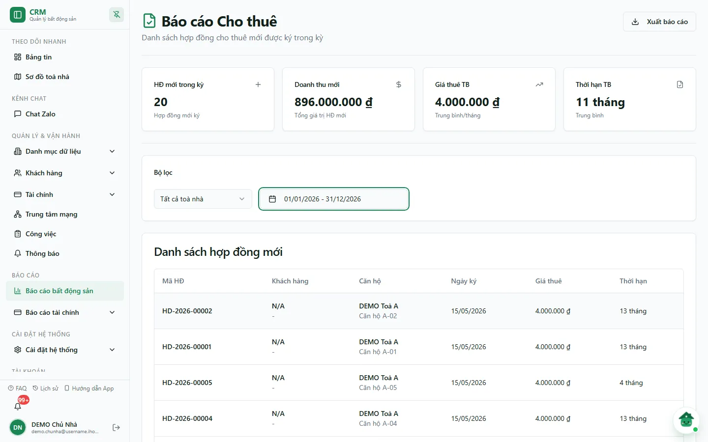

# Báo cáo: Cho thuê mới

Màn **Báo cáo Cho thuê** liệt kê các hợp đồng chưa xoá có **ngày ký** trong khoảng đã chọn (không phân biệt trạng thái hợp đồng). Dùng để biết trong kỳ đã ký thêm bao nhiêu hợp đồng, giá thuê và thời hạn bình quân.

::: info Điều kiện tiên quyết
- Quyền **Báo cáo Cho thuê mới** (`reports_real_estate.new_leases`).
:::

## Hướng dẫn từng bước

**Bước 1**: Tại menu bên trái, ấn **Báo cáo bất động sản** => thẻ **Báo cáo cho thuê** => **Xem báo cáo →**. Mặc định báo cáo xem **tháng hiện tại** (từ ngày 1 đến cuối tháng).

**Bước 2**: Ấn ô khoảng ngày để đổi kỳ: chọn nhanh **Hôm nay**, **7 ngày**, **30 ngày**, **90 ngày**, **Tháng này**, **Năm nay**, hoặc chọn ngày đầu/ngày cuối trên lịch hai tháng.

**Bước 3**: Nếu cần, chọn một toà ở ô **Tất cả toà nhà**. Bảng **Danh sách hợp đồng mới** và bốn thẻ số cập nhật theo bộ lọc.

**Bước 4**: Ấn **Xuất báo cáo** để lấy file `bao-cao-cho-thue` (Excel/CSV) gồm mã HĐ, khách hàng, căn hộ, ngày ký, giá thuê và thời hạn.

Snapshot DEMO ngày 07/10/2026: tháng 10/2026 không có hợp đồng mới; chọn **Năm nay** ra **20 hợp đồng**, **Doanh thu mới** 896.000.000 đ, **Giá thuê TB** 4.000.000 đ, **Thời hạn TB** 11 tháng.

## Thẻ số

| Thẻ | Cách tính |
| --- | --- |
| **HĐ mới trong kỳ** | Số hợp đồng trong bảng. |
| **Doanh thu mới** | Tổng (giá thuê × thời hạn ước tính) — là **giá trị hợp đồng ước tính**, không phải tiền đã thu hay doanh thu trên sổ. |
| **Giá thuê TB** | Trung bình giá thuê một tháng của các hợp đồng trong bảng. |
| **Thời hạn TB** | Trung bình thời hạn ước tính, làm tròn tháng. |

Thời hạn ước tính = số ngày từ ngày bắt đầu đến ngày kết thúc chia 30, làm tròn, tối thiểu 1 tháng — là quy đổi gần đúng, không phải số kỳ thanh toán chính xác.

Bảng gồm **Mã HĐ**, **Khách hàng** (kèm số điện thoại), **Căn hộ** (toà + phòng), **Ngày ký**, **Giá thuê**, **Thời hạn**; sắp theo ngày ký mới nhất. Tiền cọc không hiển thị trong bảng và file xuất.

## Tình huống & lỗi thường gặp

| Tình huống | Nguyên nhân & cách xử lý |
|---|---|
| Hợp đồng vừa tạo không có trong kỳ | Báo cáo lọc theo **ngày ký**, không theo ngày bắt đầu hay ngày tạo bản ghi. Kiểm tra ngày ký của hợp đồng. |
| Cột **Khách hàng** hiện “N/A” | Báo cáo lấy khách từ trường khách chính (`tenant_id`) của hợp đồng; hợp đồng không có giá trị này sẽ hiện N/A. |
| “Doanh thu mới” khác doanh thu trên sổ | Đây là giá trị hợp đồng ước tính. Tiền thật đã thu xem ở [Thu tiền tại hoá đơn](/03-quan-ly-van-hanh/thu-tien-hoa-don/); doanh thu/lợi nhuận xem ở [Phân tích tài chính](/04-bao-cao/phan-tich-tai-chinh/). |
| Đếm lịch sử rất dài bị thiếu | Truy vấn không phân trang; với dữ liệu lớn hãy thu hẹp khoảng ngày. |

## Quy trình liên quan

- [Thanh lý / bỏ trả](/04-bao-cao/thanh-ly/)
- [Tỷ lệ lấp đầy](/04-bao-cao/lap-day/)
- [Phân tích tài chính](/04-bao-cao/phan-tich-tai-chinh/)
