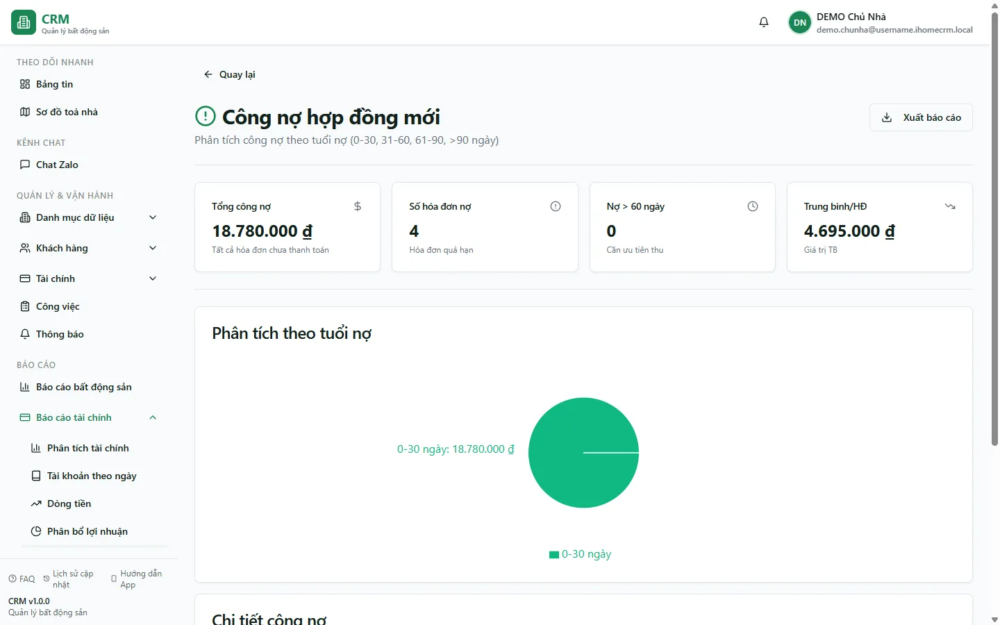

# Báo cáo: Công nợ hợp đồng mới

Báo cáo này liệt kê **mọi hoá đơn còn nợ** trong hệ thống — gồm hoá đơn tháng đầu của hợp đồng mới (thường gộp cả khoản **Tiền cọc** còn thiếu) lẫn hoá đơn các kỳ tiếp theo — rồi xếp chúng theo **tuổi nợ** để bạn biết khoản nào mới phát sinh, khoản nào đã quá hạn lâu cần ưu tiên đòi. Bạn dùng trang này để nhìn nhanh tổng công nợ, số hoá đơn đang nợ và tỉ trọng nợ theo từng mốc thời gian. Đây là **trang xem** (view-only): trang chỉ tổng hợp số liệu, mọi thao tác thu tiền vẫn làm ở màn hình hoá đơn.

Đối tượng đọc: **chủ nhà**, **kế toán** và **quản lý toà** muốn theo dõi khách còn nợ tiền nhà, tiền dịch vụ và cọc.

::: info Điều kiện tiên quyết
- Bạn cần quyền xem **Báo cáo tài chính** (module **reports_finance**). Không có quyền này thì thẻ báo cáo sẽ bị ẩn trong hub và mở thẳng đường dẫn sẽ báo không đủ quyền.
- Báo cáo dựa trên **phạm vi toà nhà** của tài khoản: chủ nhà thấy toàn bộ, nhân viên chỉ thấy hoá đơn thuộc các toà mình được phân công.
- Cần đã có hoá đơn ở trạng thái **Đã duyệt**, **Trả một phần** hoặc **Quá hạn** thì báo cáo mới có dòng để hiển thị.
:::

## Cách mở

**Bước 1**: Vào **Báo cáo** => **Tài chính** => **Công nợ hợp đồng mới**. Trang mở ra với hàng thẻ chỉ số ở đầu, biểu đồ tròn phân tích tuổi nợ và bảng chi tiết bên dưới.

## Bộ lọc & cách đọc số

Trang này **không có bộ lọc toà nhà hay khu vực** — báo cáo hiển thị toàn bộ hoá đơn còn nợ trong phạm vi mà tài khoản của bạn được phép xem. Bốn thẻ chỉ số ở đầu và bảng chi tiết đọc như sau:

| Cột / Chỉ số | Ý nghĩa |
|---|---|
| Thẻ **Tổng công nợ** | Tổng số tiền còn phải thu của tất cả hoá đơn đang nợ. Ví dụ demo cộng hoá đơn phòng **A102** (còn nợ **2.570.000đ**) với phòng **A105** (quá hạn **6.070.000đ**) và các hoá đơn khác. |
| Thẻ **Số hoá đơn nợ** | Số lượng hoá đơn đang còn nợ (mỗi hoá đơn là một dòng trong bảng). |
| Thẻ **Nợ > 60 ngày** | Số hoá đơn đã quá hạn hơn 60 ngày — nhóm cần ưu tiên thu trước. |
| Thẻ **Trung bình/HĐ** | Tổng công nợ chia cho số hoá đơn nợ, cho biết giá trị nợ trung bình mỗi hoá đơn. |
| Biểu đồ **Phân tích theo tuổi nợ** | Biểu đồ tròn chia tổng nợ thành 4 mốc: **0-30**, **31-60**, **61-90** và **>90** ngày; mỗi mốc một màu (xanh → vàng → đỏ → đỏ đậm) để bạn thấy ngay phần nợ nào đang "già". |
| Cột **Mức độ** (bảng) | Nhãn màu theo tuổi nợ của hoá đơn: **0-30 ngày** (nhẹ), **31-60 ngày** (cảnh báo), **61-90** và **>90 ngày** (đỏ, khẩn). |
| Cột **Mã HĐ** | Mã số hoá đơn để bạn tra cứu chi tiết. |
| Cột **Khách hàng** | Người đại diện hợp đồng gắn với hoá đơn (ví dụ **Nguyễn Văn A**). |
| Cột **Căn hộ** | Toà nhà và số phòng, ví dụ **Tòa DEMO A - A102**. |
| Cột **Còn nợ** | Số tiền còn phải thu của hoá đơn = tổng tiền − đã trả (hiển thị màu đỏ). |
| Cột **Ngày quá hạn** | Số ngày tính từ **hạn thanh toán** đến hôm nay. Hoá đơn chưa tới hạn hiển thị **0 ngày** và nằm ở nhóm **0-30**. |

::: tip Cách một hoá đơn được xếp mốc tuổi nợ
Số ngày quá hạn = hôm nay trừ ngày đến hạn của hoá đơn. Từ đó hệ thống xếp mốc: trên **90** ngày vào nhóm **>90**, trên **60** vào **61-90**, trên **30** vào **31-60**, còn lại (kể cả chưa tới hạn) vào **0-30**. Nhờ vậy hoá đơn A105 quá hạn lâu sẽ rơi vào mốc đỏ, còn A102 vừa tới hạn nằm ở mốc xanh 0-30.
:::

## Nguồn số liệu

- Báo cáo lấy trực tiếp từ bảng **hoá đơn**: chỉ tính hoá đơn ở trạng thái **Đã duyệt**, **Trả một phần** hoặc **Quá hạn**, và **chưa bị xoá**. Hoá đơn nháp, hoá đơn đã huỷ/đã thu đủ không xuất hiện ở đây.
- "Còn nợ" của mỗi dòng là phần chưa thu của hoá đơn (**tổng tiền − đã trả**). Khi bạn thu thêm ở màn hình hoá đơn, số này giảm và hoá đơn tự rời khỏi báo cáo khi thu đủ.
- Hoá đơn **tháng đầu của hợp đồng mới** thường gộp sẵn dòng **Tiền cọc** còn thiếu cùng tiền nhà và dịch vụ tháng đầu; vì vậy phần cọc chưa đóng cũng hiện trong công nợ ở đây. Cơ chế gộp cọc vào hoá đơn tháng đầu xem [Đặt cọc](/03-quan-ly-van-hanh/dat-coc/); cách hoá đơn hình thành và các trạng thái xem [Hoá đơn](/03-quan-ly-van-hanh/hoa-don/).
- Trang **không** đọc phiếu thu chi hay sổ quỹ — nó phản ánh **khoản phải thu trên hoá đơn**, khác với số tiền thực đã vào quỹ. Muốn xem tiền thực thu theo ngày, dùng báo cáo sổ quỹ trong hub tài chính.

## Xuất & mẹo

- Nút **Xuất báo cáo** (góc trên bên phải) cho tải dữ liệu ra **Excel (.xlsx)** hoặc **CSV (.csv)**. Định dạng **PDF** hiện chưa triển khai — chọn PDF sẽ chỉ hiện thông báo "sẽ được triển khai trong tương lai".
- File xuất gồm các cột: **Mã HĐ**, **Khách hàng**, **Căn hộ**, **Tổng tiền**, **Đã trả**, **Còn nợ**, **Ngày quá hạn** và **Phân loại** (mốc tuổi nợ) — tiện để lọc, cộng dồn hay gửi cho kế toán.
- Mẹo đọc nhanh: liếc biểu đồ tròn trước — nếu phần **>90 ngày** chiếm tỉ trọng lớn thì tập trung đòi nhóm đỏ đậm trong bảng trước tiên.
- Con số ở đây là công nợ **theo hoá đơn**. Nếu muốn gom nợ **theo từng khách hàng** (một khách nhiều hoá đơn), xem [Báo cáo khách nợ tiền](/04-bao-cao/khach-no-tien/); muốn xem lịch các kỳ sắp phải thu, xem [Báo cáo lịch thanh toán](/04-bao-cao/lich-thanh-toan/).
- Để hoá đơn rời khỏi danh sách nợ, thu tiền cho hoá đơn đó ở [Thu tiền hoá đơn](/03-quan-ly-van-hanh/thu-tien-hoa-don/); khi đã thu đủ, hoá đơn tự động biến mất khỏi báo cáo.

## Thử trực tiếp trên sandbox

<SandboxTry account="demo.chunha" app-path="/reports/finance/new-contract-debt" view-only>

**Bạn sẽ nhìn thấy**

- Thẻ **Tổng công nợ** cộng các hoá đơn còn nợ của 2 toà **DEMO**, trong đó có phòng **A102** còn nợ **2.570.000đ** và phòng **A105** quá hạn **6.070.000đ**.
- Biểu đồ **Phân tích theo tuổi nợ** tô màu phần nợ theo 4 mốc 0-30 / 31-60 / 61-90 / >90 ngày; hoá đơn quá hạn lâu của **A105** nằm ở mốc đỏ, còn **A102** ở mốc xanh 0-30.
- Bảng **Chi tiết công nợ** hiển thị dòng của khách **Nguyễn Văn A** với cột **Còn nợ** màu đỏ và cột **Ngày quá hạn** cho biết hoá đơn đã trễ bao nhiêu ngày.

</SandboxTry>

## Quy trình liên quan

- [Hoá đơn](/03-quan-ly-van-hanh/hoa-don/)
- [Thu tiền hoá đơn](/03-quan-ly-van-hanh/thu-tien-hoa-don/)
- [Đặt cọc](/03-quan-ly-van-hanh/dat-coc/)
- [Báo cáo khách nợ tiền](/04-bao-cao/khach-no-tien/)
- [Báo cáo lịch thanh toán](/04-bao-cao/lich-thanh-toan/)
- [Quy trình thu tiền](/01-bat-dau/quy-trinh-thu-tien/)
