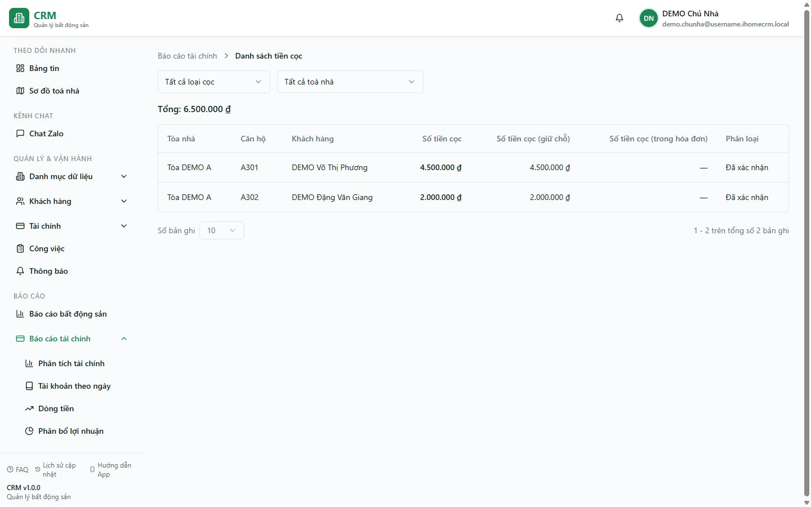

# Báo cáo: Danh sách tiền cọc

Route này cần quyền `reports_finance.deposits_report` và hiển thị dữ liệu từ nguồn cọc legacy.

Snapshot production ngày 13/08/2026 của `demo.chunha` hiển thị **Tổng: 0đ** và **Không có dữ liệu nào để hiển thị**. Cùng thời điểm, màn [Đặt cọc](/03-quan-ly-van-hanh/dat-coc/) canonical ghi nhận **20 hợp đồng cần thu 80.000.000đ, đã thu 0đ**. Đây là khác biệt giữa **báo cáo legacy rỗng** và **nghĩa vụ cọc hợp đồng**, không phải bằng chứng tổ chức không có nghĩa vụ cọc.

::: warning Nguồn legacy có thể thiếu dữ liệu
Báo cáo đọc bảng `public.deposits` và RPC tổng hợp legacy. Nguồn cọc canonical hiện nằm ở các item thu/chi được đánh dấu cọc và luồng cọc của hợp đồng. Vì hai nguồn chưa đồng nhất hoàn toàn, báo cáo này có thể rỗng hoặc thiếu dù tổ chức đang giữ cọc thực tế.
:::

## Cách sử dụng an toàn

1. Dùng bộ lọc tòa và trạng thái để tìm các bản ghi legacy cần rà soát.
2. Mở nghiệp vụ [Đặt cọc](/03-quan-ly-van-hanh/dat-coc/) để kiểm tra nguồn canonical theo khách, phòng/hợp đồng và chứng từ.
3. Đối chiếu item cọc trên phiếu thu hoặc collection; item cọc không được tính vào P&L dù tiền có thể đã vào sổ.
4. Khi báo cáo và luồng Đặt cọc khác nhau, lấy luồng canonical và chứng từ tài chính làm căn cứ xử lý; không tự tạo bản ghi legacy để “làm đầy” báo cáo.

## Phân biệt cọc và doanh thu

- Cọc là khoản đang giữ/nghĩa vụ với khách, không phải doanh thu chỉ vì tiền đã vào quỹ.
- Một lần thu có thể chứa cả item cọc và item doanh thu trong cùng voucher.
- Trạng thái giữ chỗ, chuyển hợp đồng, hoàn hoặc mất cọc phải đọc từ luồng nghiệp vụ cọc hiện hành, không suy ra chỉ từ một dòng legacy.

## Quy trình liên quan

- [Đặt cọc](/03-quan-ly-van-hanh/dat-coc/)
- [Hoàn/bỏ cọc](/03-quan-ly-van-hanh/hoan-bo-coc/)
- [Thu tiền tại hóa đơn](/03-quan-ly-van-hanh/thu-tien-hoa-don/)
- [Phân tích tài chính](/04-bao-cao/phan-tich-tai-chinh/)
