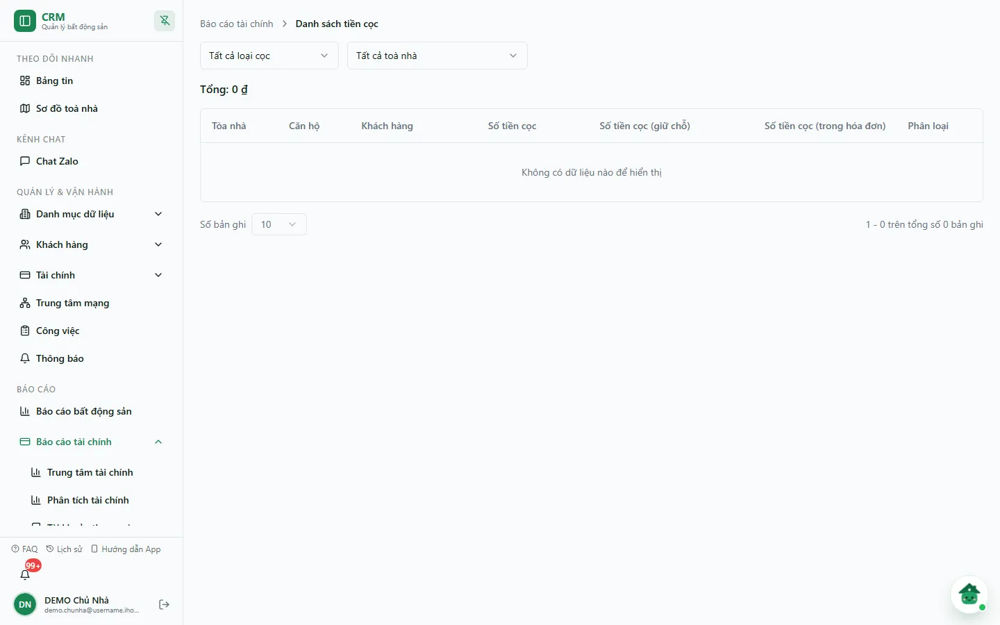

# Báo cáo: Danh sách tiền cọc

Báo cáo **Danh sách tiền cọc** liệt kê các bản ghi cọc từ **nguồn cọc cũ** (bảng cọc riêng) kèm tổng tiền theo bộ lọc. Nguồn cọc hiện hành nằm ở màn [Đặt cọc](/03-quan-ly-van-hanh/dat-coc/) và các dòng cọc trên phiếu thu chi, nên báo cáo này có thể rỗng hoặc thiếu dù tổ chức đang giữ cọc thật.

::: info Điều kiện tiên quyết
- Tài khoản có quyền **Báo cáo Danh sách cọc** (`reports_finance.deposits_report`).
:::

## Hướng dẫn từng bước

**Bước 1**: Tại thanh bên trái, ấn **Báo cáo tài chính** => **Danh sách tiền cọc**. Trên bảng có dòng **Tổng:** là tổng tiền cọc theo bộ lọc đang chọn.

**Bước 2**: Lọc bằng hai ô trên cùng:

- Ô loại cọc: **Tất cả loại cọc**, **Chờ xác nhận**, **Đã xác nhận**, **Đã chuyển HĐ**, **Đã hoàn**, **Mất cọc**.
- Ô toà nhà: **Tất cả toà nhà** hoặc một toà.

Ảnh chụp ngày 07/10/2026 (DEMO): **Tổng: 0 ₫** và **Không có dữ liệu nào để hiển thị** — nguồn cọc cũ của DEMO đang trống.

## Các cột

| Cột | Ý nghĩa |
|---|---|
| **Tòa nhà**, **Căn hộ**, **Khách hàng** | Phòng và khách gắn với bản ghi cọc. |
| **Số tiền cọc** | Số tiền của bản ghi. |
| **Số tiền cọc (giữ chỗ)** | Chỉ có số khi bản ghi ở trạng thái **Chờ xác nhận** hoặc **Đã xác nhận**. |
| **Số tiền cọc (trong hóa đơn)** | Chỉ có số khi bản ghi ở trạng thái **Đã chuyển HĐ**. |
| **Phân loại** | Trạng thái của bản ghi cọc. |

Cuối bảng có **Số bản ghi** (10, 20, 50, 100 dòng mỗi trang) và dòng đếm tổng số bản ghi.

::: warning Nguồn cũ có thể thiếu dữ liệu
Báo cáo không đọc nghĩa vụ cọc của hợp đồng hay dòng cọc trên phiếu thu. Vì hai nguồn chưa đồng nhất, báo cáo này có thể rỗng hoặc thiếu dù tổ chức đang giữ cọc. Không dùng **Tổng** ở đây làm số cọc đang giữ chính thức.
:::

## Cách sử dụng an toàn

1. Dùng bộ lọc toà và loại cọc để tìm các bản ghi cũ cần rà soát.
2. Mở màn [Đặt cọc](/03-quan-ly-van-hanh/dat-coc/) để kiểm tra nguồn hiện hành theo khách, phòng/hợp đồng và chứng từ.
3. Đối chiếu dòng cọc trên phiếu thu; dòng cọc không được tính vào lãi/lỗ dù tiền có thể đã vào sổ.
4. Khi báo cáo và màn Đặt cọc khác nhau, lấy màn Đặt cọc và chứng từ tài chính làm căn cứ; không tự tạo bản ghi cũ để “làm đầy” báo cáo.

## Phân biệt cọc và doanh thu

- Cọc là khoản đang giữ, là nghĩa vụ với khách, không phải doanh thu chỉ vì tiền đã vào quỹ.
- Một lần thu có thể chứa cả dòng cọc và dòng doanh thu trong cùng phiếu.
- Tiền cọc chỉ thật sự vào sổ quỹ khi phiếu thu ở trạng thái **Đã Thu**; phiếu mới được duyệt chưa phải tiền đã nhận.
- Trạng thái giữ chỗ, chuyển hợp đồng, hoàn hoặc mất cọc phải đọc từ luồng cọc hiện hành, không suy ra chỉ từ một dòng của báo cáo này.

## Quy trình liên quan

- [Đặt cọc](/03-quan-ly-van-hanh/dat-coc/)
- [Hoàn/bỏ cọc](/03-quan-ly-van-hanh/hoan-bo-coc/)
- [Thu tiền tại hóa đơn](/03-quan-ly-van-hanh/thu-tien-hoa-don/)
- [Phân tích tài chính](/04-bao-cao/phan-tich-tai-chinh/)
