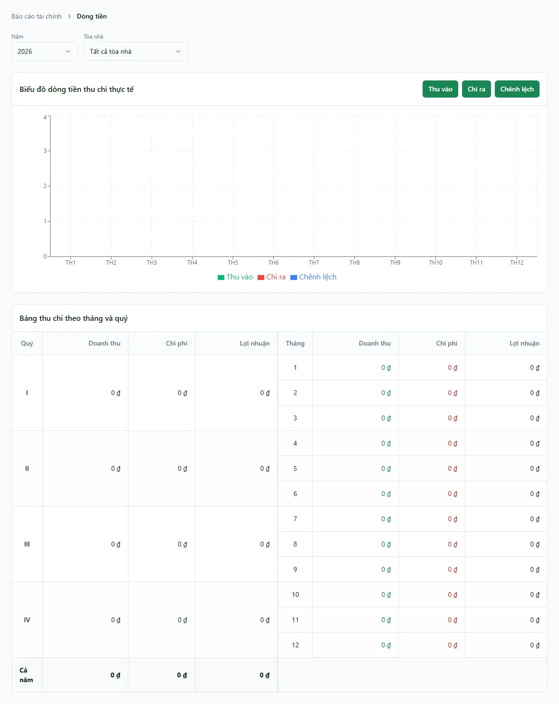

# Báo cáo: Dòng tiền

Báo cáo **Dòng tiền** cho bạn — chủ nhà, kế toán hoặc quản lý tòa — thấy trong một **năm** đã có bao nhiêu **tiền thực vào** (phiếu thu) và bao nhiêu **tiền thực ra** (phiếu chi), gom theo **từng tháng** và **từng quý**, kèm phần **Chênh lệch** (thu trừ chi). Đây là bức tranh *tiền mặt đi vào và đi ra quỹ* theo **ngày chứng từ của phiếu** — trả lời câu hỏi "tháng này thu về được bao nhiêu, chi ra bao nhiêu, còn dư bao nhiêu tiền", chứ không phải doanh thu kế toán ghi nhận.

Điều quan trọng nhất cần nhớ ngay từ đầu: **dòng tiền khác doanh thu**. Con số ở đây là **tiền thật đã vào/ra quỹ** (gồm cả tiền cọc khách nộp), nên thường **lớn hơn** doanh thu "kết quả kinh doanh" ở báo cáo [Phân bổ lợi nhuận](/03-quan-ly-van-hanh/chia-loi-nhuan/) và [Phân tích tài chính](/04-bao-cao/phan-tich-tai-chinh/) (nơi tiền cọc bị loại ra). Đây là màn **chỉ để xem** — không ghi/sửa tiền tại đây.

::: info Điều kiện tiên quyết
- Quyền **Báo cáo tài chính => Xem** (module `reports_finance`, action `view`) để mở màn báo cáo; route này gate theo feature key `reports_finance.cash_flow`.
- Đã có ít nhất vài **phiếu thu / phiếu chi đã duyệt** trong năm cần xem — báo cáo chỉ cộng phiếu ở trạng thái **Đã duyệt** và chưa xóa (xem [Thu chi](/03-quan-ly-van-hanh/thu-chi/), [Thu tiền hóa đơn](/03-quan-ly-van-hanh/thu-tien-hoa-don/)).
- Nếu bạn là nhân viên, chỉ thấy dòng tiền của các **tòa nhà bạn được phân quyền** (theo phạm vi RLS); chủ nhà thấy toàn bộ.
:::

## Cách mở

**Bước 1**: Vào menu **Báo cáo** => nhóm **Tài chính** => **Dòng tiền**. Màn mở ra với hai ô lọc ở đầu trang (**Năm** và **Tòa nhà**), bên dưới là **Biểu đồ dòng tiền thu chi thực tế** (cột theo 12 tháng) và **Bảng thu chi theo tháng và quý**.

## Bộ lọc & cách đọc số

| Cột / Chỉ số | Ý nghĩa |
| --- | --- |
| Ô lọc **Năm** | Chọn năm cần soi (mặc định là năm hiện tại; danh sách gồm **5 năm gần nhất**). Đổi năm thì cả biểu đồ lẫn bảng tính lại theo 12 tháng của năm đó. |
| Ô lọc **Tòa nhà** | Chọn **một** tòa để xem riêng, hoặc để **Tất cả tòa nhà** để gộp chung. Dropdown có gõ-để-tìm và **bao gồm cả tòa ảo "Chung"** (nơi ghi các khoản không thuộc tòa cụ thể, ví dụ chi chia lợi nhuận). |
| Nút **Thu vào** / **Chi ra** / **Chênh lệch** | Ba nút bật/tắt cột tương ứng trên **biểu đồ**. Tắt bớt để nhìn rõ một mạch, ví dụ chỉ để lại **Thu vào** xem xu hướng tiền về theo tháng. Không ảnh hưởng bảng số bên dưới. |
| Cột **Quý** (I–IV) | Nhóm gộp 3 tháng: Quý I = tháng 1–3, ..., Quý IV = tháng 10–12. Mỗi quý là một khối gộp Doanh thu / Chi phí / Lợi nhuận của 3 tháng trong nó. |
| Cột **Tháng** (1–12) | Từng tháng trong năm, mỗi tháng một dòng. |
| **Doanh thu** (= Thu vào) | Tổng **tiền thực thu** — cộng `total_amount` của mọi **phiếu THU đã duyệt** có ngày chứng từ rơi vào kỳ. |
| **Chi phí** (= Chi ra) | Tổng **tiền thực chi** — cộng `total_amount` của mọi **phiếu CHI đã duyệt** trong kỳ. |
| **Lợi nhuận** (= Chênh lệch) | **Thu vào − Chi ra** của kỳ. Đây là **chênh lệch dòng tiền** (tiền còn lại sau khi trừ chi), *không phải* lợi nhuận kế toán — vì nó có cả tiền cọc và chưa phân bổ theo kỳ áp dụng. |
| Dòng **Cả năm** | Tổng cộng 12 tháng: tổng Thu vào, tổng Chi ra và Chênh lệch của cả năm. |

::: warning "Doanh thu / Lợi nhuận" ở đây là tiền mặt, không phải KQKD
Nhãn cột dùng chữ "Doanh thu / Chi phí / Lợi nhuận", nhưng bản chất là **dòng tiền thực** theo ngày chứng từ:

- **Tiền cọc khách nộp được tính vào Thu vào** (vì nó là tiền thật vào quỹ), trong khi ở báo cáo kết quả kinh doanh thì cọc bị loại. Nên con số Thu vào ở đây thường **cao hơn** doanh thu KQKD.
- Số liệu theo **ngày phiếu thu/chi** (tiền mặt), không phân bổ đều theo kỳ áp dụng như báo cáo [Phân bổ lợi nhuận](/03-quan-ly-van-hanh/chia-loi-nhuan/).
- Khi để **Tất cả tòa nhà**, các **phiếu chuyển bàn giao nội bộ** (cặp phiếu CHI/THU sinh khi bàn giao tiền mặt cho chủ) làm **phồng cả Thu lẫn Chi** cùng một số — phần **Chênh lệch không đổi**, nhưng tổng Thu/Chi sẽ lớn hơn tiền khách thật. Muốn con số "sạch" cho từng sổ, dùng [Bàn giao & đối soát](/03-quan-ly-van-hanh/ban-giao-doi-soat/).
:::

## Nguồn số liệu

Báo cáo lấy từ **một nguồn duy nhất** là bảng thu chi (`income_expenses`) — sổ cái tiền của hệ thống. Cụ thể:

- Chỉ cộng phiếu có trạng thái **Đã duyệt** (`APPROVED`) và **chưa xóa** — phiếu nháp, phiếu đã hủy/xóa mềm **không** được tính.
- Gom theo **ngày chứng từ** (`voucher_date`) của phiếu, rồi cộng dồn thành 12 tháng và 4 quý của năm đã chọn.
- Phiếu **THU** cộng vào cột Thu vào, phiếu **CHI** cộng vào cột Chi ra.
- Khi chọn một tòa, chỉ lấy phiếu gắn đúng tòa đó (`building_id`).

Vì mọi lần thu tiền hóa đơn đã tự sinh một phiếu thu tương ứng trong sổ cái này, báo cáo **không** đọc thêm bảng nào khác (tránh đếm trùng). Đây cũng là lý do số ở đây khớp với **Sổ quỹ** và **[Sổ quỹ theo ngày](/04-bao-cao/so-quy-ngay/)** — chúng cùng đọc một nguồn, chỉ khác cách gom (theo ngày/sổ so với theo tháng/quý cả năm).

## Xuất & mẹo

- **Không có nút xuất Excel/PDF riêng** trên màn này. Cần lưu lại, bạn dùng chức năng **In** của trình duyệt (Ctrl/Cmd + P → lưu PDF), hoặc chụp màn hình biểu đồ + bảng.
- **Đọc theo quý cho nhanh**: cột Quý gộp sẵn 3 tháng — nhìn 4 khối quý là nắm ngay mùa nào tiền về mạnh, mùa nào chi nhiều.
- **Tắt bớt cột trên biểu đồ**: nếu Chi ra quá cao che mất xu hướng, tắt **Chi ra** và **Chênh lệch**, chỉ để **Thu vào** để thấy rõ nhịp tiền về từng tháng.
- **So sánh nhiều năm**: đổi ô **Năm** qua lại giữa 5 năm gần nhất để so mùa vụ; bộ lọc **Năm** và **Tòa nhà** được **giữ nguyên qua F5** nên bạn không phải chọn lại sau khi tải lại trang.
- **Muốn biết lãi/lỗ thật (KQKD)**, đừng dùng con số ở đây — mở [Phân tích tài chính](/04-bao-cao/phan-tich-tai-chinh/) hoặc [Phân bổ lợi nhuận](/03-quan-ly-van-hanh/chia-loi-nhuan/), nơi tiền cọc bị loại và chi phí được phân bổ theo kỳ.
- **Muốn đối chiếu tiền mặt còn phải nộp** của người đi thu, dùng [Bàn giao & đối soát](/03-quan-ly-van-hanh/ban-giao-doi-soat/) thay vì báo cáo này.

## Thử trực tiếp trên sandbox

<SandboxTry account="demo.chunha" app-path="/reports/finance/cash-flow" app-label="Mở báo cáo Dòng tiền" fixtures="Tòa DEMO A/B, phiếu thu/chi năm 2026 (thu tiền phòng khách Nguyễn Văn A, chi sửa chữa, cọc giữ chỗ A301/A302)" view-only>

Bài này **chỉ xem** — bạn quan sát dòng tiền, không ghi tiền:

1. Đặt ô **Năm** là **2026** và ô **Tòa nhà** là **Tất cả tòa nhà**. Hãy nhìn thấy **biểu đồ 12 tháng** với các cột **Thu vào** (xanh), **Chi ra** (đỏ) và **Chênh lệch** (xanh dương).
2. Xuống **Bảng thu chi theo tháng và quý**: đọc tháng có thu tiền phòng của khách **Nguyễn Văn A** (**1.000.000đ**) và để ý dòng **Cả năm** cộng đủ 12 tháng.
3. Bấm tắt nút **Chi ra** và **Chênh lệch** trên biểu đồ — chỉ còn cột **Thu vào**; thấy rõ tháng nào tiền về nhiều nhất.
4. Đổi ô **Tòa nhà** sang **DEMO A** rồi **DEMO B** và quan sát biểu đồ + bảng đổi theo từng tòa. Chú ý: khoản **cọc giữ chỗ A301/A302** khách nộp cũng nằm trong **Thu vào** (vì là tiền thật vào quỹ).

Kết quả mong đợi: bạn hiểu **Dòng tiền = tiền thực vào/ra theo tháng và quý** (gồm cả cọc), phân biệt được nó với doanh thu KQKD, và biết cách lọc theo năm/tòa cùng bật-tắt cột trên biểu đồ.

</SandboxTry>

## Quy trình liên quan

- [Sổ quỹ theo ngày](/04-bao-cao/so-quy-ngay/) — cùng nguồn `income_expenses` nhưng xem chi tiết theo từng ngày và từng sổ, kèm số dư đầu/cuối kỳ.
- [Phân tích tài chính](/04-bao-cao/phan-tich-tai-chinh/) — báo cáo kết quả kinh doanh (KQKD) đã loại cọc, để xem lãi/lỗ thật.
- [Bàn giao & đối soát](/03-quan-ly-van-hanh/ban-giao-doi-soat/) — con số "sạch" đã trừ phiếu chuyển bàn giao, biết ai còn cầm bao nhiêu tiền cần nộp.
- [Sổ quỹ](/03-quan-ly-van-hanh/so-quy/) — nơi mọi phiếu thu/chi đáp xuống, tạo nên dòng tiền của báo cáo này.
- [Thu chi](/03-quan-ly-van-hanh/thu-chi/) — lập/sửa/duyệt từng phiếu thu, phiếu chi làm nên số liệu.
- [Thu tiền hóa đơn](/03-quan-ly-van-hanh/thu-tien-hoa-don/) — mỗi lần thu tiền khách sinh một phiếu thu vào sổ cái.
- [Hub Báo cáo Tài chính](/04-bao-cao/hub-tai-chinh/) — điểm vào của toàn bộ báo cáo tài chính.
- [Quy trình chốt tháng](/01-bat-dau/quy-trinh-chot-thang/) — nhịp vận hành hằng tháng dùng các báo cáo này để đối chiếu.
