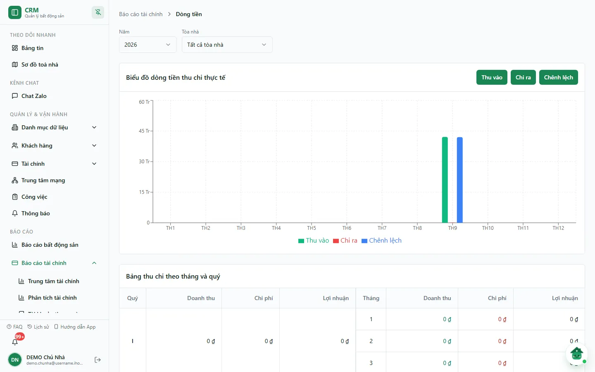
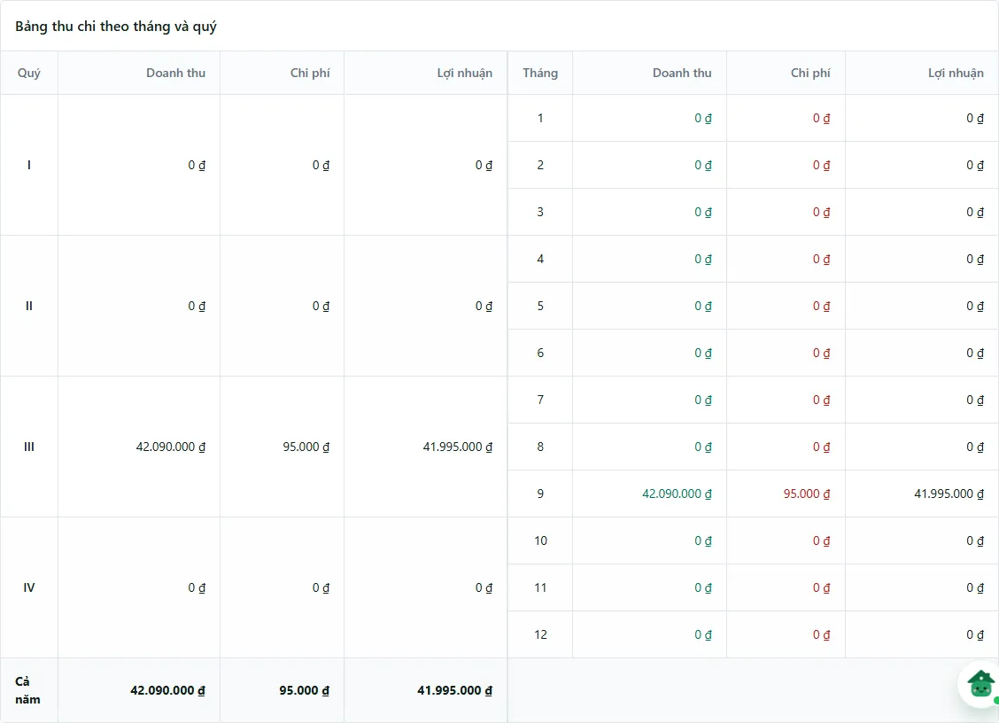

# Báo cáo: Dòng tiền

Báo cáo **Dòng tiền** cộng các bút toán đã ghi sổ vào/ra sổ quỹ theo từng tháng và quý của một năm, rồi hiện **Thu vào**, **Chi ra** và **Chênh lệch**. Chỉ phiếu ở trạng thái **Đã Thu/Đã Chi** mới được tính; phiếu mới được duyệt nhưng chưa ghi sổ không làm thay đổi số.

::: info Điều kiện tiên quyết
- Tài khoản có quyền **Báo cáo Dòng tiền** (`reports_finance.cash_flow`).
- Số chỉ cộng các sổ quỹ mà tài khoản được phép xem số dư.
:::

## Hướng dẫn từng bước

**Bước 1**: Tại thanh bên trái, ấn **Báo cáo tài chính** => **Dòng tiền**. Chọn **Năm** (năm hiện tại và 4 năm trước) và **Tòa nhà** (**Tất cả tòa nhà** hoặc một toà).

Khung **Biểu đồ dòng tiền thu chi thực tế** vẽ 12 cột tháng (TH1…TH12). Ba nút **Thu vào**, **Chi ra**, **Chênh lệch** ở góc phải bật/tắt từng chuỗi trên biểu đồ.

**Bước 2**: Cuộn xuống bảng **Bảng thu chi theo tháng và quý**. Nửa trái là tổng theo quý (I–IV), nửa phải là từng tháng; dòng cuối **Cả năm** là tổng năm.

::: warning Tên cột của bảng dễ gây hiểu nhầm
Bảng dùng tiêu đề **Doanh thu / Chi phí / Lợi nhuận**, nhưng số trong đó vẫn là **Thu vào / Chi ra / Chênh lệch** của dòng tiền — cùng nguồn với biểu đồ. Đây **không** phải doanh thu, chi phí hay lợi nhuận kinh doanh: tiền cọc nhận vào cũng nằm trong cột "Doanh thu" của bảng này. Muốn xem lãi/lỗ, dùng [Phân tích tài chính](/04-bao-cao/phan-tich-tai-chinh/).
:::

Ảnh chụp ngày 07/10/2026 (DEMO, năm 2026, tất cả toà): chỉ tháng 9 có phát sinh — thu vào 42.090.000 ₫, chi ra 95.000 ₫, chênh lệch 41.995.000 ₫; các tháng khác bằng 0 ₫.

## Nguồn số

- Cộng các bút toán ghi sổ và bút toán đảo chiều theo dấu tiền: dấu tăng vào **Thu vào**, dấu giảm vào **Chi ra**.
- Xếp vào tháng theo **ngày ghi sổ**, không theo kỳ áp dụng của hoá đơn.
- Không coi một phiếu chỉ mới **đã duyệt** là tiền đã di chuyển.

## Cách đọc đúng

- **Thu vào** là tiền làm tăng sổ quỹ.
- **Chi ra** là tiền làm giảm sổ quỹ.
- **Chênh lệch** là dòng tiền ròng trong tháng/quý/năm.
- Đây không phải báo cáo doanh thu, chi phí hay lợi nhuận.

::: warning Chuyển nội bộ và sổ nội bộ
Báo cáo cộng mọi sổ quỹ được phép xem; không có ô chọn sổ. Một lần chuyển tiền nội bộ giữa hai sổ hiện ở cả hai phía nên có thể làm tổng thu/chi phình lên dù tiền toàn tổ chức không đổi. Muốn xem riêng một sổ, dùng [Sổ quỹ theo ngày](/04-bao-cao/so-quy-ngay/) và chọn sổ đó.
:::

## So với Phân tích tài chính

[Phân tích tài chính](/04-bao-cao/phan-tich-tai-chinh/) đo lãi/lỗ theo phiếu đã duyệt, mặc định dồn tích và loại cọc. Báo cáo Dòng tiền trả lời **tiền đã thật sự vào/ra sổ khi nào**; Phân tích tài chính trả lời **doanh thu, chi phí thuộc kỳ nào**. Hai con số không bắt buộc bằng nhau.

## Tình huống & lỗi thường gặp

| Tình huống | Nguyên nhân & cách xử lý |
|---|---|
| Phiếu đã duyệt nhưng tháng vẫn 0 ₫ | Phiếu chưa ghi sổ (chưa **Đã Thu/Đã Chi**). Kiểm tra ở [Thu chi](/03-quan-ly-van-hanh/thu-chi/). |
| Tổng thu cao hơn doanh thu ở Phân tích tài chính | Dòng tiền gồm cả cọc và chuyển nội bộ; Phân tích tài chính loại cọc. |
| Chọn một toà thì số giảm mạnh | Lọc toà dựa trên toà ghi trên phiếu; bút toán không gắn phiếu có toà sẽ không vào khi lọc theo toà. |

## Quy trình liên quan

- [Sổ quỹ theo ngày](/04-bao-cao/so-quy-ngay/)
- [Thu chi](/03-quan-ly-van-hanh/thu-chi/)
- [Phân tích tài chính](/04-bao-cao/phan-tich-tai-chinh/)
- [Bàn giao tiền & đối soát](/03-quan-ly-van-hanh/ban-giao-doi-soat/)
