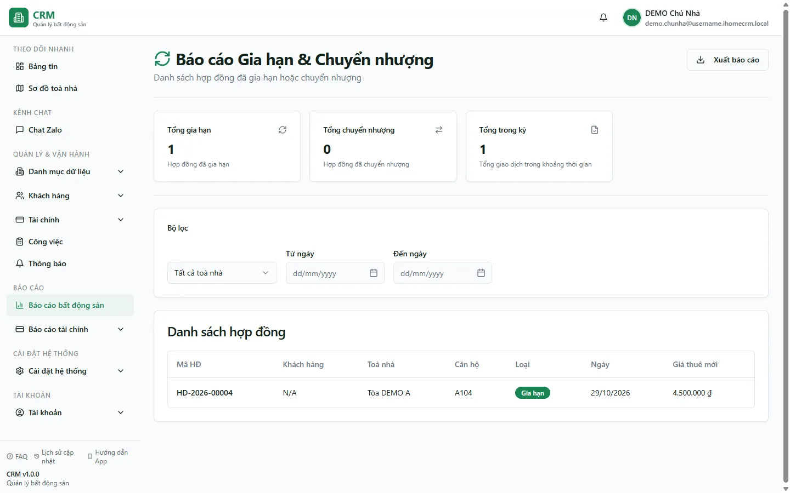

# Báo cáo: Gia hạn & chuyển nhượng

Route cần `reports_real_estate.renewals_transfers`. Hook hợp nhất hai nguồn khác nhau thành một bảng rồi sắp xếp mới nhất trước.

## Nguồn “Gia hạn”

- Bảng `contract_extensions`.
- Chỉ status `APPROVED` hoặc `COMPLETED`.
- Hợp đồng liên quan phải tồn tại và chưa xóa.
- Khoảng ngày lọc trên `extension_date`.
- Giá thuê mới = `new_rent_price`, fallback `contracts.rent_price`.
- Một hợp đồng gia hạn nhiều lần tạo nhiều dòng; thẻ **Tổng gia hạn** đếm sự kiện, không đếm hợp đồng duy nhất.

## Nguồn “Chuyển nhượng”

- Bảng `contracts` với `status = TRANSFERRED`, chưa xóa.
- Khoảng ngày trong truy vấn lọc trên `start_date`.
- Dòng hiển thị sau đó lại gán cột **Ngày** bằng `updated_at`.

::: warning Mốc lọc và mốc hiển thị của chuyển nhượng không đồng nhất
Một hợp đồng TRANSFERRED được đưa vào/loại khỏi kỳ theo `start_date`, nhưng cột Ngày và thứ tự bảng dùng `updated_at`. Vì vậy ngày nhìn thấy có thể nằm ngoài khoảng đã chọn. Đây là hành vi hiện tại, không nên mô tả bộ lọc như đang lọc theo ngày chuyển nhượng thực tế.
:::

Luồng chuyển phòng hiện đại có thể giữ HĐ `ACTIVE` và ghi `contract_transfers`; report này không đọc bảng đó, nên không phải mọi sự kiện chuyển phòng/chuyển khách đều xuất hiện.

## Bộ lọc, thẻ và xuất

- Từ ngày/đến ngày để trống = toàn lịch sử theo từng query.
- Tòa được lọc client-side sau khi gộp hai nguồn.
- Thẻ: tổng gia hạn, tổng chuyển nhượng, tổng giao dịch.
- Khách là đại diện trong `contract_customers`, fallback khách đầu tiên.
- File `bao-cao-gia-han-chuyen-nhuong` gồm mã HĐ, khách, tòa, phòng, loại, ngày và giá thuê.

## Giới hạn

- Hai query không có phân trang rõ ràng, có thể chịu cap API.
- Report không de-duplicate theo hợp đồng.
- Chuyển nhượng được suy từ trạng thái hiện tại của HĐ, không phải ledger sự kiện hoàn chỉnh.

## Quy trình liên quan

- [Hợp đồng sắp hết hạn](/04-bao-cao/hd-sap-het-han/)
- [Gia hạn & chuyển phòng](/03-quan-ly-van-hanh/gia-han-chuyen-phong/)
- [Chi tiết hợp đồng](/03-quan-ly-van-hanh/hop-dong-chi-tiet/)
