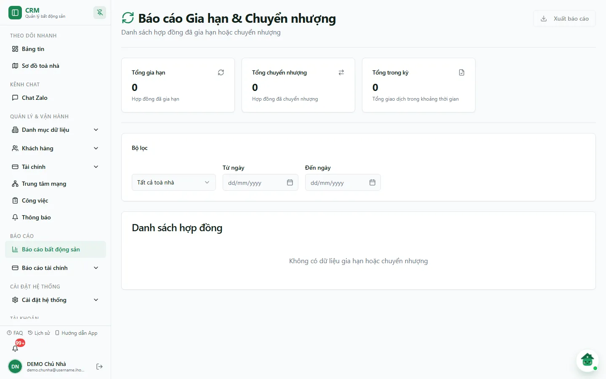

# Báo cáo: Gia hạn & chuyển nhượng

Màn **Báo cáo Gia hạn & Chuyển nhượng** gộp hai nguồn khác nhau vào một bảng: các lần gia hạn hợp đồng đã duyệt và các hợp đồng đang ở trạng thái **Đã chuyển nhượng**. Dùng để xem trong một khoảng thời gian có bao nhiêu hợp đồng được gia hạn/chuyển nhượng và giá thuê mới.

::: info Điều kiện tiên quyết
- Quyền **Báo cáo Gia hạn & chuyển nhượng** (`reports_real_estate.renewals_transfers`).
:::

## Hướng dẫn từng bước

**Bước 1**: Tại menu bên trái, ấn **Báo cáo bất động sản** => thẻ **Căn hộ gia hạn, chuyển nhượng** => **Xem báo cáo →**.

**Bước 2**: Nhập **Từ ngày** và/hoặc **Đến ngày** (dạng dd/mm/yyyy). Để trống cả hai = xem toàn bộ lịch sử.

**Bước 3**: Nếu cần, chọn một toà ở ô **Tất cả toà nhà**.

**Bước 4**: Đọc bảng **Danh sách hợp đồng**; ấn **Xuất báo cáo** để lấy file `bao-cao-gia-han-chuyen-nhuong` (Excel/CSV) gồm mã HĐ, khách hàng, toà nhà, căn hộ, loại, ngày và giá thuê mới.

Snapshot DEMO ngày 07/10/2026: không có bản ghi gia hạn đã duyệt và không có hợp đồng **TRANSFERRED**, nên cả ba thẻ bằng 0 và bảng hiện “Không có dữ liệu gia hạn hoặc chuyển nhượng”.

## Nguồn “Gia hạn”

- Bảng gia hạn hợp đồng, chỉ lấy bản ghi trạng thái **APPROVED** hoặc **COMPLETED**; hợp đồng liên quan phải còn (chưa xoá).
- Khoảng ngày lọc theo **ngày gia hạn**.
- **Giá thuê mới** = giá thuê mới của lần gia hạn; nếu trống thì lấy giá thuê hiện tại của hợp đồng.
- Một hợp đồng gia hạn nhiều lần tạo nhiều dòng; thẻ **Tổng gia hạn** đếm số lần gia hạn, không đếm hợp đồng duy nhất.

## Nguồn “Chuyển nhượng”

- Hợp đồng chưa xoá có trạng thái **TRANSFERRED**.
- Khoảng ngày lọc theo **ngày bắt đầu** của hợp đồng, nhưng cột **Ngày** lại hiển thị **ngày cập nhật cuối** của hợp đồng.

::: warning Mốc lọc và mốc hiển thị của chuyển nhượng không giống nhau
Một hợp đồng chuyển nhượng được đưa vào/loại khỏi kỳ theo ngày bắt đầu, còn cột **Ngày** và thứ tự bảng dùng ngày cập nhật cuối. Vì vậy ngày nhìn thấy có thể nằm ngoài khoảng đã chọn; đừng hiểu bộ lọc là “lọc theo ngày chuyển nhượng thực tế”.
:::

Luồng [chuyển phòng/sang nhượng](/03-quan-ly-van-hanh/gia-han-chuyen-phong/) hiện tại có thể giữ hợp đồng ở trạng thái ACTIVE và ghi sự kiện vào bảng chuyển nhượng riêng; báo cáo này không đọc bảng đó, nên không phải mọi lần chuyển phòng/chuyển khách đều xuất hiện.

## Thẻ số và cột

| Thành phần | Ý nghĩa |
|---|---|
| **Tổng gia hạn** | Số dòng loại Gia hạn. |
| **Tổng chuyển nhượng** | Số dòng loại Chuyển nhượng. |
| **Tổng trong kỳ** | Tổng hai loại. |
| Bảng | **Mã HĐ**, **Khách hàng** (người đại diện, nếu không có thì khách đầu tiên), **Toà nhà**, **Căn hộ**, **Loại** (nhãn **Gia hạn**/**Chuyển nhượng**), **Ngày**, **Giá thuê mới**. Sắp mới nhất trước. |

## Tình huống & lỗi thường gặp

| Tình huống | Nguyên nhân & cách xử lý |
|---|---|
| Đã gia hạn nhưng không thấy dòng | Lần gia hạn chưa ở trạng thái đã duyệt/hoàn tất, hoặc ngày gia hạn nằm ngoài khoảng lọc. |
| Đã chuyển phòng nhưng không thấy dòng | Hợp đồng vẫn ACTIVE (luồng chuyển mới); báo cáo chỉ đọc hợp đồng TRANSFERRED. |
| Một hợp đồng xuất hiện nhiều lần | Mỗi lần gia hạn là một dòng; báo cáo không gộp theo hợp đồng. |

Giới hạn kỹ thuật: hai truy vấn không phân trang, có thể chạm giới hạn số dòng của API khi dữ liệu rất lớn; lọc toà chạy trên trình duyệt sau khi gộp.

## Quy trình liên quan

- [Hợp đồng sắp hết hạn](/04-bao-cao/hd-sap-het-han/)
- [Gia hạn & chuyển phòng](/03-quan-ly-van-hanh/gia-han-chuyen-phong/)
- [Chi tiết hợp đồng](/03-quan-ly-van-hanh/hop-dong-chi-tiet/)
