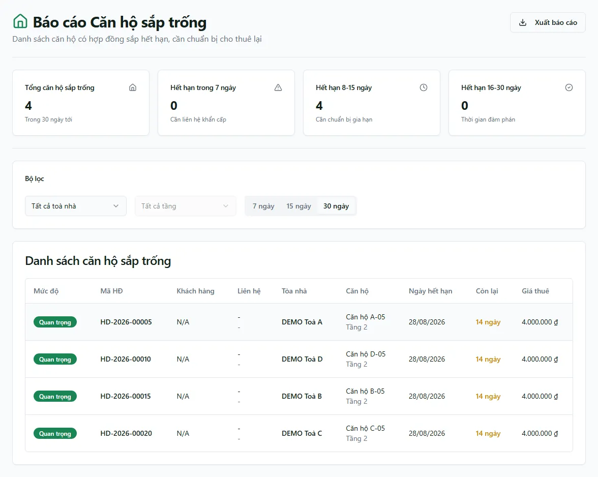

# Báo cáo: Hợp đồng sắp hết hạn

Trong ứng dụng, trang mang tên **Báo cáo Căn hộ sắp trống**. Cả route chính và alias cần `reports_real_estate.expiring`.

Snapshot production ngày 13/08/2026 ở cửa sổ mặc định 30 ngày có **4 dòng**: `HD-2026-00005`, `HD-2026-00010`, `HD-2026-00015`, `HD-2026-00020`; cả bốn cùng có ngày kết thúc **28/08/2026**. Đây là dữ liệu tại thời điểm chụp, không phải fixture cố định.

## Điều kiện dữ liệu

Hook truy vấn `contracts`:

- `status = ACTIVE`.
- `deleted_at IS NULL`.
- `end_date >= thời điểm hiện tại` và `end_date <= hiện tại + N ngày`.
- Sắp xếp `end_date` tăng dần.

N được chọn bằng tab 7, 15 hoặc 30 ngày; mặc định 30. `days_left` được tính ở trình duyệt bằng chênh lệch ngày giữa `end_date` và thời điểm hiện tại.

::: warning Không tính ngày hết hạn hiệu lực sau gia hạn
Report này đọc trực tiếp `contracts.end_date`; nó không gọi `occupancy_upcoming_vacancy_v2` và không áp bản ghi gia hạn để tạo `effective_end_date`. Nếu tổ chức đã gia hạn nhưng `end_date` chưa đồng bộ, dòng có thể vẫn xuất hiện. Muốn danh sách sắp trống đã tính gia hạn APPROVED/COMPLETED, dùng phần **Phòng sắp trống 30/60 ngày** trong [Tỷ lệ lấp đầy](/04-bao-cao/lap-day/).
:::

## Bộ lọc và thẻ số

- Tòa và tầng được lọc client-side sau truy vấn hợp đồng.
- Chọn tòa mới bật danh sách tầng và reset tầng đã chọn.
- Bốn thẻ: tổng trong cửa sổ đang chọn, hết hạn ≤7, 8–15 và 16–30 ngày.
- Nếu chọn cửa sổ 7 hoặc 15 ngày, các thẻ ở khoảng xa hơn đương nhiên có thể bằng 0.

Bảng hiển thị mức khẩn cấp, mã HĐ, khách/liên hệ, tòa, phòng/tầng, ngày hết hạn, số ngày còn lại và giá thuê. Nút **Xuất** tạo `bao-cao-can-ho-sap-trong`.

## Giới hạn

- Truy vấn không phân trang rõ ràng; tập lớn có thể chịu cap API.
- Khoảng thời gian được tạo bằng `Date`/ISO timestamp trong khi `end_date` là dữ liệu ngày; số ngày sát biên có thể phụ thuộc thời điểm chạy và múi giờ.
- Hợp đồng không còn ACTIVE không xuất hiện, kể cả còn ngày kết thúc trong cửa sổ.

## Quy trình liên quan

- [Gia hạn & chuyển nhượng](/04-bao-cao/gia-han-chuyen-nhuong/)
- [Tỷ lệ lấp đầy](/04-bao-cao/lap-day/)
- [Gia hạn & chuyển phòng](/03-quan-ly-van-hanh/gia-han-chuyen-phong/)
