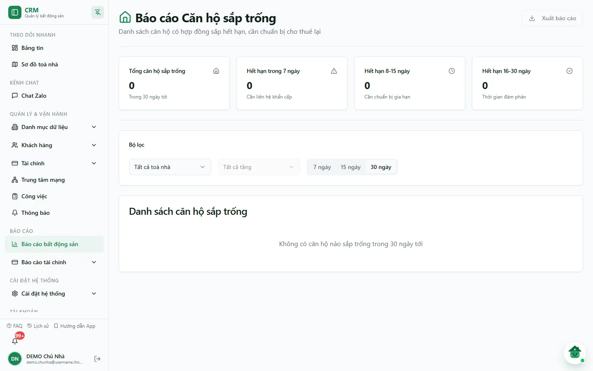

# Báo cáo: Hợp đồng sắp hết hạn

Trong ứng dụng, màn này mang tên **Báo cáo Căn hộ sắp trống** — “Danh sách căn hộ có hợp đồng sắp hết hạn, cần chuẩn bị cho thuê lại”. Dùng để biết khách nào cần liên hệ gia hạn trong 7, 15 hoặc 30 ngày tới. Route chính `/reports/real-estate/expiring-contracts` và đường dẫn rút gọn `/reports/real-estate/expiring` (thẻ trên trang tổng quan đang trỏ tới) mở cùng một màn.

::: info Điều kiện tiên quyết
- Quyền **Báo cáo HĐ sắp hết hạn** (`reports_real_estate.expiring`).
:::

## Hướng dẫn từng bước

**Bước 1**: Tại menu bên trái, ấn **Báo cáo bất động sản** => thẻ **Căn hộ sắp trống** => **Xem báo cáo →**.

**Bước 2**: Chọn cửa sổ thời gian bằng ba nút **7 ngày**, **15 ngày**, **30 ngày** (mặc định **30 ngày**).

**Bước 3**: Nếu cần, chọn toà ở ô **Tất cả toà nhà**, rồi chọn tầng ở ô **Tất cả tầng** (chỉ bấm được sau khi đã chọn toà; đổi toà sẽ xoá tầng đã chọn).

**Bước 4**: Liên hệ khách theo cột **Mức độ** và **Còn lại**; khi cần, ấn **Xuất báo cáo** để lấy file `bao-cao-can-ho-sap-trong` (Excel/CSV).

Snapshot DEMO ngày 07/10/2026: cửa sổ 30 ngày **không có hợp đồng nào**, màn hiện “Không có căn hộ nào sắp trống trong 30 ngày tới” và nút **Xuất báo cáo** bị mờ.

## Điều kiện dữ liệu

Báo cáo đọc trực tiếp bảng hợp đồng:

- Trạng thái `ACTIVE`, chưa xoá.
- Ngày kết thúc (`end_date`) từ thời điểm hiện tại đến hiện tại + N ngày (N = 7/15/30).
- Sắp xếp theo ngày kết thúc tăng dần; **Còn lại** = số ngày từ hôm nay tới ngày kết thúc.

::: warning Không tính ngày hết hạn sau gia hạn
Báo cáo này đọc thẳng `end_date` của hợp đồng, không áp các bản ghi gia hạn đã duyệt. Muốn danh sách sắp trống đã tính gia hạn **APPROVED/COMPLETED**, dùng khối **Phòng sắp trống (HĐ hết hiệu lực, đã tính gia hạn)** trong [Tỷ lệ lấp đầy](/04-bao-cao/lap-day/).
:::

## Thẻ số và cột

| Thành phần | Ý nghĩa |
|---|---|
| **Tổng căn hộ sắp trống** | Số hợp đồng trong cửa sổ đang chọn (“Trong N ngày tới”). |
| **Hết hạn trong 7 ngày** / **Hết hạn 8-15 ngày** / **Hết hạn 16-30 ngày** | Chia theo số ngày còn lại; chọn cửa sổ 7 hoặc 15 ngày thì các thẻ xa hơn đương nhiên bằng 0. |
| **Mức độ** | **Khẩn cấp** (≤7 ngày), **Quan trọng** (8–15), **Bình thường** (>15). |
| Các cột khác | **Mã HĐ**, **Khách hàng**, **Liên hệ** (điện thoại, email), **Tòa nhà**, **Căn hộ** (kèm tầng), **Ngày hết hạn**, **Còn lại**, **Giá thuê**. |

## Tình huống & lỗi thường gặp

| Tình huống | Nguyên nhân & cách xử lý |
|---|---|
| Hợp đồng đã gia hạn vẫn xuất hiện | `end_date` chưa được cập nhật theo gia hạn; đối chiếu khối sắp trống trong báo cáo Lấp đầy. |
| Cột **Khách hàng** hiện “N/A” | Báo cáo lấy khách từ trường khách chính (`tenant_id`) của hợp đồng; hợp đồng chỉ lưu khách trong danh sách người thuê sẽ hiện N/A. Xem khách ở [chi tiết hợp đồng](/03-quan-ly-van-hanh/hop-dong-chi-tiet/). |
| Hợp đồng quá hạn mà vẫn ACTIVE không có trong danh sách | Báo cáo chỉ lấy ngày kết thúc từ hôm nay trở đi; hợp đồng đã quá hạn nằm ngoài cửa sổ. |
| Số ngày sát biên lệch 1 | Khoảng ngày tính theo thời điểm chạy, trong khi ngày kết thúc là ngày; số ngày sát biên có thể lệch tuỳ giờ mở báo cáo. |

## Quy trình liên quan

- [Gia hạn & chuyển nhượng](/04-bao-cao/gia-han-chuyen-nhuong/)
- [Tỷ lệ lấp đầy](/04-bao-cao/lap-day/)
- [Gia hạn & chuyển phòng](/03-quan-ly-van-hanh/gia-han-chuyen-phong/)
