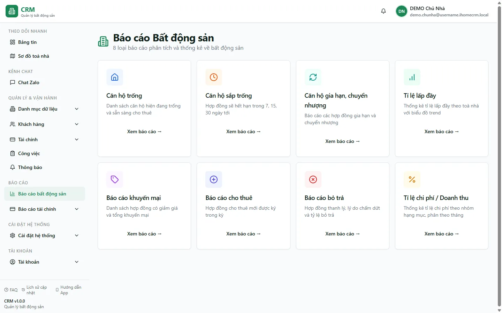

# Báo cáo bất động sản (tổng quan)

Trang **Báo cáo bất động sản** là **điểm vào (hub)** gom **8 báo cáo vận hành** về phòng và hợp đồng của bạn — từ *phòng nào đang trống*, *hợp đồng nào sắp hết hạn*, *tỉ lệ lấp đầy theo toà* cho tới *khuyến mãi đang chạy* và *tỉ lệ chi phí trên doanh thu*. Bản thân trang này chỉ là **lưới điều hướng**: nó không có số liệu riêng và không ghi gì vào sổ — bạn bấm vào từng thẻ để mở đúng báo cáo cần xem. Trang dành cho **chủ nhà**, **kế toán** và **quản lý toà** muốn nhìn nhanh sức khoẻ cho thuê rồi đi sâu vào từng báo cáo.

::: info Điều kiện tiên quyết
- Bạn có quyền mở nhóm **Báo cáo bất động sản** (nhóm quyền `reports_real_estate`). Mỗi báo cáo con có thể được cấp/khoá riêng theo từng loại; nếu thiếu quyền một loại, thẻ tương ứng vẫn hiện nhưng khi mở sẽ báo không đủ quyền.
- Đã có **toà nhà và phòng** (xem [Tạo toà nhà](/01-bat-dau/tao-toa-nha/), [Tạo tầng & phòng](/01-bat-dau/tao-tang-phong/)) và ít nhất vài **hợp đồng** để các báo cáo có dữ liệu — nếu chưa có, các bảng sẽ trống, đó là trạng thái bình thường.
:::

## Cách mở

**Bước 1**: Ở menu bên trái, nhóm **BÁO CÁO**, ấn chọn **Báo cáo** => **Báo cáo bất động sản**. Màn hình mở ra một lưới **8 thẻ báo cáo**, phía trên có tiêu đề *Báo cáo Bất động sản* và dòng *8 loại báo cáo phân tích và thống kê về bất động sản*. Mỗi thẻ có tên báo cáo, một câu mô tả và liên kết **Xem báo cáo →**.

**Bước 2**: Bấm liên kết **Xem báo cáo →** trên thẻ bạn cần để đi vào báo cáo chi tiết. Bấm mục **Báo cáo bất động sản** ở menu trái bất cứ lúc nào để quay lại lưới hub này.

## Tám báo cáo trong nhóm

Mỗi hàng dưới đây là một thẻ trên lưới. Bấm tên báo cáo để mở trang hướng dẫn chi tiết của loại đó.

| Báo cáo (bấm để mở) | Cho biết gì | Ví dụ với dữ liệu demo |
| --- | --- | --- |
| **[Căn hộ trống](/04-bao-cao/phong-trong/)** | Danh sách phòng đang trống & sẵn sàng cho thuê, kèm **số ngày trống** tô màu theo ngưỡng 7 / 30 ngày. **Đã loại** phòng cọc giữ chỗ. | Toà **DEMO A/B** đang có nhiều căn trống; hai phòng **A301/A302** đang giữ chỗ nên **không** nằm trong danh sách này. |
| **[Căn hộ sắp trống (HĐ sắp hết hạn)](/04-bao-cao/hd-sap-het-han/)** | Hợp đồng **đang hiệu lực** sẽ hết hạn trong **7 / 15 / 30** ngày tới, để bạn chủ động gia hạn hoặc chào thuê lại. | HĐ phòng **A103** còn khoảng **21 ngày** là hết hạn → xuất hiện ở mốc 30 ngày. |
| **[Gia hạn / chuyển nhượng](/04-bao-cao/gia-han-chuyen-nhuong/)** | Hợp đồng **đã gia hạn** (suy từ lịch sử gia hạn) và hợp đồng **đã chuyển nhượng** trong kỳ. | HĐ phòng **A104** đã gia hạn → hiện ở nhóm gia hạn. |
| **[Tỉ lệ lấp đầy](/04-bao-cao/lap-day/)** | **% phòng đang thuê** theo từng toà + biểu đồ xu hướng (trend) 12 tháng; tách riêng nhóm **Đã cọc** và **Bảo dưỡng**. | **8 phòng đang thuê** ở DEMO A/B; hai phòng cọc giữ chỗ tách thành nhóm *Đã cọc*. |
| **[Khuyến mại](/04-bao-cao/khuyen-mai/)** | Danh sách hợp đồng có **giảm giá** và **tổng khuyến mãi** đang áp dụng. | HĐ phòng **A105** có khuyến mãi → hiện trong danh sách. |
| **[Cho thuê mới](/04-bao-cao/cho-thue-moi/)** | Hợp đồng **mới được ký trong kỳ** (theo ngày ký), để đo tốc độ lấp phòng. | Các HĐ mới ký của khách như **Nguyễn Văn A** trong tháng được liệt kê. |
| **[Bỏ trả / thanh lý](/04-bao-cao/thanh-ly/)** | Hợp đồng **thanh lý / chấm dứt**, kèm lý do và **tỷ lệ bỏ trả**. | Khi có phòng khách trả trước hạn, dòng thanh lý và lý do sẽ hiện ở đây. |
| **[Tỉ lệ chi phí / Doanh thu](/04-bao-cao/ty-le-chi-phi/)** | Thống kê **chi phí theo nhóm hạng mục** so với **doanh thu thực thu**, phân theo tháng. | So sánh chi phí sửa chữa/vận hành với doanh thu thu được từ DEMO A/B. |

## Bộ lọc & cách đọc số

Lưới hub **không có bộ lọc** — mọi bộ lọc nằm **bên trong từng báo cáo con**. Khi mở một báo cáo, bạn thường gặp các bộ lọc chung sau (đọc để không hiểu nhầm số):

| Cột / Chỉ số | Ý nghĩa |
| --- | --- |
| Ô **Tất cả toà nhà** | Lọc theo một toà. Là combobox **gõ để tìm**, **đơn-chọn phẳng** (chọn đúng 1 toà hoặc để trống xem tất cả), ví dụ chọn **Tòa DEMO A**. |
| Ô **Tất cả tầng** | Lọc thêm theo tầng trong toà đã chọn (có ở báo cáo phòng trống, sắp hết hạn…). |
| **Số ngày** (7 / 15 / 30) | Ở báo cáo *Căn hộ sắp trống*: khoảng thời gian tới hạn cần cảnh báo. |
| **Số ngày trống** | Phòng đã trống bao lâu; tô màu theo ngưỡng **7 / 30 ngày** để bạn ưu tiên phòng trống lâu. |
| **Trạng thái** phòng | `AVAILABLE` = sẵn sàng cho thuê; phòng **cọc giữ chỗ** mang trạng thái `RESERVED` và **không** tính là trống cũng **không** tính là đã thuê. |
| **% lấp đầy** | Phòng đang thuê ÷ tổng phòng, sau khi tách nhóm **Đã cọc** và **Bảo dưỡng** ra khỏi mẫu số. |
| **Giảm giá / Khuyến mãi** | Tổng phần giảm trên hợp đồng (báo cáo Khuyến mại). |
| **Tỉ lệ chi phí** | Σ chi phí của nhóm hạng mục ÷ doanh thu **thực thu** trong tháng (không lấy tổng hoá đơn chưa thu). |

## Nguồn số liệu

- **Hub chỉ là lưới điều hướng tĩnh** — không tự tính hay lưu con số nào; toàn bộ số liệu do **từng báo cáo con** tính ra khi bạn mở.
- Các báo cáo đọc **trực tiếp dữ liệu vận hành**: danh sách phòng, hợp đồng (chỉ đếm hợp đồng **đang hiệu lực – ACTIVE** cho các số "đang thuê"/"sắp hết hạn"), **lịch sử gia hạn** và **sổ thu chi**.
- **Gia hạn** được suy từ **lịch sử gia hạn hợp đồng**, không dựa vào trạng thái hợp đồng — một HĐ đã gia hạn vẫn **giữ trạng thái ACTIVE**.
- **Phòng cọc giữ chỗ** (`RESERVED`) là **bucket riêng**: bị loại khỏi báo cáo phòng trống và tách khỏi số "đang thuê" ở báo cáo lấp đầy.
- **Tỉ lệ chi phí / Doanh thu** lấy mẫu số là **doanh thu thực thu** (các phiếu thu đã duyệt trong tháng), không phải tổng hoá đơn — nên phản ánh tiền thật đã vào.
- Chi tiết mạch nghiệp vụ của cả nhóm được mô tả trong tài liệu hệ thống *Báo cáo · Dashboard · Thông báo* (`docs/he-thong/13-bao-cao-dashboard-thong-bao.md`).

## Xuất & mẹo

- **Xuất file** làm ở **từng báo cáo con**: mở báo cáo → bấm **Xuất báo cáo** ở góc phải trên. Trang hub này không có nút xuất.
- **Bộ lọc được giữ khi tải lại trang (F5)**: chọn toà/tầng/khoảng ngày trong một báo cáo rồi F5, hệ thống nhớ lại lựa chọn của bạn.
- **Mẹo theo dõi định kỳ**: mỗi tuần mở trước **[Căn hộ sắp trống](/04-bao-cao/hd-sap-het-han/)** để không bị động khi HĐ hết hạn (ví dụ **A103** còn ~21 ngày), rồi soi **[Căn hộ trống](/04-bao-cao/phong-trong/)** để đẩy phòng trống lâu.
- Muốn xem bức tranh **tiền và công nợ** thay vì phòng/hợp đồng, sang nhóm **[Báo cáo tài chính](/04-bao-cao/hub-tai-chinh/)**.

## Thử trực tiếp trên sandbox

<SandboxTry account="demo.chunha" app-path="/reports/real-estate" app-label="Mở lưới Báo cáo bất động sản" view-only>

Mở trang **Báo cáo bất động sản** và quan sát (không thao tác ghi gì):

1. Ở đầu trang, **hãy nhìn thấy** tiêu đề *Báo cáo Bất động sản* và dòng *8 loại báo cáo phân tích và thống kê về bất động sản*.
2. **Hãy nhìn thấy đủ 8 thẻ**: Căn hộ trống, Căn hộ sắp trống, Căn hộ gia hạn/chuyển nhượng, Tỉ lệ lấp đầy, Khuyến mại, Cho thuê mới, Bỏ trả, Tỉ lệ chi phí / Doanh thu — mỗi thẻ đều có liên kết **Xem báo cáo →**.
3. Bấm **Xem báo cáo →** trên thẻ **Căn hộ trống**: **hãy nhìn thấy** danh sách phòng trống của **Tòa DEMO A/B** và để ý hai phòng cọc giữ chỗ **A301/A302** **không** có trong danh sách.
4. Quay lại hub, bấm **Căn hộ sắp trống**: **hãy nhìn thấy** hợp đồng phòng **A103** (còn ~21 ngày) trong mốc 30 ngày tới.

Đây là bài **chỉ xem** để làm quen cách điều hướng giữa hub và các báo cáo con — bạn không thay đổi dữ liệu nào.

</SandboxTry>

## Quy trình liên quan

- [Báo cáo tài chính (tổng quan)](/04-bao-cao/hub-tai-chinh/) — nhóm hub song song, tập trung vào tiền và công nợ thay vì phòng/hợp đồng.
- [Căn hộ trống](/04-bao-cao/phong-trong/) · [HĐ sắp hết hạn](/04-bao-cao/hd-sap-het-han/) · [Tỉ lệ lấp đầy](/04-bao-cao/lap-day/) — ba báo cáo được xem thường xuyên nhất trong nhóm.
- [Hợp đồng](/03-quan-ly-van-hanh/hop-dong/) — nơi quản lý hợp đồng mà các báo cáo này tổng hợp lại (ký mới, gia hạn, chuyển nhượng, thanh lý).
- [Đặt cọc](/03-quan-ly-van-hanh/dat-coc/) — vì sao phòng cọc giữ chỗ (A301/A302) bị tách khỏi báo cáo phòng trống và lấp đầy.
- [Giới thiệu hệ thống](/01-bat-dau/gioi-thieu/) — bức tranh tổng thể và cách các phân hệ nối vào báo cáo.
