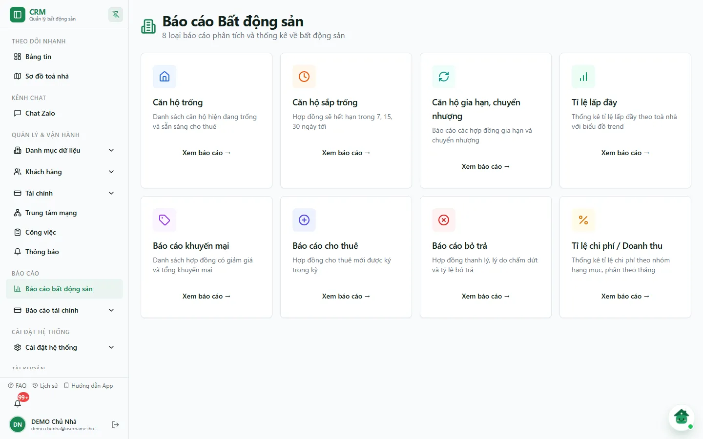

# Báo cáo bất động sản

Trang **Báo cáo Bất động sản** (`/reports/real-estate`) là lưới tám thẻ dẫn tới tám báo cáo về phòng, hợp đồng và chi phí. Bản thân trang không tính số liệu; mỗi thẻ mở một báo cáo riêng, có quyền riêng.

::: info Điều kiện tiên quyết
- Vào trang cần quyền **Vào trang báo cáo BĐS** (`reports_real_estate.view`).
- Mỗi báo cáo đích cần thêm quyền action riêng (bảng dưới); trong màn phân quyền vai trò, các quyền này nằm ở nhóm **Báo cáo → Báo cáo BĐS**.
:::

## Hướng dẫn từng bước

**Bước 1**: Tại thanh menu bên trái, mục **BÁO CÁO**, ấn chọn **Báo cáo bất động sản**. Màn hình hiện tiêu đề **Báo cáo Bất động sản** — “8 loại báo cáo phân tích và thống kê về bất động sản” — cùng tám thẻ.

**Bước 2**: Ấn **Xem báo cáo →** (hoặc bất kỳ chỗ nào trên thẻ) để mở báo cáo tương ứng.

## Tám thẻ và quyền

| Thẻ trên trang | Route chính | Quyền (action) | Trang hướng dẫn |
| --- | --- | --- | --- |
| Căn hộ trống | `/reports/real-estate/vacant-rooms` | `vacant_rooms` | [Phòng trống](/04-bao-cao/phong-trong/) |
| Căn hộ sắp trống | `/reports/real-estate/expiring-contracts` | `expiring` | [Hợp đồng sắp hết hạn](/04-bao-cao/hd-sap-het-han/) |
| Căn hộ gia hạn, chuyển nhượng | `/reports/real-estate/renewals-transfers` | `renewals_transfers` | [Gia hạn & chuyển nhượng](/04-bao-cao/gia-han-chuyen-nhuong/) |
| Tỉ lệ lấp đầy | `/reports/real-estate/occupancy` | `occupancy` | [Tỷ lệ lấp đầy](/04-bao-cao/lap-day/) |
| Báo cáo khuyến mại | `/reports/real-estate/promotions` | `promotions` | [Khuyến mãi](/04-bao-cao/khuyen-mai/) |
| Báo cáo cho thuê | `/reports/real-estate/new-leases` | `new_leases` | [Cho thuê mới](/04-bao-cao/cho-thue-moi/) |
| Báo cáo bỏ trả | `/reports/real-estate/terminations` | `terminations` | [Thanh lý / bỏ trả](/04-bao-cao/thanh-ly/) |
| Tỉ lệ chi phí / Doanh thu | `/reports/real-estate/expense-ratio` | `expense_ratio` | [Tỷ lệ chi phí](/04-bao-cao/ty-le-chi-phi/) |

Thẻ **Căn hộ trống** và **Căn hộ sắp trống** trên lưới hiện trỏ tới đường dẫn rút gọn `/reports/real-estate/vacant` và `/reports/real-estate/expiring`; hai đường dẫn này mở đúng màn của route chính và cần cùng quyền. `/reports/real-estate/occupancy-new` chỉ còn là đường chuyển hướng về `/reports/real-estate/occupancy`.

::: warning Thấy thẻ không có nghĩa là được xem
Trang render đủ tám thẻ cho mọi người vào được trang, không lọc theo quyền. Nếu tài khoản thiếu action của một báo cáo, bấm thẻ đó sẽ bị chặn ở route và đưa về trang chủ.
:::

## Các tính năng chung của tám báo cáo

| Thành phần | Công dụng |
|---|---|
| Hàng thẻ số ở đầu trang | Tóm tắt nhanh; chỉ hiện khi dữ liệu đã tải xong (lúc chờ là các khối xám). |
| Khung **Bộ lọc** | Chọn toà nhà, tầng, khoảng ngày… tuỳ báo cáo. Lựa chọn được giữ lại khi tải lại trang (F5). |
| **Xuất báo cáo** | Mở menu **Chọn định dạng**: **Excel (.xlsx)**, **CSV (.csv)**; **PDF (chưa hỗ trợ)** bị mờ. Nút mờ khi chưa có dòng dữ liệu hoặc đang tải (“Chờ tải đủ dữ liệu để xuất báo cáo.”). |

Quyền **Xuất báo cáo BĐS** (`reports_real_estate.export`) có trong màn phân quyền, nhưng nút **Xuất báo cáo** của tám báo cáo hiện không kiểm quyền này: ai mở được báo cáo đều xuất được danh sách đang hiển thị.

## Chọn báo cáo theo câu hỏi

- Phòng nào đang không có hợp đồng hiệu lực: **Căn hộ trống**.
- Hợp đồng nào sắp hết hạn: **Căn hộ sắp trống**, hoặc khối **Phòng sắp trống 30/60 ngày** trong **Tỉ lệ lấp đầy** (khối này đã tính gia hạn).
- Bức tranh năm nhóm phòng, xu hướng 12 tháng và doanh thu bỏ lỡ: **Tỉ lệ lấp đầy**.
- Khách vào/ra trong kỳ: đối chiếu **Báo cáo cho thuê** với **Báo cáo bỏ trả**.
- Ưu đãi đã lưu trên hợp đồng: **Báo cáo khuyến mại**.
- Chi phí so với thu theo tháng (theo phiếu **đã duyệt**, chưa phải tiền đã chi/thu thật): **Tỉ lệ chi phí / Doanh thu**.

## Tình huống & lỗi thường gặp

| Tình huống | Nguyên nhân & cách xử lý |
|---|---|
| Bấm thẻ bị đưa về trang chủ | Tài khoản thiếu action của báo cáo đó. Nhờ quản trị bật quyền tương ứng trong vai trò. |
| Báo cáo trống | Có thể do bộ lọc (toà, khoảng ngày) hoặc tài khoản chỉ được xem một số toà. Bảng rỗng không chứng minh cả công ty không có dữ liệu. |
| Khung báo cáo báo lỗi tải | Bấm thử lại; nếu vẫn lỗi, chụp màn hình gửi quản trị. |

## Quy trình liên quan

- [Phòng trống](/04-bao-cao/phong-trong/)
- [Hợp đồng sắp hết hạn](/04-bao-cao/hd-sap-het-han/)
- [Tỷ lệ lấp đầy](/04-bao-cao/lap-day/)
- [Thanh lý / bỏ trả](/04-bao-cao/thanh-ly/)
