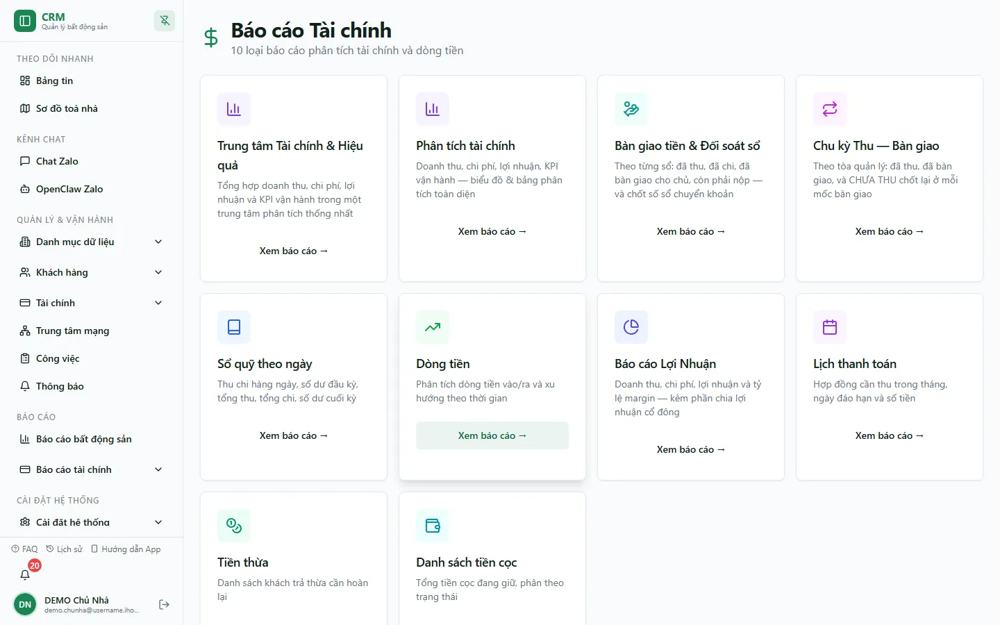

# Báo cáo tài chính

Hub `/reports/finance` trên deployment production được kiểm tra ngày 13/08/2026 hiển thị **10 loại báo cáo**. Mỗi thẻ báo cáo còn có action quyền riêng; mở được hub không đồng nghĩa mở được mọi báo cáo.

## 10 thẻ đang hiển thị

1. Trung tâm Tài chính & Hiệu quả
2. Phân tích tài chính (`analysis`)
3. Bàn giao tiền & Đối soát sổ (`handover_report`)
4. Chu kỳ Thu → Bàn giao (`collection_cycle`)
5. Sổ quỹ theo ngày (`daily_cashbook`)
6. Dòng tiền (`cash_flow`)
7. Báo cáo Lợi nhuận (`profit_distribution` và quyền tab liên quan)
8. Lịch thanh toán (`payment_schedule`)
9. Tiền thừa (`overpayment`)
10. Danh sách tiền cọc (`deposits_report`)

::: info Runtime đã kiểm tra
Ảnh trên là production với tổ chức DEMO và tài khoản `demo.chunha`; thẻ **Trung tâm Tài chính & Hiệu quả** đang được hiển thị. Ở tổ chức hoặc vai trò khác, thẻ có thể bị ẩn bởi điều kiện tổ chức/quyền riêng của route.
:::

## Chọn báo cáo đúng câu hỏi

- Muốn biết tiền đã vào/ra: dùng **Dòng tiền** hoặc **Sổ quỹ theo ngày**.
- Muốn biết lãi/lỗ: dùng **Phân tích tài chính**.
- Muốn kiểm tra cọc: ưu tiên luồng **Đặt cọc**; báo cáo danh sách cọc hiện là legacy.
- Muốn xem credit khách còn lại: không dùng **Tiền thừa** làm nguồn canonical.
- Muốn đối chiếu người đi thu/nộp: dùng **Chu kỳ Thu → Bàn giao**, rồi kiểm tra sổ quỹ để biết balance chính xác.
