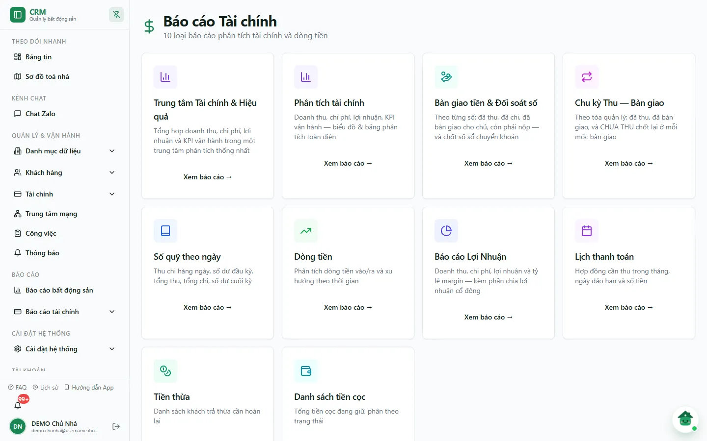

# Báo cáo tài chính

Trang **Báo cáo Tài chính** (`/reports/finance`) là cửa vào chung của các báo cáo tiền, lãi/lỗ, cọc và bàn giao. Mỗi thẻ mở một báo cáo riêng; mỗi báo cáo lại cần một quyền con riêng của module `reports_finance`, nên mở được trang này không có nghĩa là mở được mọi báo cáo.

::: info Điều kiện tiên quyết
- Tài khoản có quyền **Vào trang báo cáo tài chính** (`reports_finance.view`).
- Muốn mở từng báo cáo, cần thêm quyền con tương ứng (xem bảng bên dưới).
:::

## Hướng dẫn từng bước

**Bước 1**: Tại thanh bên trái, ấn **BÁO CÁO** => **Báo cáo tài chính** để mở danh sách báo cáo con, hoặc mở thẳng `/reports/finance`. Trang hiện tiêu đề **Báo cáo Tài chính** và dòng phụ cho biết số loại báo cáo đang hiển thị.

**Bước 2**: Ấn **Xem báo cáo →** trên thẻ cần xem. Nếu tài khoản thiếu quyền con của báo cáo đó, hệ thống không mở báo cáo mà đưa về trang chủ. Nếu chưa tải được danh sách quyền, màn báo **Không tải được quyền** kèm nút **Thử lại** — đây là lỗi tải, không phải bị thu hồi quyền.

## Các thẻ đang hiển thị

Ảnh chụp ngày 07/10/2026 với `demo.chunha` hiển thị **10 loại báo cáo**:

| Thẻ | Mở tới | Quyền con cần có |
|---|---|---|
| **Trung tâm Tài chính & Hiệu quả** | [Trung tâm tài chính](/04-bao-cao/trung-tam-tai-chinh/) | Chỉ hiện khi tài khoản thuộc tổ chức được bật trung tâm này |
| **Phân tích tài chính** | [Phân tích tài chính](/04-bao-cao/phan-tich-tai-chinh/) | `analysis` |
| **Bàn giao tiền & Đối soát sổ** | [Bàn giao tiền & đối soát](/03-quan-ly-van-hanh/ban-giao-doi-soat/) | `handover_report` |
| **Chu kỳ Thu — Bàn giao** | [Chu kỳ Thu — Bàn giao](/04-bao-cao/thu-ban-giao/) | `collection_cycle` |
| **Sổ quỹ theo ngày** | [Sổ quỹ theo ngày](/04-bao-cao/so-quy-ngay/) | `daily_cashbook` |
| **Dòng tiền** | [Dòng tiền](/04-bao-cao/dong-tien/) | `cash_flow` |
| **Báo cáo Lợi Nhuận** | [Báo cáo Lợi Nhuận & chia lợi nhuận cổ đông](/03-quan-ly-van-hanh/chia-loi-nhuan/) | Không chặn ở cửa vào; từng tab bên trong mở theo quyền riêng |
| **Lịch thanh toán** | [Lịch thanh toán](/04-bao-cao/lich-thanh-toan/) | `payment_schedule` |
| **Tiền thừa** | [Tiền thừa](/03-quan-ly-van-hanh/tien-thua/) | `overpayment` |
| **Danh sách tiền cọc** | [Danh sách tiền cọc](/04-bao-cao/danh-sach-coc/) | `deposits_report` |

Khi tổ chức không được bật **Trung tâm Tài chính & Hiệu quả**, trang chỉ còn 9 thẻ và dòng phụ đổi theo.

::: tip Thẻ trên trang và mục trên thanh bên khác nhau
Trang tổng hợp luôn hiện đủ các thẻ trên. Danh sách con dưới **Báo cáo tài chính** ở thanh bên thì chỉ hiện mục mà tài khoản có quyền, và **không có** hai mục **Bàn giao tiền & Đối soát sổ** và **Chu kỳ Thu — Bàn giao** — hai báo cáo này mở từ thẻ trên trang (Chu kỳ Thu — Bàn giao còn có nút tắt ở màn Thu tiền). Trên thanh bên, báo cáo Sổ quỹ theo ngày mang tên **Tài khoản theo ngày**.
:::

## Chọn báo cáo đúng câu hỏi

- Muốn biết **tiền thật đã vào/ra sổ quỹ** (chỉ tính bút toán đã ghi sổ, tức phiếu ở trạng thái **Đã Thu/Đã Chi**): dùng **Dòng tiền** hoặc **Sổ quỹ theo ngày**.
- Muốn biết **doanh thu, chi phí, lãi/lỗ** theo kỳ: dùng **Phân tích tài chính**. Báo cáo này tính phiếu **đã duyệt**, nên số có thể khác số tiền thật đã ghi sổ.
- Muốn kiểm tra cọc: ưu tiên màn [Đặt cọc](/03-quan-ly-van-hanh/dat-coc/); **Danh sách tiền cọc** đọc nguồn cọc cũ và có thể rỗng.
- Muốn xem khoản khách trả dư: dùng **Tiền thừa**, nhưng đối chiếu thêm hoá đơn trước khi hoàn.
- Muốn đối chiếu người đi thu và tiền đã nộp: dùng **Chu kỳ Thu — Bàn giao**, rồi kiểm tra **Sổ quỹ theo ngày** để biết số dư chính xác.

::: info Báo cáo công nợ cũ
Hai báo cáo **Khách nợ tiền** và **Công nợ hợp đồng mới** đã bỏ. Đường dẫn cũ tự chuyển sang màn [Thu tiền](/03-quan-ly-van-hanh/thu-tien-mobile/) — xem [Khách nợ tiền (đã chuyển)](/04-bao-cao/khach-no-tien/) và [Công nợ hợp đồng mới (đã chuyển)](/04-bao-cao/cong-no-hd-moi/).
:::

## Quy trình liên quan

- [Sổ quỹ](/03-quan-ly-van-hanh/so-quy/)
- [Thu chi](/03-quan-ly-van-hanh/thu-chi/)
- [Bàn giao tiền & đối soát](/03-quan-ly-van-hanh/ban-giao-doi-soat/)
