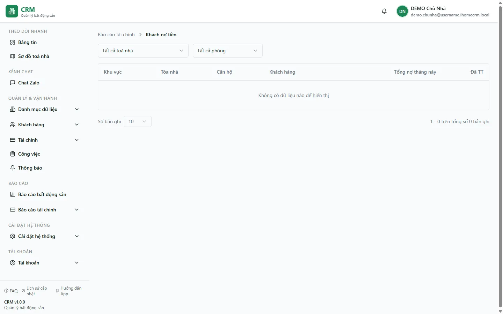

# Báo cáo: Khách nợ tiền

Báo cáo này **gom công nợ theo từng khách hàng**: hệ thống quét mọi hoá đơn còn nợ trong phạm vi của bạn rồi cộng dồn về người **đại diện hợp đồng**, nên mỗi khách chỉ hiện **một dòng** với tổng số tiền họ đang nợ — kể cả khi một khách có nhiều hoá đơn ở nhiều kỳ. Bạn dùng trang này để trả lời câu hỏi "**ai** đang nợ và nợ **bao nhiêu**", khác với báo cáo công nợ theo từng hoá đơn. Danh sách được xếp **giảm dần theo số nợ**, nên khách nợ nhiều nhất luôn nằm trên cùng.

Đây là **trang xem** (view-only): trang chỉ tổng hợp số liệu để bạn theo dõi, mọi thao tác thu tiền vẫn làm ở màn hình hoá đơn. Đối tượng đọc: **chủ nhà**, **kế toán** và **quản lý toà** muốn nắm nhanh danh sách khách còn nợ tiền nhà, dịch vụ và cọc.

::: info Điều kiện tiên quyết
- Bạn cần quyền xem **Báo cáo tài chính** (module **reports_finance**). Không có quyền này thì thẻ báo cáo bị ẩn trong hub và mở thẳng đường dẫn sẽ báo không đủ quyền.
- Báo cáo dựa trên **phạm vi toà nhà** của tài khoản: chủ nhà thấy toàn bộ, nhân viên chỉ thấy hoá đơn thuộc các toà mình được phân công.
- Phải có hoá đơn ở trạng thái **Đã duyệt**, **Trả một phần** hoặc **Quá hạn** (và chưa bị xoá) thì báo cáo mới có dòng để hiển thị; khách đã thu đủ sẽ không xuất hiện.
:::

## Cách mở

**Bước 1**: Vào **Báo cáo** => **Tài chính** => **Khách nợ tiền**. Trang mở ra với hàng bộ lọc ở đầu và bảng danh sách khách còn nợ bên dưới, mỗi dòng là một khách hàng.

## Bộ lọc & cách đọc số

Ở đầu trang có hai ô lọc; bảng bên dưới liệt kê từng khách còn nợ.

| Cột / Chỉ số | Ý nghĩa |
|---|---|
| Ô lọc **Tất cả toà nhà** | Lọc danh sách theo một toà. Để **Tất cả toà nhà** để xem mọi toà trong phạm vi của bạn, hoặc chọn ví dụ **Tòa DEMO A** để chỉ còn khách của toà đó. Đây là ô chọn đơn, lọc ngay trên dữ liệu đã tải. |
| Ô lọc **Chọn phòng** | Hiện chỉ có một lựa chọn **Tất cả phòng** — chưa lọc được theo từng phòng, để nguyên là được. |
| Cột **Khu vực** | Khu vực của toà. Ở phiên bản hiện tại cột này **luôn hiển thị "—"** (báo cáo chưa lấy tên khu vực), nên bạn dựa vào cột **Tòa nhà** để phân biệt. |
| Cột **Tòa nhà** | Toà chứa phòng của khách, ví dụ **Tòa DEMO A**. |
| Cột **Căn hộ** | Số phòng khách đang thuê, ví dụ **A102**. |
| Cột **Khách hàng** | Người **đại diện hợp đồng** mà công nợ được gom về, ví dụ **Nguyễn Văn A**. |
| Cột **Tổng nợ tháng này** | Tổng số tiền khách còn phải thu, hiển thị **màu đỏ**. Đây là số **cộng dồn phần còn nợ của mọi hoá đơn đang nợ** của khách đó (tổng tiền − đã trả), không chỉ riêng một tháng — nhãn "tháng này" chỉ là tên cột. Ví dụ **Nguyễn Văn A** ở **A102** còn nợ **2.570.000đ**. |
| Cột **Đã TT** | **Đã thanh toán** — tổng số tiền khách đã trả cho các hoá đơn đang nợ đó, để bạn thấy khách đã đóng được bao nhiêu so với phần còn thiếu. |

::: tip Đọc danh sách nhanh
Danh sách xếp **giảm dần theo Tổng nợ**, nên khách nợ nhiều nhất nằm trên cùng — ví dụ phòng **A105** đang **quá hạn 6.070.000đ** sẽ đứng trên khách **A102** nợ **2.570.000đ**. Cứ đòi từ trên xuống là ưu tiên đúng người nợ lớn. Cần biết một khoản nợ đã trễ bao nhiêu **ngày** hay thuộc mốc tuổi nợ nào, hãy mở [Báo cáo công nợ hợp đồng mới](/04-bao-cao/cong-no-hd-moi/) — báo cáo đó tách theo từng hoá đơn và có phân tích tuổi nợ.
:::

Cuối bảng có ô **Số bản ghi** (10 / 20 / 50 / 100) và dòng đếm "**X − Y trên tổng số Z bản ghi**". Đây là phân trang hiển thị: hệ thống đã tải đủ danh sách rồi cắt trang ngay trên màn hình, nên đổi số bản ghi hay lật trang không tải lại dữ liệu.

## Nguồn số liệu

- Báo cáo lấy trực tiếp từ bảng **hoá đơn**: chỉ tính hoá đơn ở trạng thái **Đã duyệt**, **Trả một phần** hoặc **Quá hạn** và **chưa bị xoá**. Hoá đơn nháp, đã huỷ hoặc đã thu đủ không được cộng vào.
- Mỗi hoá đơn được quy về **người đại diện hợp đồng**; hệ thống cộng phần **còn nợ** (tổng tiền − đã trả) của tất cả hoá đơn cùng một khách lại thành một dòng. Vì vậy một khách thuê nhiều phòng hoặc nợ nhiều kỳ vẫn chỉ hiện **một dòng tổng**.
- Khoản **Tiền cọc** còn thiếu thường được gộp sẵn trong hoá đơn tháng đầu của hợp đồng mới, nên phần cọc chưa đóng cũng nằm trong tổng nợ của khách ở đây. Cách gộp cọc vào hoá đơn tháng đầu xem [Đặt cọc](/03-quan-ly-van-hanh/dat-coc/); cách hoá đơn hình thành và các trạng thái xem [Hoá đơn](/03-quan-ly-van-hanh/hoa-don/).
- Trang **không** đọc phiếu thu chi hay sổ quỹ — nó phản ánh **khoản phải thu còn lại trên hoá đơn**, khác với số tiền thực đã vào quỹ. Khi bạn thu thêm cho một hoá đơn ở màn hình hoá đơn, phần "Tổng nợ" của khách giảm theo, và khách tự rời khỏi danh sách khi mọi hoá đơn đã thu đủ.
- So với [Báo cáo công nợ hợp đồng mới](/04-bao-cao/cong-no-hd-moi/) (liệt kê **từng hoá đơn** kèm tuổi nợ 0-30/31-60/61-90/>90), báo cáo này **gom về từng khách** để bạn nhìn tổng nợ theo người — hai báo cáo cùng nguồn hoá đơn nhưng nhìn ở hai góc khác nhau.

## Xuất & mẹo

- Trang này tập trung cho việc **xem trên màn hình** và **hiện chưa có nút xuất file** riêng. Nếu cần bảng tải về (Excel/CSV) để gửi kế toán, dùng [Báo cáo công nợ hợp đồng mới](/04-bao-cao/cong-no-hd-moi/) — báo cáo đó có nút xuất và chi tiết theo từng hoá đơn.
- Mẹo đòi nợ: liếc từ **trên xuống** vì danh sách đã xếp theo số nợ giảm dần; xử lý vài khách đầu bảng là gom được phần lớn công nợ.
- Muốn xem ai đang nợ trong **một toà** cụ thể, chọn toà ở ô **Tất cả toà nhà** rồi đọc lại tổng; cột **Khu vực** đang là "—" nên đừng dựa vào nó để phân toà.
- Khi đã liên hệ được khách, vào [Thu tiền hoá đơn](/03-quan-ly-van-hanh/thu-tien-hoa-don/) để ghi nhận khoản thu; hoá đơn thu đủ sẽ tự động biến mất khỏi báo cáo này.
- Cần tra thông tin liên hệ (điện thoại) của khách để nhắc nợ, xem hồ sơ khách ở [Cư dân](/03-quan-ly-van-hanh/cu-dan/).

## Thử trực tiếp trên sandbox

<SandboxTry account="demo.chunha" app-path="/reports/finance/customer-debt" view-only>

**Bạn sẽ nhìn thấy**

- Bảng **Khách nợ tiền** với mỗi dòng là một khách của 2 toà **DEMO**: cột **Khách hàng** ghi **Nguyễn Văn A**, cột **Tòa nhà** ghi **Tòa DEMO A**, cột **Căn hộ** ghi số phòng như **A102**.
- Cột **Tổng nợ tháng này** in **màu đỏ**: khách phòng **A105** đang quá hạn **6.070.000đ** nằm phía trên khách phòng **A102** còn nợ **2.570.000đ**, vì danh sách xếp giảm dần theo số nợ.
- Cột **Khu vực** hiển thị **"—"** cho mọi dòng, còn cột **Đã TT** cho biết khách đó đã trả được bao nhiêu.
- Đổi ô lọc từ **Tất cả toà nhà** sang **Tòa DEMO A** thì bảng chỉ còn các khách thuộc toà đó; đổi ô **Số bản ghi** ở cuối bảng chỉ thay đổi cách hiển thị, không tải lại dữ liệu.

</SandboxTry>

## Quy trình liên quan

- [Báo cáo công nợ hợp đồng mới](/04-bao-cao/cong-no-hd-moi/)
- [Hoá đơn](/03-quan-ly-van-hanh/hoa-don/)
- [Thu tiền hoá đơn](/03-quan-ly-van-hanh/thu-tien-hoa-don/)
- [Đặt cọc](/03-quan-ly-van-hanh/dat-coc/)
- [Cư dân](/03-quan-ly-van-hanh/cu-dan/)
- [Quy trình thu tiền](/01-bat-dau/quy-trinh-thu-tien/)
