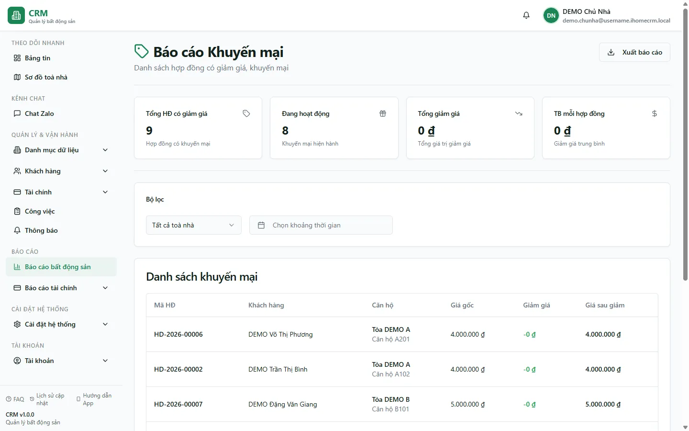

# Báo cáo: Khuyến mãi

Báo cáo **Khuyến mại** liệt kê những **hợp đồng thuê có cấu hình giảm giá** — tức là khi ký hợp đồng bạn đã đặt một mức khuyến mãi (giảm một số tiền cố định hoặc giảm theo phần trăm trên giá thuê). Màn này gom tất cả các hợp đồng đó về một chỗ để bạn — chủ nhà, kế toán hay quản lý toà — nhìn nhanh **đang ưu đãi cho bao nhiêu khách, mỗi hợp đồng giảm bao nhiêu và tổng giá trị giảm giá** là bao nhiêu mỗi kỳ. Đây là **màn để xem** (report view-only): bạn không tạo hay sửa khuyến mãi ở đây — khuyến mãi được đặt trong từng hợp đồng. Số liệu lấy từ bảng hợp đồng (xem cấu trúc ở he-thong 05) và nằm trong cụm báo cáo tổng hợp (he-thong 13).

::: info Điều kiện tiên quyết
- Cần quyền **Báo cáo => Xem** để mở màn báo cáo. Trong hệ thống, báo cáo này thuộc nhóm **Báo cáo Bất động sản** (feature **Khuyến mại**); ai được cấp xem nhóm báo cáo BĐS sẽ mở được.
- Phải có ít nhất một **hợp đồng có đặt khuyến mãi** (cấu hình giảm giá lúc ký) thì bảng mới có dòng. Hợp đồng chưa cấu hình giảm giá sẽ không xuất hiện.
- Bạn chỉ thấy hợp đồng thuộc **phạm vi toà nhà** được phân quyền; nhân viên bị giới hạn toà sẽ chỉ thấy khuyến mãi của các toà mình phụ trách.
:::

## Cách mở

**Bước 1**: Vào menu **Báo cáo** => nhóm **Bất động sản** => **Khuyến mại**. Màn mở ra với các **thẻ tổng hợp** ở đầu trang, bên dưới là bảng **Danh sách khuyến mại**.

## Bộ lọc & cách đọc số

Đầu trang có **bộ lọc toà nhà** (ô chọn gõ-để-tìm, mặc định *Tất cả toà nhà*) và **bộ chọn khoảng thời gian**. Khoảng thời gian lọc theo **ngày ký hợp đồng** — để trống là xem toàn bộ, không giới hạn thời gian.

Bốn thẻ tổng hợp và các cột trong bảng đọc như sau:

| Cột / Chỉ số | Ý nghĩa |
| --- | --- |
| Thẻ **Tổng HĐ có giảm giá** | Tổng số hợp đồng đang có cấu hình khuyến mãi (bằng số dòng của bảng). |
| Thẻ **Đang hoạt động** | Trong số trên, có bao nhiêu hợp đồng còn hiệu lực (trạng thái đang thuê). |
| Thẻ **Tổng giảm giá** | Cộng dồn mức giảm mỗi tháng của mọi hợp đồng trong danh sách — tổng ưu đãi bạn đang dành cho khách một kỳ. |
| Thẻ **TB mỗi hợp đồng** | Giảm giá trung bình = Tổng giảm giá ÷ số hợp đồng. |
| Cột **Mã HĐ** | Mã hợp đồng (nếu chưa đặt mã thì hiển thị 8 ký tự đầu của mã hệ thống). |
| Cột **Khách hàng** | Tên người thuê đứng tên hợp đồng. |
| Cột **Căn hộ** | Toà nhà và số phòng (căn hộ) của hợp đồng. |
| Cột **Giá gốc** | Giá thuê/tháng ghi trên hợp đồng, **trước khi** giảm. |
| Cột **Giảm giá** | Số tiền được giảm mỗi tháng. Nếu khuyến mãi đặt kiểu **cố định** thì đây chính là số tiền đó; nếu đặt kiểu **phần trăm** thì hệ thống tự tính = Giá gốc × %. |
| Cột **Giá sau giảm** | Giá thực khách trả = Giá gốc − Giảm giá (không xuống dưới 0). |

::: tip Giảm cố định hay giảm %
Mức **Giảm giá** hiển thị đã được quy về **số tiền/tháng**. Với khuyến mãi kiểu phần trăm, hệ thống nhân phần trăm với giá gốc giúp bạn, nên bạn không cần tính tay. Cột **Giá sau giảm** luôn là số tiền khách thực trả mỗi kỳ.
:::

## Nguồn số liệu

- Báo cáo đọc trực tiếp từ **bảng hợp đồng**, chỉ lấy những hợp đồng **có cấu hình khuyến mãi** và **chưa bị xoá**. Hợp đồng không đặt giảm giá sẽ không được đưa vào.
- Thông tin **giá gốc, mức giảm, kiểu giảm (cố định/phần trăm)** lấy từ chính khuyến mãi bạn đặt trong hợp đồng khi ký. Muốn sửa con số, bạn vào lại hợp đồng để chỉnh, báo cáo sẽ cập nhật theo.
- **Bộ lọc thời gian** áp theo **ngày ký hợp đồng**; **bộ lọc toà nhà** áp theo toà của căn hộ trong hợp đồng.
- Thẻ **Đang hoạt động** dựa trên **trạng thái hợp đồng** (còn hiệu lực hay đã kết thúc), nên một hợp đồng đã thanh lý vẫn còn trong danh sách nhưng không được đếm vào ô này.

## Xuất & mẹo

- Nút **Xuất** (góc trên bên phải) tải danh sách đang hiển thị ra tệp (tên tệp `bao-cao-khuyen-mai`), gồm các cột **Mã HĐ, Khách hàng, Căn hộ, Giá gốc, Giảm giá, Giá sau giảm** và thêm cột **Trạng thái** (Đang áp dụng / Đã kết thúc) để tiện lọc trên Excel.
- Muốn xem khuyến mãi ký trong một đợt (ví dụ chương trình ưu đãi tháng), hãy đặt **khoảng thời gian** trùng đợt đó — báo cáo chỉ giữ hợp đồng ký trong khoảng.
- Nếu một toà đang giảm giá nhiều, lọc riêng toà đó rồi nhìn thẻ **Tổng giảm giá** để ước lượng phần doanh thu đang "nhường" cho khách mỗi tháng.
- Bộ lọc toà và khoảng thời gian **được giữ lại khi bạn tải lại trang (F5)**, không phải chọn lại từ đầu.

## Thử trực tiếp trên sandbox

<SandboxTry account="demo.chunha" app-path="/reports/real-estate/promotions" app-label="Mở Báo cáo Khuyến mại" view-only>

Bài này **chỉ xem** — bạn quan sát cách đọc báo cáo, không chỉnh sửa gì:

1. Để bộ lọc **Tất cả toà nhà** và **không đặt khoảng thời gian** để thấy toàn bộ hợp đồng có khuyến mãi. Hãy nhìn thấy hợp đồng phòng **A105** (Toà **DEMO A**, khách **Nguyễn Văn A**) xuất hiện với một mức **Giảm giá** và **Giá sau giảm** thấp hơn **Giá gốc**.
2. Đọc bốn thẻ tổng hợp ở đầu trang: **Tổng HĐ có giảm giá**, **Đang hoạt động**, **Tổng giảm giá** và **TB mỗi hợp đồng** — đối chiếu tổng giảm giá với số hiển thị trên dòng A105.
3. Đổi bộ lọc sang toà **DEMO B** để thấy danh sách chỉ còn khuyến mãi của toà đó (có thể trống nếu toà B chưa đặt ưu đãi) — hiểu rằng bộ lọc toà chỉ giữ lại hợp đồng thuộc toà đã chọn.
4. (Tuỳ chọn) Bấm **Xuất** để tải danh sách ra tệp và thấy có thêm cột **Trạng thái**.

Kết quả mong đợi: bạn nắm được báo cáo Khuyến mại chỉ gom **hợp đồng có cấu hình giảm giá**, đọc được **Giá gốc → Giảm giá → Giá sau giảm** trên từng dòng và hiểu ý nghĩa bốn thẻ tổng hợp.

</SandboxTry>

## Quy trình liên quan

- [Hợp đồng](/03-quan-ly-van-hanh/hop-dong/) — nơi đặt và chỉnh khuyến mãi (giảm giá) cho từng hợp đồng; nguồn số liệu của báo cáo này.
- [Quy trình khách thuê](/01-bat-dau/quy-trinh-khach-thue/) — bức tranh tổng quát từ lúc ký hợp đồng (kèm ưu đãi) đến khi khách vào ở.
- [Hoá đơn](/03-quan-ly-van-hanh/hoa-don/) — mức giảm giá của hợp đồng phản ánh vào giá thuê trên hoá đơn hằng tháng.
- [Báo cáo Bất động sản](/04-bao-cao/hub-bds/) — cụm báo cáo BĐS chứa màn Khuyến mại và các báo cáo vận hành khác.
- [Báo cáo Cho thuê mới](/04-bao-cao/cho-thue-moi/) — báo cáo anh em, thống kê hợp đồng mới ký theo ngày ký.
