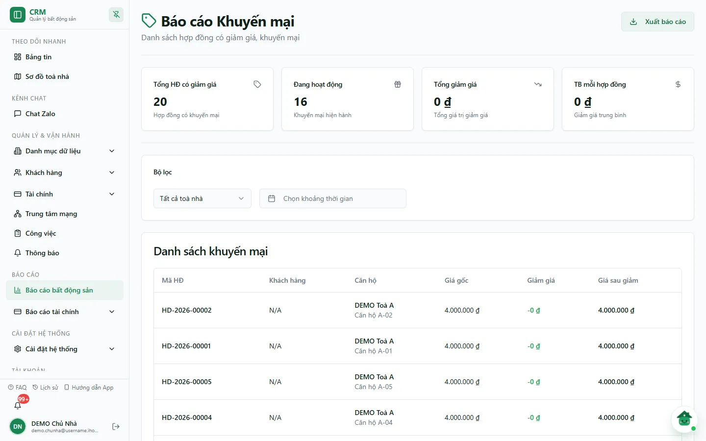

# Báo cáo: Khuyến mãi

Màn **Báo cáo Khuyến mại** liệt kê các hợp đồng chưa xoá có lưu thông tin giảm giá (trường `discounts` khác rỗng) và quy đổi ra giá sau giảm. Báo cáo đọc trực tiếp từ hợp đồng; không có bảng “chương trình khuyến mại” riêng.

::: info Điều kiện tiên quyết
- Quyền **Báo cáo Khuyến mãi** (`reports_real_estate.promotions`).
:::

## Hướng dẫn từng bước

**Bước 1**: Tại menu bên trái, ấn **Báo cáo bất động sản** => thẻ **Báo cáo khuyến mại** => **Xem báo cáo →**.

**Bước 2**: Nếu cần, chọn toà ở ô **Tất cả toà nhà** và khoảng ngày ở ô **Chọn khoảng thời gian** (có nút nhanh **Hôm nay**, **7 ngày**, **30 ngày**, **90 ngày**, **Tháng này**, **Năm nay**). Khoảng ngày lọc theo **ngày ký** hợp đồng; để trống = mọi hợp đồng có giảm giá.

**Bước 3**: Đọc bảng; ấn **Xuất báo cáo** để lấy file `bao-cao-khuyen-mai` (Excel/CSV).

Snapshot DEMO ngày 07/10/2026 (không chọn khoảng ngày): **20 hợp đồng** có trường giảm giá, **16** đang ACTIVE, nhưng mức giảm đều bằng 0 nên **Tổng giảm giá** và **TB mỗi hợp đồng** = 0 đ; cột **Giảm giá** hiện “-0 đ” và **Khách hàng** hiện “N/A”.

## Cách quy đổi mức giảm

Báo cáo đọc mức giảm trong trường giảm giá của hợp đồng (`amount`, nếu không có thì `value`) và kiểu giảm:

- Kiểu **phần trăm** (`percent`): giảm = giá thuê × mức giảm / 100.
- Kiểu khác hoặc không ghi kiểu: coi là **số tiền cố định**.
- **Giá sau giảm** = giá thuê − giảm, không nhỏ hơn 0.

Tên ưu đãi (nếu có) không hiển thị trên bảng và không có trong file xuất.

## Thẻ số và cột

| Thành phần | Ý nghĩa |
|---|---|
| **Tổng HĐ có giảm giá** | Số dòng trong bảng. |
| **Đang hoạt động** | Số hợp đồng trong danh sách đang ở trạng thái ACTIVE — là trạng thái hợp đồng, không phải thời hạn hiệu lực của ưu đãi. |
| **Tổng giảm giá** | Cộng mức giảm của mỗi hợp đồng **một lần**. |
| **TB mỗi hợp đồng** | Tổng giảm giá chia số dòng. |
| Bảng | **Mã HĐ**, **Khách hàng**, **Căn hộ** (toà + phòng), **Giá gốc**, **Giảm giá**, **Giá sau giảm**. Sắp theo ngày ký mới nhất. File xuất có thêm cột **Trạng thái** (**Đang áp dụng** khi hợp đồng ACTIVE, còn lại **Đã kết thúc**). |

::: warning Không phải tổng ưu đãi đã thực hiện
Mức giảm là số quy đổi trên giá thuê một kỳ của mỗi hợp đồng và chỉ được cộng một lần; báo cáo không nhân với số tháng, không đối chiếu hoá đơn đã áp giảm hay tiền đã thu. “Tổng giảm giá” vì vậy không phải số tiền khuyến mại đã ghi sổ hay của cả thời hạn hợp đồng.
:::

## Tình huống & lỗi thường gặp

| Tình huống | Nguyên nhân & cách xử lý |
|---|---|
| Hợp đồng không có ưu đãi vẫn hiện với “-0 đ” | Trường giảm giá đã được lưu (dù rỗng) nên vẫn thoả điều kiện “khác rỗng”. |
| Cột **Khách hàng** hiện “N/A” | Báo cáo lấy khách từ trường khách chính (`tenant_id`) của hợp đồng; hợp đồng không có giá trị này sẽ hiện N/A. Xem khách ở [chi tiết hợp đồng](/03-quan-ly-van-hanh/hop-dong-chi-tiet/). |
| Lọc toà chậm khi dữ liệu lớn | Lọc toà chạy trên trình duyệt sau khi tải; truy vấn không phân trang nên có thể chạm giới hạn số dòng của API. |

## Quy trình liên quan

- [Hợp đồng](/03-quan-ly-van-hanh/hop-dong/)
- [Cho thuê mới](/04-bao-cao/cho-thue-moi/)
- [Phân tích tài chính](/04-bao-cao/phan-tich-tai-chinh/)
