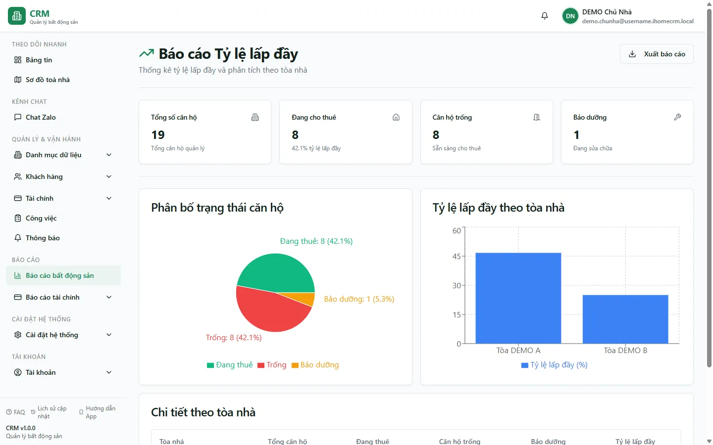

# Báo cáo: Tỷ lệ lấp đầy

Báo cáo này trả lời một câu hỏi duy nhất nhưng quan trọng bậc nhất với người cho thuê: **"Trong tổng số phòng tôi có, bao nhiêu phòng đang thực sự cho thuê ra tiền?"**. Con số đó gọi là **tỷ lệ lấp đầy** = số phòng **đang thuê** chia cho **tổng số phòng**. Trang gom số theo **từng toà nhà** (để so sánh toà nào khai thác tốt, toà nào còn nhiều phòng trống) và theo **thời gian** (xu hướng 12 tháng gần nhất, để thấy toà đang ấm dần lên hay nguội đi). Đây là **trang để xem** — bạn không nhập hay sửa gì ở đây, mọi con số được tổng hợp tự động từ phòng và hợp đồng.

Trang này dành cho **bạn** ở vai chủ nhà, kế toán hoặc quản lý toà — những người cần nhìn nhanh bức tranh khai thác để ra quyết định (đẩy marketing toà đang trống nhiều, hay giữ giá toà đang kín phòng).

::: info Điều kiện tiên quyết
- Tài khoản có **quyền xem Báo cáo**, mục **Tỷ lệ lấp đầy** (thuộc nhóm báo cáo Bất động sản). Không có quyền thì thẻ báo cáo không hiện và route bị chặn.
- Đã có **toà nhà và phòng** trong hệ thống (xem [Tạo toà nhà](/01-bat-dau/tao-toa-nha/) và [Tạo tầng & phòng](/01-bat-dau/tao-tang-phong/)). Toà chưa có phòng thì tổng số phòng bằng 0.
- Số "đang thuê" đọc từ **hợp đồng đang hiệu lực (ACTIVE)** — muốn số đúng thì hợp đồng phải được ký và duyệt (xem [Hợp đồng](/03-quan-ly-van-hanh/hop-dong/)).
- Bạn chỉ thấy số của **những toà thuộc phạm vi quyền của mình**. Nhân viên bị giới hạn theo toà/khu sẽ thấy tổng nhỏ hơn chủ nhà.
:::

## Cách mở

**Bước 1**: Vào **Báo cáo** => **Bất động sản** để mở trung tâm [Báo cáo BĐS](/04-bao-cao/hub-bds/) (lưới 8 thẻ báo cáo vận hành).

**Bước 2**: Bấm thẻ **Tỷ lệ lấp đầy**. Màn hình báo cáo mở ra với các thẻ tổng (Tổng số phòng, Đang thuê, Trống, Bảo dưỡng), tỷ lệ lấp đầy theo từng toà và biểu đồ xu hướng.

::: tip Có hai phiên bản của trang này
Hệ thống còn giữ **bản cũ** (đường dẫn `/reports/real-estate/occupancy`) — chỉ là **một ảnh chụp toàn hệ thống**, không có ô lọc toà và không có biểu đồ xu hướng 12 tháng. **Bản mới** (`/reports/real-estate/occupancy-new`) bổ sung **bộ lọc toà**, thẻ **Bảo dưỡng** và **biểu đồ xu hướng**. Nếu cần lọc theo toà hay xem diễn biến theo tháng, hãy dùng bản mới.
:::

## Bộ lọc & cách đọc số

| Cột / Chỉ số | Ý nghĩa |
| --- | --- |
| Bộ lọc **Toà nhà** *(chỉ bản mới)* | Thu hẹp báo cáo về một toà. Bản cũ không có ô này, luôn hiển thị mọi toà trong phạm vi quyền. |
| **Tổng số phòng** | Tất cả phòng của toà (theo phạm vi quyền của bạn). Đây là **mẫu số** để tính tỷ lệ. |
| **Đang thuê** | Số phòng có **hợp đồng đang hiệu lực (ACTIVE)** — đếm theo phòng. Đây là **tử số** của tỷ lệ lấp đầy. |
| **Đã cọc / Giữ chỗ** | Phòng đang được **cọc giữ chỗ** (trạng thái RESERVED). Nhóm này **không tính là đang thuê** và cũng **không tính là trống** — nó tách riêng. Lưu ý: bản mới hiện **chưa hiển thị cột "Đã cọc" riêng**; phòng giữ chỗ chỉ bị **trừ khỏi số "Trống"**. |
| **Trống** | Phòng có thể cho thuê ngay = Tổng số phòng − Đang thuê − Đã cọc − Bảo dưỡng. |
| **Bảo dưỡng** *(bản mới)* | Phòng đang sửa chữa/bảo dưỡng, tách thành nhóm riêng theo từng toà (không tính vào Trống). |
| **Tỷ lệ lấp đầy (%)** | = Đang thuê ÷ Tổng số phòng × 100. Càng cao càng khai thác tốt. Vì phòng **Đã cọc** và **Bảo dưỡng** nằm trong mẫu số nhưng không nằm ở tử số, chúng làm tỷ lệ này thấp xuống một chút cho tới khi phòng chính thức lên hợp đồng. |
| **Biểu đồ xu hướng 12 tháng** *(bản mới)* | Tỷ lệ lấp đầy theo từng tháng trong 12 tháng gần nhất — nhìn để biết toà đang **ấm dần** hay **nguội đi**. |

Cách đọc nhanh với dữ liệu demo: hệ thống có **Tòa DEMO A** và **Tòa DEMO B** với **8 phòng đang thuê**. Hai phòng **A301** và **A302** đang được **cọc giữ chỗ** nên rơi vào nhóm **Đã cọc / Giữ chỗ** — bạn sẽ thấy chúng **không** cộng vào "Đang thuê" và cũng **không** nằm trong "Trống". Nếu một toà có 10 phòng mà 8 phòng đang thuê thì tỷ lệ lấp đầy của toà đó là **80%**.

## Nguồn số liệu

- **Tử số "Đang thuê"** lấy từ bảng hợp đồng, chỉ đếm hợp đồng ở trạng thái **ACTIVE** (đang hiệu lực). Hợp đồng nháp/đã thanh lý/hết hạn không được tính. Hợp đồng đã **gia hạn** vẫn giữ trạng thái ACTIVE nên **vẫn được tính là đang thuê** — đúng như thực tế.
- **Mẫu số "Tổng số phòng"** và nhóm **Trống/Đã cọc/Bảo dưỡng** lấy từ bảng phòng. Trạng thái **Đã cọc (RESERVED)** được hệ thống tự đặt khi có **phiếu cọc giữ chỗ** (xem [Đặt cọc](/03-quan-ly-van-hanh/dat-coc/)), nên tách chính xác khỏi phòng trống thật sự.
- Báo cáo **không** đọc từ hoá đơn hay phiếu thu — nó chỉ phản ánh **tình trạng phòng và hợp đồng**, không phản ánh tiền đã thu.
- **Phạm vi hiển thị theo quyền**: bạn chỉ thấy các toà mình được phân quyền. Vì vậy hai người ở hai phạm vi khác nhau mở cùng báo cáo có thể ra tổng số phòng khác nhau — đó là đúng thiết kế, không phải lỗi.
- Về hiệu năng: khi lọc theo toà, phần **phòng** được lọc ngay từ máy chủ, còn phần **hợp đồng** và **xu hướng 12 tháng** được tải rồi lọc trên trình duyệt. Toà có rất nhiều hợp đồng lịch sử sẽ mất thêm vài giây để dựng biểu đồ.

## Xuất & mẹo

- Dùng nút **Xuất** trên trang để tải bảng ra tệp (Excel/PDF) khi cần gửi báo cáo hay lưu hồ sơ tháng.
- **Chọn đúng bản trang**: cần lọc theo toà hoặc xem diễn biến theo tháng thì mở **bản mới** (có ô lọc toà + biểu đồ xu hướng); chỉ cần một con số tổng toàn hệ thống thì bản cũ đủ dùng.
- **Đừng hoảng khi tỷ lệ tụt nhẹ lúc mới cọc**: phòng vừa nhận cọc giữ chỗ (như A301/A302) chưa lên hợp đồng nên chưa cộng vào "Đang thuê" — tỷ lệ lấp đầy sẽ nhích lên khi khách ký hợp đồng chính thức.
- **Muốn biết cụ thể phòng nào đang trống bao nhiêu ngày**, chuyển sang [Báo cáo Phòng trống](/04-bao-cao/phong-trong/) — trang lấp đầy cho **tỷ lệ**, trang phòng trống cho **danh sách chi tiết**.
- **Toà có tỷ lệ lấp đầy thấp kéo dài** là tín hiệu cần đẩy cho thuê — kết hợp xem [Báo cáo Cho thuê mới](/04-bao-cao/cho-thue-moi/) và [Hợp đồng sắp hết hạn](/04-bao-cao/hd-sap-het-han/) để biết phòng nào sắp trống thêm.

## Thử trực tiếp trên sandbox

<SandboxTry account="demo.chunha" app-path="/reports/real-estate/occupancy" app-label="Mở báo cáo Tỷ lệ lấp đầy" fixtures="Tòa DEMO A/B, 8 phòng đang thuê, A301/A302 cọc giữ chỗ" view-only>

Mở báo cáo với vai chủ nhà và **quan sát** (trang chỉ để xem, không nhập gì):

1. Hãy nhìn thấy các thẻ tổng: **Tổng số phòng**, **Đang thuê = 8**, **Trống**, và tỷ lệ **lấp đầy (%)** của toàn hệ thống.
2. Hãy nhìn thấy tỷ lệ lấp đầy được tách **theo từng toà** — so sánh **Tòa DEMO A** với **Tòa DEMO B** để biết toà nào kín phòng hơn.
3. Hãy nhìn thấy hai phòng cọc giữ chỗ **A301** và **A302** **không** làm tăng số "Đang thuê" và cũng **không** nằm trong "Trống" — chúng thuộc nhóm giữ chỗ riêng.
4. (Bản mới) Hãy nhìn thấy **biểu đồ xu hướng 12 tháng** — đường tỷ lệ lấp đầy đi lên hay đi xuống qua các tháng.

Kết quả mong đợi: bạn đọc được **8 phòng đang thuê**, hiểu **tỷ lệ lấp đầy = đang thuê ÷ tổng phòng**, và nắm được rằng **phòng cọc giữ chỗ được tách riêng**, không lẫn vào phòng thuê lẫn phòng trống.

</SandboxTry>

## Quy trình liên quan

- [Báo cáo Phòng trống](/04-bao-cao/phong-trong/) — danh sách chi tiết từng phòng trống và số ngày trống, bổ trợ cho con số tỷ lệ ở đây.
- [Báo cáo Hợp đồng sắp hết hạn](/04-bao-cao/hd-sap-het-han/) — biết trước phòng nào sắp trống để chủ động lấp đầy lại.
- [Báo cáo Cho thuê mới](/04-bao-cao/cho-thue-moi/) — theo dõi số hợp đồng ký mới, mặt "tăng lấp đầy" của bức tranh.
- [Trung tâm Báo cáo BĐS](/04-bao-cao/hub-bds/) — nơi mở tất cả báo cáo vận hành bất động sản.
- [Hợp đồng](/03-quan-ly-van-hanh/hop-dong/) — nguồn của số "đang thuê"; hợp đồng phải ACTIVE mới được tính lấp đầy.
- [Đặt cọc](/03-quan-ly-van-hanh/dat-coc/) — phiếu cọc giữ chỗ là thứ đưa phòng vào nhóm "Đã cọc / Giữ chỗ", tách khỏi phòng trống.
