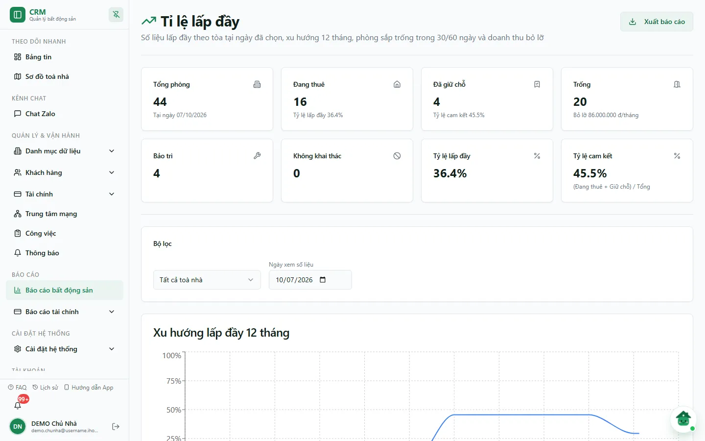
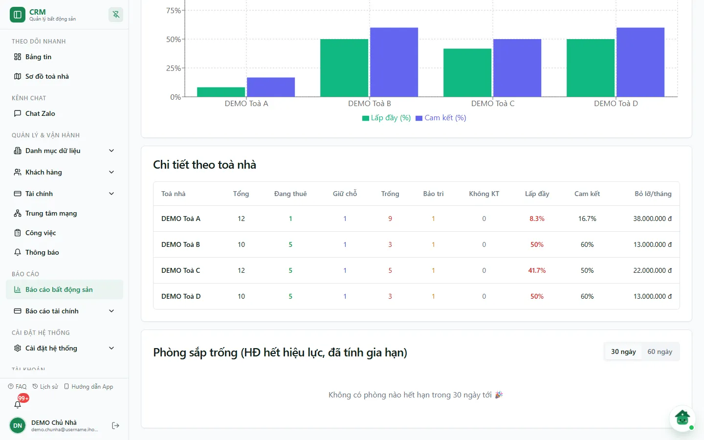

# Báo cáo: Tỷ lệ lấp đầy

Màn **Tỉ lệ lấp đầy** cho biết tại một ngày, mỗi toà có bao nhiêu phòng đang thuê, giữ chỗ, trống, bảo trì, không khai thác; kèm xu hướng 12 tháng và danh sách phòng sắp trống đã tính gia hạn. Toàn bộ số liệu được tính trên máy chủ, nên đây là báo cáo phòng trống/lấp đầy nên dùng khi cần con số chuẩn. Đường dẫn cũ `/reports/real-estate/occupancy-new` chỉ chuyển hướng về màn này.

::: info Điều kiện tiên quyết
- Quyền **Báo cáo Lấp đầy** (`reports_real_estate.occupancy`).
:::

## Hướng dẫn từng bước

**Bước 1**: Tại menu bên trái, ấn **Báo cáo bất động sản** => thẻ **Tỉ lệ lấp đầy** => **Xem báo cáo →**. Đầu trang có tám thẻ số, khung **Bộ lọc** và biểu đồ **Xu hướng lấp đầy 12 tháng**.

**Bước 2**: Chọn một toà ở ô **Tất cả toà nhà** (ô chọn một toà; để **Tất cả toà nhà** = mọi toà trong phạm vi được xem). Muốn xem quá khứ, đổi **Ngày xem số liệu** (mặc định hôm nay, không chọn được ngày tương lai).

**Bước 3**: Kéo xuống để xem biểu đồ **Tỷ lệ lấp đầy & cam kết theo toà**, bảng **Chi tiết theo toà nhà** và khối **Phòng sắp trống (HĐ hết hiệu lực, đã tính gia hạn)**. Chọn **30 ngày** hoặc **60 ngày** ở góc khối sắp trống.

**Bước 4**: Ấn **Xuất báo cáo** để lấy file `ty-le-lap-day-<ngày>` (Excel/CSV): mỗi toà một dòng kèm ngày xem số liệu, bộ lọc toà và phần **ĐỊNH NGHĨA METRIC** ở cuối file.

Snapshot DEMO ngày 07/10/2026 (tất cả toà): **Tổng phòng 44**, **Đang thuê 16** (lấp đầy 36,4%), **Đã giữ chỗ 4** (cam kết 45,5%), **Trống 20** (bỏ lỡ 86.000.000 đ/tháng), **Bảo trì 4**, **Không khai thác 0**. Khối sắp trống 30 ngày không có phòng nào.

## Năm nhóm phòng tại ngày đã chọn

| Nhóm | Định nghĩa |
| --- | --- |
| Đang thuê | Có hợp đồng đang hiệu lực tại ngày đã chọn; hợp đồng quá hạn chưa thanh lý/gia hạn vẫn tính là đang ở. |
| Đã giữ chỗ | Không có hợp đồng hiệu lực và phòng ở trạng thái giữ chỗ (đã cọc). |
| Trống | Không có hợp đồng hiệu lực và phòng còn trống. |
| Bảo trì | Phòng đang bảo trì. |
| Không khai thác | Phòng ngưng khai thác và các trạng thái bất thường; **không** tính là Trống. |

- **Tỷ lệ lấp đầy** = Đang thuê / Tổng.
- **Tỷ lệ cam kết** = (Đang thuê + Giữ chỗ) / Tổng.
- **Bỏ lỡ/tháng** (doanh thu bỏ lỡ) = tổng giá thuê niêm yết của riêng phòng **Trống**.

Bảng **Chi tiết theo toà nhà** có các cột **Toà nhà**, **Tổng**, **Đang thuê**, **Giữ chỗ**, **Trống**, **Bảo trì**, **Không KT**, **Lấp đầy** (xanh ≥90%, vàng ≥70%, đỏ dưới 70%), **Cam kết**, **Bỏ lỡ/tháng**.

## Xu hướng 12 tháng và phòng sắp trống

- **Xu hướng lấp đầy 12 tháng** gộp các toà đã chọn thành một đường; di chuột vào điểm để xem “x% (đang thuê/tổng phòng)”. Xu hướng dùng định nghĩa lịch sử: phòng có hợp đồng ở mọi trạng thái trừ nháp giao với tháng đó — tháng quá khứ vẫn tính hợp đồng nay đã thanh lý/hết hạn.
- **Phòng sắp trống** liệt kê phòng có hợp đồng đang hiệu lực mà ngày hết hiệu lực (đã cộng gia hạn **đã duyệt/hoàn tất**) rơi trong 30 hoặc 60 ngày; mỗi phòng một dòng, cột **Gia hạn** hiện **Đã gia hạn** hoặc **Chưa**.

::: info Hai định nghĩa “đang thuê” là có chủ ý
Thẻ số là trạng thái tại một ngày; xu hướng là lịch sử theo tháng. Không so từng tháng của biểu đồ với thẻ số hôm nay như thể chúng dùng cùng một điều kiện.
:::

## Tình huống & lỗi thường gặp

| Tình huống | Nguyên nhân & cách xử lý |
|---|---|
| Một khối hiện “Không tải được …” kèm nút **Thử lại** | Thẻ số, xu hướng và danh sách sắp trống tải riêng; khối lỗi không làm hỏng khối khác. Bấm **Thử lại**. |
| Số Trống khác [báo cáo Phòng trống](/04-bao-cao/phong-trong/) | Báo cáo Phòng trống gộp cả phòng bảo trì/không khai thác; ở đây chúng tách nhóm riêng. |
| Phòng giữ chỗ làm tăng tỷ lệ cam kết nhưng không tăng lấp đầy | Đúng định nghĩa: giữ chỗ chưa phải đang thuê. |
| “Bỏ lỡ/tháng” khác doanh thu trên sổ | Đây là giá niêm yết của phòng Trống, không phải dự báo doanh thu hay lợi nhuận. |

## Quy trình liên quan

- [Phòng trống](/04-bao-cao/phong-trong/)
- [Hợp đồng sắp hết hạn](/04-bao-cao/hd-sap-het-han/)
- [Cho thuê mới](/04-bao-cao/cho-thue-moi/)
- [Thanh lý / bỏ trả](/04-bao-cao/thanh-ly/)
