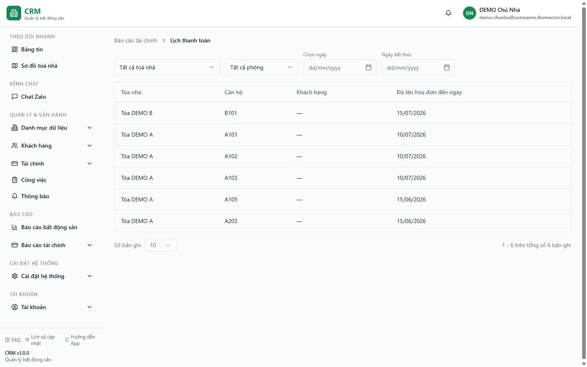

# Báo cáo: Lịch thanh toán

Báo cáo **Lịch thanh toán** cho bạn biết **mỗi phòng đang thuê đã được lập hoá đơn đến ngày nào**. Thay vì liệt kê từng hoá đơn, báo cáo gom **mỗi phòng thành một dòng** và hiển thị mốc **Đã lên hóa đơn đến ngày** — tức ngày đến hạn muộn nhất trong số các hoá đơn đã tạo cho phòng đó.

Nhờ vậy bạn nhìn nhanh được phòng nào đã "phủ" hoá đơn tới tương lai và phòng nào có mốc rơi vào quá khứ / gần hôm nay — dấu hiệu **cần tạo hoá đơn cho kỳ thu tiếp theo**. Báo cáo này chỉ hiển thị **mốc ngày**, không hiển thị số tiền còn phải thu; phần tiền xử lý tại [Quy trình thu tiền](/01-bat-dau/quy-trinh-thu-tien/).

Báo cáo phù hợp với **kế toán**, **quản lý toà** và **chủ nhà** khi rà soát chu kỳ xuất hoá đơn hằng tháng.

::: info Điều kiện tiên quyết
Bạn cần quyền xem **Báo cáo tài chính** (module `reports_finance`, hành động **Xem**). Nếu menu **Báo cáo tài chính** không hiện, hãy nhờ chủ nhà bật quyền cho tài khoản của bạn. Nhân viên chỉ thấy dữ liệu của các toà nằm trong phạm vi được phân công.
:::

## Cách mở

1. Trên thanh điều hướng, vào **Báo cáo** => **Báo cáo tài chính** để mở trang tổng hợp báo cáo tài chính.
2. Tại lưới thẻ, bấm thẻ **Lịch thanh toán**.

Bạn cũng có thể vào thẳng qua đường dẫn **/reports/finance/payment-schedule**.

## Bộ lọc & cách đọc số

Trên đầu trang có các ô lọc, phía dưới là bảng dữ liệu. Bộ lọc áp dụng ngay khi bạn chọn (không cần nút "Áp dụng").

| Cột / Chỉ số | Ý nghĩa |
| --- | --- |
| **Toà nhà** (ô lọc) | Chọn một toà để chỉ xem phòng của toà đó; để **Tất cả toà nhà** để xem toàn bộ. Ô này lọc trước khi gom theo phòng. |
| **Chọn phòng** (ô lọc) | Hiện chỉ có lựa chọn **Tất cả phòng**. Ô này chưa lọc được theo từng phòng riêng lẻ. |
| **Chọn ngày** (ô lọc) | Giới hạn dưới của cột **Đã lên hóa đơn đến ngày**: chỉ hiện phòng có mốc **từ ngày này trở đi**. |
| **Ngày kết thúc** (ô lọc) | Giới hạn trên: chỉ hiện phòng có mốc **đến ngày này**. Kết hợp với **Chọn ngày** để soi một khoảng thời gian. |
| **Toà nhà** (cột bảng) | Tên toà nhà chứa phòng. |
| **Căn hộ** (cột bảng) | Số / tên phòng. Mỗi phòng chỉ xuất hiện **một dòng** duy nhất. |
| **Khách hàng** (cột bảng) | Khách đại diện của hợp đồng đang thuê phòng. |
| **Đã lên hóa đơn đến ngày** (cột bảng) | Ngày đến hạn **muộn nhất** trong các hoá đơn đã tạo cho phòng. Đây là "ranh giới" đã xuất hoá đơn: mốc càng xa trong tương lai nghĩa là phòng đã được lập hoá đơn tới kỳ đó. |
| **Số bản ghi** (dưới bảng) | Số dòng mỗi trang: 10 / 20 / 50 / 100. |

**Cách đọc nhanh:** bảng sắp xếp **giảm dần theo ngày** (phòng có mốc xa nhất lên trên). Những phòng nằm **cuối bảng** — có **Đã lên hóa đơn đến ngày** rơi vào quá khứ hoặc rất gần hôm nay — là phòng bạn nên kiểm tra xem **đã tạo hoá đơn cho kỳ kế tiếp chưa**.

## Nguồn số liệu

- Báo cáo đọc từ bảng **hoá đơn** (`invoices`), lấy các hoá đơn có **ngày đến hạn trong vòng 365 ngày tới** rồi **gom theo phòng**.
- Với mỗi phòng, cột **Đã lên hóa đơn đến ngày** = **ngày đến hạn muộn nhất** trong tất cả hoá đơn của phòng đó.
- Cột **Khách hàng** lấy khách **đại diện** của hợp đồng gắn với hoá đơn.
- Lưu ý: báo cáo gom **mọi** hoá đơn của phòng (kể cả hoá đơn nháp hoặc đã huỷ/xoá mềm nếu có), nên hãy đối chiếu với trang **Hoá đơn** khi thấy một mốc ngày bất thường. Xem thêm [Hoá đơn](/03-quan-ly-van-hanh/hoa-don/).

## Xuất & mẹo

- Trang **chưa có nút Xuất Excel**. Để lưu lại, bạn có thể chụp màn hình, hoặc tăng **Số bản ghi** lên 100 rồi bôi đen bảng để sao chép.
- Dùng cặp ô **Chọn ngày** + **Ngày kết thúc** để lọc riêng những phòng có mốc rơi vào tháng hiện tại — nhanh chóng thấy phòng nào **sắp hết kỳ đã xuất hoá đơn**.
- Chọn từng **Toà nhà** khi bạn phụ trách nhiều toà, để rà soát gọn theo từng toà.
- Báo cáo này chỉ nói **đến ngày nào**, không nói **còn phải thu bao nhiêu**. Muốn biết và xử lý số tiền, hãy mở [Quy trình thu tiền](/01-bat-dau/quy-trinh-thu-tien/).
- Bộ lọc bạn chọn được **giữ lại qua F5** (làm mới trang), nên khi quay lại báo cáo vẫn ở đúng toà/khoảng ngày bạn đang xem.

## Thử trực tiếp trên sandbox

<SandboxTry account="demo.chunha" app-path="/reports/finance/payment-schedule" view-only>

Hãy nhìn thấy: mỗi phòng đang thuê ở **Toà DEMO A** và **Toà DEMO B** là **một dòng** trong bảng, với cột **Đã lên hóa đơn đến ngày** cho biết phòng đã được xuất hoá đơn tới mốc nào. Thử để **Tất cả toà nhà** rồi đổi sang **Toà DEMO A** để thấy bảng chỉ còn phòng của toà A. Các phòng đang còn nợ như **A102** và **A105** vẫn xuất hiện ở đây kèm mốc ngày của hoá đơn gần nhất — số tiền còn nợ thì xem ở báo cáo Khách nợ tiền.

</SandboxTry>

## Quy trình liên quan

- [Quy trình chốt tháng](/01-bat-dau/quy-trinh-chot-thang/) — tạo hoá đơn kỳ mới cho các phòng đã hết kỳ.
- [Quy trình thu tiền](/01-bat-dau/quy-trinh-thu-tien/) — sau khi có hoá đơn thì ghi nhận thu tiền.
- [Hoá đơn](/03-quan-ly-van-hanh/hoa-don/) — nơi tạo và tra cứu chi tiết từng hoá đơn của phòng.
- [Thu tiền hoá đơn](/03-quan-ly-van-hanh/thu-tien-hoa-don/) — ghi nhận thanh toán cho hoá đơn.
- [Quy trình thu tiền](/01-bat-dau/quy-trinh-thu-tien/) — xem và thu số tiền còn lại theo hóa đơn/phòng.
- [Hub Báo cáo tài chính](/04-bao-cao/hub-tai-chinh/) — quay lại danh sách toàn bộ báo cáo tài chính.
