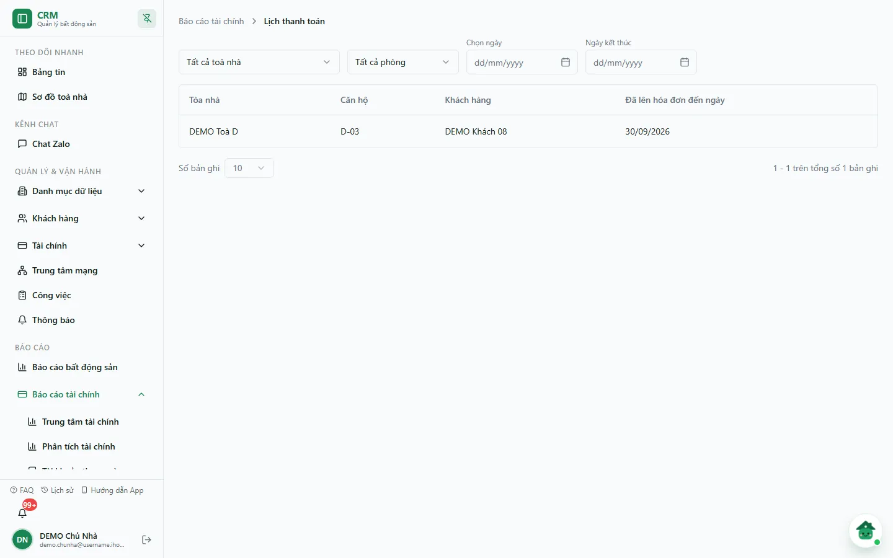

# Báo cáo: Lịch thanh toán

Báo cáo **Lịch thanh toán** cho biết **mỗi phòng đã được lên hoá đơn đến ngày nào**. Dùng nó để tìm phòng sắp hết kỳ đã lập hoá đơn, rồi mở [Hoá đơn](/03-quan-ly-van-hanh/hoa-don/) để quyết định có cần lập kỳ tiếp theo hay không. Báo cáo không phải danh sách hoá đơn còn nợ và không hiện số tiền.

::: info Điều kiện tiên quyết
- Tài khoản có quyền **Báo cáo Lịch thanh toán** (`reports_finance.payment_schedule`).
:::

## Hướng dẫn từng bước

**Bước 1**: Tại thanh bên trái, ấn **Báo cáo tài chính** => **Lịch thanh toán**. Bảng có bốn cột **Tòa nhà**, **Căn hộ**, **Khách hàng**, **Đã lên hóa đơn đến ngày**, mỗi phòng một dòng, phòng có ngày muộn nhất đứng đầu.

**Bước 2**: Thu hẹp bằng các bộ lọc trên cùng:

- Ô toà nhà (**Tất cả toà nhà** hoặc một toà).
- **Chọn ngày** và **Ngày kết thúc**: chỉ giữ các phòng có *ngày đã lên hoá đơn đến* nằm trong khoảng này.
- **Số bản ghi** ở cuối bảng: 10, 20, 50 hoặc 100 dòng mỗi trang.

Ảnh chụp ngày 07/10/2026 (DEMO, không lọc): báo cáo chỉ có 1 dòng — phòng D-03 của DEMO Toà D đã lên hoá đơn đến 30/09/2026.

## Cách đọc

- Báo cáo lấy hoá đơn chưa huỷ, chưa xoá, có hạn thanh toán đến **hôm nay + 365 ngày** (không giới hạn phía quá khứ).
- Hoá đơn được gom theo phòng. Cột **Đã lên hóa đơn đến ngày** là ngày cuối kỳ hoá đơn muộn nhất của phòng; hoá đơn không có ngày cuối kỳ thì dùng hạn thanh toán.
- Hoá đơn đã thu đủ vẫn được tính — báo cáo không phân biệt đã thu hay chưa thu.
- Cột **Khách hàng** là khách đại diện của hợp đồng gắn với hoá đơn.

## Giới hạn hiện tại

::: warning Không dùng làm danh sách đầy đủ tuyệt đối
- Truy vấn chưa phân trang nên có thể bị giới hạn ở 1.000 hoá đơn; tổ chức nhiều hoá đơn có thể thiếu phòng.
- Ô **Tất cả phòng** hiện chỉ có đúng một lựa chọn và không lọc gì.
- Mỗi phòng chỉ hiện một ngày (muộn nhất), nên có thể che một hoá đơn cũ hơn đang cần xử lý.
- Thẻ báo cáo trên trang tổng hợp ghi "ngày đáo hạn và số tiền", nhưng bảng hiện tại không có cột số tiền.
:::

Vì vậy, không kết luận “không có hoá đơn” hoặc “không còn nợ” chỉ dựa vào báo cáo này. Hãy kiểm tra [Hoá đơn](/03-quan-ly-van-hanh/hoa-don/) với bộ lọc hợp đồng, kỳ và trạng thái, hoặc màn [Thu tiền](/03-quan-ly-van-hanh/thu-tien-mobile/) để xem khoản còn phải thu.

## Cách sử dụng an toàn

1. Lọc toà và khoảng ngày cần rà.
2. Ghi nhận các phòng có ngày đã lên hoá đơn sắp hết.
3. Mở danh sách hoá đơn để xem từng kỳ của phòng đó.
4. Chỉ tạo hoá đơn mới sau khi chắc chắn kỳ tương ứng chưa tồn tại.

## Quy trình liên quan

- [Hoá đơn — danh sách & tạo lẻ](/03-quan-ly-van-hanh/hoa-don/)
- [Sinh hoá đơn hàng loạt](/03-quan-ly-van-hanh/sinh-hoa-don/)
- [Thu tiền tại phòng](/03-quan-ly-van-hanh/thu-tien-mobile/)
