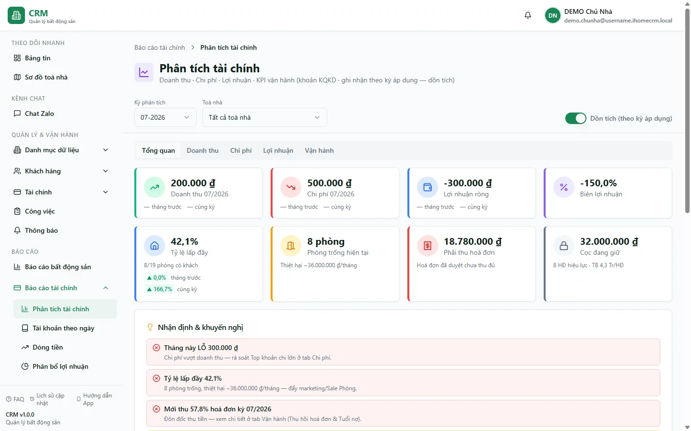

# Báo cáo: Phân tích tài chính

Route cần quyền `reports_finance.analysis`. Báo cáo có năm tab: **Tổng quan**, **Doanh thu**, **Chi phí**, **Lợi nhuận** và **Vận hành**.

## Hai chế độ thời gian

- **Dồn tích** là mặc định: doanh thu và chi phí được quy vào kỳ kinh tế tương ứng.
- **Tiền mặt** dùng ngày voucher/movement để nhìn thời điểm tiền được ghi nhận theo chế độ tiền.

Đổi chế độ có thể làm số theo tháng khác nhau mà không phải lỗi: một hóa đơn thuộc kỳ này có thể được thu ở kỳ khác.

## Ý nghĩa các tab

| Tab | Câu hỏi chính |
| --- | --- |
| Tổng quan | Các KPI tài chính và vận hành chính đang ở mức nào? |
| Doanh thu | Doanh thu item-level đến từ nhóm nào và kỳ nào? |
| Chi phí | Chi phí được phân bổ theo nhóm/hạng mục ra sao? |
| Lợi nhuận | Kết quả doanh thu trừ chi phí theo chế độ đang chọn. |
| Vận hành | Lấp đầy, công nợ, phát hành/thực thu và chỉ báo vận hành. |

## Phạm vi P&L

P&L/KQKD dùng dữ liệu item-level và loại các item cọc. Tiền cọc có thể đã vào sổ quỹ nhưng vẫn không phải doanh thu. Điều này giải thích vì sao số thu tiền và doanh thu không bằng nhau.

::: warning Ba khái niệm khác nhau
- **P&L** ở đây đo doanh thu/chi phí/lợi nhuận.
- **Dòng tiền** đo movement đã post vào/ra sổ quỹ.
- **Profit Close/chia lợi nhuận** là nghiệp vụ chốt khác, không phải chỉ đổi bộ lọc trên báo cáo này.
:::

## Cách đối chiếu

1. Chọn cùng phạm vi tòa và thời gian.
2. Xác định đang dùng dồn tích hay tiền mặt.
3. Kiểm tra item cọc bị loại khỏi P&L.
4. Khi cần truy tiền thực, mở [Dòng tiền](/04-bao-cao/dong-tien/) hoặc [Sổ quỹ theo ngày](/04-bao-cao/so-quy-ngay/).
5. Khi cần truy công nợ, mở danh sách hóa đơn/Thu tiền thay vì suy ra từ chênh lệch dòng tiền.

## Quy trình liên quan

- [Dòng tiền](/04-bao-cao/dong-tien/)
- [Sổ quỹ theo ngày](/04-bao-cao/so-quy-ngay/)
- [Danh sách tiền cọc](/04-bao-cao/danh-sach-coc/)
- [Thu chi](/03-quan-ly-van-hanh/thu-chi/)
