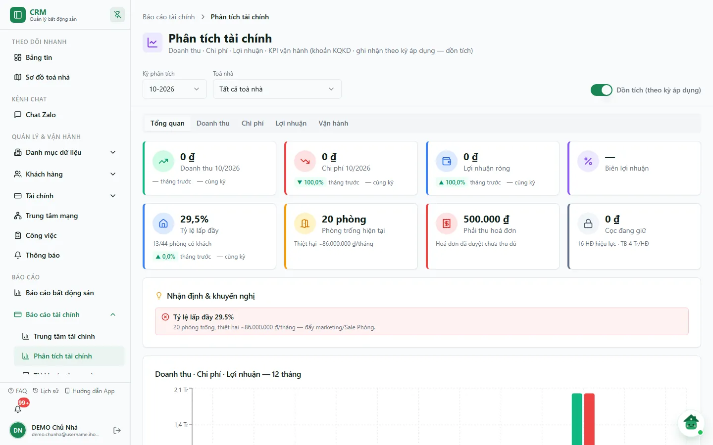
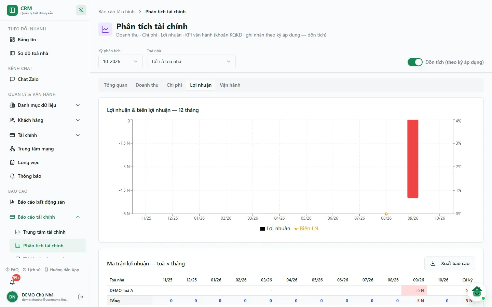

# Báo cáo: Phân tích tài chính

Báo cáo **Phân tích tài chính** trả lời câu hỏi *doanh thu, chi phí, lợi nhuận và chỉ số vận hành của một tháng đang ở mức nào, so với tháng trước và cùng kỳ năm trước*. Báo cáo chỉ tính các khoản thuộc kết quả kinh doanh (KQKD); tiền cọc không được tính là doanh thu.

::: info Điều kiện tiên quyết
- Tài khoản có quyền **Báo cáo Phân tích tài chính** (`reports_finance.analysis`).
:::

## Hướng dẫn từng bước

**Bước 1**: Tại thanh bên trái, ấn **Báo cáo tài chính** => **Phân tích tài chính** (hoặc thẻ **Phân tích tài chính** trên trang [Báo cáo tài chính](/04-bao-cao/hub-tai-chinh/)). Thanh lọc phía trên gồm:

- **Kỳ phân tích**: chọn tháng dạng `MM-yyyy`, tối đa 36 tháng gần nhất; mặc định tháng hiện tại.
- **Toà nhà**: mặc định **Tất cả toà nhà**; danh sách có cả toà ảo dùng cho chi phí chung.
- Công tắc **Dồn tích (theo kỳ áp dụng)**: bật sẵn. Dòng phụ dưới tiêu đề đổi giữa *"ghi nhận theo kỳ áp dụng — dồn tích"* và *"ghi nhận theo ngày phiếu — tiền mặt"* để cho biết đang xem chế độ nào.

Tab **Tổng quan** hiện 8 thẻ chỉ số: **Doanh thu**, **Chi phí** của tháng, **Lợi nhuận ròng**, **Biên lợi nhuận**, **Tỷ lệ lấp đầy**, **Phòng trống hiện tại**, **Phải thu hoá đơn**, **Cọc đang giữ** — kèm mức thay đổi so với tháng trước và cùng kỳ, khung **Nhận định & khuyến nghị**, biểu đồ **Doanh thu · Chi phí · Lợi nhuận — 12 tháng** và bảng **So sánh theo toà nhà**.

**Bước 2**: Ấn các tab **Doanh thu**, **Chi phí**, **Lợi nhuận**, **Vận hành** để xem chi tiết. Ví dụ tab **Lợi nhuận** có biểu đồ **Lợi nhuận & biên lợi nhuận — 12 tháng**, bảng **Ma trận lợi nhuận — toà × tháng** và phần **Lợi nhuận luỹ kế từ đầu năm**.

## Ý nghĩa các tab

| Tab | Nội dung chính |
| --- | --- |
| Tổng quan | 8 thẻ chỉ số, nhận định tự động, biểu đồ 12 tháng và so sánh theo toà. |
| Doanh thu | Cơ cấu doanh thu theo hạng mục thu qua các tháng. |
| Chi phí | Tỷ lệ chi phí / doanh thu 12 tháng, cơ cấu theo hạng mục chi, **Top 10 khoản chi lớn** của tháng. |
| Lợi nhuận | Lợi nhuận và biên lợi nhuận 12 tháng, ma trận toà × tháng, lợi nhuận luỹ kế từ đầu năm. |
| Vận hành | Tỷ lệ lấp đầy 12 tháng, biến động hợp đồng, thu hồi hoá đơn theo kỳ, tuổi nợ (chưa tới hạn đến quá hạn > 90 ngày), trạng thái phòng và chỉ số hợp đồng hiện tại. |

Các bảng có nút **Xuất báo cáo** với lựa chọn **Excel (.xlsx)** và **CSV (.csv)**; mục PDF hiện ghi **PDF (chưa hỗ trợ)**.

## Hai chế độ ghi nhận

- **Dồn tích (theo kỳ áp dụng)** — mặc định: khoản thu/chi được quy vào kỳ mà nó áp dụng (ví dụ kỳ hoá đơn), khớp với cách tính của [Báo cáo Lợi Nhuận / chia lợi nhuận](/03-quan-ly-van-hanh/chia-loi-nhuan/).
- Tắt công tắc — **theo ngày phiếu**: khoản được quy vào tháng của ngày phiếu.

Chỉ phần lãi/lỗ và cơ cấu hạng mục đổi theo công tắc; các chỉ số vận hành (lấp đầy, phòng trống, công nợ…) không phụ thuộc.

::: warning "Theo ngày phiếu" không phải tiền thật vào sổ
Cả hai chế độ đều tính các phiếu thu chi **đã duyệt**. Đã duyệt chỉ là bước phê duyệt — tiền chỉ thật sự vào/ra sổ quỹ khi phiếu ở trạng thái **Đã Thu/Đã Chi** (đã ghi sổ). Vì vậy dù tắt công tắc, số ở đây vẫn không thay cho báo cáo tiền. Muốn biết tiền thật, dùng [Dòng tiền](/04-bao-cao/dong-tien/) hoặc [Sổ quỹ theo ngày](/04-bao-cao/so-quy-ngay/).
:::

## Phạm vi lãi/lỗ

- Chỉ tính dòng phiếu thuộc KQKD; các dòng cọc bị loại. Tiền cọc có thể đã vào sổ quỹ nhưng vẫn không phải doanh thu, nên số thu tiền và doanh thu thường không bằng nhau.
- Ở chế độ theo ngày phiếu, hạng mục chi cũ đã được gộp vào hạng mục chuẩn sẽ hiện dưới tên hạng mục chuẩn. Ở chế độ dồn tích, hạng mục cũ và hạng mục chuẩn có thể hiện thành hai dòng riêng; tổng không đổi.

Ảnh chụp ngày 07/10/2026 (DEMO, dồn tích): tháng 10/2026 chưa có doanh thu/chi phí; tỷ lệ lấp đầy 29,5% (13/44 phòng có khách), 20 phòng trống, phải thu hoá đơn 500.000 ₫, cọc đang giữ 0 ₫. Cùng lúc đó báo cáo [Dòng tiền](/04-bao-cao/dong-tien/) ghi nhận tháng 9/2026 có 42.090.000 ₫ thu vào, trong khi tab Lợi nhuận tháng 09/26 lại âm — ví dụ cho việc tiền vào sổ và lãi/lỗ là hai câu hỏi khác nhau.

::: warning Ba khái niệm khác nhau
- **Lãi/lỗ** ở đây đo doanh thu, chi phí, lợi nhuận theo phiếu đã duyệt.
- **Dòng tiền** đo bút toán đã ghi sổ vào/ra sổ quỹ.
- **Chốt/chia lợi nhuận** là nghiệp vụ riêng tại [Chia lợi nhuận cổ đông](/03-quan-ly-van-hanh/chia-loi-nhuan/), không phải chỉ đổi bộ lọc trên báo cáo này.
:::

## Cách đối chiếu

1. Chọn cùng phạm vi toà và cùng tháng.
2. Xác định đang ở chế độ dồn tích hay theo ngày phiếu (xem dòng phụ dưới tiêu đề).
3. Nhớ rằng dòng cọc bị loại khỏi lãi/lỗ.
4. Khi cần truy tiền thật, mở [Dòng tiền](/04-bao-cao/dong-tien/) hoặc [Sổ quỹ theo ngày](/04-bao-cao/so-quy-ngay/).
5. Khi cần truy công nợ, mở [Hoá đơn](/03-quan-ly-van-hanh/hoa-don/) hoặc [Thu tiền](/03-quan-ly-van-hanh/thu-tien-mobile/) thay vì suy ra từ chênh lệch dòng tiền.

## Tình huống & lỗi thường gặp

| Tình huống | Nguyên nhân & cách xử lý |
|---|---|
| Đổi công tắc làm số theo tháng thay đổi | Bình thường: một khoản thuộc kỳ này có thể có ngày phiếu ở kỳ khác. |
| Doanh thu ở đây khác tổng thu ở Dòng tiền | Dòng tiền gồm cả cọc và chỉ tính bút toán đã ghi sổ; báo cáo này loại cọc và tính phiếu đã duyệt. |
| Lần sau mở lại vẫn giữ kỳ/toà cũ | Bộ lọc được nhớ trên trình duyệt. Chọn lại kỳ hoặc **Tất cả toà nhà** nếu cần. |

## Quy trình liên quan

- [Dòng tiền](/04-bao-cao/dong-tien/)
- [Sổ quỹ theo ngày](/04-bao-cao/so-quy-ngay/)
- [Danh sách tiền cọc](/04-bao-cao/danh-sach-coc/)
- [Thu chi](/03-quan-ly-van-hanh/thu-chi/)
