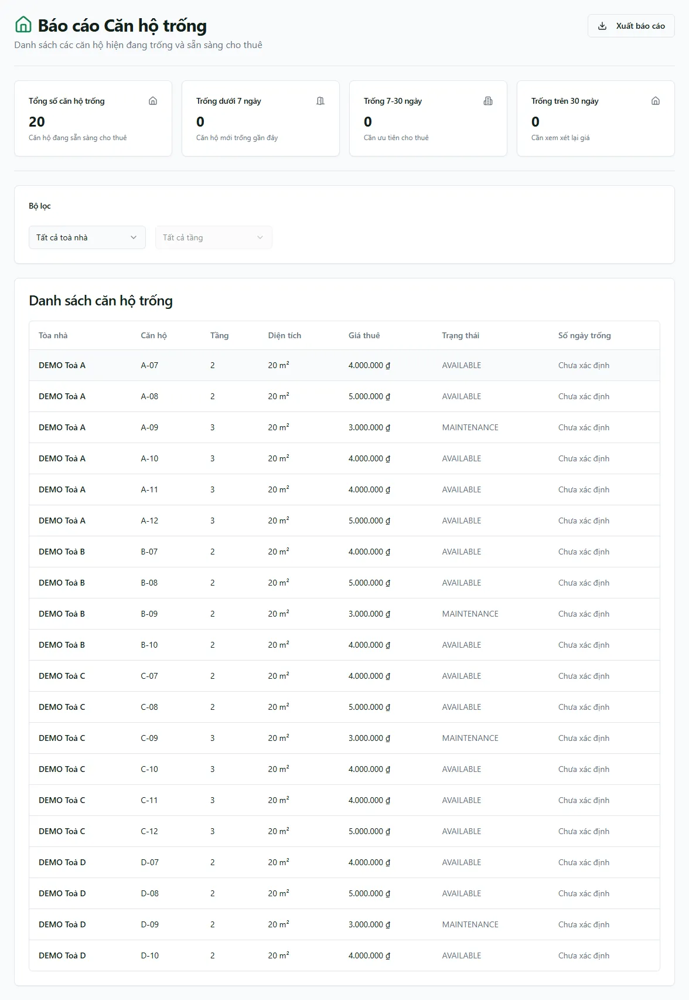

# Báo cáo: Phòng trống

Route chính và alias đều cần `reports_real_estate.vacant_rooms`. Báo cáo này là snapshot hiện tại phía trình duyệt, khác với snapshot server-side năm nhóm của [Tỷ lệ lấp đầy](/04-bao-cao/lap-day/).

Snapshot production ngày 13/08/2026 hiển thị **20 phòng** trong báo cáo. Tập này có cả phòng trạng thái `MAINTENANCE`, nên không đồng nhất với thẻ **Tổng phòng trống = 16** tại `/apartments`. Chênh lệch là do hai màn dùng semantics khác nhau; không lấy con số của màn này thay cho màn kia.

## Quy tắc một phòng xuất hiện

Hook tải ba tập dữ liệu:

1. Các phòng chưa xóa, có thể lọc tòa ngay trên truy vấn.
2. `room_id` của mọi hợp đồng `ACTIVE` chưa xóa.
3. Hợp đồng `TERMINATED`/`EXPIRED` để tìm ngày kết thúc gần nhất của phòng.

Phòng được liệt kê khi **không có room_id trong tập ACTIVE** và `room.status !== "RESERVED"`. Vì vậy:

- Phòng giữ chỗ `RESERVED` không xuất hiện.
- Các trạng thái khác như bảo trì/không khai thác không bị loại bởi hook này nếu không có HĐ ACTIVE; cần đọc cột trạng thái trước khi coi phòng là “sẵn sàng cho thuê”.
- Hợp đồng ACTIVE quá hạn nhưng chưa đổi trạng thái vẫn làm phòng bị coi là đang có người ở.

::: warning Tên báo cáo rộng hơn điều kiện dữ liệu
Mô tả giao diện nói “sẵn sàng cho thuê”, nhưng điều kiện hook chỉ loại `RESERVED`; nó không loại rõ `MAINTENANCE` hoặc `UNAVAILABLE`. Để phân loại vận hành chuẩn theo năm nhóm, đối chiếu báo cáo Lấp đầy.
:::

## Bộ lọc và cột

- Chọn tòa; sau đó có thể chọn tầng. Lọc tầng chạy client-side bằng giá trị `rooms.floor`.
- Bảng gồm tòa, phòng, tầng, diện tích, giá niêm yết, trạng thái và số ngày trống.
- `days_vacant` = chênh lệch từ hôm nay tới `max(actual_end_date, end_date)` gần nhất trong các HĐ kết thúc.
- Nếu phòng chưa có HĐ kết thúc được nhận diện, số ngày trống là **Chưa xác định**.

Bốn thẻ chia số ngày trống thành tổng, dưới 7 ngày, 7–30 ngày và trên 30 ngày. File xuất `bao-cao-can-ho-trong` dùng chính danh sách đang hiển thị.

## Giới hạn

- Ba truy vấn không dùng helper phân trang, nên dữ liệu lớn có thể chịu cap API.
- Tập HĐ ACTIVE và ended được tải toàn phạm vi rồi mới so room id, kể cả khi đang lọc một tòa.
- Số ngày trống không dùng lịch sử chuyển phòng/chuyển nhượng; nó chỉ dựa vào HĐ `TERMINATED`/`EXPIRED` gắn với room id hiện có.

## Quy trình liên quan

- [Tỷ lệ lấp đầy](/04-bao-cao/lap-day/)
- [Hợp đồng sắp hết hạn](/04-bao-cao/hd-sap-het-han/)
- [Thanh lý / bỏ trả](/04-bao-cao/thanh-ly/)
- [Phòng/căn hộ](/03-quan-ly-van-hanh/can-ho-phong/)
