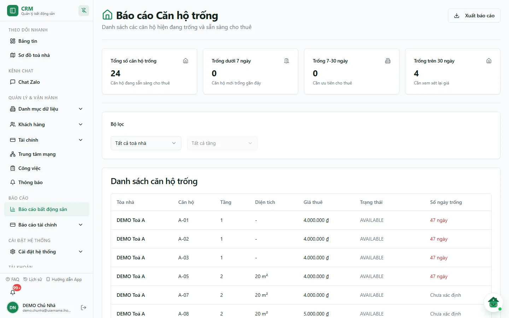
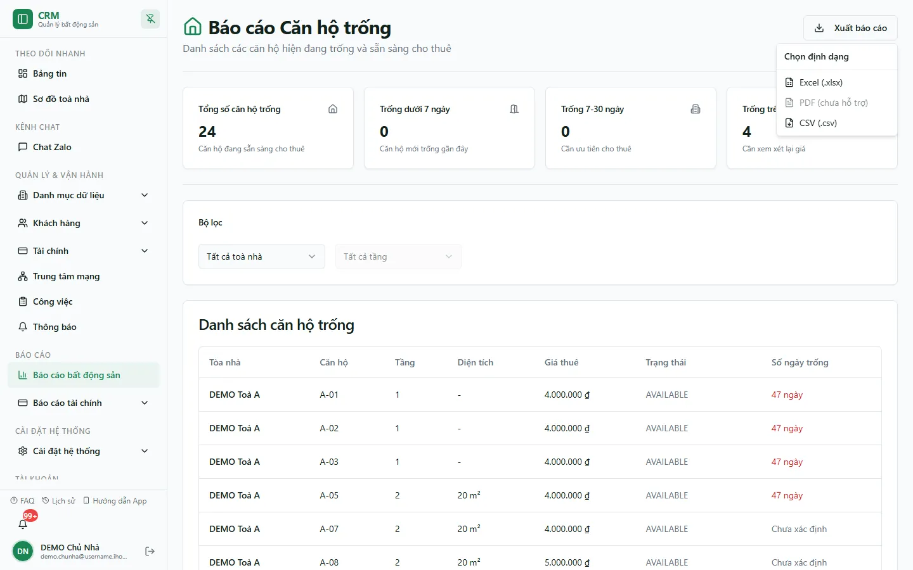

# Báo cáo: Phòng trống

Trong ứng dụng, màn này mang tên **Báo cáo Căn hộ trống**. Dùng khi cần danh sách phòng đang không có hợp đồng hiệu lực để chào thuê, kèm số ngày phòng đã trống. Route chính `/reports/real-estate/vacant-rooms` và đường dẫn rút gọn `/reports/real-estate/vacant` (thẻ trên trang tổng quan đang trỏ tới) mở cùng một màn.

::: info Điều kiện tiên quyết
- Quyền **Báo cáo Phòng trống** (`reports_real_estate.vacant_rooms`).
:::

## Hướng dẫn từng bước

**Bước 1**: Tại menu bên trái, ấn **Báo cáo bất động sản** => thẻ **Căn hộ trống** => **Xem báo cáo →**. Màn hình hiện bốn thẻ số, khung **Bộ lọc** và bảng **Danh sách căn hộ trống**.

**Bước 2**: Muốn xem một toà, chọn toà ở ô **Tất cả toà nhà**; khi đã chọn toà, ô **Tất cả tầng** mới bấm được để lọc tiếp theo tầng. Đổi toà sẽ xoá tầng đã chọn.

**Bước 3**: Muốn lấy danh sách ra file, ấn **Xuất báo cáo** rồi chọn **Excel (.xlsx)** hoặc **CSV (.csv)**. File có tên `bao-cao-can-ho-trong`, gồm đúng các dòng đang hiển thị kèm cột **Ngày trống gần nhất**.

Snapshot DEMO ngày 07/10/2026 (tất cả toà): **24 phòng** trong báo cáo, trong đó 20 phòng `AVAILABLE` và 4 phòng `MAINTENANCE`; thẻ **Trống trên 30 ngày** = 4 (các phòng A-01, A-02, A-03, A-05 trống 47 ngày), 20 phòng còn lại **Chưa xác định** số ngày trống.

## Quy tắc một phòng xuất hiện

Báo cáo tải ba tập dữ liệu:

1. Các phòng chưa xoá (lọc toà ngay khi truy vấn nếu đã chọn toà).
2. Phòng của mọi hợp đồng `ACTIVE` chưa xoá.
3. Hợp đồng `TERMINATED`/`EXPIRED` để tìm ngày kết thúc gần nhất của từng phòng.

Phòng được liệt kê khi **không có hợp đồng ACTIVE** và **trạng thái phòng khác `RESERVED`**. Vì vậy:

- Phòng đã giữ chỗ (`RESERVED`) không xuất hiện.
- Phòng **bảo trì** (`MAINTENANCE`) hoặc **không khai thác** (`UNAVAILABLE`) vẫn xuất hiện nếu không có hợp đồng ACTIVE — đọc cột **Trạng thái** trước khi coi phòng là “sẵn sàng cho thuê”.
- Hợp đồng ACTIVE đã quá ngày kết thúc nhưng chưa thanh lý/gia hạn vẫn làm phòng bị coi là đang có người ở.

::: warning Tên thẻ rộng hơn điều kiện dữ liệu
Thẻ **Tổng số căn hộ trống** ghi “Căn hộ đang sẵn sàng cho thuê”, nhưng con số gồm cả phòng bảo trì/không khai thác. Ví dụ DEMO hôm nay: báo cáo này ra 24, còn báo cáo [Tỷ lệ lấp đầy](/04-bao-cao/lap-day/) tách thành **Trống 20** + **Bảo trì 4**. Muốn số phòng thực sự chào thuê được, dùng nhóm **Trống** của báo cáo Lấp đầy.
:::

## Thẻ số, bộ lọc và cột

| Thành phần | Ý nghĩa |
|---|---|
| **Tổng số căn hộ trống** | Số dòng trong bảng. |
| **Trống dưới 7 ngày** / **Trống 7-30 ngày** / **Trống trên 30 ngày** | Chia theo số ngày trống; phòng **Chưa xác định** không vào thẻ nào trong ba thẻ này. |
| **Tất cả toà nhà** / **Tất cả tầng** | Lọc toà (truy vấn) và tầng (lọc trên trình duyệt theo số tầng của phòng). |
| Bảng | **Tòa nhà**, **Căn hộ**, **Tầng**, **Diện tích**, **Giá thuê** (giá niêm yết của phòng), **Trạng thái** (mã trạng thái phòng), **Số ngày trống**. Sắp theo toà rồi tên phòng. |

**Số ngày trống** = số ngày từ hôm nay lùi về ngày kết thúc gần nhất (`actual_end_date`, nếu trống thì `end_date`) của các hợp đồng `TERMINATED`/`EXPIRED` từng gắn với phòng. Màu: ≤7 ngày xanh, 8–30 ngày vàng, >30 ngày đỏ. Phòng chưa từng có hợp đồng kết thúc hiện **Chưa xác định**.

## Tình huống & lỗi thường gặp

| Tình huống | Nguyên nhân & cách xử lý |
|---|---|
| Số phòng trống khác thẻ ở màn [Phòng/căn hộ](/03-quan-ly-van-hanh/can-ho-phong/) hoặc báo cáo Lấp đầy | Mỗi màn dùng định nghĩa khác nhau; màn này gộp cả phòng bảo trì/không khai thác. |
| Phòng vừa chuyển phòng/sang nhượng có số ngày trống lạ | Số ngày chỉ dựa vào hợp đồng `TERMINATED`/`EXPIRED` gắn với phòng; không đọc lịch sử chuyển phòng. |
| Ô **Tất cả tầng** bị mờ | Chưa chọn toà. |

Giới hạn kỹ thuật: ba truy vấn không phân trang, nên với dữ liệu rất lớn có thể chạm giới hạn số dòng của API; tập hợp đồng được tải toàn phạm vi rồi mới so theo phòng, kể cả khi đang lọc một toà.

## Quy trình liên quan

- [Tỷ lệ lấp đầy](/04-bao-cao/lap-day/)
- [Hợp đồng sắp hết hạn](/04-bao-cao/hd-sap-het-han/)
- [Thanh lý / bỏ trả](/04-bao-cao/thanh-ly/)
- [Phòng/căn hộ](/03-quan-ly-van-hanh/can-ho-phong/)
